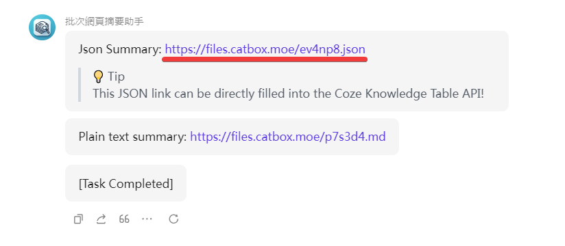
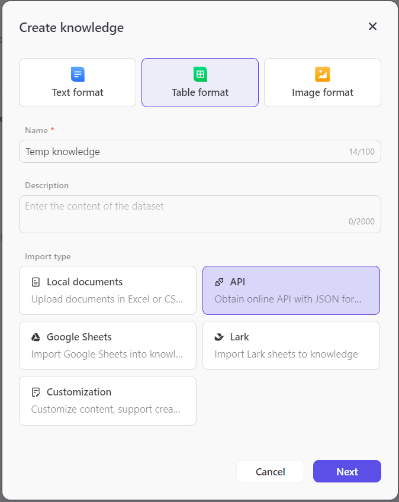
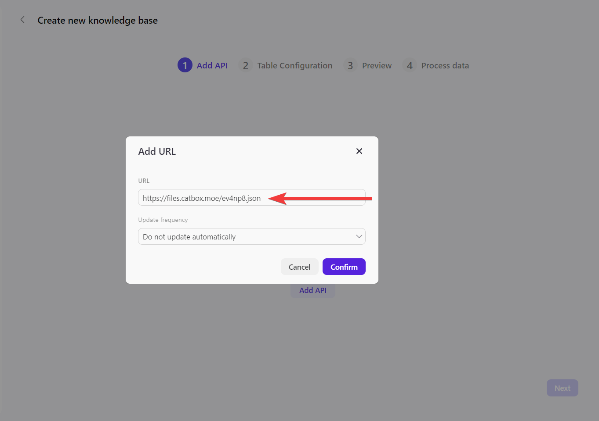
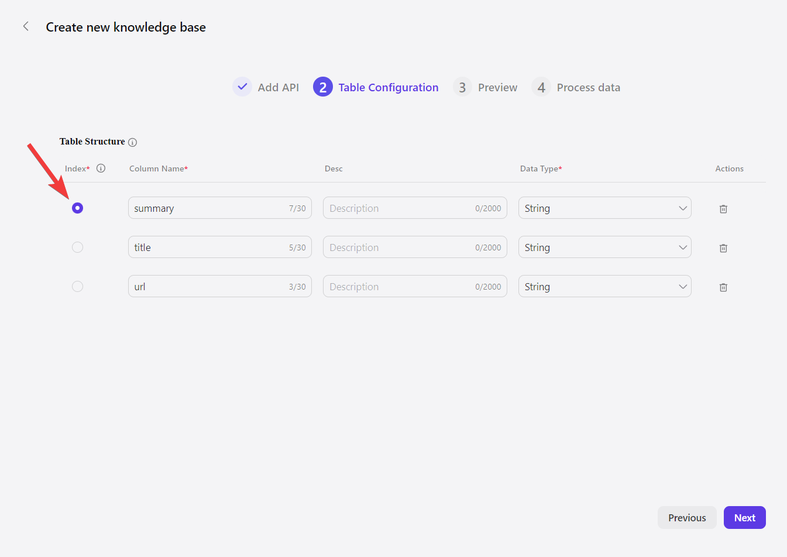
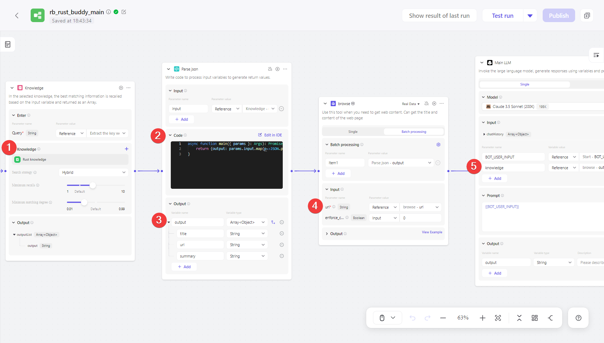

+++
title = "Batch Webpage Summary Assistant 批次網頁摘要助手"
description = "使用 Batch Webpage Summary Assistant 非常簡單。只需要輸入多行網頁 URL，它就會自動抓取這些網頁的內容，生成摘要，並返回包含 URL 和摘要的 json 輸出。在處理大量網頁資料的場景，這個工具能極大地簡化了摘要索引的知識庫建立過程。"
date = 2024-08-31T19:42:00.006Z
updated = 2024-09-16T09:45:59.711Z
draft = false
aliases = [ "/2024/09/ai-batch-webpage-summary-assistant.html" ]

[taxonomies]
tags = [ "AI" ]
licenses = [ "GFDL 1.3" ]

[extra]
banner = "preview.png"
+++
<figure>

  
  <figcaption><a href="https://civitai.com/images/25902592">Made with Flux.1-dev</a></figcaption>
</figure>

> 🗃️ 一次性將大量的網頁做摘要，方便製作 LLM 外部知識庫 🧠
>
> ---
> 👉 <https://www.coze.com/s/Zs8k6x4DJ/>

## 前言

正如其名，這個助手的主要功能是**批次處理大量網頁，為每個網頁生成精簡而全面的摘要**。它是我在設計[「摘要索引與全文參考方法」](@/AI/say-goodbye-to-ai-hallucinations-a-simple-method-to-Improve-the-accuracy-of-your-rag-system/index.md)時製作的輔助工具。

使用 Batch Webpage Summary Assistant 非常簡單。只需要輸入多行網頁 URL，它就會自動抓取這些網頁的內容，生成摘要，並返回包含 URL 和摘要的 json 輸出。在處理大量網頁資料的場景，這個工具能極大地簡化了摘要索引的知識庫建立過程。

本篇文章除了介紹助手之外，亦會說明如何使用它快速的建立外部網頁知識庫。<!--more-->

## 設計理念

在開發這個助手時，我特別注重了兩個關鍵點：「摘要的長度控制」和「關鍵字的保留」。

為什麼這兩點如此重要呢？

首先，<span class="success">控制摘要長度能確保我們的索引保持精簡，不會超過 chunk 長度上限</span>。我將摘要的長度限制在大約五句話左右，這個長度既能概括文章的主要內容，又不會過於冗長。實際上，AI 無法完全遵守「長度」要求，但有大致符合即可。

其次，<span class="success">關鍵字的保留是為了提高向量搜尋的準確性。</span>畢竟，向量搜尋並非語義搜尋，而是基於文本相似度的匹配。通過在摘要中保留關鍵字，我們大大提高了檢索的精確度。另外，考慮到混合搜尋可能會進行二次語意判斷，輸出不能僅是關鍵字的堆砌，而需要包含完整語義。因此，它應該是「富含關鍵字的短句子」這樣的輸出。

> 此機器人的 workflow 已公開發佈
>
> ---
> <https://www.coze.com/store/workflow/7408180329628008466>

## 如何建立外部網頁知識庫

1. 複製 json 網址
  
2. 製作一個包含 API 知識的表格
  
3. 將此網址填入 URL 欄位
  
4. 選擇 "summary" 作為索引
  

## 如何使用外部網頁知識庫



1. 建立 Knowledge 節點，選中上一小節建立的 table knowledge  
2. 建立 Code 節點，將 Knowledge 取得的 json 字串轉換回物件。  
   程式碼如下:  

    ```javascript
    async function main({ params }: Args): Promise { 
      return {output: params.input.map(p=>JSON.parse(p.output))}; 
    }
    ```

3. 設定物件陣列輸出如圖。
4. 使用 browse plugin 下載網頁內容。  
   記得在上方切換至 Batch processing，並在 url 選中 browse-url
5. 在 LLM 節點中使用取得的完整網頁內容。  
   LLM 的 prompt 請參考以下文章

> 延伸閱讀
>
> ---
> [告別 AI 幻覺：一個簡單方法提升你的 RAG 系統精準度](/AI/say-goodbye-to-ai-hallucinations-a-simple-method-to-improve-the-accuracy-of-your-rag-system)
