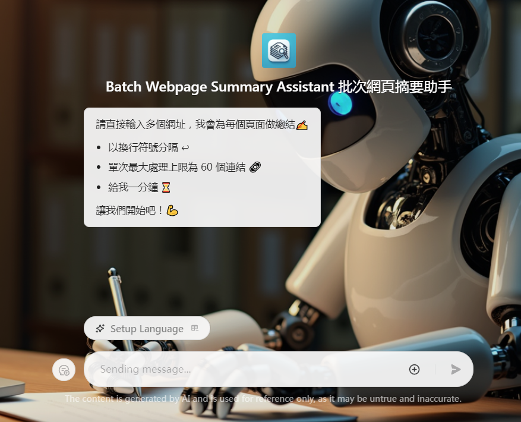

+++
title = "告別 AI 幻覺：一個簡單方法提升你的 RAG 系統精準度——「摘要索引與全文參考方法」"
description = "告別 AI 幻覺：一個簡單方法提升你的 RAG 系統精準度——「摘要索引與全文參考方法」"
date = 2024-08-31T14:04:00.015Z
updated = 2024-09-11T10:15:21.869Z
draft = false
aliases = [
  "/2024/08/say-goodbye-to-ai-hallucinations-a-simple-method-to-Improve-the-accuracy-of-your-rag-system.html"
]

[taxonomies]
tags = [ "AI" ]

[extra]
banner = "book.png"
iscn = "iscn://likecoin-chain/glaRLMBBdqLeNQDKZFhhfLHA0aeZxUDYqpWwHs79_vc/2"
+++
<figure>

  
  <figcaption><a href="https://civitai.com/images/27051549">Made with Flux.1-dev</a></figcaption>
</figure>

> 本篇文章透過「[筆韻智匠 Quill Sage🖋️✨](https://www.coze.com/s/Zs8k6GASu/)」和 Claude 3.5 Sonnet 聯合創作

## 前言：RAG 技術的應用與挑戰

嘿，各位開發者和 AI 愛好者們！今天我要聊聊 [RAG (Retrieval-Augmented Generation)](https://en.wikipedia.org/wiki/Retrieval-augmented%5Fgeneration) 技術。相信大家對這個名詞不陌生吧？ RAG 已經成為 AI 應用中不可或缺的一部分，特別是在需要大量精確資訊的場景中。

在開始深入探討之前，我想先邀請大家試試我開發的 C# AI Buddy。這是一個整合了 800 多頁 Microsoft Learn 文件的 C# AI 助手，不僅能回答你的 C# 相關問題，還能提供準確的文件參考連結。有興趣的讀者可以先體驗一下，看看它是如何運用我今天要討論的技術。本文後面會公開它的工作流程喔！

> C# AI Buddy
>
> ---
> 👉 <https://www.coze.com/s/Zs8k6Co9K/>

回到正題，RAG 技術雖然強大，但在實際應用中也面臨著一些挑戰。首先是「**全文索引**」做法的問題。當我們直接對大量文本進行索引時，常常會發現檢索結果不夠精準。想像一下，你在海量的文件中查找特定資訊，卻總是找不到最相關的那一篇。找不到正確的參考資料，AI 自然無法做出正確的回答。

另一個棘手的問題是 Chunk 大小的限制。在處理長文本時，我們通常需要將其分割成小塊 (Chunks) 進行處理。但是，**Chunk 的大小上限往往會限制我們保留完整上下文的能力**。結果就是，我們可能會錯過重要的上下文資訊，導致 AI 的理解不準確或是腦補產生幻覺。

這些挑戰促使我思考：**有沒有更好的方法來改善 RAG 技術，既能提高檢索的準確性，又能在有限的空間內保留更多有價值的資訊呢？**

接下來，我們就來探討一下「**摘要索引與全文參考**」這個方法，看看它如何應對這些挑戰，為 RAG 技術帶來新的可能性。

## 摘要索引與全文參考方法

在面對 RAG 技術的挑戰時，我想到了一個有趣的方法：為什麼不 **先對文件做個「精華版」**，然後 **用這個精華版來找資料** 呢？這就是「摘要索引與全文參考方法」的核心思想。

條列式來說，這個方法分為幾個步驟：

1. 先用 AI 為每個文件生成一個簡潔的摘要
2. 將摘要和原始文件建立連結
3. 對這些摘要進行向量索引
4. 搜尋時先找到相關的摘要，再通過摘要找到完整的原始文件
5. 最後，讓 AI 根據完整的文件內容來回答問題

聽起來有點繞口，但其實這個過程很像是你在圖書館找書。先看書名和簡介 (摘要) ，覺得相關再翻開整本書 (原始文件) 來閱讀。

### 詳細工作流程

讓我們一步步來看這個方法是如何運作的：

1. **使用 LLM 生成文件摘要**：使用聰明的大型語言模型 (LLM)，為每個文件生成一個簡明扼要的摘要。這個摘要應該包含文件的關鍵資訊和主要觀點。
2. **建立摘要與原始文件的關聯**：為每個摘要與原始文件的位置 (可能是 URL 或文件路徑) 關聯起來。這樣，我們就能通過摘要快速找到完整的文件。
3. **對摘要進行向量索引**：我們將摘要轉換為向量，並建立索引。這一步驟的目的是為了後續能夠快速、有效地檢索相關摘要，確保在用戶提出問題時能迅速找到最匹配的內容。
4. **基於摘要檢索並提取全文**：當用戶提出問題時，我們首先在摘要索引中搜尋最相關的內容。找到相關摘要後，我們就能通過之前建立的關聯快速定位並提取完整的原始文件。實務上推薦使用 Hybrid Search 混合搜尋，它的成果總是優於純用全文檢索或是純用向量檢索。
5. **LLM 利用完整文件內容回答問題**：最後，我們將用戶的問題和提取出的完整文件一起傳給聰明的 LLM。LLM 會基於這些完整的上下文資訊來生成答案，既保證了資訊的準確性，又避免了 AI 的無中生有。

### 技術要點

在實施「**摘要索引與全文參考方法**」時，摘要生成的品質至關重要。我們需要確保摘要不僅簡潔，還必須包含所有關鍵字。這是因為向量搜尋並非語義搜尋，而是比對用戶問題和索引之間的關聯性。然而，考慮到 **混合搜尋** 的需求，摘要又不能僅僅是關鍵字的堆砌，還需要保留足夠的文意供模型判斷。因此，一個好的做法是在指示 LLM 生成摘要時，強調「**五句話長度的摘要**」和「**包含所有關鍵字**」這兩個重點。

> 我特別做了一個 Coze bot 用來一次性的對大量網頁做摘要
>
> ---
> 👉 <https://www.coze.com/s/Zs8kjAdbH/>

在上下文管理方面，我們需要充分利用 LLM 超大的上下文窗口 (context window)。以 Claude 3.5 Sonnet 為例，它的 context window 高達 200k tokens，約等於十萬個中文字元。在實際應用中，我們可以用以下公式來計算每一篇文件的長度上限：

<mark>(200k - 提問內容 - system prompt - Chat History) / 參考文件數量</mark>

假設提問、system prompt 和 Chat History 共佔用 8k tokens，我們打算取 5 篇參考文件，那麼每篇文件的長度上限就是 (200k - 8k) / 5 ≈ 38k tokens，約等於兩萬個中文字元。這個長度其實很長，一般來說足以容納一個完整的書籍章節或是整頁的線上教學文件。在進行資料整理時首先是按照合理的上下文來切分，然後確保它落在此長度之內即可。

## 方法優勢分析

「摘要索引與全文參考方法」顯著提升了檢索的準確性。傳統的全文索引方法往往會因為文件內容的複雜性和用語的統一性而導致檢索結果不夠精準。而通過**使用 AI 生成的摘要作為索引，我們可以更好地捕捉文件的核心內容和關鍵字**，從而提高搜尋結果的相關性。這種方法特別適合處理長篇文件或專業領域的文獻，因為它能夠有效地提取出最關鍵的資訊，使得檢索過程更加高效和準確。

這種方法還很好地應對了 Chunk 大小限制的挑戰。在傳統的 RAG 實作中，我們常常需要將長文本分割成較小的 chunks 來處理，這可能導致上下文資訊的丟失和截斷。而通過「摘要索引與全文參考方法」，我們可以**在索引階段使用簡潔的摘要，同時在回答問題時引用完整的原始文件**。這樣不僅保留了參考文件的完整上下文，還能充分利用 LLM 大型的 context window，從而生成更加全面和準確的回答。

能充分利用 LLM 的大型 context window 是這個方法的另一個重要優勢。現代的 LLM 如 Claude 3.5 Sonnet 擁有高達 200k tokens 的上下文窗口，這為我們提供了處理大量文本的能力。通過精心設計的上下文管理策略，**我們可以在單次查詢中納入多個完整的文件或長篇章節，而不是僅僅依賴於分散的文本片段**。這大大增強了 AI 理解和綜合資訊的能力，使得生成的回答更加連貫和深入。

此方法還顯著降低了 AI 生成幻覺的風險。當 AI 模型缺乏足夠的上下文資訊時，它可能會靠腦補填補知識空白，導致生成不準確或完全錯誤的資訊。而通過提供上下文完整的原始文件作為參考，我們大大減少了這種風險，**AI 可以直接基於可靠的完整資訊來形成回答，而不是依賴於可能不完整或片段的知識**。這不僅提高了回答的準確性，也增強了整個系統的可信度。

最後，這種方法具有很好的可擴展性和靈活性。無論是處理小型的專業文獻集合，還是大規模的網頁內容，摘要索引與全文參考的方法都能很好地適用。**通過調整摘要生成的策略、單個文件的長度以及完整文本的提取方法，我們可以根據不同的應用場景和需求進行調整，以同一套概念應用於不同的實作**。這種適應性使得該方法在各種 AI 輔助資訊檢索和問答系統中都能發揮作用。

## 實際應用案例

理論終歸是理論，實踐才是檢驗真理的唯一標準。為了驗證摘要索引與全文參考方法的實際效果，我開發了兩個具體的應用：[Batch Webpage Summary Assistant (批次網頁摘要助手)](https://www.coze.com/s/Zs8k6x4DJ/) 和 [C# AI Buddy (C# AI 助手)](https://www.coze.com/s/Zs8k6skpT/)。

### Batch Webpage Summary Assistant

> <https://www.coze.com/s/Zs8k6x4DJ/>

首先登場的是 Batch Webpage Summary Assistant，這是一個基於 Coze 平台開發的 AI 助手。正如其名，這個助手的主要功能是**批次處理大量網頁，為每個網頁生成精簡而全面的摘要**。在開發這個助手時，我特別注重了兩個關鍵點：「摘要的長度控制」和「關鍵字的保留」。

為什麼這兩點如此重要呢？

首先，控制摘要長度能確保我們的索引保持精簡，不會超過 chunk 長度上限。我將摘要的長度限制在大約五句話左右，這個長度既能概括文章的主要內容，又不會過於冗長。實際上，AI 無法完全遵守「長度」要求，但有大致符合即可。

其次，關鍵字的保留是為了提高向量搜尋的準確性。畢竟，向量搜尋並非語義搜尋，而是基於文本相似度的匹配。通過在摘要中保留關鍵字，我們大大提高了後續檢索的精確度。另外，考慮到混合搜尋可能會進行二次語意判斷，輸出不能僅是關鍵字的堆砌，而需要包含完整語義。因此，它應該是「富含關鍵字的短句子」這樣的輸出。

使用 Batch Webpage Summary Assistant 非常簡單。只需要輸入多行網頁 URL，它就會自動抓取這些網頁的內容，生成摘要，並返回包含 URL 和摘要的 json 輸出。在處理大量網頁資料的場景，這個工具能極大地簡化了摘要索引的知識庫建立過程。

### C# AI Buddy

> <https://www.coze.com/s/Zs8k6skpT/>

**C# AI Buddy 是一個專為 C# 開發者設計的 AI 助手**，運用了摘要索引與全文參考方法，利用 Batch Webpage Summary Assistant 整合了 800 多頁的 Microsoft Learn C# 文件。

首先，**對用戶的問題進行分類**，判斷是否屬於內建知識庫的範疇。如果問題涉及第三方套件或不在知識庫範圍內，系統會自動切換到 Google Search 流程，以確保提供最相關的資訊。

接著，**從用戶問題中提取關鍵字**，這一步驟能提高向量搜尋的準確性。還記得我們的摘要中都有些什麼嗎？**「關鍵字」**。通過讓 LLM 提取用戶問題的關鍵字 —— 算是對用戶輸入做摘要的概念，我們能夠更精準地匹配摘要索引。找到摘要後，C# AI Buddy 會**即時取回這些文件的完整內容**，確保 LLM 獲得最新、最完整的資訊。

最後，呼叫 context window 較大的 LLM (這裡使用 Claude 3.5 Sonnet)，**要求它參考這些完整文件內容來解答用戶問題**，並**提供參考文件的連結**。這不僅增加了回答的可信度，還為用戶提供了深入學習的機會。用戶可以輕鬆點擊這些連結，直接查看原始文件，從而驗證答案並獲得更多相關知識。

<figure>

<figcaption>C# AI Buddy 的完整工作流程</figcaption>
</figure>

> 圖中 LLM 的 System prompt
>
> ---
> <https://gist.github.com/jim60105/02134cb805efea8bf71ecc4408e4368b>

這個精心設計的流程顯著提高了回答的準確性和相關性，無論是使用內部知識庫還是 Google Search，C# AI Buddy 都能靈活應對各種 C# 相關問題，並提供準確的解答和官方文件資源，提升了用戶的學習效率和問答體驗。

## 總結：平衡效能與成本的 RAG 技術新篇章

在深入探討了「摘要索引與全文參考方法」的優勢之後，我們也必須面對這種方法的一個顯著缺點：成本問題。這種方法需要在準備階段依頼 LLM 總結所有的文件，並在最後使用大型 context window 的 LLM 來處理完整文件。這兩個流程能大幅提高回答的準確性，但同時也會耗用大量的 token，導致成本急劇上升，這對許多專案來說可能成為一個重大障礙。

然而，Coze 平台提供了一個有效的解決方案。

容我簡單的介紹一下，**Coze 是 No-code 一站式 AI Bot 開發平台，無論你是否有程式設計基礎，都可以在這裡快速建立基於 AI 模型的各類問答 Bot**。這個平台的功能涵蓋範圍廣泛，從簡單的問答到複雜邏輯的對話，都能輕鬆實現。此外，Coze 允許用戶將搭建的 Bot 發佈到 LINE, Discord, Telegram 等通訊軟體上，與使用者進行互動，擴展了 AI Bot 的應用範圍。

> Coze.com
>
> ---
> 👉 <https://www.coze.com/>  
> 請在[官方文件](https://www.coze.com/docs/guides/billing)查看詳細的計價規則，以官方解釋為準。

Coze 平台的一大優勢在於其獨特的計價模式。除了傳統的基於 token 計費的模式之外，Coze 還採用了基於訊息次數的計價方式。這意味著，**使用者和助手之間每次訊息交換的成本是固定的，不會因為在 LLM 上使用更多的 token 而增加費用**。這使得我們可以放心地將超大 context window 用好用滿，將完整的文件內容提供給 LLM，而不必擔心成本失控。

總的來說，**「摘要索引與全文參考方法」為 RAG 技術的應用提供了一個強大而靈活的框架。這種方法不僅提高了資訊檢索的準確性，還克服了傳統 RAG 實現中的諸多限制**。通過生成精確的摘要索引，我們能夠更有效地捕捉文件的核心內容，同時保留了回答階段引用完整原始文件的能力。這種方法充分利用了現代 LLM 的大型 context window，使 AI 能夠基於更完整的資訊生成回答，顯著降低了生成幻覺的風險。

儘管存在成本挑戰，但隨著技術的進步和更多創新解決方案的出現，我相信這種方法將在未來發揮越來越重要的作用。無論是構建專業領域的知識問答系統，還是開發大規模的資訊檢索工具，摘要索引與全文參考方法都為開發者提供了一個強大的工具，助力創造出更智慧、更準確的 AI 應用。

> 本篇文章的英文翻譯版投稿於 HackerNoon
>
> ---
> <https://hackernoon.com/say-goodbye-to-ai-hallucinations-a-simple-method-to-improving-the-accuracy-of-your-rag-system>
