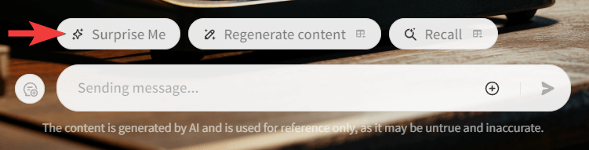
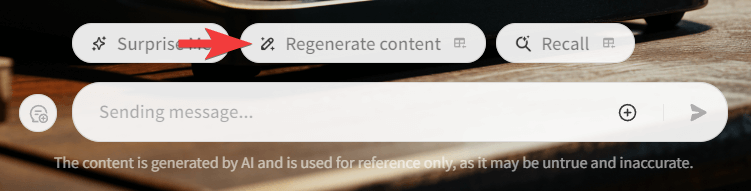

+++
title = "如何用 AI 寫小說？ —— 揭開「垃圾小說產生器」的創意魔法！✨📚"
description = "探索如何利用 AI 創造優質垃圾小說！本文介紹「垃圾小說產生器」Coze 助手的功能、使用方法及驚人創意，讓你輕鬆生成獨特故事。立即體驗 AI 文學的魅力，開啟你的創作之旅！"
date = 2024-09-15T20:41:00.041Z
updated = 2024-10-03T12:15:18.758Z
draft = false
aliases = [ "/2024/09/ai-trash-novel-generator.html" ]

[taxonomies]
tags = [ "AI", "Novel" ]
licenses = [ "GFDL 1.3" ]

[extra]
banner = "banner.png"
iscn = "iscn://likecoin-chain/CZQlYkJAHJ8aJ6F-1V6YnLlaBze4qZDKD_lGtdPjKNo/1"
withAI = "本篇文章透過「[筆韻智匠 Quill Sage🖋️✨](https://www.coze.com/s/Zs8k6GASu/)」和 Claude 3.5 Sonnet 聯合創作"

  [extra.comments]
  id = "113146735399825887"

  [extra.preview]
  withAI = true
  url = "https://civitai.com/images/33836772"
+++
## 前言

大家好！今天我要向各位讀者介紹我的 Coze 助手 ——**「垃圾小說產生器」**。相信我，這個小工具絕對會顛覆你們對 AI 小說創作的認知！

> 「垃圾小說產生器」為你打造優質廁紙 📚🗑️
>
> ---
> 👉<https://www.coze.com/s/Zs8kptJFN/>

2024 年人工智慧正在改變我們的生活，而文學創作當然也不例外。**我設計的這個小助手不只是一個普通的寫作助手，而是一個能夠獨立完成整個小說創作過程的 AI 助手喔！**

請想像一下，只要給予簡單的指示，你們就能坐享其成，欣賞 AI 的奇思妙想。從構思情節、設計角色到撰寫章節，這位充滿創意的 AI 作家都能一手包辦。是不是聽起來很神奇？

不過，我最自豪的還是「垃圾小說產生器」的「Surprise Me」功能。不知道各位有沒有夢想過只需輕點一個按鈕，就能得到一部完全隨機、充滿創意的小說呢？現在，這個夢想實現了！**「Surprise Me」就像是創意的轉蛋機，每次都能變出讓人驚喜的故事**。無論是科幻驚悚還是浪漫喜劇，奇幻冒險或現實主義，它都能帶你們進入一個個全新的文學世界。

而且，我要特別告訴大家一個好消息：「垃圾小說產生器」是能免費使用的！

每天大家都有免費的 30 次交談額度，盡情享受這個神奇工具帶來的樂趣吧！

準備好了嗎？那麼，讓我們一起探索「垃圾小說產生器」的奇妙世界，看看我的這個 AI 助手如何進行 AI 式文學創作！

> 這個助手在 Coze 以 GPT-4o mini 計價  
> 30 次 = (由我付錢的 20 次 + 免費帳號自帶的 10 次)  
> [具體定價以 Coze.com 解釋為準](https://www.coze.com/docs/guides/message%5Fcredits?%5Flang=zh)

<!-- more -->

## 「垃圾小說產生器」是什麼？

### AI 驅動的全自動小說創作工具

各位讀者，「垃圾小說產生器」是我開發的一個革命性的 AI 驅動全自動小說創作工具。整個創作過程完全自動化，無需人類干預。你們只需要坐在一旁，期待 AI 如何將一個創意變成一篇完整的小說。

這個系統的特別之處在於我為它整理的 80 個創作主題，每個主題都配有專門的創作指引。這使得「垃圾小說產生器」能夠創作出比直接使用任何大型語言模型更加多樣化的作品。

讓我為大家簡要介紹一下它的工作流程，重點說明「**創作大綱**」和「**生成本文**」這兩個關鍵步驟：

首先是「創作大綱」階段。**系統會從 80 個預設的創作主題中選擇最適合的一個或多個，根據主題的創作指引生成一個獨特的故事大綱**。這個大綱包含了故事的基本框架、主要情節點和角色設定。由於主題的多樣性，「垃圾小說產生器」可以輕鬆地在不同類型和風格之間切換，創造出豐富多彩的故事結構。

接下來是「生成本文」的階段。有了大綱作為基礎，Claude 3.5 Sonnet 就會開始真正的寫作過程。**它會根據大綱中的每個要點進行詳細的擴展，創造出生動的場景描述、引人入勝的對話，以及細膩的人物刻畫**。在這個過程中，AI 會確保故事的連貫性和邏輯性，同時也會注入適當的情感元素和文學技巧，使整個故事更加吸引人。

### 「垃圾小說產生器」命名的由來

各位可能會好奇，為什麼我要給這個強大的 AI 寫作工具起一個如此自嘲的名字呢？這背後其實蘊含著一些幽默和諷刺的意味。

在文學圈子裡，我們常常用一個略帶貶義的詞來形容那些缺乏實質內容、大量生產且品質參差不齊的小說——「廁紙文學」。這個比喻雖然有些粗俗，但卻形象地描述了這類作品：用完即丟、沒有營養。

「垃圾小說產生器」這個名字正是源於這個概念的延伸。儘管我的 AI 系統具備驚人的寫作能力，能夠創作出情節豐富、結構完整的故事，但它所產出的終究是由機器生成的作品。這些作品可能缺乏人類作家那種源於生活經驗和情感積澱的深度。因此，我起初開玩笑地稱它為「優質廁紙製造機」，後來覺得廁紙未免有些粗俗，就改成了「垃圾小說產生器」。

這個名字恰當地反映了工具的特性和我的創作理念。它提醒我們，**儘管 AI 能夠模仿人類的寫作風格，但真正有價值的文學作品仍需要人類的創造力和獨特視角**。同時，現在這垃圾般的名字也暗示了我對 AI 創作的一種期待：也許有一天，AI 能夠超越我的想像，創造出真正有意義的、不是垃圾的作品。

有趣的是，「垃圾小說產生器」常常給我帶來意想不到的驚喜。它會創作出荒誕不經卻妙趣橫生的情節，或者意外觸及一些深刻的主題。這些「垃圾」中偶爾閃現的亮點，讓我重新思考 AI 創作的潛力和界限。

**我希望讀者們能將「垃圾小說產生器」視為現時點 AI 創作能力的一個參考值**。通過體驗它所產出的成品，我們可以更深入地思考人類創作的獨特價值。它不僅展示了 AI 在文學創作領域的現狀，更為我們提供了一個機會，去反思人類創意、情感深度以及生活經驗在文學作品中的不可替代性。

## 主要功能介紹

讓我們來看看「垃圾小說產生器」的主要功能吧。這個 AI 工具的核心能力是通過與用戶對話來生成完整的小說。它的知識庫內建了 80 種不同題材的創作指引，範圍相當廣泛，從冒險、校園生活、魔法、穿越到歷史故事，應有盡有。**AI 會根據你的喜好選擇幾個合適的題材指引做為參考，然後為你編寫一個故事大綱**。你可以隨時給出修改意見，AI 會不斷調整調整大綱，直到你滿意為止。

大綱完成之後就是每個章節的寫作過程。**在寫作過程中，AI 會參考整個大綱和之前寫過的內容**。比如說，當它寫到第三章時，會回顧第一章和第二章的內容，確保故事情節的連貫性和邏輯性。這樣，我們就能得到一個結構完整、情節連貫的故事。

### 客製化創作選項

「垃圾小說產生器」使用 AI 來撰寫大綱，**你可以通過簡單的對話來指定你想要的故事類型、長度和風格，以及任何的個人化指示**。無論你喜歡驚心動魄的科幻短篇，還是婉轉動人的古典愛情長篇，AI 都能按照你的要求來創作。

不僅如此，你還可以指定具體的寫作風格、主要角色特徵，甚至是故事發生的時代背景。這讓每一部由 AI 創作的小說都能成為獨一無二的作品，完全符合你的個人品味。

### 「Surprise Me」：隨機創意的極致體現

對於喜歡意外驚喜的讀者，我特別提供了「**Surprise Me**」功能。這個功能可以說是隨機創意的極致體現。**當你選擇這個選項時，AI 會從題材庫中隨機選取三個主題，立即開始創作。**

想像一下，你可能會得到一個融合了科幻、浪漫喜劇和歷史元素的奇妙故事，或者是一個結合了恐怖、運動和電波主題的獨特作品。這種隨機組合不僅能激發出意想不到的創意火花，還能為你帶來全新的閱讀體驗。

「Surprise Me」功能挑戰了傳統的寫作框架，展現了 AI 創意的無限可能。它為你提供了一種探索未知文學領域的有趣方式，每次使用都可能帶來驚喜。

## 如何使用「垃圾小說產生器」

無論你是想要特定類型的小說，還是想來一次充滿驚喜的文學冒險，「垃圾小說產生器」都能滿足你的需求。接下來就讓我們一步步來看如何創作屬於你的 AI 小說。

### 步驟零：「Surprise me」模式

如果你想來點驚喜，「Surprise me」模式絕對是個不錯的選擇。**只需點擊下方的「Surprise me」按鈕，AI 就會立即開始它的隨機廁紙創作之旅**。在這個模式下，AI 會創作一個 7 章節的短篇故事，大約一萬字左右。整個過程需要等待約 15 分鐘，但相信我，這等待絕對值得！

### 步驟一：提供基本創意元素

想要更多控制權？那就來聊聊天吧！**你可以用自然語言告訴 AI 你的想法**，比如故事主題、背景設定、喜歡的題材，甚至是角色特徵。不用擔心想不出來，這一步完全是可選的。你可以給出一個大致方向，讓 AI 幫你補完剩下的細節，也可以讓 AI 自由發揮。

最棒的是，你可以和 AI 多次來回討論，調整大綱直到你滿意為止。就像和一個創意十足的朋友聊天一樣，輕鬆又有趣！

### 步驟二：生成並檢視作品

準備好了嗎？只要對 AI 說聲「**很好，開始生成**」，魔法就開始了！AI 會立即開始創作，完成後會直接在聊天視窗裡呈現故事內容。每個章節約需兩分鐘，若無指定章節長度，其預設值為 7 個章節。

為了方便你閱讀或分享，AI 還會提供一個 privatebin 連結。要注意的是，這個連結會在一週後自動失效，所以如果你特別喜歡這個故事，別忘了下載保存！

### 步驟三：微調和再生成（如需要）

對故事不太滿意？沒關係！在創作大綱時，AI 會提供一個 Story ID。如果你想用同樣的大綱重新來過，**只需使用「Regenerate content」按鈕，填入 Story ID 和想要重新開始的章節編號（Start參數），AI 就會從那一章開始重新創作後面的所有內容。**

**如果你想在原有故事的基礎上做更大的改動，也可以要求 AI 基於上一個故事生成新的大綱，然後再創作**。不過要注意的是，AI 在創作時只會參考「大綱」和「同一故事的前面章節」，不會記得「上一篇故事」的內容。所以，如果有什麼情節特別想保留，一定要記得把它加入新的大綱中喔！

使用「垃圾小說產生器」就是這麼簡單有趣。無論你是想要一個驚喜，還是想親自參與創作過程，它都能滿足你的需求。現在，準備好開始你的 AI 寫作冒險了嗎？

## 開啟你的 AI 文學之旅

好了，親愛的讀者們，現在你已經了解了「垃圾小說產生器」的神奇之處，是時候親自體驗一下這個有趣的 AI 工具了！

> 「垃圾小說產生器」為你打造優質廁紙 📚🗑️
>
> ---
> 👉<https://www.coze.com/s/Zs8kptJFN/>

想要開始你的 AI 寫作冒險嗎？很簡單！只需點擊上面的連結，你就能立即進入「垃圾小說產生器」的奇妙世界。

別忘了嘗試不同的創作模式喔！你可以從「Surprise Me」模式開始，體驗一下 AI 的隨機創意。或者，你也可以嘗試提供一些基本的創意元素，看看 AI 如何將你的想法變成一個完整的故事。

不妨多多嘗試不同的設置。比如說，你可以要求一個科幻背景的愛情故事，或者一個發生在中世紀的偵探小說。每一次嘗試，都可能帶來意想不到的驚喜！

### 分享你的 AI 創作成果

創作的樂趣在於分享！當你得到一個令你驚艷或是覺得特別有趣的故事時，何不與他人分享呢？

**你可以將 AI 生成的作品分享到各種社交平台上**。無論是 Mastodon、Facebook、X、還是 Threads，相信都會有人對你的 AI 創作感興趣。你可以分享 privatebin 連結，或者只分享一些特別精彩的片段。不過別忘了，privatebin 的連結會在一週後失效，你得手動上傳至別處喔！

**除了作品本身，你的使用體驗也很值得分享**。你是如何與 AI 互動的？在創作過程中有什麼有趣的發現嗎？或許 AI 生成了一些特別搞笑或意想不到的情節？這些都是很棒的分享素材！

記得在分享時加上 `#AIGC` `#AI文學` 之類的標籤，讓更多人能看到你的創作。誰知道呢，你可能會在網上找到一群志同道合的 AI 文學愛好者！

{{mastodon(id="113880643434231018")}}

> 我也在這裡分享自己的有趣作品，觀迎參觀看看😋
>
> ---
> <https://cloud.maki0419.com/s/zA9ArA7WdtDWE7f>

**最後，別忘了回來跟我分享你的創作經歷**。你對「垃圾小說產生器」有什麼看法？它如何改變了你對 AI 創作的認知？你是否發現了某個它無法創作的題材？你的反饋對我來說非常寶貴，也可能幫助我在未來改進這個工具。

現在，準備好開始你的 AI 文學之旅了嗎？點擊連結，讓我們一起探索 AI 創作的無限可能吧！期待看到你的精彩作品！
