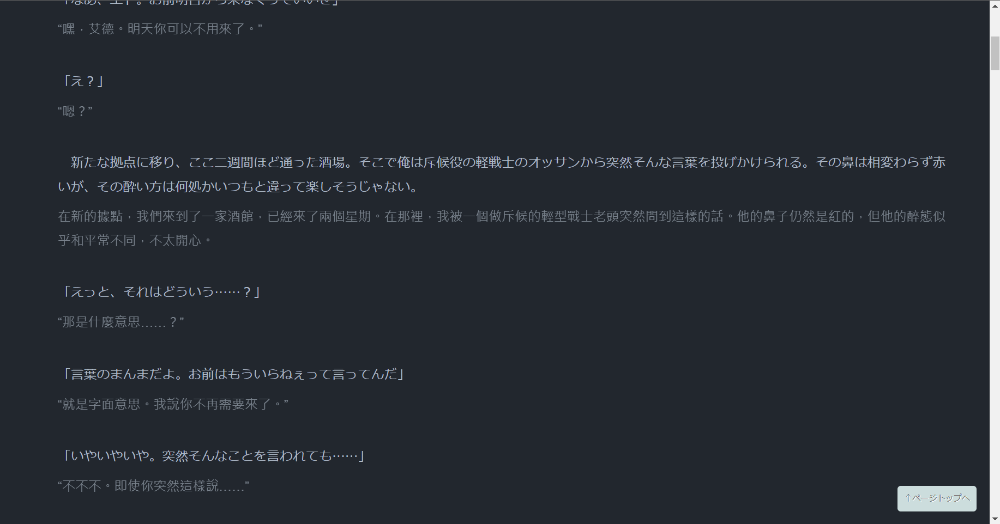

+++
title = "AI 翻譯解鎖——日文網路小說無障礙閱讀體驗"
description = """
已試過 AI 翻譯但並不滿意？
不要太快放棄，AI 翻譯品質與 prompt (提示詞) 高度相關。它表現不好是因為你的提示詞不好！這篇文章瞄準「以翻譯機閱讀日本web小說」的讀者，介紹我使用的工具、翻譯設定和提示詞。 """
date = 2023-05-27T12:00:00.039Z
updated = 2024-08-31T18:51:07.606Z
draft = false
aliases = [
  "/2023/05/Unlocking-AI-Translation-Barrier-free-Reading-Experience-of-Japanese-Web-Novels.html"
]

[taxonomies]
tags = [ "AI" ]

[extra]
card = "preview.jpg"
iscn = "iscn://likecoin-chain/eSjhLqDYXgHdvTrcgWw-XkLtgCjso_PJJmZ3v768Ao0/1"
hot = true

  [extra.comments]
  id = "110440637831102537"
+++
<figure>


<figcaption>圖片出處: <a target="_blank" href="https://arthub.ai/art/10458">arthub.ai</a></figcaption>
</figure>

## 前言

已試過 AI 翻譯但並不滿意？  
不要太快放棄，AI 翻譯品質與 prompt (提示詞) 高度相關。<span class="danger">它表現不好是因為你的提示詞不好！</span>

機器翻譯技術的進步為閱讀外文小說開啟了新的大門。過去，不管是 Google 翻譯還是 Deepl 翻譯，譯文都充滿了「機翻味」，難以達到可閱讀小說的水準。**但自 OpenAI 推出 ChatGPT 後，AI 翻譯品質有了巨大提升**。有了大型語言模型的加持，<span class="success">不僅可以生成流暢的譯文，根據上下文推測語意，甚至能模仿原文的文句風格。</span>雖未臻「完美」，但將翻譯水準從「可以理解的文件」提升到了「閒暇時想讀的書」。

這篇文章瞄準「**以翻譯機閱讀日本web小說**」的讀者，介紹我使用的工具、翻譯設定和提示詞。  
希望能為讀書人提供一些參考，順利踏入大 AI 時代。

本文提供以下日文小說網站的推薦設定

* [小説家になろう (成為小說家吧)](https://syosetu.com/)
* [カクヨム (KAKUYOMU)](https://kakuyomu.jp/)
* [アルファポリス - 電網浮遊都市 - (AlphaPolis)](https://www.alphapolis.co.jp/)
<!--more-->
> 延伸閱讀
>
> ---
> [琳的備忘手札: 我的日文輕小說書單](/2017/10/novelList.html)

## 事前準備

* 安裝擴充功能:
  * 沉浸式翻譯
    * 官網  
    <https://immersive-translate.owenyoung.com/>
    * Chrome 擴充  
    <https://chrome.google.com/webstore/detail/immersive-translate/bpoadfkcbjbfhfodiogcnhhhpibjhbnh>
  * OpenAI Translator
    * GitHub  
    <https://github.com/openai-translator/openai-translator>
    * Chrome 擴充  
    <https://chrome.google.com/webstore/detail/openai-translator/ogjibjphoadhljaoicdnjnmgokohngcc>
  * Stylebot (可選，改善閱讀版面)
    * 官網  
    <https://stylebot.dev/>
    * Chrome 擴充  
    <https://chrome.google.com/webstore/detail/stylebot/oiaejidbmkiecgbjeifoejpgmdaleoha>
* 申請 OpenAI API Key
  1. 註冊帳號: <https://platform.openai.com/>
  2. 取得 API Key: <https://platform.openai.com/account/api-keys>
  3. 將 sk 開頭的 API Key 複製下來貼到記事本，後續設定時會使用到它
  4. 儲值個 5 美元進去: <https://platform.openai.com/settings/organization/billing/overview>

## 要錢 $\_$a

要錢，但並不是很貴。

我們會使用 「GPT-4o mini」模型，具體的價目表在這裡: <https://openai.com/api/pricing/>  
撰文時為 US$0.150 / 1M input tokens + US$0.600 / 1M output tokens

我猜你對 token 怎麼計算沒有感覺......我也是😆  
它是語言模型在理解文章時的一個最小單位。  
這個單位並不是「一個中文字」、「一個英文字」或是「一個字母」這種東西。  
總而言之，你就當成它是一個技術上合理的計價單位就行了。  

OpenAI API 是採用「先儲值，從中扣款」的收費模式。請你先儲個 5 美元進去，然後實際體驗看看讀了多少文章會用完它。

> 以備你有需要，這裡是 [token 計算機](https://platform.openai.com/tokenizer)

## 設定 —— 沉浸式翻譯

開啟擴充功能的「選項」，以下未提及的選項維持預設值即可


### 「基本設定」頁籤

* 目標語言: 繁體中文
* 翻譯服務: OpenAI
* 選擇一個服務提供者: 自訂API Key
* APIKEY: (前面取得的 OpenAI API Key，為 sk 開頭一長串)
* 模型: gpt-4o-mini
* 每秒最大要求數: 1  
(OpenAI 對個別用戶套用不同的流量限制，你可以在[這裡](https://platform.openai.com/account/limits)查到你的限制)
* 你可以指定一位 AI 專家來提供翻譯策略: 通用
* 每次要求的最大文字長度: 5000
* 每次請求最大段落數: 10
* System Prompt:  

   ```
   （您是一個專業的翻譯引擎，請將文本翻譯成口語化、優雅且流暢的內容。逐句翻譯，不要改變文句的順序和斷行。只能翻譯文本內容，不能進行解釋。使用全型標點符號。將人名和地名都以音譯處理。）  
      
   翻譯時參考此日文中文專有名詞對應表:  
   ティア=蒂亞  
   エド=艾德  
   ```

   > 名詞對應表依照你正在閱讀的文章修改，但不能寫太多！  
   > 這些提示詞都會計入 token 數，將影響到返回的文字數上限和費用！

* Prompt:

   ```
   （將以下提供的文本翻譯成正體中文 zh-tw，只能返回翻譯後的文本，不能進行解釋。）
   Source Text: {{text}}
   Translated Text:
   ```

* Multiple Prompt:  

   ```
   您將收到一個以 YAML 格式排列的輸入，其中包含帶有 "id" 和 "{{imt_source_field}}" 字段的條目。以下是輸入：
   
   <yaml>
   {{yaml}}
   </yaml>
   
   對於 YAML 中的每個條目，將 "{{imt_source_field}}" 字段的內容翻譯成正體中文 zh-tw。將翻譯寫回該條目的 "{{imt_source_field}}" 字段。
   
   這是預期格式的範例：
   
   <example>
   Input:
   - id: 1
      {{imt_source_field}}: Source
   Output:
   - id: 1
      {{imt_trans_field}}: Translation
   </example>
   
   請直接返回翻譯後的 YAML，不要包裝 <yaml> 標記或包含任何其他資訊。
   ```

* Subtitle Prompt:

   ```
   你將會把一組以 YAML 格式編排的影片字幕中所有 "{{imt_sub_source_field}}" 欄位翻譯成正體中文 zh-tw。以下是原始的 YAML 格式字幕：
   
   <yaml_subtitles>
   {{yaml}}
   </yaml_subtitles>
   
   請僅將每個字幕條目的 "{{imt_sub_source_field}}" 字段翻譯為正體中文 zh-tw。 請勿翻譯或更改 "id" 字段。
   
   以相同的 YAML 格式輸出翻譯後的字幕，每個字幕條目獨佔一行。 "id" 欄位應保持不變， "{{imt_sub_source_field}}" 欄位應包含您的正體中文翻譯。
   
   請直接返回翻譯後的 YAML，不要包裝 <yaml> 標記或包含任何其他資訊。
   ```

> 小技巧
>
> ---
> 告訴它以「**正體中文 zh-tw**」回應能大幅減少簡體中文字出現！

### 「進階設定」頁籤

* 是否翻譯網頁所有區域: 否
* 進入網頁後，是否立即翻譯到頁面底部？: 是
* 啟用網頁標題翻譯: 否

### 「關於」頁籤

* 啟用本機翻譯快取（減少重複段落的翻譯要求）: 是

### 「開發者設定」頁籤


```json
[
  {
    "matches": "kakuyomu.jp",
    "selectors": [
      "#contentMain-inner"
    ]
  },
  {
    "matches": "www.alphapolis.co.jp",
    "selectors": [
      ".novel-body",
      ".title",
      ".abstract"
    ]
  },
  {
    "matches": "ncode.syosetu.com",
    "selectors": [
      ".p-novel__title",
      ".p-novel__body",
      ".p-novel__summary",
      ".p-eplist__subtitle"
    ]
  }
]
```

## 設定 —— OpenAI Translator

開啟擴充功能的「設定」，以下未提及的選項維持預設值即可


* 語言: 繁體中文
* 預設翻譯服務商: OpenAI
* API 密鑰: (前面取得的 OpenAI API Key，為 sk 開頭一長串)
* API 模型: gpt-4o-mini
* 預設翻譯模式: 翻譯
* 預設目標語言: 繁體中文
* 語言檢測引擎: 本地
* 選中文字時顯示圖示: 是
* 自動翻譯: 否

## 設定 —— Stylebot

下載這個 json 設定檔  
<https://gist.github.com/jim60105/6f3ef74137c9e2b7bbf1ea25e01e0082>

開啟擴充功能的「設置」，在「備份」頁籤導入設定檔


## 測試

> 我採用的是翻譯時間較久，但是準確度較高的配置。  
> 建議預先在新分頁開啟下一章節( Shift + 滑鼠中鍵點擊)，當翻譯開始轉圈後回去讀上一章節以節省時間。

* <https://ncode.syosetu.com/n3189gr/1/>  
  
* [https://kakuyomu.jp/works/16816452221279498067/episodes/16816452221279618112](https://kakuyomu.jp/works/16816452221279498067/episodes/16816452221279618112)  
  
* [https://www.alphapolis.co.jp/novel/901123427/931067230/episode/2922606](https://www.alphapolis.co.jp/novel/901123427/931067230/episode/2922606)  
  

## 常見問題

### 無限轉圈，譯文沒有出來

**OpenAI 的翻譯速度會受到原文長度的影響**。如果等待 30 秒後仍未收到翻譯結果或錯誤提示，請嘗試使用 OpenAI Translator 局部翻譯。將原文選中然後點選小圖示。如果 OpenAI Translator 也無法翻譯，則很可能是原文包含了禁詞。在這種情況下，請切換至 Google 翻譯來閱讀那一段落。


### Error 429


* You exceeded your current quota, please check your plan and billing details.  
  你超出使用量限制了。
* That model is currently overloaded with other requests.  
  OpenAI 的伺服器繁忙，等一會再試一次。
* Rate limit reached for gpt-3.5-turbo in organization org-exampleorgid123 on tokens per min.  
  短時間發出過多的請求。將每秒最大要求數設定為 1。  
  OpenAI 對個別用戶套用不同的流量限制，你可以在[這裡](https://platform.openai.com/account/limits)查到你的限制。

### 名詞錯置

我注意到 AI 有時會隨意使用專有名詞對應表中的詞彙來取代未定義的專有名詞，這顯示它在處理未知詞方面仍存在錯誤。希望未來的 AI 模型在這方面有所改善，能更精確地理解全文脈絡及判斷適當的詞彙。

### 清除翻譯記錄

開啟翻譯快取功能後，**工具會記住已翻譯的句子**，以避免發出重複的 API 請求，從而降低使用成本。如果需要清除快取，可以在「選項」的「關於」頁籤中點選「清除快取」按鈕。

### 翻譯很慢等好久

~~對，它就很慢。~~ 202401: 它變快很多了，真的！

我建議在切換章節時，**先在新分頁預翻譯下一章節的內容**，然後返回查看已完成翻譯的前一章。這樣可以減少等待時間，達到更流暢的閱讀體驗。

### 譯文品質未達預期

譯文的品質與原文和提示詞息息相關。

某些作者的文風較雜亂，使用大量專有名詞，會導致翻譯品質下降。可以嘗試兩個方向改善: **增加專有名詞對應表**，以及**加長每次請求的最大段落數**。前後文可以幫助 AI 理解文意，建議設為 8 至 15 段落。但是設定太長可能超出 token 限制、漏掉一整段或直接無回應!

至於提示詞，上方的設定是我自己的，大家可自行修改。<span class="success">有更好的提示詞歡迎在下方留言分享。</span>👍

> 延伸閱讀
>
> ---
> [琳的備忘手札: 我的日文輕小說書單](/my-novel-list)
