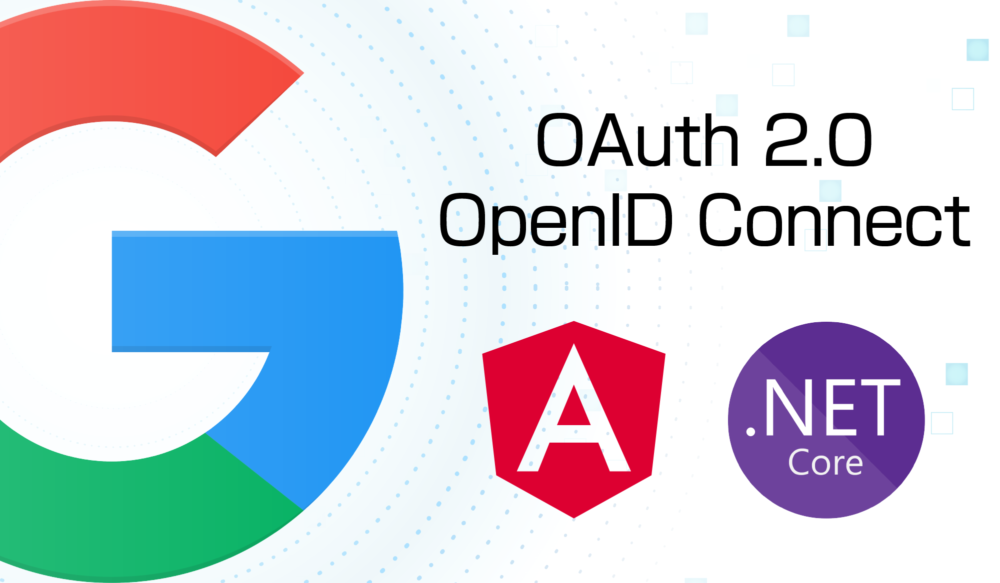

+++
title = "[Angular2 + ASP.NET Web API] Google OAuth 2.0 OpenID Connect with Authorization Code Flow 授權碼流程"
date = 2022-09-11T10:00:00.019Z
updated = 2022-09-18T00:53:29.370Z
draft = false
aliases = [
  "/2022/09/angular2-aspnet-webapi-google-oauth2-oidc-auth-code-flow.html"
]
description = "本文使用 Angular + ASP.NET Web API，示範如何在前後端分離的專案中實作 Google  OAuth2 OpenID Connect 授權碼流程登入。"

[taxonomies]
tags = [ ".NET Core", "C#", "JavaScript", "Google" ]

[extra]
banner = "preview.png"
featured = true
+++

[](preview.png)

> Demo site
>
> ---
> <https://googleoidcdemo.maki0419.com/>

本專案使用 Angular + ASP.NET Web API，示範如何在前後端分離的專案中實作 Google OAuth2 OpenID Connect 登入。

> 本文重點主要是在於實作，而非 OAuth 2.0 的流程講解  
> 如果想要深入學習，請參考保哥的課程 [《精通 OAuth 2.0 授權框架》](https://www.accupass.com/event/2207070432471635037675)
<!--more-->
## 介紹

使用 Angular 實現 OpenID Connect (OIDC) 登入，網路上的教學大都是使用隱含流程 (Implicit flow)。  
隱含流程不需要後端，適合 Angular 這種純前端應用。  
它的設定比較簡單，設備維護成本低，但相較於授權碼流程 (Authorization code flow) 來說{{cr(body="隱含流程的安全性較低")}}。

在較為大型的 Angular 應用程式專案中，常會搭配後端 API 以處理資料庫或是複雜的應用邏輯。  
或許你不會為了 OIDC 而多開一台後端伺服器，但倘若只是把授權碼流程的一部份搬到現有的後端 API，這就成為了一個划算的決定。

* C# ASP.NET Core 6 Web API 專案
  * OIDC 僅使用 Google 官方的 [Google.Apis.Auth](https://www.nuget.org/packages/Google.Apis.Auth/) 套件
* Angular 14 前端專案
  * OIDC 僅使用 Google 官方的 [Google Sign-In](https://developers.google.com/identity/gsi/web/guides/client-library) 客戶端套件

> 本文 GitHub 專案
>
> ---
> [jim60105/GoogleOIDC\_Angular\_ASPNETWebAPI\_Auth\_Code\_Flow](https://github.com/jim60105/GoogleOIDC%5FAngular%5FASPNETWebAPI%5FAuth%5FCode%5FFlow)

## Try it out

* 在 [Google API Console](https://console.developers.google.com/) 註冊新的專案，「憑證→OAuth 2.0 用戶端 ID→網頁應用程式」取得「用戶端編號」、「用戶端密碼」
* 在 「已授權的重新導向 URI」填入 `https://localhost:7091/api/Auth/oidc/signin`
* Git clone  

  ```bash
  git clone https://github.com/jim60105/GoogleOIDC_Angular_ASPNETWebAPI_Auth_Code_Flow.git
  ```

* ASP.NET Web API
  * Visual Studio 啟動 `ASPNET_WebAPI/GoogleOIDC_Angular_ASPNETWebAPI_Auth_Code_Flow.sln`
  * 修改 `ASPNET_WebAPI\appsettings.json` 檔案  
    * 在 `YOUR CLIENT ID` 填入「用戶端編號」  
    * 在 `YOUR CLIENT SECRET` 填入「用戶端密碼」  
    * `RedirectUri` 若留空字串則會彈性使用 runtime http request 進來時使用的 host；或者你也可以在這裡填入設定
  * 以 Debug 模式啟動但不偵錯 (Ctrl+F5)，Swagger 將啟動在 <https://localhost:7091>
* Angular
  * Visual Studio Code 啟動 `Angular` 目錄
  * 修改 `Angular\src\environments\environment.ts` 檔案  
    * 在 `YOUR CLIENT ID` 填入「用戶端編號」
  * npm install 並啟動伺服器  

   ```bash
   npm install 
   npm run-script start
   ```

* 訪問 <https://localhost:4200/>

## 套件安裝

* ASP.NET Core Web API
  * 安裝 nuget 套件: [Google.Apis.Auth](https://www.nuget.org/packages/Google.Apis.Auth/)
* Angular
  * 引用 [Google Sign-In](https://developers.google.com/identity/gsi/web/guides/client-library) 客戶端套件庫  
    <script src="https://emgithub.com/embed-v2.js?target=https%3A%2F%2Fgithub.com%2Fjim60105%2FGoogleOIDC_Angular_ASPNETWebAPI_Auth_Code_Flow%2Fblob%2Fmaster%2FAngular%2Fsrc%2Findex.html%23L11&amp;style=base16%2Ftomorrow-night&amp;type=code&amp;showBorder=on&amp;showLineNumbers=on&amp;showFileMeta=on&amp;showFullPath=on&amp;showCopy=on"></script>
  * 安裝 npm 套件 @types/google.accounts, jwt-decode  

    ```bash
    npm install --save-dev @types/google.accounts
    npm install --save jwt-decode

    ```

  * 在 `Angular\tsconfig.app.json` 中的 `compilerOptions:types` 中加入 `"google.accounts"`  
    <script src="https://emgithub.com/embed-v2.js?target=https%3A%2F%2Fgithub.com%2Fjim60105%2FGoogleOIDC_Angular_ASPNETWebAPI_Auth_Code_Flow%2Fblob%2Fmaster%2FAngular%2Ftsconfig.app.json%23L2-L10&amp;style=base16%2Ftomorrow-night&amp;type=code&amp;showBorder=on&amp;showLineNumbers=on&amp;showFileMeta=on&amp;showFullPath=on&amp;showCopy=on"></script>

## 授權流程

1. 用戶在前端按下 Sign in with Google 按鈕
2. 以 gsi 客戶端套件啟動授權碼流程  
   <script src="https://emgithub.com/embed-v2.js?target=https%3A%2F%2Fgithub.com%2Fjim60105%2FGoogleOIDC_Angular_ASPNETWebAPI_Auth_Code_Flow%2Fblob%2F292f0e393a593baeb5b57df35b28845db73fafdc%2FAngular%2Fsrc%2Fapp%2Fauthentication.service.ts%23L19-L28&amp;style=base16%2Ftomorrow-night&amp;type=code&amp;showBorder=on&amp;showLineNumbers=on&amp;showFileMeta=on&amp;showFullPath=on&amp;showCopy=on"></script>
3. 導向至 Google OAuth 授權頁面
4. (使用者同意後)，導向至 `後端/api/Auth/oidc/signin`，Model Binding 取得授權碼  
   若是使用者拒絕，或是發生了任何失敗，`error` 參數就會接到內容  
   <script src="https://emgithub.com/embed-v2.js?target=https%3A%2F%2Fgithub.com%2Fjim60105%2FGoogleOIDC_Angular_ASPNETWebAPI_Auth_Code_Flow%2Fblob%2F292f0e393a593baeb5b57df35b28845db73fafdc%2FASPNET_WebAPI%2FControllers%2FAuthController.cs%23L24-L39&amp;style=base16%2Ftomorrow-night&amp;type=code&amp;showBorder=on&amp;showLineNumbers=on&amp;showFileMeta=on&amp;showFullPath=on&amp;showCopy=on"></script>
5. 以授權碼去要回 idToken  
   <script src="https://emgithub.com/embed-v2.js?target=https%3A%2F%2Fgithub.com%2Fjim60105%2FGoogleOIDC_Angular_ASPNETWebAPI_Auth_Code_Flow%2Fblob%2F292f0e393a593baeb5b57df35b28845db73fafdc%2FASPNET_WebAPI%2FServices%2FOIDCService.cs%23L39-L57&amp;style=base16%2Ftomorrow-night&amp;type=code&amp;showBorder=on&amp;showLineNumbers=on&amp;showFileMeta=on&amp;showFullPath=on&amp;showCopy=on"></script>
6. 導向回前端，將 idToken 以網址參數傳給 Angular  
   <script src="https://emgithub.com/embed-v2.js?target=https%3A%2F%2Fgithub.com%2Fjim60105%2FGoogleOIDC_Angular_ASPNETWebAPI_Auth_Code_Flow%2Fblob%2F292f0e393a593baeb5b57df35b28845db73fafdc%2FASPNET_WebAPI%2FControllers%2FAuthController.cs%23L38&amp;style=base16%2Ftomorrow-night&amp;type=code&amp;showBorder=on&amp;showLineNumbers=on&amp;showFileMeta=on&amp;showFullPath=on&amp;showCopy=on"></script>
7. Angular 前端應用程式接到 idToken  
   <script src="https://emgithub.com/embed-v2.js?target=https%3A%2F%2Fgithub.com%2Fjim60105%2FGoogleOIDC_Angular_ASPNETWebAPI_Auth_Code_Flow%2Fblob%2F292f0e393a593baeb5b57df35b28845db73fafdc%2FAngular%2Fsrc%2Fapp%2Fapp.component.ts%23L22-L42&amp;style=base16%2Ftomorrow-night&amp;type=code&amp;showBorder=on&amp;showLineNumbers=on&amp;showFileMeta=on&amp;showFullPath=on&amp;showCopy=on"></script>
8. 將 idToken 做 JWT decode，取得內容物  
   <script src="https://emgithub.com/embed-v2.js?target=https%3A%2F%2Fgithub.com%2Fjim60105%2FGoogleOIDC_Angular_ASPNETWebAPI_Auth_Code_Flow%2Fblob%2F292f0e393a593baeb5b57df35b28845db73fafdc%2FAngular%2Fsrc%2Fapp%2Fauthentication.service.ts%23L50&amp;style=base16%2Ftomorrow-night&amp;type=code&amp;showBorder=on&amp;showLineNumbers=on&amp;showFileMeta=on&amp;showFullPath=on&amp;showCopy=on"></script>

   > 如果需要在前 / 後端驗證 JWT Token 的有效性，可以叫這個 api  
   > Google 會驗證簽章、簽發者、有效期，並在驗證通過時返回內容  
   > (直接 JWT decode 會比打這個 API 要來得快，建議只在需要由 Google 驗證時呼叫它)  
   > `https://oauth2.googleapis.com/tokeninfo?id_token=XYZ123`
   >
   > 參考來源:  
   > <https://developers.google.com/identity/sign-in/web/backend-auth#calling-the-tokeninfo-endpoint>

## 參考資料

* [Google API Console](https://console.developers.google.com/)
* [Verify the Google ID token on your server side | Sign In With Google | Google Developers](https://developers.google.com/identity/gsi/web/guides/verify-google-id-token)
* [Using OAuth 2.0 for Web Server Applications | Google Identity | Google Developers](https://developers.google.com/identity/protocols/oauth2/web-server)
* [OpenID Connect | Google Identity | Google Developers](https://developers.google.com/identity/protocols/oauth2/openid-connect)
* [Namespace Google.Apis.Auth | Google API support libraries](https://googleapis.dev/dotnet/Google.Apis.Auth/latest/api/Google.Apis.Auth.html)

> 延伸閱讀
>
> ---
>
> * [LINE Login OpenID Connect Demo Project (ASP.NET Core 6 MVC)](https://github.com/jim60105/LINELoginOIDCDemo)
> * [LINE Login OpenID Connect Implementation Demo Project (ASP.NET Core 6 MVC)](https://github.com/jim60105/LINELoginOIDCImplementationDemo)
> * [LINE Login OpenID Connect Demo Project (ASP.NET MVC5, .NET Framework 4.8)](https://github.com/jim60105/LINELoginOIDCDemo%5FMVC5)
