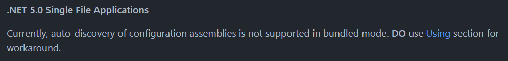

+++
title = "使用.NET Core的單一檔案部署時，Serilog不運作。你也可能以為你的程式不運作。"
description = "使用.NET Core的單一檔案部署時，Serilog不運作。你也可能以為你的程式不運作。"
date = 2022-03-02T16:03:00.016Z
updated = 2023-06-10T20:40:23.433Z
draft = false
aliases = [ "/2022/03/net-coreserilog.html" ]

[taxonomies]
tags = [ ".NET Core", "C#" ]

[extra]
card = "preview.png"
disclaimer = """
2023/06/11 更新:  
現在起它會報個錯誤給你！🤘  
參考: <https://github.com/serilog/serilog-settings-configuration/pull/353>"""
poor = true
+++


> 操你媽的大地雷，氣到我來發一篇文

> 寫在最前面，本文觸發的條件:
>
> * .NET Core
> * 單一檔案部署 (Single file application)
> * Serilog
> * 以 appsettings.json 來定義 log 規則
<!--more-->
如果滿足上述條件，記得 json 中要加上這一段  
參考專案檔內安裝的 Serilog 套件來寫

```json
{
  "Serilog": {
    "Using": [    <-----THIS SECTION!!!
      "Serilog",
      "Serilog.Enrichers.Thread",
      "Serilog.Settings.Configuration",
      "Serilog.Sinks.Console",
      "Serilog.Sinks.File"
    ],
    "WriteTo": [
 
      ...
      
    ],
    "Enrich": [
      "FromLogContext",
      "WithThreadId",
      "WithEventId"
    ]
  }
}
```

這件事被寫在兩個地方

* [這個 issue](https://github.com/serilog/serilog/issues/1558#issuecomment-812678179)
* [Serilog 其中一個套件依賴的 README 中的一行小字](https://github.com/serilog/serilog-settings-configuration/#net-50-single-file-applications)  
  
  寫得這麼清楚真是謝謝你了，若沒有這行字我還不知道怎麼跟客戶交差

最雷的是 Serilog 不會報錯，他就默默的，給你黑視窗，完全沒有畫面  
你會經歷  
把自己的 code 查一次  
→ 花一堆時間釐清程式為什麼不運作  
→ 懷疑人生  
→ 發現是 appsettings.json 怪怪的，但其它設定都有讀入  
→ 想辦法打開 Serilog 的報錯  
→ 得到 `Unable to find a method called File.`  
→ 丟 Google 後找到那個 issue 和文件  
→ 然後氣到上自己的部落格和社群罵髒話 (╯‵□′)╯︵┻━┻

而且我正在寫 Windows Service，[官方指南](https://docs.microsoft.com/zh-tw/dotnet/core/extensions/windows-service#publish-the-app)寫著推薦用單檔部署，我一直以為是哪裡弄錯沒成功啟動服務  
這兩件事湊在一起真他媽的雷到誇張

> [](finger.gif)
>
> 幹
