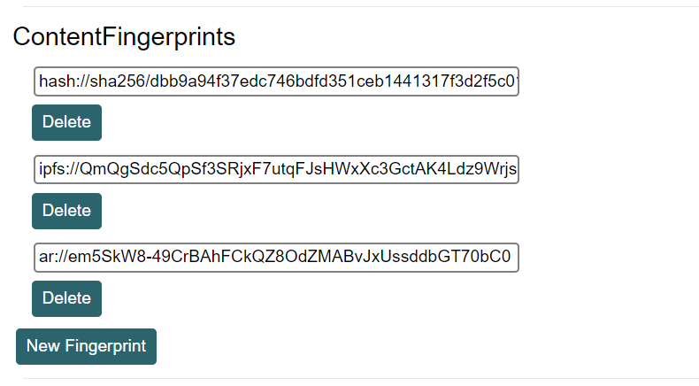

+++
title = "將網頁原樣保存以製作Writing NFT (適用於Blogger和其它平台)"
description = "透過 NFT Potal 出版 Writing NFT 時，我發現它的網頁爬蟲功能有一點點的不完美。這篇文章會說明如何自行爬蟲下來完整的網頁 html 存檔，再以此來制作 Writing NFT。"
date = 2022-12-18T02:01:00.015Z
updated = 2023-11-05T07:46:06.109Z
draft = false
aliases = [ "/2022/12/archive-page-for-writing-nft.html" ]

[taxonomies]
tags = [ "區塊鏈", "WritingNFT" ]
licenses = [ "GFDL 1.3" ]

[extra]
iscn = "iscn://likecoin-chain/0TcWBncBjI36FAfqcjQnRpSnzVYMEJy56YD7fOCq--M/1"
card = "preview.png"

  [extra.comments]
  id = "109532306623570043"
+++
## 前言

透過 [NFT Portal](https://app.like.co/nft/url) 出版 Writing NFT 時，我發現它的網頁爬蟲功能有一點點的不完美。

* 它有自己的一套機制去抓出網頁中的「文章內容」  
這能有效降低檔案容量減少開銷，但機制並非100%適合所有網頁版型，而且就...不那麼美
* <b>外部連結資源</b>並未上傳至 IPFS、Arweave，這些資源從原始位置刪除掉就沒有了  
如果你的圖片在不同的網址 (像Blogger預設就是)，它們就是外部連結資源
* 外部連結的站台若有 [CORS (Cross-Origin Resource Sharing)](https://developer.mozilla.org/en-US/docs/Web/HTTP/CORS)、[CSP(Content Security Policy)](https://developer.mozilla.org/en-US/docs/Web/HTTP/CSP) 設定，或者圖片站台有 [Hotlink Protection](https://support.cloudflare.com/hc/en-us/articles/200170026-Understanding-Cloudflare-Hotlink-Protection) 功能，這些資源將無法被存取  
我們的使用情境確實是 Cross Origin
* 在頁面容量較大時會發生爬蟲失敗的狀況  
(爬蟲功能關係到後端主機的負載，不可能無限制的爬，這是很合理的狀況)

> 總而言之，我的網頁變成了這個樣子  
> [ar://6tpNpIuUvMgu-KXkFHm\_0BnoyUEjKGGwQvklZ1-dk8k](https://arweave.net/6tpNpIuUvMgu-KXkFHm%5F0BnoyUEjKGGwQvklZ1-dk8k)  
> [ar://CgOW561bpnJd\_1ce9yVm7XCFGamn9BZm9JYry1PPSbM](https://arweave.net/CgOW561bpnJd%5F1ce9yVm7XCFGamn9BZm9JYry1PPSbM)

這篇文章會說明**如何自行爬蟲下來完整的網頁 html 存檔，再以此來制作 Writing NFT**。

<!-- more -->

首先，請安裝這個擴充功能

## 安裝擴充功能: 網頁剪貼簿

> Chrome 擴充功能  
> <https://chrome.google.com/webstore/detail/oegnpmiddfljlloiklpkeelagaeejfai>  
>
> ---
> Firefox 附加元件  
> <https://addons.mozilla.org/firefox/addon/webscrapbook>

網頁剪貼簿 (WebScrapBook) 可以忠實擷取網頁內容，支援多種儲存格式與客製化設定，還可以對擷取的資料做檢索、組織、加註、編輯。

網頁剪貼簿可擷取選取的網頁範圍、擷取網頁原貌 (未經頁面腳本處理)、或把網頁擷取為書籤。亦可自訂如何處理網頁中的圖片、音訊、視訊、字體、框架頁、樣式表、腳本等資源。網頁可儲存為資料夾、zip 封存檔案 (htz 或 maff)，或單一 html 檔案。

這個工具厲害的地方在於它可以將連結資源都轉成內嵌資源，並產出單一的 html 檔案，這很易於保存和管理。

安裝完成後，請開啟此擴充功能的「選項」，由最下方匯入這一份設定檔。

> 設定檔下載
>
> ---
> <a href="webscrapbook.options.20221217.json" download>webscrapbook.options.20221217.json</a>

## 爬蟲下載自己的網頁頁面

接下來請到你要制作 Writing NFT 的頁面，啟動「網頁剪貼簿」的「擷取分頁」功能。

> 它可能會照原樣截取下你的登入名稱、大頭貼  
> **建議在無痕模式下操作**

它會彈出一個視窗顯示下載進度，在結束後產出一個 html 檔案。

因為圖片內嵌進去了，檔案可能會很大，**請確認它是否超過20MB** ，這是 ISCN App 的檔案上傳容量上限。

若它超過20MB，我們改為

1. 先產生不內嵌圖片的小容量版本，以此產生 ISCN
2. 額外手動把完整版本上傳 IPFS、Arweave
3. 更新 ISCN 的 IPFS、Arweave 記錄以連結至前一步驟上傳的檔案

請改用「網頁剪貼簿」的「擷取分頁**為...**」功能，在「擷取 - 內容」 → 「圖片」，由「儲存現用」改為「**連結**」，取得容量小很多的 html 檔案。

**請打開這個 html 檔案，確認一切完好。**

下一步驟，我們要拿這個檔案建立 ISCN。

> 在我提供的設定檔中，**video 和 iframe 是保留為原始連結**  
> 這兩種資源的容量大，內嵌時請自行按需求斟酌
>
> 

## 建立 ISCN

這裡沒什麼需要說的，在 [ISCN App](https://app.like.co/new) 把 html 檔案上傳，輸入資料即可。

> 官方說明書
>
> ---
> <https://docs.like.co/v/zh/general-guides/decentralized-publishing/app.like.co#bu-zhou-er-shang-zai-nei-rong>

## 鑄造 Writing NFT

點選網頁右上角，直接 Mint NFT。

> 官方說明書
>
> ---
> <https://docs.like.co/v/zh/general-guides/writing-nft/nft-portal#fang-fa-1-cha-zhao-iscn-hou-zhi-jie-chu-ban-writing-nft>

如果你的檔案小於20MB，到這裡就完成了！
**如果你的檔案超過20MB，接著還要替換內容。**

## 手動把 html 上傳至 IPFS、Arweave

### IPFS

來到 [Pinata](https://www.pinata.cloud/) 註冊帳號，然後上傳 html 檔案。免費帳號可以保存 1GB 的檔案，很足夠了。

上傳完畢後，在此取得 IPFS CID:

### Arweave

先從[水龍頭](https://faucet.arweave.net/)創建錢包，內含 0.02AR 的免費資金。註冊[ArDrive](https://ardrive.io/) 並開啟錢包，上傳 html 檔案。

上傳後在此取得數據交易ID:

## 更新 ISCN 內容

打開 [ISCN Browser](https://likecoin.github.io/iscn-browser) 並連結你的錢包。

瀏覧你創建的 ISCN，找到該筆資料後點擊右側的「Edit」。

往下找到「ContentFingerprints」，將 ipfs 和 ar 換成上一步驟取得的內容。

> 你可以在 [SHA256 File Checksum Online](https://emn178.github.io/online-tools/sha256%5Fchecksum.html) 計算文件的 sha256 hash，或者乾脆刪除它

**記得點下面的「Update」按鈕**，將數據更新至區塊鏈上。

## 結束🎉

Writing NFT 會自動關聯到新版本的 ISCN，到 Writing NFT 頁面上確認吧！
