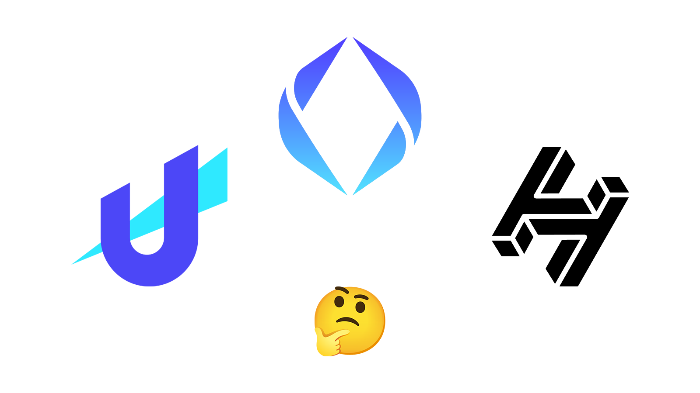

+++
title = "區塊鏈網域簡介 —— Handshake 、 Unstoppable Domains 、 Ethereum Name Service"
description = "本文以一個業餘網管的視角出發，就Handshake、Unstoppable Domains、Ethereum Name Service三個當紅的區塊鏈網域專案作介紹，描述它們有何不同，而你應該怎麼選。 HNS vs. UD vs. ENS Blockchain Domain DNS"
date = 2022-01-08T20:35:00.052Z
updated = 2022-12-13T16:11:34.783Z
draft = false
aliases = [
  "/2022/01/blockchain-domains-handshake-unstoppable-domains-ethereum-name-service.html"
]

[taxonomies]
tags = [ "區塊鏈", "Blockchain Domain" ]

[extra]
card = "preview.png"
iscn = "iscn://likecoin-chain/5ziIrlJOYm_goQSS2ITXSEPQ9lIZ8U3owXdieu543RU/1"
featured = true

  [extra.comments]
  id = "109420959355542822"
+++

## 前言

在網路世界中，我們每台裝置都擁有 IP 以代表自己的網路位置。人們難以記住一串數字，於是發明了 DNS 系統來將 IP 對應到有意義的字串。這是一個很棒的發明，也是現今的主流技術，但他有著高度中心化的特性。

當使用者以本站網域名稱 `blog.maki0419.com` 查詢本站 IP 時，會經由**根網域名稱伺服器**、**com 權威網域名稱伺服器** 取得 `maki0419.com` **網域名稱伺服器位置**，並取得子網域 `blog.maki0419.com` 的網頁伺服器 IP 位置。當其中一台網域伺服器糟到劫持，DNS 系統就可能回應一個假的 IP 位置。而區塊鏈網域基本上就是要擺脫這個問題。

> 其實區塊鏈網域的概念很簡單，**就是把你的 IP 給寫到鏈上**，只是大家的做法不太一樣

我個人並不是區塊鏈工程師，我不了解技術細節，本文也不會探討那些東西。我會以一個業餘網管的視角出發，就 Handshake、Unstoppable Domains、Ethereum Name Service 三個當紅的區塊鏈網域專案作介紹，描述它們有何不同，而你應該怎麼選。

喔對了，我現在手上有 20 個 Handshake domains，以及兩個 Unstoppable Domains.

## 傳統 Domain Name System

<embed type="image/svg+xml" src="../dns_owner.svg" />

在進入正題之前，我想先介紹一下 DNS 是如何運作的，請見上圖  
舉例來說，假設 client 端查詢 `www.happydog.com`，其對應為 `77.77.77.77`，是一台網頁伺服器的 IP

1. 客戶端向解析器詢問 `www.happydog.com`
2. 解析器向根域名伺服器詢問 `www.happydog.com`
3. 根域名伺服器回覆 com 權威域名伺服器位置
4. 解析器向 com 權威域名伺服器詢問 `www.happydog.com`
5. com 權威域名伺服器回覆 happydog 次級域名伺服器位置
6. 解析器向 happydog 次級域名伺服器詢問 `www.happydog.com`
7. happydog 次級域名伺服器回覆為 A 記錄 `77.77.77.77`
8. 解析器回覆客戶端，`www.happydog.com` 對應到 `77.77.77.77`
9. 客戶端向 `77.77.77.77` 查詢網頁
10. 網頁伺服器回覆網頁內容

此處的解析器常被稱為 **DNS 伺服器**，也就是你填入電腦 DNS 位置的 8.8.8.8、1.1.1.1 等伺服器。這台解析器可以由使用者自行架設，它的定位是「被使用者信任」的解析器。

下方的次級域名伺服器是由網站擁有者所管理。例如本站的 `maki0419.com` 是由我所管理，我可以設定 blog 子網域指向何處。使用者今天看到的網站明天可能對應到另一個 IP，這些內容是可被我變動的，或者可能我被駭客入侵攻擊。後面我們會提到如何解決這個問題。

根域名伺服器和權威域名伺服器是**由網路巨頭所管理**，是整個 DNS 系統的中心化部份。只要這幾台機器被劫持，它們可能會回應錯誤的 IP 位置，讓使用者無法瀏覧網站，或被導向錯誤的伺服器。事實上這就是「DNS 污染」攻擊，是大陸網友的日常生活。

所以呢，讓我們把右邊那塊上鏈

## Handshake domains (HNS)

<embed type="image/svg+xml" src="../dns_hns.svg" />

別懷疑，這個專案的名稱就叫 **Handshake**，為了區分一般稱為 Handshake domain，或是它的虛擬幣名稱 HNS。

Handshake domain 使用的是頂級域名層級，每個人在這裡取得的域名是和 com、org 同級。Handshake 考慮到兼容，已將現有的頂級域名做保留，不會和傳統的域名系統衝突。Handshake 的解析器已有實作，稱為 [HNSD](https://github.com/handshake-org/hnsd)。當客戶端詢問 Handshake domain 時，它會去鏈上查；當客戶端詢問傳統 TLD 域名時，它會向上游的解析器查詢。

來模擬，client 端查詢 `www.happydog`，假設其對應為 `77.77.77.77`，是一台網頁伺服器的 IP  
注意，happydog 並不是 ICANN 發出的頂級域名之一，它會被視為 Handshake domain 去鏈上查詢  
([Handshake domain 上確實有這個域名](https://www.namebase.io/domains/happydog)，可惜不是我的\~)

1. 客戶端向 Handshake 解析器詢問 `www.happydog`
2. 解析器**去鏈上查詢** `www.happydog`
3. 解析器**在鏈上找到 happydog 頂級域名伺服器 IP**
4. 解析器向 happydog 頂級域名伺服器詢問 `www.happydog`
5. happydog 頂級域名伺服器回覆為 A 記錄 `77.77.77.77`
6. Handshake 解析器回覆客戶端，`www.happydog` 對應到 `77.77.77.77`
7. 客戶端向 `77.77.77.77` 查詢網頁
8. 網頁伺服器回覆網頁內容

這個模型能夠很完美的嵌入現有的 DNS 系統，它和現有的設計契合。你只要運行起一台 HNSD，然後把客戶端的 DNS 指向它就好。且由於區塊鏈公開且不可變的特性，客戶端絕不可能受到 DNS 污染。鏈上 happydog 頂級域名伺服器位置，保證是由網站擁有者寫上去的。

但它還不夠去中心化，看看那台 happydog 頂級域名伺服器。接下來要講的兩個專案更絕，客戶端直接去鏈上查。

## Unstoppable Domains 和 Ethereum Name Service

<embed type="image/svg+xml" src="../dns_eth.svg" />

**Unstoppable Domains 和 Ethereum Name Service 都是由客戶端直接去鏈上查**。特別一提，查回來的不再是 A record 了，而是 IPFS CID，以此到 IPFS 網路上取回網頁。

1. 客戶端去鏈上查詢 `www.happydog.crypto`
2. 客戶端在鏈上找到 `www.happydog.crypto` 對應的內容為 `bafybeiafugyu3readoox4ilri5sznkalntg4ckio3y52mhw3yjkullnskl`
3. 客戶端在 IPFS 網路上訪問 `bafybeiafugyu3readoox4ilri5sznkalntg4ckio3y52mhw3yjkullnskl`
4. 客戶端在 IPFS 網路上取得 `bafybeiafugyu3readoox4ilri5sznkalntg4ckio3y52mhw3yjkullnskl` 網頁內容

IPFS 上的網頁和鏈上的 IPFS CID 一定是由網站擁有者上傳，而且因為 IPFS 的設計，「同一個 CID」一定會取得「同一個」網頁內容。只要改了一個字元 hash 就會不同，在 IPFS 網路上就會是另一個 CID。鏈上的東西不能假，其指向的 IPFS 網頁也不能換，客戶端取得的一定會是網站擁有者所上傳的那份網頁。

客戶端由區塊鏈和 IPFS 取得網頁內容，不依靠任何中心伺服器的回應，這是完全的去中心化。

這很美好，但它完全和現有的 DNS 系統不相同。客戶端必須支援查詢 UD、ENS domain，且要能顯示 IPFS 內容。它回應的並不是一個 IP 位置，如果你的服務並不是單純的靜態網頁或 Web3 網頁，那麼也不適用。**事實上 UD 和 ENS 主要是矚目在虛擬錢包位址的對應**，IPFS 網頁只算是附加價值。但我是個網頁工程師，所以嘛...

> IPFS 不是區塊鏈，是分散式網路儲存系統  
> 雖不精確，但你可以想成是沒有 tracker 的 BT
>
> 本文不探討 IPFS，詳細請閱讀這篇站外文章  
> [IPFS 問與答 | 人生這部戲 | Frank Shi](https://www.frank.hk/blog/ipfs-q-and-a/)

## 比較

### Handshake

* 頂級域名
* 契合現有的 DNS 系統，只需要把 resolver 換掉
* 不完全去中心化，但已把最重要的部份上鏈
* 在鏈上寫 TXT、NS、DS records，指向外部個人域名伺服器
* 網域取得是採用[競標，第二高價者得標](/2022/01/handshake-blockchain-domain-auction.html#handshake%E7%B6%B2%E5%9F%9F%E7%9A%84%E7%AB%B6%E6%A8%99%E8%A6%8F%E5%89%87)，一次性付費

> 基本上，以夠高的價格下標不太熱門的網域就很少有人來搶，就有機會以 0 元得標 (因為沒有第二高價者)

### Unstoppable Domains 、 Ethereum Name Service

* 次級域名
* 完全不同於現有的 DNS 系統，需要特殊的客戶端
* 完全去中心化
* 只能對應 IPFS 文件、虛擬錢包位置，並非是傳統 records 那一套
* 域名本身的價格還好，但上鏈和變更時的 gas fees 很貴，非常貴，超級貴，因為他們是要在 ERC-20 鏈上寫字

  > 2024/10/10 更新:  
  > [Unstoppable Domains 全面和 Polygon 合作](https://support.unstoppabledomains.com/support/solutions/articles/48001200584-learn-more-about-our-l2-scaling-solution-and-what-it-means-for-you)；[ENSv2 宣佈將轉移到 Layer 2](https://blog.ens.domains/post/ensv2)，這些是它們為了對應過高的 gas fees 所做出的策略。狀況已改善很多，請自行查閱最新資訊。

* Unstoppable Domains 是一次性付費買斷，價格以... 熱門度? 而定  
  Ethereum Name Service 按年續費，價格以網域字串長度而定 (5 字元以上 USD 5 / 年；4 字元 USD 160 / 年；3 字元 USD 640 / 年)

## 結語

區塊鏈網域距離主流還有很長一段路，現在都還是非常早期的階段。我不知道它們未來誰是 iPhone? 誰是 PDA? 我個人目前擁有 20 個 Handshake domains，以及兩個 Unstoppable Domains，沒有 ENS domain。理由也很明確，ENS 是按年續費的，我不打算為還沒人在用的東西付維護費。Handshake、Unstoppable Domains 是一次性購買，反倒是提早入場不用擠人。

不過按年續費也不一定是壞事啦，至少能看到他們為了持續賺錢而讓 ENS 專案活著的未來。沒熱度而死去的區塊鏈專案可是不計其數呢。

> 下篇  
> [Handshake domain 區塊鏈網域 —— 購買 HNS、網域競標](../handshake-blockchain-domain-auction)
