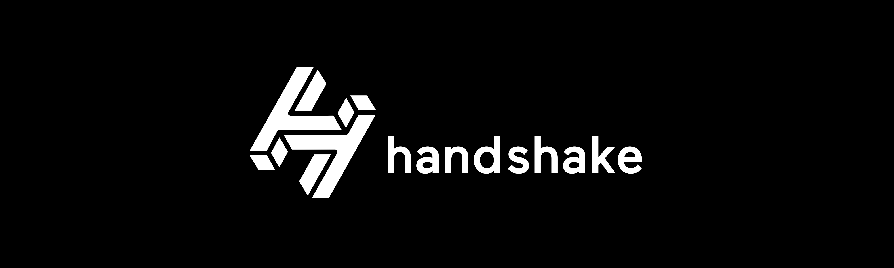

+++
title = "Handshake domain 區塊鏈網域 —— 如何訪問網域"
description = "Handshake domain 區塊鏈網域 —— 如何訪問網域"
date = 2022-01-15T19:24:00.006Z
updated = 2022-12-15T20:23:49.754Z
draft = false
aliases = [ "/2022/01/handshake-blockchain-domain-how-to-access.html" ]

[taxonomies]
tags = [ "區塊鏈", "Blockchain Domain" ]

[extra]
card = "preview.png"
+++

> 前篇  
> [Handshake domain 區塊鏈網域 —— 購買HNS、網域競標](/Blockchain/blockchain-domain/handshake-blockchain-domain-auction)

在前篇我們成功把網域給標到手了！區塊鏈網域和其它常見的NFT可不一樣，它不只是個所有權憑證，它寫在鏈上的資訊還能導向我們的伺服器位置。Handshake domain是個已經有實作的專案，整個架構是能運行的。要把它使用起來，我們有兩個面向要設定，一邊是伺服器方；一邊是訪問方——伺服器方要起動一台DNS主機，並由鏈上指向它；訪問方要把自己的解析器替換為Handshake resolver。

這篇將講解如何設定**訪問方**，使自己能訪問Handshake網域，並且在文末探討有關憑證驗證的議題。

## 如何訪問Handshake網域

Handshake的解析器有不少實作，[完整清單在此](https://learn.namebase.io/starting-from-zero/how-to-access-handshake-sites)。以下介紹幾個不錯的方案。

> 請用 [welcome.nb/](http://welcome.nb/) 進行測試輸入時注意最後方的斜槓，以免某些瀏覧器啟動搜尋功能

### HNS↗TO - 不用做任何設定

網址: [hns.to](http://hns.to)

hns.to是一個Handshake的網關服務，它能以傳統DNS訪問，並代理Handshake網域的內容給你。在瀏覧器直接訪問 "hns.to/"+Handshake 網域，例如"[hns.to/welcome.nb/](http://hns.to/welcome.nb/)"，它會自動導向至<http://welcome.nb.hns.to/>，並返回 [welcome.nb/](http://welcome.nb/) 的內容給你。它很方便，但這一定不安全，所有流量都會經過它們家的伺服器。

這適用在暫時提供未設定Handshake domain環境的圈外人使用，請不要把它視為正式用途。

### Bob Extension (Chrome Extension)

網址: <https://chrome.google.com/webstore/detail/bob-extension/ogcmjchbmdichlfelhmceldndgmgpcem>

它是一個瀏覧器內錢包，[由社群維護](https://github.com/kyokan/bob-extension)。除了常見的和dapps互動以外，它還提供瀏覧器內proxy功能——將Chrome的DNS查詢導向到HNSD解析器。預設它會使用公開的HNSD主機，你可以在設定中改成指向你自己的解析器。

我不推薦使用這個Extension做Proxy。猜也知道，[Let's Encrypt不支援發行Handshake domain的TLS證書](https://community.letsencrypt.org/t/lets-encrypt-for-handshake-domains/159544)，所以我在個人主機上使用自簽憑證。當訪問網頁時會出現`ERR_CERT_AUTHORITY_INVALID`，按「繼續」或輸入`thisisunsafe`以訪問，這還算能接受。但是經過Extension Proxy後，此錯誤會變為`ERR_PROXY_CERTIFICATE_INVALID`，並且無法手動允許。無法訪問是要我怎麼用..

### NextDNS - 內建Handshake域名解析的DNS提供商

網址: <https://nextdns.io/zht>

NextDNS公司是一家DNS解析器提供商，允許用戶設定DNS Filter以過濾DNS查詢。NextDNS 每月提供 30 萬筆查詢次數的免費額度，如果你需要更多流量，訂閱制為NT$70/月、NT$700/年。他們內建非常多的DNS過濾清單、追蹤清單，甚至有AdGuard的清單。最重要的，它們可以解析Handshake域名。

如果你不自己架設解析器，那麼NextDNS是最理想的選擇了，若你的用量不會超出免費額度的話。NextDNS網站有完整的設定教學，你可以把它設定在瀏覧器層級；電腦OS層級；或是路由器層級。NextDNS是一家頂尖的DNS提供商，而它們支援Handshake這件事，無疑是給Handshake社群帶來很大的肯定。

> 題外話，我個人目前使用NextDNS做手機的DNS Filter  
> 不愧是小米手機，追蹤數據一半送美國、一半送大陸  
> 中美大數據我兩邊都參與到了耶┌(。Д。)┐  
>
> 

### HNSD - SPV light node

網址: <https://github.com/handshake-org/hnsd>

HNSD由社群維護，是Handshake網路的SPV解析器。它會和其它HSD full node建立P2P網路，向其它full node詢問網域解析，並驗證獲得的回應。HNSD本身不儲存任何資料，只在DNS cache滿載時使用12MB的memory。

自行架設HNSD時，能夠保證你的瀏覧不經過其它第三方外部主機。HNSD的優點在於它的運行成本很低，並不是每個人的環境都有足夠強大的機器，儲存20GB且持續增長的區塊鏈以運行完整的HSD節點。但由於它依賴外部的full node查詢區塊鏈，它不是一個安全的解決方案。

你可以在本機電腦運行它，並把瀏覧器DNS指向它；或是在內網的NAS上運行它，把電腦的DNS指向它。

### Fingertip - HNSD + letsdane + go-ethereum的Proxy server

網址: <https://impervious.com/fingertip.html>

這是一個[開源](https://github.com/imperviousinc/fingertip)的Proxy伺服器，內建HNSD以解析handshake網域，整合了[letsdane](https://github.com/buffrr/letsdane)以驗證DANE憑證，還整合[go-ethereum](https://github.com/ethereum/go-ethereum)以解析.eth域名(ENS域名)。安全性考量請參考上方HNSD的描述，除了Proxy Server和DNS Server差別外，其餘在定位上差不多。

### HSD - full node

網址: <https://github.com/handshake-org/hsd>

自行運行HSD完整節點當然是完全分散式、最隱私、且最安全的做法。你持有完整的區塊鏈，並且直接在上頭查找網域資訊。

## 探討關於Handshake的憑證信任驗證機制

> 在Namebase的說明文件上有探討這個主題
>
> <https://learn.namebase.io/about-handshake/about-handshake#a-more-secure-internet>

> CA憑證的介紹，請見外站連結
>
> HTTPS/SSL/TLS 概述，整體流程、憑證、數位簽章 - iT 邦幫忙
>
> <https://ithelp.ithome.com.tw/articles/10193095>

你的電腦上出廠就安裝了數百個CA——微軟有390個證書，而Mac OS X有170個證書。為了「安全」地瀏覽網頁，你必須信任所有這些CA以及它們委託的許多中介機構。如果這些機構中哪怕任何一個有惡意行為或被駭客攻擊，那麼你所有的HTTPS互聯網瀏覽流量都會受到影響，容易受到MITM中間人攻擊。**在[DigiNotar事件](https://www.hkcert.org/tc/blog/trust-of-website-certificate-questioned-reflection-of-the-comodo-and-diginotar-incidents)中，伊朗政府駭掉了一個荷蘭CA，並利用它對30萬伊朗公民進行MITM攻擊。**這又是一個中心化架構的缺陷，而Handshake能解決這個問題。

Handshake網域以區塊鏈作為自己的信任根，並將其TLS密鑰釘在自己身上。

Handshake不是依靠「由數百個證書頒發機構組成的任意集中式列表」來驗證公鑰的真實性，而是通過「將信任根轉移到一個有密碼支持的分佈式信任根」也就是區塊鏈，使任何人都可以驗證密鑰的真實性。與傳統網域不同的是，只需要一個壞的證書頒發機構就可以破壞你的安全，而在Handshake，駭客得要造假整個Handshake區塊鏈。

CA驗證的主要目標是「讓客戶端確定其取得的網頁，是由被權威驗證過的伺服器所發出」。「申請人被權威驗證過」，並且因為只有該伺服器能送得出憑證，「網頁沒有在中途被調包」。區塊鏈網域的本質就是要脫離權威審察，在這裡並沒有被信任的權威，也沒有人能審察你的網域註冊。「申請人被權威驗證過」不一定是好事，因為權威可能不被信任，尤其這些機構都在各大政府的掌控之下。再說，現在由Let's Encrypt可以很簡單的取得被瀏覧器信任的憑證。若看到一家正規公司的憑證由Let's Encrypt簽發當然是件不正常的事，但它一樣都會顯示綠色鎖頭🔒。

在區塊鏈的世界中，鏈上的資訊是不可能假的。我們使用自簽憑證，將此憑證的雜湊寫到Handshake鏈上，並在網頁上提供此憑證。客戶端將憑證和鏈上寫的資訊作比對，以查覈此網頁是由網域擁有者所送出，「網頁沒有在中途被調包」。整個信任基礎由「權威認證的信任樹」改為「網頁確實來自網域所有者」。今天你來到`blog.maki0419/`看到了綠色鎖頭，你想知道的是這確實是我的網頁，而不是我有向權威繳保護費。DANE驗證的是更合理的信任基礎。

> DNS-based Authentication of Named Entities (DANE)是一項網際網路安全協議，允許使用DNSSEC將通常用於TLS的X.509數位證書與域名綁定。它是在RFC6698中提出的，是一種在沒有CA的情況下驗證TLS客戶端和服務器實體的方法。  
>
> 詳細探討請見外站連結  
> DANE 的過去、現在與未來 - 財團法人台灣網路資訊中心部落格 | TWNIC Blog  
> <https://blog.twnic.tw/2021/04/15/17961/>

> 要在Handshake實作DANE驗證請讀以下這篇文章，文內講得非常詳細  
> [Building a secure website on your Handshake TLD | by Matthew Zipkin | Medium](https://matthewzipkin.medium.com/building-a-secure-website-on-your-handshake-tld-a8922a950a4f)  
> 對，真有夠複雜

此文撰文時點，主流瀏覧器都不支援DANE驗證，客戶端要[另起一台Proxy來驗](https://github.com/buffrr/letsdane)。這讓我覺得，在Handshake尚未流行的現階段配置DANE的意義還不夠大。目前我個人只使用簡單的自簽憑證，確保連線有透過TLS加密而已。

## 結語

你可能很高興的設定好了，但我得在這裡說句實話 ——就個人體驗來說，上鏈查資料比傳統DNS系統要慢上數百倍。當resolver中沒有cache時，你可能要重覆F5個20秒才能成功查回ip，視你的機器效能和網路速度而定。沒有辦法，不像傳統DNS是以速度和串串樂為中心的設計，Handshake是以區塊鏈為中心的設計。只要上鏈就會扯到機器效能，而其結果就是慢。

現在我個人使用NextDNS，並在平常不使用的Browser上設定DoH，以免超出免費方案。當我要訪問Handshake站點，我就打開該Browser，並多F5個幾次讓NextDNS建立cache。目前我的使用量小到不值得我在本地配置node，並且我也沒有什麼機敏資訊害怕洩漏。以上心得提供給各位參考。

下一篇講講我們身為伺服器方，如何來設定第一個Handshake domain，實際操作架設一個站點起來。

> 下篇  
> [Handshake domain 區塊鏈網域 —— 如何設定網域](/2022/03/handshake-blockchain-domain-how-to-setup.html)

iscn://likecoin-chain/dIW1ALSDI9yVxlh8an4X9uOzlwB7bp2gBPPWMPz6--8
