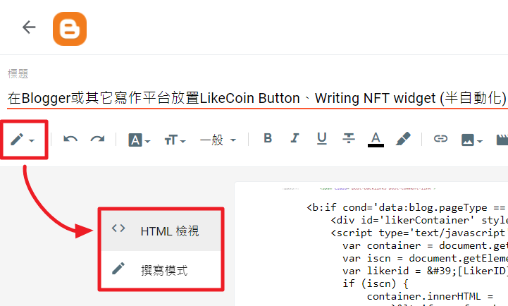

+++
title = "在Blogger或其它寫作平台放置LikeCoin Button、Writing NFT widget (半自動化)"
description = """
我也加入 Writing NFT 的作者行列了！
這篇文章教各位在 Blogger 每篇文的文末自動產生 LikeCoin Button ，並且，只要在文章中加入 ISCN ，LikeCoin Button 就會變成 Writing NFT widget！"""
date = 2022-12-14T13:04:00.017Z
updated = 2023-11-05T07:31:32.294Z
draft = false
aliases = [ "/2022/12/likecoin-writing-nft-widget-on-blogger.html" ]

[taxonomies]
tags = [ "區塊鏈", "WritingNFT" ]
licenses = [ "GFDL 1.3" ]

[extra]
card = "preview.png"
iscn = "iscn://likecoin-chain/iQ5NQdeCLXQ66evbflzBGgc908rbt0xlfH15cQLdlSQ/1"
trigger = "本站已於 2024 年年底由 Blogger 遷離。雖然本文內容依然有效，但此頁的渲染不再使用相同的程式碼產生。"

  [extra.comments]
  id = "109512278874620729"
+++


## 前言

我也加入 Writing NFT 的作者行列了！

這篇文章教各位在 Blogger 每篇文的文末自動產生 LikeCoin Button ，並且，只要在文章中加入 ISCN ，LikeCoin Button 就會變成 Writing NFT widget！

所謂的「半自動化」，是指**你需要手動為文章產生 ISCN 並加入文章內**，其餘都是自動化的喔！<!--more-->

## Widget 外觀

<div id="likerContainer">
  <iframe
          class="writingNFT"
          frameborder="0"
          sandbox="allow-scripts allow-same-origin allow-popups allow-popups-to-escape-sandbox allow-storage-access-by-user-activation"
          scrolling="no"
          src="https://button.like.co/in/embed/iscn/button?iscn_id=iscn://likecoin-chain/iQ5NQdeCLXQ66evbflzBGgc908rbt0xlfH15cQLdlSQ/1"></iframe>
</div>

<div id="likerContainer">
  <iframe
          class="likecoin"
          frameborder="0"
          sandbox="allow-scripts allow-same-origin allow-popups allow-popups-to-escape-sandbox allow-storage-access-by-user-activation"
          scrolling="no"
          src="https://button.like.co/in/embed/jim60105/button?referrer=http%3A%2F%2F127%2E0%2E0%2E1%3A1111%2FBlockchain%2Flikecoin%2Dwriting%2Dnft%2Dwidget%2Don%2Dblogger%2F"></iframe>
</div>

## 插入程式碼

* 打開主題編輯器: Blogger 後台 → 主題 → 編輯 HTML
* Ctrl+F 尋找 `<data:post.body/>` ，這個標籤是文章內容，我們要把 code 貼在它的後面

    > 如果你的版型支援手機版，你會找到兩處，一處手機版一處電腦版，不要遺漏

* 複製貼上這段程式碼，位置參考如圖  
    [](template.png)  

    ```html
    <b:if cond='data:blog.pageType == &quot;item&quot;'>
    <div id='likerContainer' style='background: white; box-shadow: inset 0 0 16px 11px #000000; width: 360px; margin: 0px auto;'/>
        <script type='text/javascript'>
        var container = document.getElementById(&#39;likerContainer&#39;);
        var iscn = document.getElementById(&#39;iscn&#39;)?.innerHTML.trim();
        var likerid = &#39;[LikerID]&#39;;
        if (iscn) {
            container.innerHTML =
                `&lt;iframe frameborder=&#39;0&#39; sandbox=&#39;allow-scripts allow-same-origin allow-popups allow-popups-to-escape-sandbox allow-storage-access-by-user-activation&#39; scrolling=&#39;no&#39; src=&#39;https://button.like.co/in/embed/iscn/button?iscn_id=${encodeURIComponent(iscn)}&#39; style=&#39;max-height: 440px; height: 103vw; width: 100%;&#39;/&gt;`;
            console.log(&#39;ISCN: &#39; + iscn);
        } else {
            container.innerHTML =
                `&lt;iframe frameborder=&#39;0&#39; sandbox=&#39;allow-scripts allow-same-origin allow-popups allow-popups-to-escape-sandbox allow-storage-access-by-user-activation&#39; scrolling=&#39;no&#39; src=&#39;https://button.like.co/in/embed/${likerid}/button?referrer=${encodeURIComponent(location.href.split[&#39;?&#39;](0).split[&#39;#&#39;](0))}&#39; style=&#39;height: 200px; width: 100%;&#39;/&gt;`;
        }
        </script>
    </b:if>
    ```

    > Blogger 主題程式碼需要做 HTML encode  
    > [文末](#general-code)提供原始程式碼以在其它平台上使用

  * <span class="danger">把程式碼第六行的 `[LikerID]` 改為你的 LikerID！</span>
  * CSS微調: 你可能會想調整在第二行的 style，讓它搭配你的版型風格

## 使用方式

### 在沒有出版為 Writing NFT 的時候

它會顯示為讚賞按鈕，<span class="success">自動的</span>，什麼都不用做！

<div id="likerContainer">
  <iframe
          class="likecoin"
          frameborder="0"
          sandbox="allow-scripts allow-same-origin allow-popups allow-popups-to-escape-sandbox allow-storage-access-by-user-activation"
          scrolling="no"
          src="https://button.like.co/in/embed/jim60105/button?referrer=http%3A%2F%2F127%2E0%2E0%2E1%3A1111%2FBlockchain%2Flikecoin%2Dwriting%2Dnft%2Dwidget%2Don%2Dblogger%2F"></iframe>
</div>

### 在出版為 Writing NFT 的時候

* 在 [NFT Portal](https://app.like.co/nft/url) 手動出版為 Writing NFT，取得 ISCN

    > 官方說明書  
    >
    > ---  
    > [https://docs.like.co/v/zh/general-guides/writing-nft/nft-portal](https://docs.like.co/v/zh/general-guides/writing-nft/nft-portal#yi-wen-zhang-wang-zhi-chu-ban-writing-nft)

* 回到文章編輯器，<span class="danger">切換至 <> HTML檢視</span>  
    
* 在文章的任一處 (最末尾即可)，貼上這個 div 標籤

    ```html
    <div id="iscn" hidden>iscn://likecoin-chain/iQ5NQdeCLXQ66evbflzBGgc908rbt0xlfH15cQLdlSQ/1</div>
    ```

> 各位理解後一定能記住它
>
> ---
>
> <span style="color: lightgreen;">&lt;div</span><span style="color: #01ffff;"> </span><span style="color: #ffa400;">id="iscn"</span>
> <span style="color: #fcff01;">hidden</span><span style="color: lightgreen;">&gt;</span><span style="color: #b4a7d6;">iscn://likecoin-chain/iQ5NQdeCLXQ66evbflzBGgc908rbt0xlfH15cQLdlSQ/1</span><span style="color: lightgreen;">&lt;/div&gt;</span>
>
> ---
>
> <span style="color: lightgreen;">綠色</span>： div 標籤本體，它是&lt;div&gt;&lt;/div&gt;的形式  
> <span style="color: #ffa400;">橘色</span>： 這個標籤的 id，用做程式碼的識別，這 id 就叫做 iscn  
> <span style="color: #fcff01;">黃色</span>： hidden ，設定這個標籤在頁面上隱藏不顯示  
> <span style="color: #b4a7d6;">紫色</span>： ISCN 的內容，程式會把這個內容拿去產生 Writing NFT widget

<div id="likerContainer">
  <iframe
          class="writingNFT"
          frameborder="0"
          sandbox="allow-scripts allow-same-origin allow-popups allow-popups-to-escape-sandbox allow-storage-access-by-user-activation"
          scrolling="no"
          src="https://button.like.co/in/embed/iscn/button?iscn_id=iscn://likecoin-chain/iQ5NQdeCLXQ66evbflzBGgc908rbt0xlfH15cQLdlSQ/1"></iframe>
</div>

## 通用程式碼 {#general-code}

以下提供 html encode 前的程式碼，可以在其它的寫作平台使用

```html
<div id="likerContainer" style="background: white; box-shadow: inset 0 0 16px 11px #000000; width: 360px; margin: 0px auto;" ></div>
<script type="text/javascript">
    var container = document.getElementById('likerContainer');
    var iscn = document.getElementById('iscn')?.innerHTML.trim();
    var likerid = '[LikerID]';
    if (iscn) {
        container.innerHTML =
            `<iframe frameborder='0' sandbox='allow-scripts allow-same-origin allow-popups allow-popups-to-escape-sandbox allow-storage-access-by-user-activation' scrolling='no' src='https://button.like.co/in/embed/iscn/button?iscn_id=${encodeURIComponent(iscn)}' style='max-height: 440px; height: 103vw; width: 100%;'/>`;
        console.log('ISCN: ' + iscn);
    } else {
        container.innerHTML =
            `<iframe frameborder='0' sandbox='allow-scripts allow-same-origin allow-popups allow-popups-to-escape-sandbox allow-storage-access-by-user-activation' scrolling='no' src='https://button.like.co/in/embed/${likerid}/button?referrer=${encodeURIComponent(location.href.split('?')[0].split('#')[0])}' style='height: 200px; width: 100%;'/>`;
    }
</script>
```

## 參考資料

* [以JavaScript在Blogger等各家網誌的文末、側欄產生LikeButton « 尋夢，撐一支長篙](https://danieltw.net/archives/2444)
* [NFT Widget - LikeCoin](https://docs.like.co/v/zh/general-guides/writing-nft/nft-widget)

> ↓下面這一個就是用此方法產生的 widget↓
