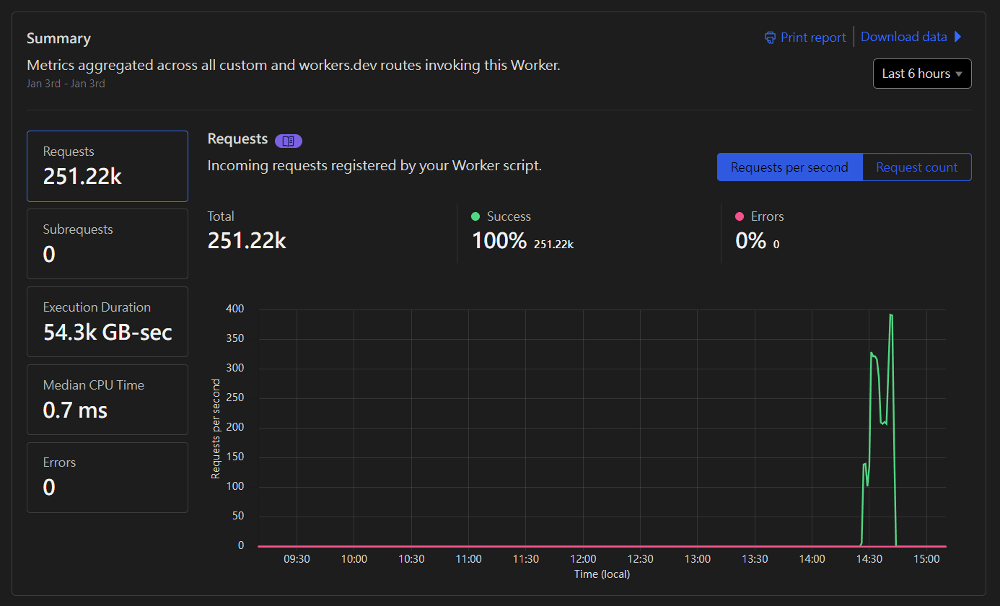
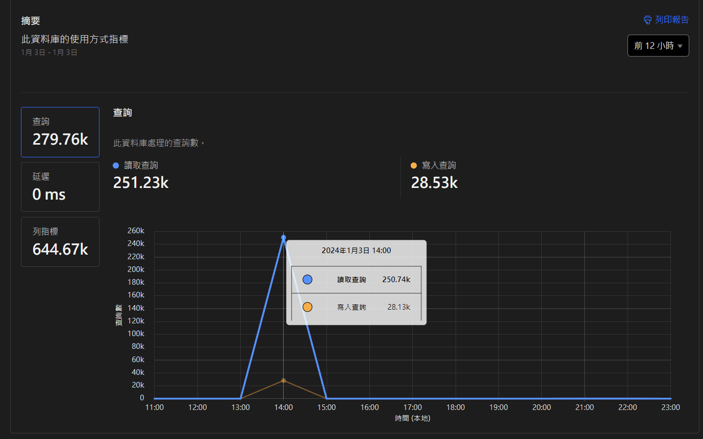
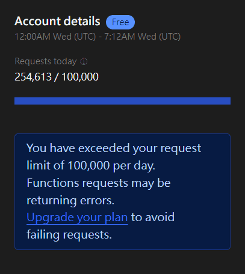
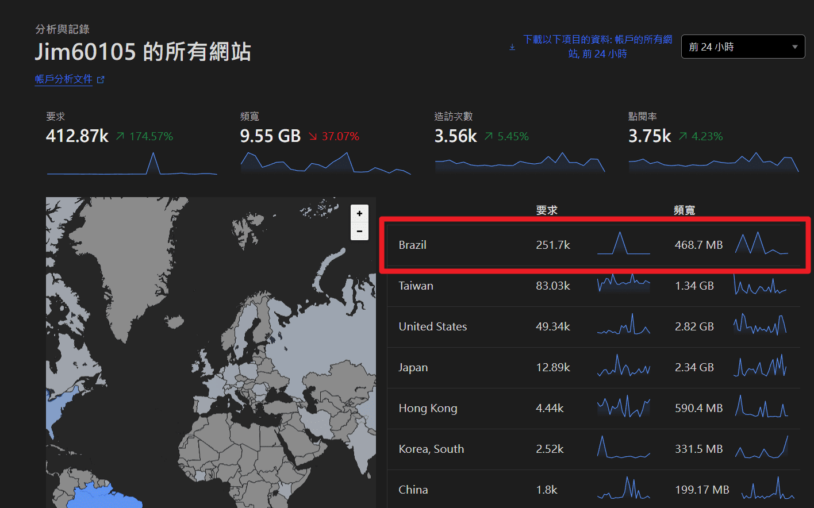

+++
title = "[經驗分享] 我的 Cloudflare Worker 被進行外部壓力測試，俗稱DDOS 😠"
description = "[經驗分享] 我的 Cloudflare Worker 被進行外部壓力測試，俗稱DDOS 😠"
date = 2024-01-04T03:57:00.011Z
updated = 2024-01-04T04:41:06.996Z
draft = false
aliases = [ "/2024/01/cloudflare-worker-ddos.html" ]

[taxonomies]
tags = [ "Cloudflare" ]
licenses = [ "All Rights Reserved" ]

[extra]
card = "preview.png"
poor = true
+++

1/3 下午我收到了三封 email 來自 Cloudflare，**警告我 Workers 的用量被耗盡。**  
每日十萬次在下午兩點被用完？我的用量沒這麼狂，肯定有事情發生了。

<!--more-->
## 發生了什麼

進到 Worker Dashboard 後注意到其中一支 Worker 被觸發了 251.22k 次。  
15 分鐘打了 25 萬次！  
明顯是被 DDOS，但 Cloudflare 沒擋下來。或者說，我以為 WAF 會把這種異常擋下來。

這支 Worker 是用在 [Soundbuttons 專案](https://sound-buttons.click/)內的計數器，[在 GitHub 上開源](https://github.com/sound-buttons/worker-click-counter)。它做的事很簡單: 存一個數值在 D1 資料庫，GET request 僅回傳數值，POST request 加 1 回傳數值。Soundbuttons 前端頁面在按鈕被觸發時就會 POST 一次。

有趣的是，再仔細看一次文首那張圖 —— 成功數 100%！

從 D1 的存取記錄可以看到，250.74k 查詢 + **28.13k** 寫入。計數器的數字現在是 **57213** ，而我記憶中上次注意到它是約 **28000** 左右，數目大致吻合。  
<small>* 計數器已手動校正回歸</small>

這支 Cloudflare Worker 在 DDOS 攻擊中正常運作，證明了 Worker 和 D1 能夠直接吃下這個數量級的負載！持續的每秒 300 次請求！

哈哈，在外部壓測中交出漂亮成績單🤣

## 損失

損失難以估計...... 什麼的並沒有發生。除了我的當日免費額度被耗盡以外，沒有任何損失。

需要注意的是我是免費 plan，**在超過流量時會被中斷服務而非被計價，所以我才沒有金錢損失**。服務中斷對我的 side project 來說並不是什麼大問題，這符合我的預期。實際上這支 Worker 並沒有被中斷服務，我也不明白為什麼? 但我的其它 Worker 卻被中斷了。

## 如何預防再次發生

最大的問題是，**Worker 被觸發了。**  
Worker 是以請求次數計價的，它被 DDOS 觸發本身就是問題，必須要在更前面就把它擋下來。

這支 Worker 我開了兩條路徑可存取

* `view-counter.sound-buttons.click`: 這條掛在 sound-buttons.click 網域之下，Soundbuttons 專案是使用這個網址。
* `view-counter-sb.jim60105.workers.dev`: 這條是 worker 預設給的網址，我把它寫在了 GitHub 上做展示，未實際在專案內使用  
  <small>* 現在已移除</small>

由於 sound-buttons.click 的 domain traffic 在這段時間顯示流量正常，可推測被打的是第二條預設的 workers.dev 的路徑。依照[官方文件](https://developers.cloudflare.com/workers/platform/limits/#request)的說法，我認為 workers.dev 網域有 DDOS Protection 功能，但我在 dashboard 上找不到如何設定。或許是內建的不能設定? 這內建的不給力啊...

我的決定是**停用 workers.dev 路徑**，僅保留 sound-buttons.click 網域之下的路徑，並**在網域上設定較嚴格的 DDOS 設定**。還有就是... **不要把路徑直接寫在 GitHub 上**😅

<figure>

<figcaption>此攻擊來自巴西</figcaption>
</figure>

> 延伸閱讀
>
> ---
>
> * [\[個人專案\] 網頁計數器徽章 View Counter Badge —— 瀏覧數別再送人啦！以 Cloudflare Workers D1 實作適合純前端網頁的計數器](/SideProject/view-counter-badge-cloudflare-workers-d1)
> * [\[個人專案\] 以 Cloudflare Pages 打造低成本高流量的即時投票系統 (Cloudflare Pages, Pages Functions, Cloudflare D1)](/Cloudflare/cloudflare-pages)
