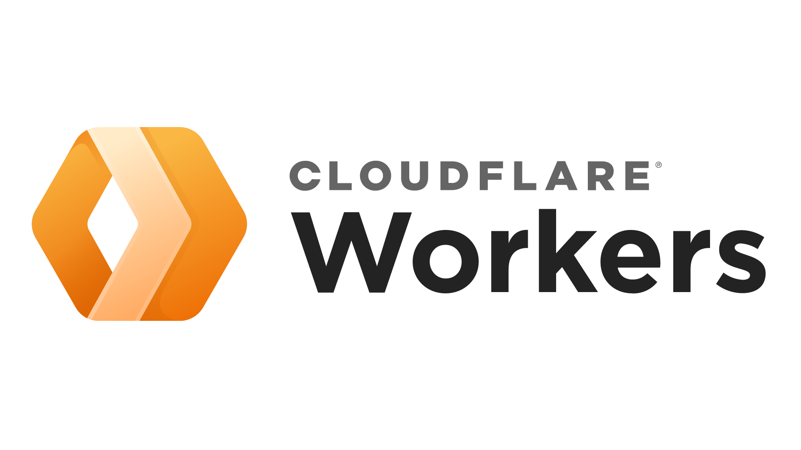
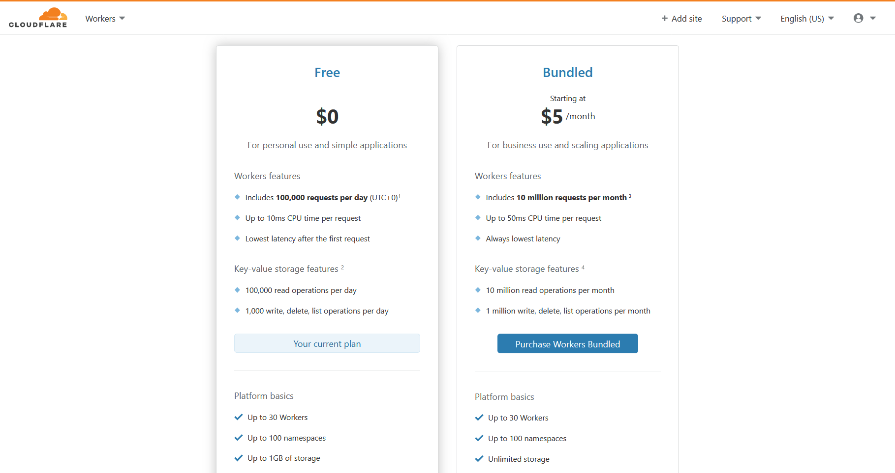
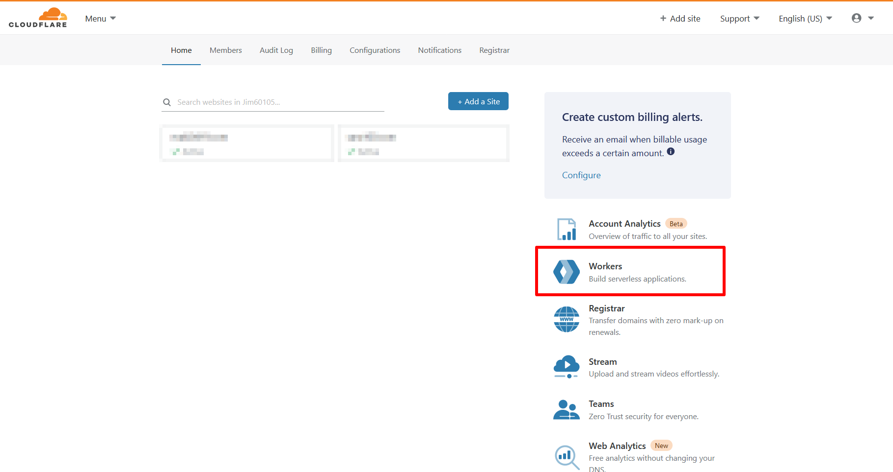
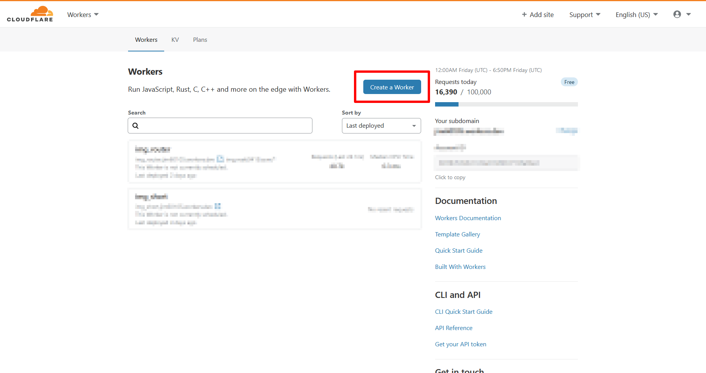
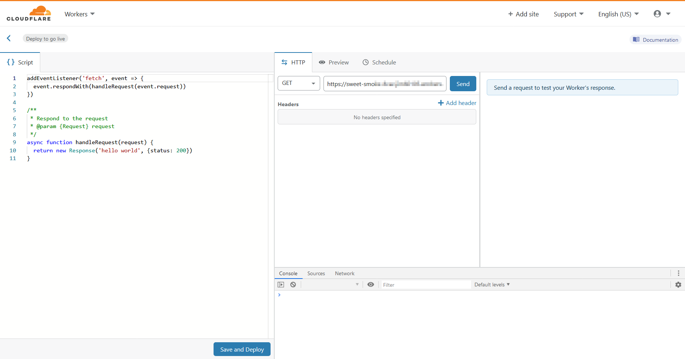
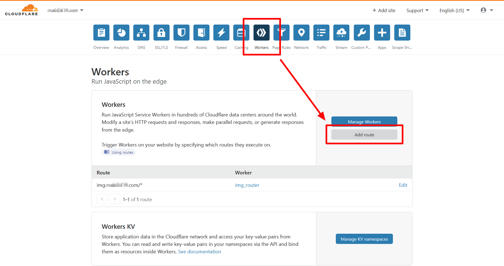
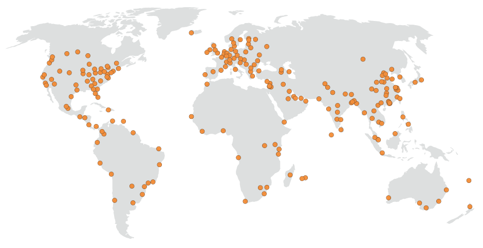
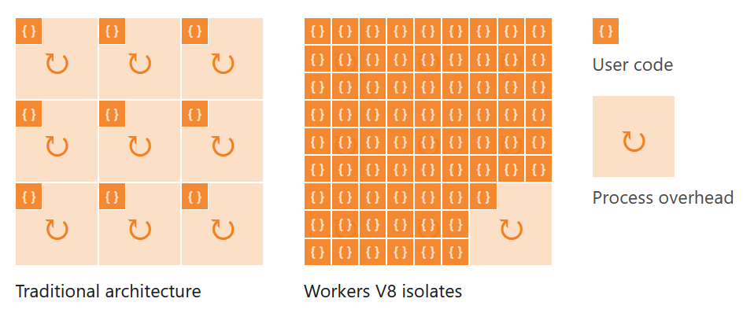

+++
title = "Cloudflare Workers入門"
description = "Cloudflare  Workers將送進來的request在cloudflare的網絡上做處理。你可以把它放在client和server的中間，用做Middleware；後方也可以沒有server ─ 直接返回html，或是用做路由、網址轉送；IP base重導向；修改header等"
date = 2021-02-05T21:02:00.046Z
updated = 2024-01-04T04:02:44.835Z
draft = false
aliases = [ "/2021/02/cloudflare-workers-introduction.html" ]

[taxonomies]
tags = [ "JavaScript", "Cloudflare" ]
licenses = [ "GFDL 1.3" ]

[extra]
banner = "preview.png"
iscn = "iscn://likecoin-chain/YikXnx1yEVJvfIlh1SvhvwGomCk1rJQ4d3Jw1YnRiaA/1"
disclaimer = "本文於 2021 年撰寫時是使用 Service Workers 格式，[現在請一律改用 ES Modules 格式](https://developers.cloudflare.com/workers/learning/migrate-to-module-workers/)"
+++

[](preview.png)

## 前言

去年我曾寫過一支 Cloudflare worker，[用做 Nextcloud 的 img 網域縮址](@/Container/nextcloud/index.md#img-router)  
當時是初探，純粹採用線上編輯器撰寫，功能只是簡單的 routing

這幾天我寫了個[新的 random 功能](https://github.com/jim60105/worker-img%5Frouter#%E9%9A%A8%E6%A9%9F%E5%9C%96%E7%89%87%E5%8A%9F%E8%83%BD)，並趁這個機會把專案做了重構；改寫為 TypeScript；切割檔案，以 Webpack 打包部屬；將可變更的設定值改以環境變數傳遞，增加專案重用性

同時還串上了現在很夯的 GitHub Action，在線上做打包推送去 Cloudflare  
我也花時間把 Worker 用的 CLI 工具──Wrangler 摸了一輪，搞定了 Worker debug 和收 log 流程

本文預計分為兩篇

* Cloudflare Workers 入門 ─ 簡介
* ~~Cloudflare Workers 進階 ─ Wrangler 簡介和 GitHub Action 串接部屬 (還沒寫!)~~

Cloudflare Workers 是個還算新的產品，中文教學並不多，謹將我的研究成果小記在此。

<!-- more -->

## 簡介 Cloudflare Worker

[](workers.png)

> Cloudflare Workers 提供了一個無伺服器執行環境，使您無需配置或維護基礎架構即可創建全新的應用程序或擴充現有的應用程序。
>
> ── 譯自[官方文件](https://developers.cloudflare.com/workers/)

Cloudflare Workers 將送進來的 request 在 cloudflare 的網絡上做處理  
你可以把它放在 client 和 server 的中間，用做 Middleware；後方也可以沒有 server ─ 直接返回結果

Cloudflare 會在你註冊後送你一個 subdomain 讓你直接 call，而更常見的用法是把自有 DNS subdomain 接過來做 route matching  
例如說用做路由、網址轉送；IP base 重導向；撰寫特殊快取規則；做 debug logging；修改 header，或是你也可以直接返回完整的 html


本文於 2021 年撰寫時是使用 Service Workers 格式，[現在請一律改用 ES Modules 格式](https://developers.cloudflare.com/workers/learning/migrate-to-module-workers/)  
下方的範例是舊格式，請到[官方文件](https://developers.cloudflare.com/workers/examples/redirect/)查看新的範例！


[官方文件](https://developers.cloudflare.com/workers/examples)提供了幾個用例，請前往參考  
在這裡我想放一個最基本的，Redirect

```javascript
const destinationURL = "https://example.com"
const statusCode = 301
 
async function handleRequest(request) {
    /**
     * Do something here
     */
    return Response.redirect(destinationURL, statusCode);
}
 
addEventListener("fetch", async event => {
    event.respondWith(handleRequest(event.request));
})
```

程式進入點在最下方的 event listener，呼叫 handleRequest() 並傳入 event.request，回傳會塞進 event.respondWith()。  
而 handleRequest() 內就是你可以寫 code 的地方。

> 若你已經等不及要嘗試，可以 Try in the Playground  
> <https://cloudflareworkers.com/>

### 註冊 Cloudflare Workers 帳號

沒什麼好教的，從這裡註冊:

<https://dash.cloudflare.com/sign-up/workers>

註冊完後你會獲得一個 `username.workers.dev` 的 subdomain  
即使你沒有網域，也可以直接從這裡呼叫你的 workers

### Plan

[](plans.png)

想也不用想，點左邊  
免費方案超過扣打時它會回報錯誤，而**付費方案在超過時會以用量計費**  
等你免費真的用爆了再回來升就好，這沒什麼陷阱  
完整的限制列表在這裡: <https://developers.cloudflare.com/workers/platform/limits>

### 線上編輯工具

來到你的 Dashboard:<https://dash.cloudflare.com>  
在右側找到「Workers」，點撃上方醒目的「Create a Worker」

[](online1.png)

[](online2.png)

然後就可以玩了!  
你一定會想從這些開始: <https://developers.cloudflare.com/workers/examples>

[](online3.png)

### 設定 Route 至 Workers 規則

前面提到你獲得了一個 subdomain，那我們要怎麼把自己現有的網域導至 workers 呢?  
來到你的 domain dashboard，點上方的「Workers」頁籤，再點下方的「Add route」

[](route1.png)

在此處可以設定路由規則，參閱官方文件:  
<https://developers.cloudflare.com/workers/platform/routes#matching-behavior>

請注意，這裡<span class="danger">並不是接受 regex pattern</span>，僅接受以 `*` 比對無限多個任意字元，且**只能用在最前方、子網域、和最後方**

[](route2.png)

## Cloudflare Workers 的運作

> 此節摘錄翻譯自官方文件: How Workers works  
> <https://developers.cloudflare.com/workers/learning/how-workers-works>

Workers 運行時使用 V8 引擎─和 Chromium 及 Node.js 相同，但仍有一些細微差異是你在撰寫程式時要思考的。Workers functions 不是在個人電腦上運行（例如瀏覽器或在中央伺服器上），而是在 Cloudflare 的邊緣網絡 (Edge Network) 上運行 ─ 邊緣網絡分佈在數百個位置的數千台機器組成。這些機器中的每一個都承載一個 Workers runtime 實例，並且每個 runtime 都能夠運行成千個用戶自訂程式。

[](how-works1.png)

### 隔離區 (Isolates)

一個 runtime 可以運行數百或數千個隔離區，並在它們之間無縫切換。每個隔離區的記憶體是完全隔離的，因此在運行時，每個程式段均受到來自其他用戶編寫的程式的保護。隔離區也設計為可以非常快速的啟動。並非為每個 function 創建虛擬機，而是在現有環境中創建隔離區，此設計消除了虛擬機設計中的應用啟動時間。與容器或虛擬機上的 Node 進程相比，任何給定的隔離區啟動速度都快約一百倍。值得注意的是，啟動時隔離區消耗的記憶體少了一個數量級。

[](how-works2.png)

啟動後的隔離區具有其自身的 scope，但是隔離區不一定會長時間存在。隔離區可能會在以下狀況被停止:

* 機器上的資源限制
* 可疑腳本 (任何被視為試圖突破隔離區沙箱的腳本)
* [個別資源限制](https://developers.cloudflare.com/workers/platform/limits)

因此，通常建議不要在全域範圍內存儲可變變數，除非你已考慮了這種偶然性。

### 按請求做運算

大多數 Workers 都是預設 Workers 的變體:

```javascript
addEventListener("fetch", event => {
    event.respondWith(handleRequest(event.request));
})
 
async function handleRequest(request) {
    return new Response("Hello worker!", { status: 200 });
}
```

當任何 Cloudflare 的 runtime 收到對 worker.dev subdomain 或 Cloudflare 管理的 DNS 的請求時，Workers 腳本會將 FetchEvent 參數傳遞給腳本中定義的 event handler。你可以通過在這裡計算回應、使用 fetch 訪問另一台伺服器等等的方式來產生回應。到達 responseWith () 所需的 CPU 週期全都影響了計算時間。例如，setInterval 在等待時不會佔用 CPU 週期。

### 分佈式執行

隔離區在請求期間是可以連續使用，但是在極少數情況下，隔離區可能會被停止。當腳本達到我們的極限時，或者當運行請求的機器的資源異常緊張時，機器將在事件得到\_正確\_回應之後選擇性的停止隔離區。

像所有其他 JavaScript 平台一樣，單個 Workers 實例可以處理多個請求，包括在單線程事件循環中的並發請求。不能保證任何兩個請求都將落在同一實例中。因此，不建議在 event handler 中使用可變的全域變數。

一言以蔽之: **全域變數的值是無法預期的，他在 function 之間可能會改變。** 所以別用。

## 參考連結

* Cloudflare Workers®  
  <https://workers.cloudflare.com/>
* Cloudflare Workers documentation  
  <https://developers.cloudflare.com/workers/>
* Cloudflare Workers Examples  
  <https://developers.cloudflare.com/workers/examples>
