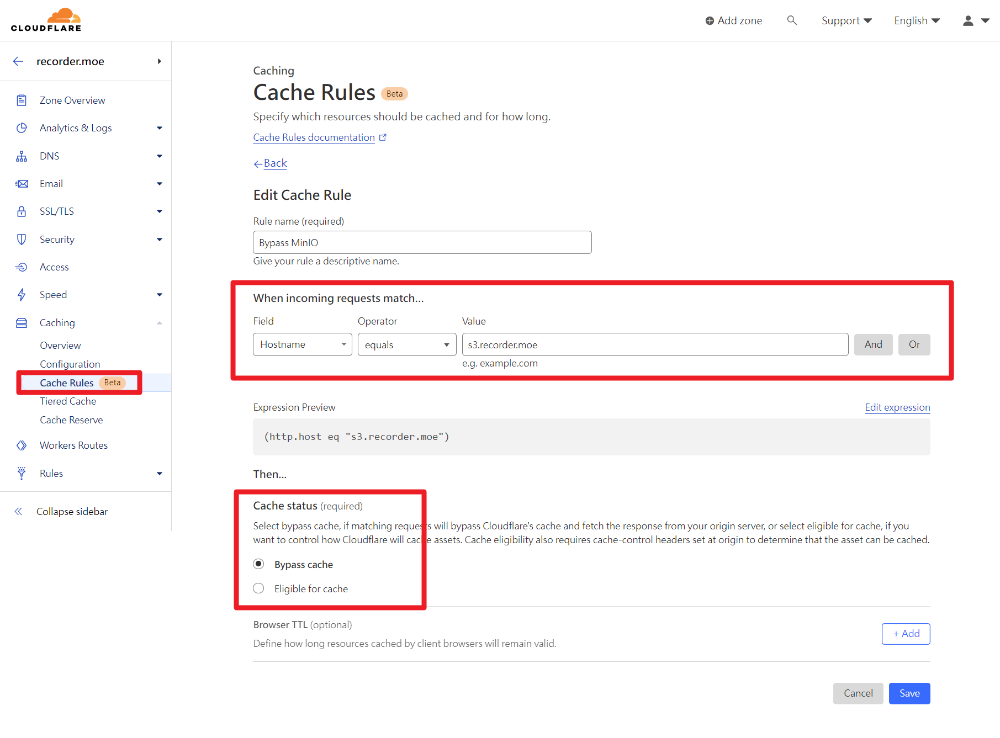

+++
title = "MinIO 在 StatObject 時總是回傳權限不足 (Insufficient permissions)"
description = "使用 StatObject 檢查檔案是否存在，而它一直報錯權限不足。"
date = 2023-07-30T15:57:00.004Z
updated = 2024-01-04T04:03:19.559Z
draft = false
aliases = [ "/2023/07/minio-statobject-insufficient.html" ]

[taxonomies]
tags = [ "Cloudflare", "MinIO", "S3" ]
licenses = [ "All Rights Reserved" ]

[extra]
banner = "preview.webp"
iscn = "iscn://likecoin-chain/FtSKInk6bfr_5iDfLV6sxSCCAJIzQAYFC_9weWdgywY/1"

  [extra.comments]
  id = "110813859486445588"

  [extra.preview]
  description = "(AIGC, PNG Info^)"
  withAI = true
+++
## 前言

程序猿: 今天天氣晴朗，是個適合在家踩地雷的好日子😎

這次中雷的前提是「使用 **Cloudflare** 做為 MinIO 的網域 **Proxy**，並開啟 **Cache** 功能」。

我不知道其它的 S3-like storage 會不會發生，但既然 [MinIO SDK 上的 issue](https://github.com/minio/minio-js/issues/842) 因「Our sdks are validated for highest s3 compatibility so it does not require any fix in the SDK.」而關閉，應該是都會發生吧...

<!-- more -->

## TL;DR 先說結論

在 Cloudflare 上新增 CacheRule，將整個網域 Bypass cache。

[](cf.png)

## 遇到問題

我正在寫 [Recorder.moe](https://github.com/Recorder-moe) 專案，實作接 MinIO 伺服器作為 Object Storage。其中有一段邏輯使用 StatObject 檢查影片檔案是否存在，而它一直報錯權限不足。

當然，我來回的檢查了 MinIO 上的權限設定，並把 [MinIO doc](https://min.io/docs/minio/linux/administration/identity-access-management/policy-based-access-control.html) 仔細讀過了一次，確認了我的權限設定並沒有錯。

接著，我使用 [mc (minio client)](https://min.io/docs/minio/linux/reference/minio-mc.html) 登入了 root account，並執行了以下的 command:  

```bash
jim60105 ~ ❯❯❯ mc ls minio/livestream-recorder/videos/
[2023-07-29 21:48:20 CST] 6.1GiB STANDARD _0mKSCIcuiy4.mp4
[2023-07-29 21:48:20 CST] 4.0GiB STANDARD _7_oxT9-XtNs.mp4
[2023-07-29 21:48:20 CST] 1.8GiB STANDARD _I-GNO2YlXOU.mp4
[2023-07-29 21:52:01 CST] 2.0GiB STANDARD _QhYxULIUaoE.mp4
[2023-07-29 21:48:20 CST] 2.4GiB STANDARD _aPI2iLpATvQ.mp4
[2023-07-29 21:48:20 CST] 4.7GiB STANDARD _b0FnpGNF_8Q.mp4
[2023-07-29 21:48:20 CST] 1.6GiB STANDARD _lUeEngcdDb8.mp4
[2023-07-29 21:51:52 CST]  91MiB STANDARD _olHwcQXvCGg.mp4
jim60105 ~ ❯❯❯ mc stat minio/livestream-recorder/videos/_aPI2iLpATvQ.mp4
mc.exe: <ERROR> Unable to stat `minio/livestream-recorder/videos/_aPI2iLpATvQ.mp4`. Insufficient permissions to access this path `https://s3.recorder.moe/livestream-recorder/videos/_aPI2iLpATvQ.mp4`.
```

蛤，這是 root account 耶

## 發現問題

我試了好幾種關鍵字，最後用「minio stat no permission」搜到了[這個 issue](https://github.com/minio/minio-js/issues/842)。

最下方的另一個 [mentioned issue](https://github.com/minio/minio-js/issues/1099) 講明了問題發生的原因

> Same problem here, we were using statObject in our platform, now we started
> using cloudflare and it stopped working.
>
> The "it is not a bug, it is a feature" is documented in cloudflare:  
> [https://developers.cloudflare.com/cache/best-practices/cache-behavior/#interaction-of-head-requests-with-cache](https://developers.cloudflare.com/cache/best-practices/cache-behavior/#interaction-of-head-requests-with-cache)
>
> **I think the problem could be in the HEAD and GET endpoints not working in**
> **the same way.**
> If our system makes a HEAD call and cloudflare does not have it cached, it
> converts it to the same GET call, and returns only the headers of the
> response (which should be the same as if we make a HEAD call). The problem
> comes when the HEAD and GET endpoints behaviours are not the same.
>

嗯，看來 MinIO 在 GET 和 HEAD 的處理上不同。然後?

Cloudflare 的 document 寫了這些

> Cloudflare converts HEAD requests to GET requests for cacheable requests.
>
> **When you make a HEAD request for a cacheable resource and Cloudflare does**
> **not have that resource in the edge cache**, a cache miss happens.
> **Cloudflare will send a GET request to your origin**, cache the full response and return the response headers only. Make sure
> the origin server is setup to handle GET requests, even if only HEAD
> requests are expected, so that compatibility with this behavior is ensured.

好喔，就你在搞

## 解決問題

知道兇手就好解決了，在 Cloudflare 上新增 CacheRule，將整個網域 Bypass cache

[](cf.png)

結案
