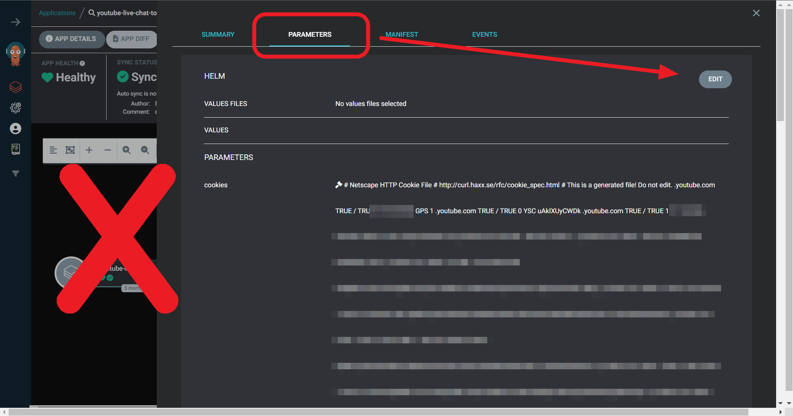
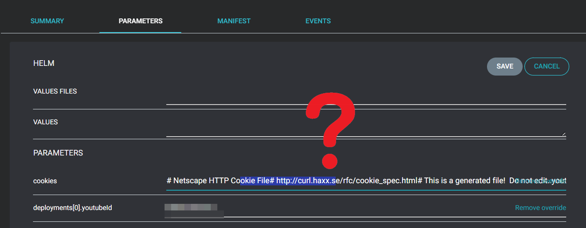
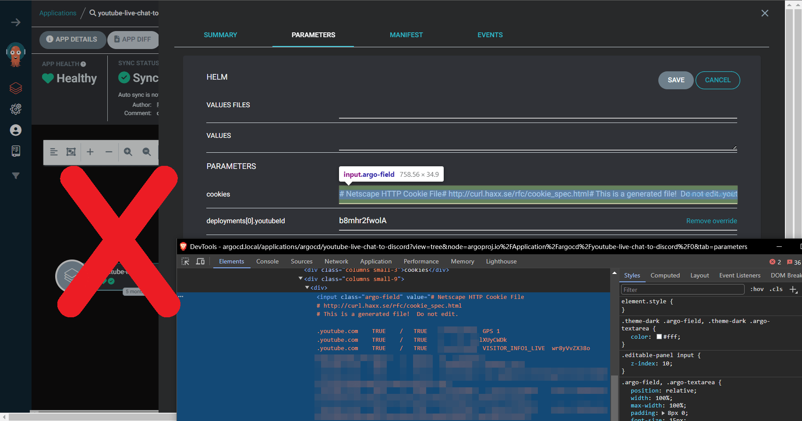
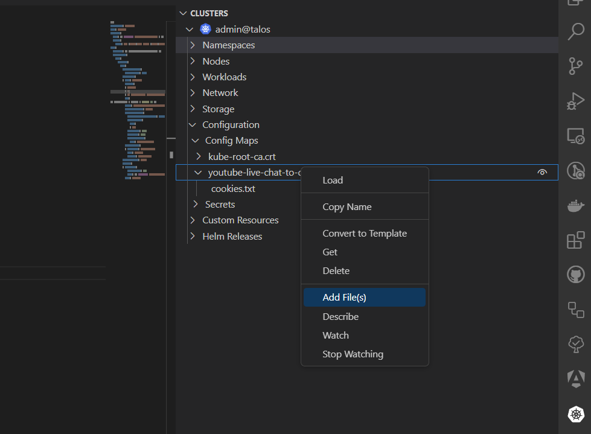
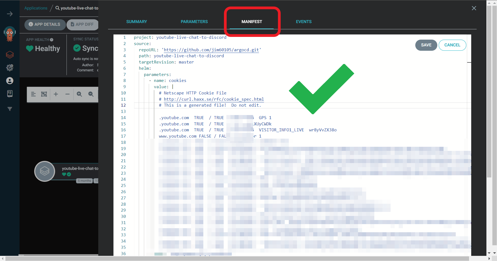
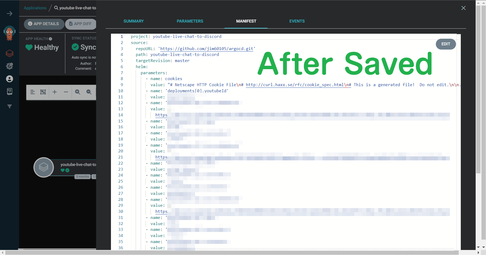
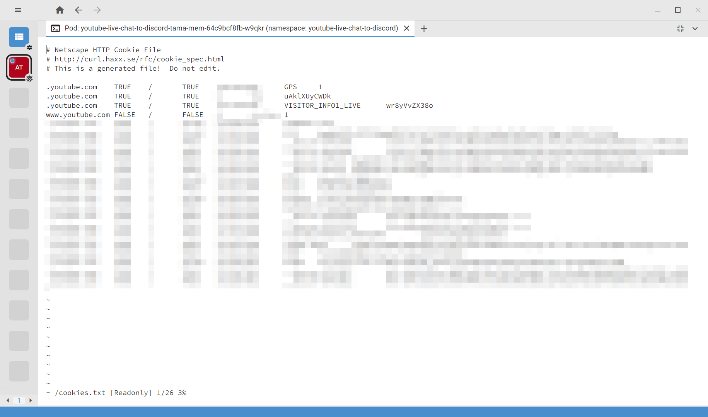

+++
title = "在 ArgoCD Configmap 插入斷行符的方式"
description = "本文記錄使用 ArgoCD 在 ConfigMap 中插入斷行字串的解決方法。"
date = 2023-12-03T14:35:00.010Z
updated = 2024-03-11T17:17:51.920Z
draft = false
aliases = [ "/2023/12/argocd-configmap.html" ]

[taxonomies]
tags = [ "K8s", "ArgoCD", "Container" ]

[extra]
card = "preview.png"
iscn = "iscn://likecoin-chain/AjK-ggg_eC-h34r9lN9oQwsUKPm4_9ovcwmK51DHJq8/1"
poor = true
+++

記一下今天拆的地雷。

我的 [YoutubeLiveChatToDiscord](https://github.com/jim60105/YoutubeLiveChatToDiscord) 可以監控會員限定的直播，它是使用 yt-dlp 實作的，驗證方式是通過 Netscape Cookie file。我的是用 ArgoCD 部署，將文字塞入 Application Parameters 後寫到 Configmap，再掛載進去為 cookies.txt 檔案。

Netscape Cookie file 的關鍵是它吃斷行，我最終 Pod 內的文字檔需要是 LF 斷行。

我試著從網頁上的 Parameters 頁籤去改它，它是單行 input textbox，但不論用什麼方式填進去都會無法保留斷行，包括斷行符、\\n、\\\\n、\\r\\n 什麼都不行。

這裡要怎麼塞入斷行符?

當然，我也試過直接修改 Configmap，但是這個 Configmap 是由 ArgoCD 管理的，修改後又會被覆寫。

最後我終於找到一個成功的方法： 在網頁上的 Manifest 頁籤修改！  
不知為何我花了好幾個小時才注意到這個頁籤可以編輯...

所以從網頁做設定是正確的方式，只不過單行輸入框會吃掉斷行符，必須直接在 Manifest 改 yml 才行。

在 Pod 中看見正確換行的檔案時真是感動，週日的一個下午就這樣過去了。

