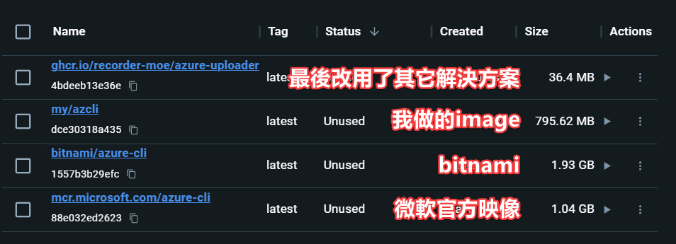

+++
title = "從 azure-cli 到 REST API：我的 Azure Blob Storage 上傳優化之旅"
description = "在這篇文章中，我要分享在 Recorder.moe 專案中，如何從使用肥大的 azure-cli 轉變到使用簡潔的 REST API 來上傳影片到 Azure Blob Storage。這是一個關於優化 Dockerfile 和 Azure Blob Storage上傳流程的實戰故事。"
date = 2024-01-11T10:12:00.018Z
updated = 2024-01-11T13:08:17.995Z
draft = false
aliases = [ "/2024/01/azcli-to-rest-api.html" ]

[taxonomies]
tags = [ "Azure", "Container" ]
licenses = [ "All Rights Reserved" ]

[extra]
iscn = "iscn://likecoin-chain/3DGNu2HPD0tXzVjLqRmyoOBljyl707TKim_yh4XU2S8/1"
card = "preview.png"
+++

在這篇文章中，我要分享在 Recorder.moe 專案中，如何從使用肥大的 azure-cli 轉變到使用簡潔的 REST API 來上傳影片到 Azure Blob Storage。你將看到我如何發現 azure-cli 的官方 docker image 體積過大，並且自己動手優化 Dockerfile，最後改變解決方案，成功將 image 降低到只有 36.4 MB。

這是一個關於優化 Dockerfile 和 Azure Blob Storage 上傳流程的實戰故事，希望能對你有所啟發。

對，標題和介紹是 GPT-4 寫的，下面才是正文😉
<!--more-->
---

我在 [Recorder.moe](https://github.com/Recorder-moe) 專案裡有一個環節是要把錄製完成的影片上傳到 Azure Blob Storage。

設計上會**啟動一個 docker container**，掛載裝有下載完成影片的 volume，然後**把檔案上傳至 blob storage**。它是運行在 Azure Container Instance 掛載 Azure File Share。

我原本是使用[微軟的 azure-cli 的官方 image](https://hub.docker.com/%5F/microsoft-azure-cli) 加上一支 shell script 來執行 az 上傳。但是這個官方 image 實在是太大了，1.04 GB！

Image 尺寸會關係到運行成本及啟動時間，我不能接受它這麼大，這甚至比我專案的主程式還要大...  
(做為參考我也去下載了 bitnami 的映像，更大😆 )

我去查看了[官方的 Dockerfile](https://github.com/Azure/azure-cli/blob/dev/Dockerfile.spot) 以後覺得它...不是那麼的好，於是寫了一個[我自己的版本](https://github.com/Recorder-moe/azure-uploader/blob/master/azcli.Dockerfile)。  
(取用時請注意專案的 GPLv3 License)

我透過 multi-stage build 來安裝並丟掉了 cache 和 compiled bytecode 來降低容量。  
但即使我這樣調整完，它仍然要 **795.62 MB**。

最後我放棄使用 azure-cli，改為[呼叫 REST api](https://learn.microsoft.com/zh-tw/rest/api/storageservices/put-blob)。我的需求其實很單純，就只是上傳個檔案而已，並不需要這麼強大肥大的工具。

而[這個解決方案](https://github.com/Recorder-moe/azure-uploader/blob/master/azure-uploader.sh#L49)的 image 尺寸是 —— 36.4 MB！

---

註:  
我有看到[這個 issue](https://github.com/Azure/azure-cli/issues/23366#issuecomment-1801206118)，但是不知道為什麼我實際拉下來的 image 仍是 1 GB 大。

---

本文改寫自我的嘟文

{{mastodon(id="111732530470295993")}}

