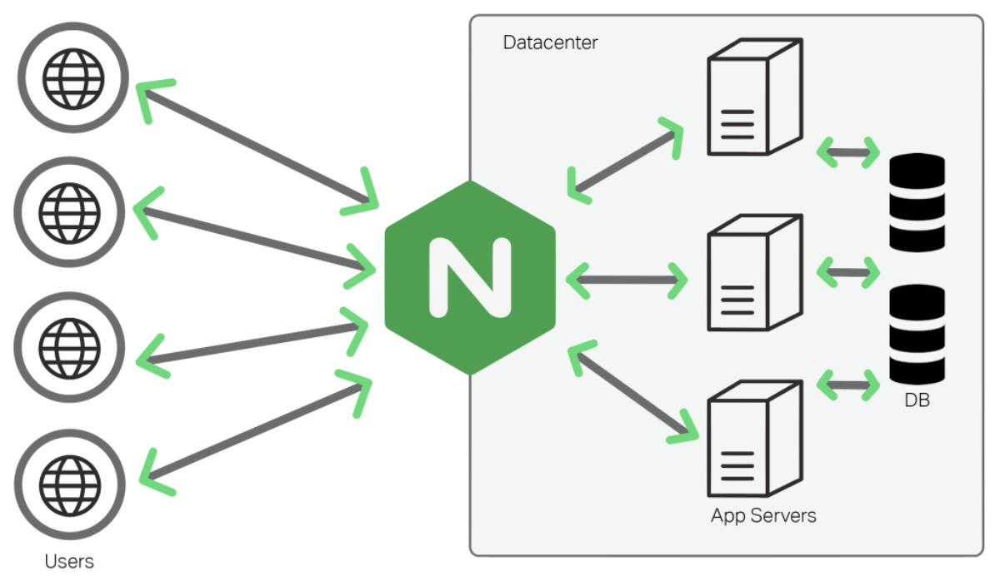
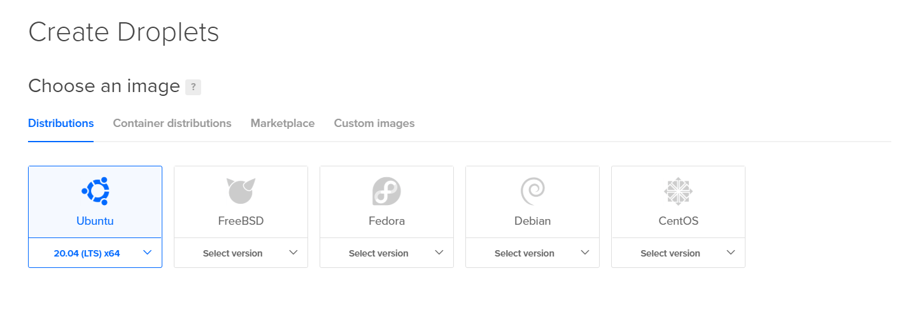
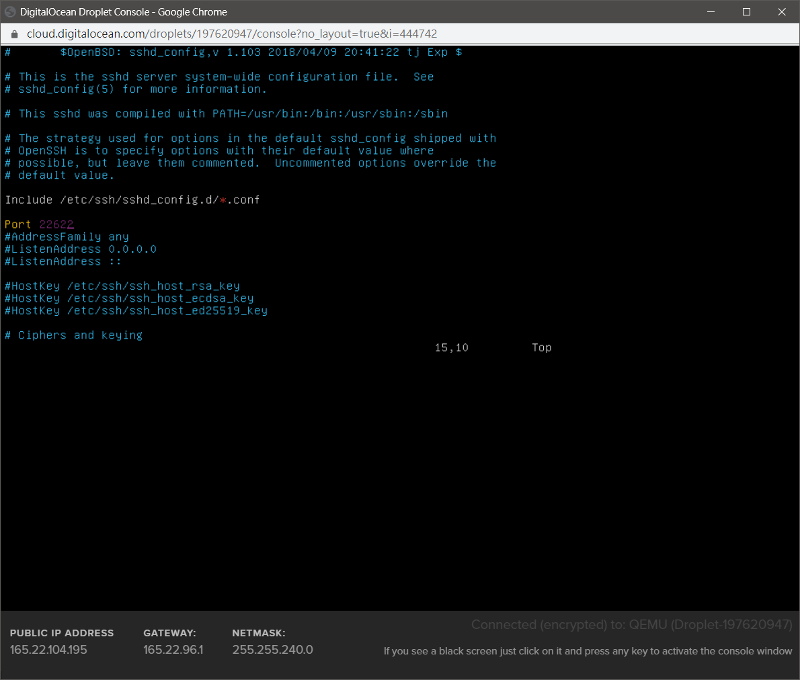
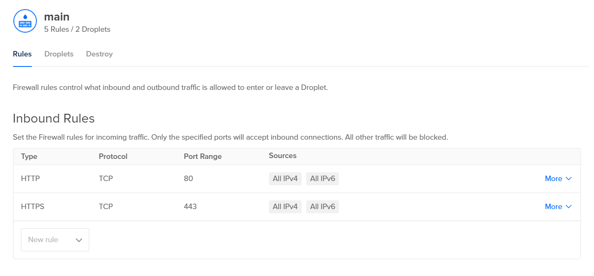
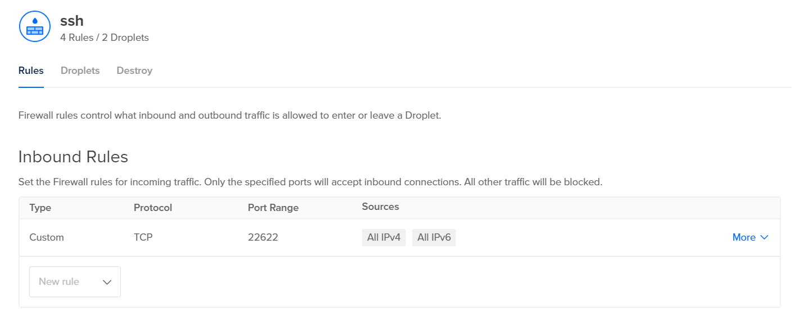
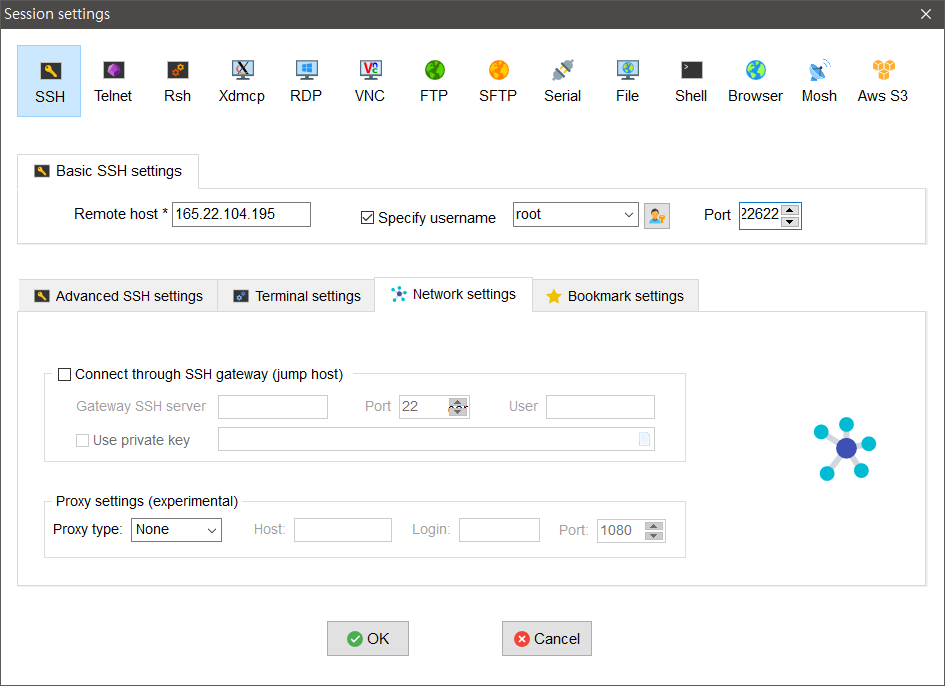
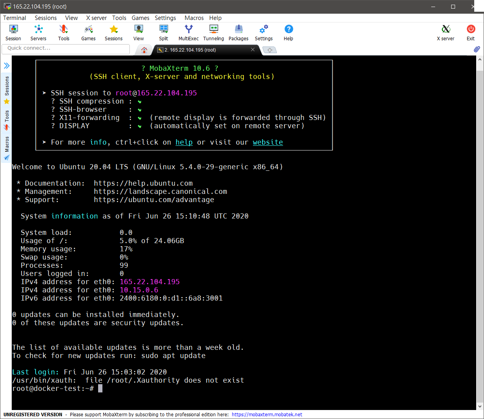
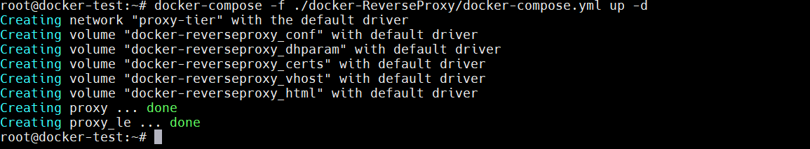

+++
title = "[Docker] Linux 主機之 Docker 安裝和 ReverseProxy 建置"
description = "此篇文章由零開始設定Linux主機、安裝Docker，並設定反向代理做為伺服器的網路門戶。"
date = 2020-11-23T18:51:00.080Z
updated = "2024-10-13T14:24:51.502Z"
draft = false
aliases = [ "/2020/11/linux-docker-setup-revese-proxy.html" ]

[taxonomies]
tags = [ "Docker", "Container", "Linux" ]

[extra]
card = "preview.png"
iscn = "iscn://likecoin-chain/_zmSdL8lQdrPnP5LurJlWdK6WsCzRksqbRzk-UJKr4c/1"

  [extra.comments]
  id = "113300757885315845"
+++

## 前言

<figure>

  
  <figcaption><a href="https://webapplicationconsultant.com/scalability/nginx-reverse-proxy-for-scalability/">圖源</a></figcaption>
</figure>

此篇文章由零開始設定 Linux 主機、安裝 Docker，並設定 Reverse Proxy

Reverse Proxy (反向代理)，可以比喻為一棟樓的大門管理員  
當一個包裏送至管理員，管理員會依照地址將之轉送給後方的住戶  
當一個 Web Request 送至 Reverse Proxy，Reverse Proxy 會依照 URL 將之轉送給後方的伺服器  
使用 docker 技術，能在同一台機器上配置多個伺服器，且不會互相干擾

此套 ReverseProxy 可在 docker compose up 時建立路由，自動申請及 Renew SSL 證書  
我個人的所有網路服務都是配合此套 ReverseProxy 做建置，特撰此文以做前導

## 流程簡述

1. 起一台新的 Linux
2. 安裝 docker、docker-compose
3. git clone 下 Reverse Proxy 之建置檔案
4. docker-compose up -d

## 建置 {#build}

### Linux 主機 {#DigitalOcean}

* 起一台 Linux 做 Main Server，理論上任何能裝 Docker 的 arm64 linux 都行  

  <aside><a href="https://www.digitalocean.com/?refcode=ac52b09a7f63&amp;utm_campaign=Referral_Invite&amp;utm_medium=Referral_Program&amp;utm_source=badge">{{ image(url="https://web-platforms.sfo2.cdn.digitaloceanspaces.com/WWW/Badge%201.svg", alt="DigitalOcean Referral Badge") }}</a></aside> 我個人是用 <a href="https://m.do.co/c/ac52b09a7f63" target="_blank"><b><span style="-webkit-text-stroke: 0.05em rgb(0,105,255); color: white;">DigitalOcean</span></b></a>，最便宜的方案每個月 6 美元 (4 美元的方案請略過它)  

  這是老牌的主機商，在業界有信譽有口碑，比國內的主機商穩定得多  
  亞洲可選的資料中心在新加坡，對台灣連線速度佳，沒有什麼奇怪的問題  
  透過上方推廣鏈結註冊，你會拿到 **60 天內 200 美元的試用額度**，而這足夠玩遍所有功能  
  DigitalOcean 的註冊優惠都是這個價，用我的推廣就當成是對我小額贊助吧  

  [](2.png)

* 我選一台 Ubuntu x64 LTS  

  [](1.png)

* 由後台從 Console 連入，把 SSH port 改為自設的 port  

  ```bash
  vi /etc/ssh/sshd_config
  service ssh restart
  ```

  [](5.png)

> 如果你使用 22.10 版本以上的 Ubuntu，改用這個方式更改 SSH port
>
> ---
> <https://askubuntu.com/a/1439482>

* **注意 UFW 是否有擋 port**  

  ```bash
  ufw status
  ```

  **如果它是 inactive <span class="danger">以外</span>的狀態**，請上網找 <mark>Ubuntu UFW</mark> 相關文章做調整  
  需開放 80、443 和自設的 SSH port
* 若是租用 VPS，建議關了 UFW，用 VPS 後台的 Firewall 功能即可  

  [](3.png)

  [](4.png)

* SSH Client，**以 root 連入**，推薦 [MobaXterm](https://mobaxterm.mobatek.net/)  

  [](6.png)

  [](7.png)

> 小小建議
>
> ---
> 可以開一個 3GB 的 Volume 做 Swap，比加 RAM 便宜得多喔  
> [建立 Volume 的說明](https://docs.digitalocean.com/products/volumes/quickstart/)，還有 [Swap 的說明](https://www.digitalocean.com/community/tutorial%5Fcollections/how-to-add-swap-space)

### Docker 安裝

> 可參閱[官方文件](https://docs.docker.com/engine/install/ubuntu/#installation-methods)  
> 若有更新，請以官方文件為準

* (選) 全面更新

  ```bash
  sudo apt-get update && sudo apt-get upgrade -y
  ```

* 安裝必要組件  

  ```bash
  sudo apt-get install \
    ca-certificates \
    curl \
    gnupg \
    lsb-release
  ```

* 加入 gpg key  

  ```bash
  sudo mkdir -p /etc/apt/keyrings
  curl -fsSL <https://download.docker.com/linux/ubuntu/gpg> | sudo gpg --dearmor -o /etc/apt/keyrings/docker.gpg
  ```

* 加入 repo 庫  

  ```bash
  echo \
  "deb [arch=$(dpkg --print-architecture) signed-by=/etc/apt/keyrings/docker.gpg] https://download.docker.com/linux/ubuntu \
  $(lsb_release -cs) stable" | sudo tee /etc/apt/sources.list.d/docker.list > /dev/null
  ```

* 安裝 Docker 和 Docker compose plugin  

  ```bash
  sudo apt-get update
  sudo apt-get install docker-ce docker-ce-cli containerd.io docker-compose-plugin
  ```

* 測試  

  ```bash
  docker --version
  docker compose version
  ```

  安裝成功將會印出版本號

### Reverse Proxy 建置

> 請用 root 連入或是 su  
> docker 所有操作都需要 root 權限，且 docker-compose file 我會建議放在 root 家目錄下

* cd 到 root 家目錄  

  ```bash
  cd
  ```

* git clone 專案  

  ```bash
  git clone https://github.com/jim60105/docker-ReverseProxy.git
  ```

* 啟動 nginx reverse proxy  
  
  ```bash
  docker-compose -f ./docker-ReverseProxy/docker-compose.yml up -d
  ```

  [](9.png)

## Reverse Proxy 之使用

請 **對每個後端服務** 添加以下環境變數

|環境變數|說明|
|---|---|
|VIRTUAL_HOST| 要導向此 container 的網址|
|LETSENCRYPT_HOST| SSL 證書之網域、別名|
|LETSENCRYPT_EMAIL| SSL 證書申請人 email，到期日近會有通知。請正確填寫，似乎不能變更|
|LETSENCRYPT_TEST| 申請測試證書。請給 true/false。因正式申請有嘗試次數上限、申請數量上限，**請在最後上線前再轉 false**|

然後將所有後端服務都連上 `networks: proxy-tier`，就像[這樣](https://github.com/jim60105/docker-V2Ray/blob/master/docker-compose.yml#L23-L24)

就這麼簡單 (╹ڡ╹)

## 附註: `docker-compose` vs `docker compose`

* docker-compose: Compose v1，是以 python 寫的，穩定。最後一版是 [v1.29.2](https://github.com/docker/compose/releases/tag/1.29.2)
* docker compose: Compose v2，是以 golang 重寫的，其設計能從 v1 無痛轉移，大部份的參數相同，~~但目前不太穩定~~。

> 2024/10/13 更新  
> 目前 v2 已經穩定，請一律使用 v2

Windows Docker Desktop 新舊都有內建，可在設定中開啟 v2  
v2 不像 v1 是獨立程式，而是 docker-cli plugin

其餘差異見官方文件。

> [Compose command compatibility with docker-compose | Docker Documentation](https://docs.docker.com/compose/cli-command-compatibility/)

### compose-switch: 以 `docker-compose` 執行 `docker compose`

網路上舊的 command 都是 `docker-compose`，因為 command 不同，沒辦法 copy & paste 直接用，造成不少困擾。官方做了 [compose-switch](https://github.com/docker/compose-switch) 工具來解決這個問題。它可以在下 command 執行 `docker-compose` 時改叫 `docker compose` 來用。

**需注意，compose-switch 是「以 `docker-compose` 來呼叫 v2」，而不是執行 v1，[v2 和 v1 有若干不同](https://docs.docker.com/compose/cli-command-compatibility/)。**

```bash
curl -fL https://raw.githubusercontent.com/docker/compose-switch/master/install_on_linux.sh | sh
update-alternatives --install /usr/local/bin/docker-compose docker-compose /usr/local/bin/compose-switch 99
```

測試

```bash
docker-compose version
```

安裝成功將會印出版本號

## 附註: 常用 docker 指令

```bash
# 列出所有 container，-a: 列出包含未啟動的 container
docker ps -a

# 列出所有 volume
docker volume ls

# 清除所有未被 container 使用的 volume
docker volume prune

# 建立 compose，同時用來做驗證
docker-compose build

# compose 狀態，可以用來檢查變數是否有正確代入，環境變數的讀入順序十分麻煩
docker-compose config

# 啟動 compose，-d: 以 daemon 背景服務執行
docker-compose up -d

# compose 操作都可以用 - f 給定 docker-compose.yml 的位置，但需注意有些相對路徑可能會有問題
docker-compose -f <路徑> up -d

# stop & remove compose 的所有 container，-v: 同時刪除 volume
docker-compose down

# 列出此 compose 的 logs，-f: 持續監聽
docker-compose logs

# 列出指定 container 的 log，-f: 持續監聽 docker logs
docker logs <container name>

# 重啟 compose 下的 container

docker-compose restart

# 在 container 內執行指令，常會執行 bash 來做進入  
docker exec -it <指令>
```
