+++
title = "[Docker] Nextcloud 自有雲建置"
description = "以 Docker 建置 Nextcloud，作為檔案主機或圖片主機使用"
date = 2020-07-03T21:38:00.163Z
updated = "2024-10-13T17:44:41.166Z"
draft = false
aliases = [ "/2020/07/docker-nextcloud.html" ]

[taxonomies]
tags = [ "Docker" ]

[extra]
card = "preview.jpg"
iscn = "iscn://likecoin-chain/aXd1wy1XjZZQ72ErL3P5adhEFObEBmvbLGiaJS9nVJg/1"
hot = true

  [extra.comments]
  id = "109560226789865888"
+++

## 前言


> Nextcloud 是一套用於建立網路硬碟的客戶端－伺服器軟體。其功能與 Dropbox 相近，但 Nextcloud 是自由及開放原始碼軟體，每個人都可以在私人伺服器上安裝並執行它。
>
> —— [維基百科](https://zh.wikipedia.org/zh-tw/Nextcloud)

<aside>
{{ image(url="Nextcloud.png", alt="Nextcloud") }}
</aside>

我的 blogger 日瀏覧量約 1000 人次，其中 1/4 是來自大陸牆內，因為眾所周知的原因，他們看不到 blogger 上 google 伺服器的圖片 (過牆請見[附註](#Wall))

我想所有站長都知道圖片的重要，一但失去圖片，文章看起來就是垃圾。

<span class="hide">不要誤會，我不是針對你</span>  
說起圖片站，常見到的像是 imgur、upload.cc、Flickr

前兩個確定牆了，Flickr Pro 據說能過，但樹大招風 (ry

這裡就是 **私有主機** 出場的地方了! ⁽⁽٩(๑˃̶͈̀ ᗨ ˂̶͈́)۶⁾⁾

圖片鏈結放在與 blogger 同一網域下，若整個站被牆那就是另一層面的問題了 ┐(´д\`)┌

且我的 Nextcloud 同時做為檔案主機和圖片主機

所以不只圖片，分享檔案再也不用和該死的百毒網盤大眼瞪小眼 wwww  
而效果，試試看這條網址: <https://cloud.maki0419.com/s/RDFmcPoi3gZ6kmq>

這是我花一週做出的專案，docker 真心好玩 (ㆆᴗㆆ)

本機客戶端設定自動同步後，只要在電腦裡把檔案放進資料夾就會自動上傳 Nextcloud，接著直接輸入網址就能訪問

有沒有看到文首的圖片? 對，他就在一個 blog\nextcloud\preview.jpg 的路徑下

寫 blog 時上傳圖片唯一要做的一件事，就是把它拖進去

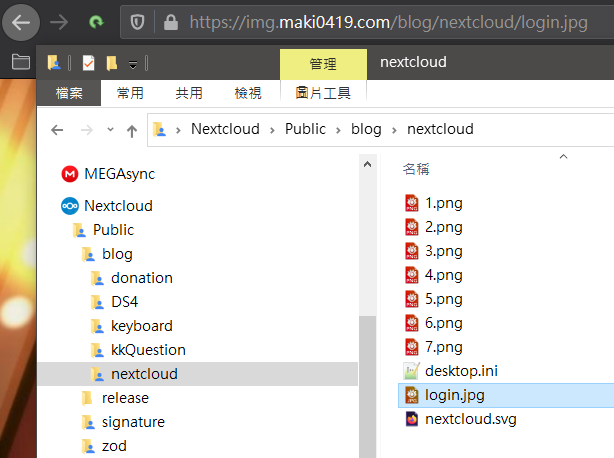

上傳是機器的事，我就按資料夾名拼網址用就好  

> 2024/10/14 更新  
> 因應本站遷移至 Zola，圖片代管已和部落格站點整合，不再使用 Nextcloud 作為圖片主機

## 概觀

### 本專案核心目標

* 以<span class="success">最少的步驟</span>建立整個 server
* **定時備份功能**
* 同時做為 **檔案分享站** 和 **圖片站**，圖片站需要縮址和直鏈訪問

### 本專案特徵

* **使用 nextcloud 官方 image**，將來升級就是 docker-compose pull 解決
* 重寫了 docker-compose file 將<span class="success">需要填入的部份獨立出來，並降到最少</span>
* 分開 nginx reverse proxy 和 Nextcloud 的 compose file，實現擴充彈性
* 用 Cloudflare Worker 將 img 網域做縮址，以產生<span class="success">漂亮的圖片直鏈</span>

### 本文適合對象

* 初級以上的 linux 操作基礎
* 有自己的主機或 NAS，沒有可以[現在租](/Container/linux-docker-setup-reverse-proxy#DigitalOcean) (不然你檔案想放哪裡?)
* **會在意中國大陸看不到圖片的 blogger 站長** <span class="hide">我</span>

## 流程簡述

1. [Linux 主機之 Docker 安裝和 ReverseProxy 建置](/Container/linux-docker-setup-reverse-proxy)
2. git clone 下來 docker-compose 建置檔案和 config 檔案
3. 密碼類的個別設定
4. docker-compose up -d
5. (選) Restore 既有資料和 config

## 硬體架構

機器有兩台: DigitalOcean 租的 VPS 做主要伺服器；我家的 Synology NAS 做備份伺服器  
若不備份 Rsync Server 就不是必要的。本文會講解不做備份的設定方式

```
┌ DigitalOcean Droplet (Main Server)  
WWW
└ Synology NAS (Rsync Server)
```

## Main Server 系統架構

```
WWW
│
Reverse Proxy (nginx Server) (SSL 證書申請、Renew)
│ ┌ MariaDB 資料庫 (網路只對 Nextcloud)
└ Nextcloud (nginx Server)
└ Jobber (Cron) (定時備份 Docker volume，備份完送至 rsync server)
```

## DNS 設定和 Cache 設定 {#dnsSetting}

我使用 Cloudflare 做 DNS 和 Cache  
若用其它 DNS 商請略過 Cache 設定

**SSL 相關設定如此是為了讓 Let's Encrypt 能成功訪問**，請留意

DNS Record 有三條，一條 A 指向 SERVER\_IP，另倆 CNAME 指向 A Record  
nextcloud 網域 DNS Only 用做日常操作，以免 Cache 造成回應錯誤  
**Cache 只設定於 cloud 和 img 倆網域上**，分享時使用這倆網域以節省主機流量，<span class="success">Cloudflare 能夠抓住近 99%</span>

* DNS
  * A: `nextcloud.domain.com` → SERVER\_IP (**DNS Only**)
  * CNAME: `cloud.domain.com` → `nextcloud.domain.com` (Proxied)
  * CNAME: `img.domain.com` → `nextcloud.domain.com` (Proxied)
* SSL/TLS
  * Always Use HTTPS: **Off**
  * HTTP Strict Transport Security (HSTS):**Disabled**
  * Automatic HTTPS Rewrites: (Can enable if needed)
* Caching
  * Caching Level: Standard
* Page Rule
  * `*domain.com/.well-known/acme-challenge*`
    * **Disable Everything**
    * Cache Level: Bypass
  * `nextcloud.domain.com/index.php/apps/sharingpath/<NEXTCLOUDUSERNAME>/Public/*`
    * **Disable Security**
    * Browser Integrity Check: **Off**
    * SSL: Full
    * Browser Cache TTL: a year
    * Cache Level: Cache Everything
    * Edge Cache TTL: a month
    * Automatic HTTPS Rewrites: On
    * **Disable Performance**
  * `https://cloud.domain.com/*`
    * SSL: Full
    * **Rocket Loader: Off**
    * Cache Level: Cache Everything
    * Automatic HTTPS Rewrites: On
    * **Disable Apps**

## 建置

### Linux 主機和 Docker 安裝

請完成此文的 **建置** 章節

👉 [\[Docker\] Linux 主機之 Docker 安裝和 ReverseProxy 建置](/Container/linux-docker-setup-reverse-proxy#build)

### Nextcloud 建置

* cd 到 root 家目錄

  ```bash
  cd
  ```

* git clone 專案  

  ```bash
  git clone https://github.com/jim60105/docker-Nextcloud.git
  ```

* 進入 docker-Nextcloud 資料夾  

  ```bash
  cd docker-Nextcloud
  ```

* 填入.env 檔案  

  ```bash
  cp .env_sample .env && vim .env
  ```

  [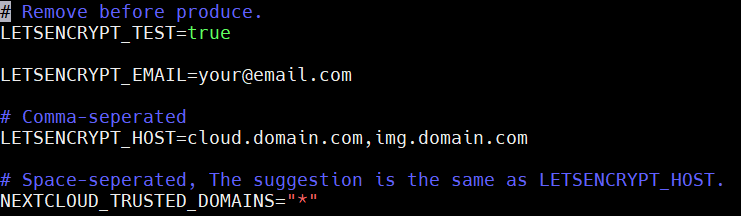](10.png)

  | 環境變數 | 說明 |
  | --- | --- |
  | LETSENCRYPT_TEST | 此為設定申請測試 SSL 證書，現在給 true，**最後上線前才改 false** |
  | LETSENCRYPT_EMAIL | Let's Encrypt 在證書到期時通知你用的 email，不會透過這個做驗證。但這也是你對網域的申報，建議正確填入。 |
  | LETSENCRYPT_HOST | SSL 證書網域名稱和別名。以半型逗點「,」分隔，不能用 wildcard |
  | NEXTCLOUD_TRUSTED_DOMAINS | Nextcloud 的信任網域，這是一個安全性設定，**以其它的網域訪問 Nextcloud 時會被擋住**。 建議和 LETSENCRYPT_HOST 填入相同內容但以空白分隔，或可用「\*」wildcard 字符。 需注意，填入後若要消除，必須到 nextcloud container 下的 `/var/www/html/config/config.php` 中做消除。 此處設定只寫不消，且**只在第一次建立 Nextcloud 設定檔時會讀取**。 |

* 填入 db.env 檔案
  
  ```bash
  cp db.env_sample db.env && vim db.env
  ```

  | 環境變數 | 說明 |
  | --- | --- |
  | MYSQL_PASSWORD | Nextcloud 程式專用帳號的 Database 密碼 |
  | MYSQL_ROOT_PASSWORD | Database 的 root 密碼 |

  下面這兩條可不使用，只有同時設定了才會生效  
  設定了上機時會跳過創建主帳號程序，直接開始 Nextcloud 初始化

  | 環境變數 | 說明 |
  | --- | --- |
  | NEXTCLOUD_ADMIN_USER | 創建你要用的 Nextcloud 帳號 |
  | NEXTCLOUD_ADMIN_PASSWORD | 創建你要用的 Nextcloud 密碼 |

* 修改 jobber 部份:
  * 你有 Rsync Server，且會按照本文設定  
    → 建立\~/ssh.pas 檔案過 build，密碼我們後面再填入

    ```bash
    touch \~/ssh.pas
    ```

  * 你沒有 Rsync Server，定時備份後留在 Main Server 就好  
    → 編輯 docker-compose.yml，刪除 JOB\_COMMAND1 的後半段、secrets 相關內容  

    [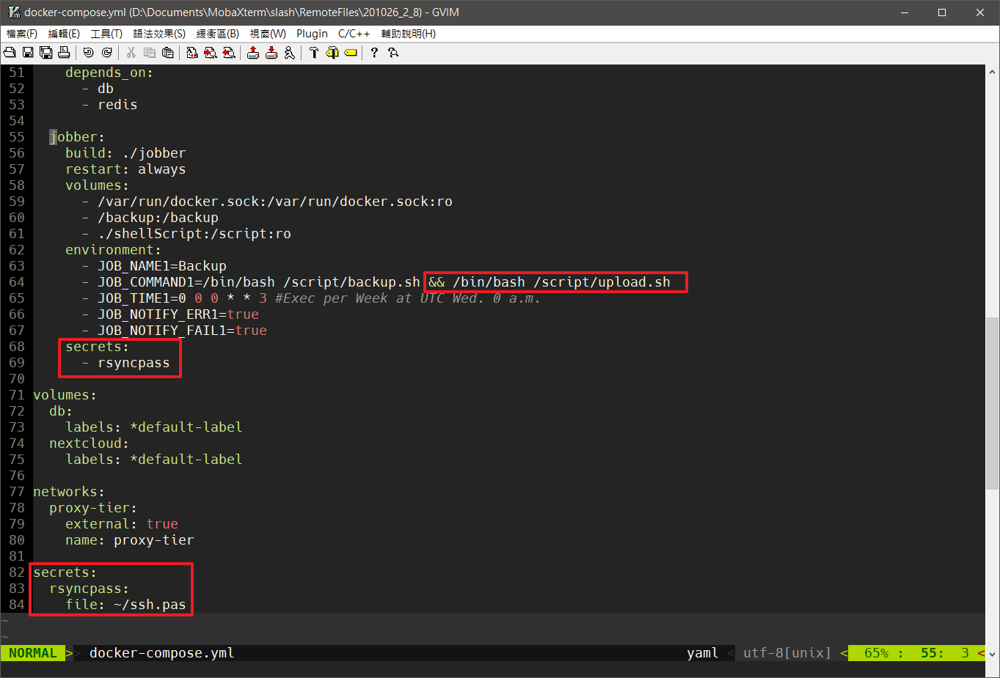](18.png)

  * 你完全不想執行備份  
    → 編輯 docker-compose.yml，刪除 secrets 相關內容和整個 jobber  

    [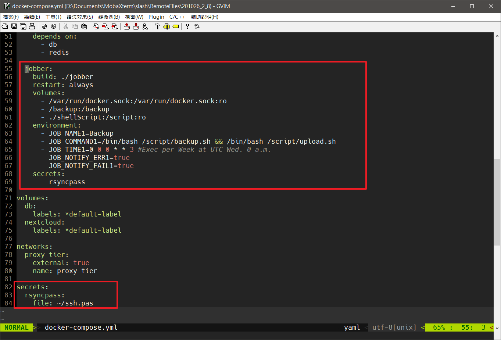](17.png)

* 起機囉\~\~

  ```bash
  docker-compose up -d
  ```

* 檢查 Container 是否都有起來
  
  ```bash
  docker ps -a
  ```

  [](11.png)

* 檢查 SSL 是否成功
  
  ```bash
  docker logs proxy_le -f
  ```

  注意紅框處，這樣就是成功

  [](12.png)

* 將 SSL 申請改為正式申請  

  ```bash
  vim .env
  ```

  第一行 `LETSENCRYPT_TEST` 改為 `false`


因為 Let's Encrypt 針對網域正式申請有次數限制，<span class="danger">不論成功與否，做太多次就會鎖住</span>  
發布前一定要測試成功再轉正，並於申請成功後**備份 cert**  


* 重新啟動 container

  ```bash
  docker-compose down -v && docker compose up -d
  ```

  檢查是否有成功要到正式證書  
  注意紅框處，已沒有\_test\_字樣

  [](13.png)

## Rsync Server 設定和備份還原

### Rsync Server 設定

* Synology rsync server 設定
  * Rsync 是 DSM 內建功能，開啟「控制台→檔案服務→rsync」  
    啟動 rsync 服務，port 可改 (或者由上層的 router，外自訂轉內 22)

    [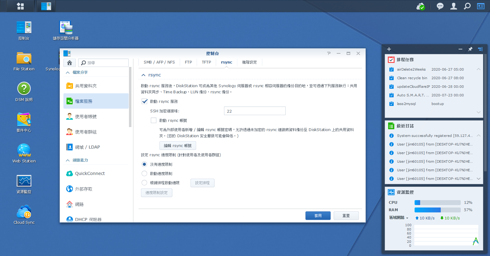](rsync1.png)

  * 「使用者帳號→新增使用者」  
    使用者名**必須為 rsync**，密碼記起來

    [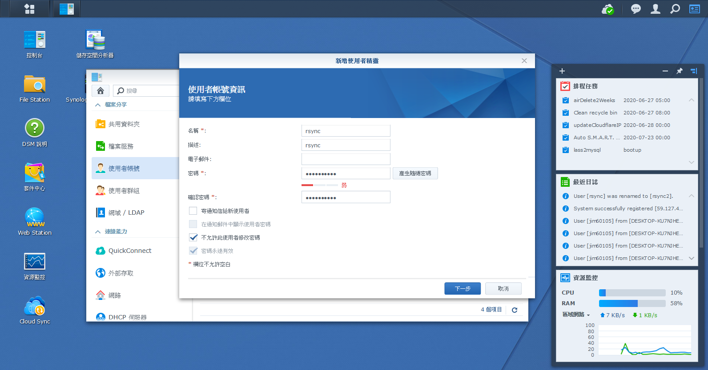](rsync2.png)

  * 設定 NetBackup 為可讀寫，其餘禁止  
    (這 rsync 專用的共用資料夾**必須名為 NetBackup**)

    [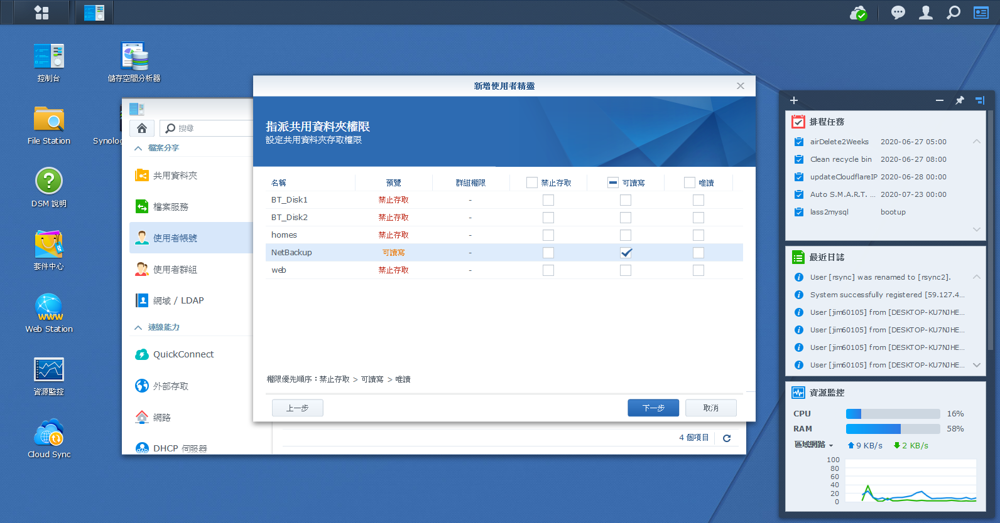](rsync3.png)

  * 使用者建立後，選中 rsync 使用者「編輯」→「應用程式」頁籤  
    全選禁止，再選中「rsync 服務→針對 IP 設定」  
    「允許清單→新增 IP 位址→單一主機」，**填入 Main Server 的 IP**

    [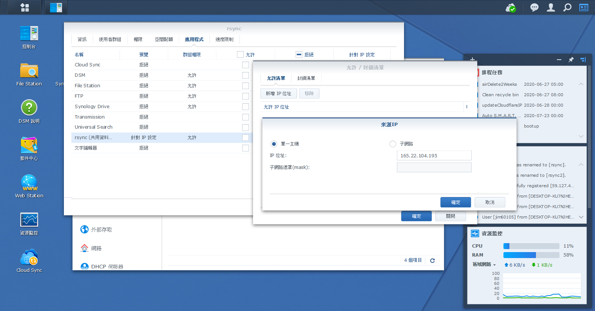](rsync4.png)

* 回到 Main Server，修改 upload.sh 的設定  
  
  ```bash
  cp shellScript/upload.sh_sample shellScript/upload.sh && vim shellScript/upload.sh
  ```

  最後兩行修改如下，填入你的 RSYNC\_SERVER\_IP 和 PORT  

  ```bash
  su - root -c "ssh-keyscan -p 你的PORT 你的RSYNC_SERVER_IP >> ~/.ssh/known_hosts"
  su - root -c "sshpass -f /run/secrets/rsyncpass rsync -e 'ssh -p 你的PORT' -avz --no-p --no-g /backup/ rsync@你的RSYNC_SERVER_IP::NetBackup/docker_backup/"
  ```

* 將 shellScript 下的檔案權限都改為可執行  
  
  ```bash
  chmod 744 shellScript/* && ls -al shellScript/
  ```

  root 權限應為 rwx

  [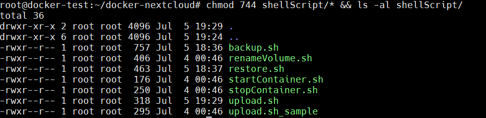](14.png)

* 設定 rsync server 的 ssh 密碼，填入 Rsync Server 上 rsync 使用者的密碼  

  ```bash
  echo "你的密碼" > ~/ssh.pas
  ```

* 修改密碼檔權限為 -rw-------

  ```bash
  chmod 600 ~/ssh.pas
  ```

### 備份

測試定時備份功能，下面這段的意思是  
「在名為 docker-nextcloud\_jobber\_1 的 container 中，執行 jobber test 指令，測試名為 Backup 的定時工作」

```bash
docker exec -it docker-nextcloud_jobber_1 jobber test Backup
```

Stderr 會報說下載了 docker image 和加入 SSH-Key, 但只要有輸出 rsync 資訊就是成功

[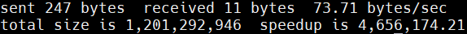](15.png)

也別忘了到 Rsync Server 確認檔案是否存在

[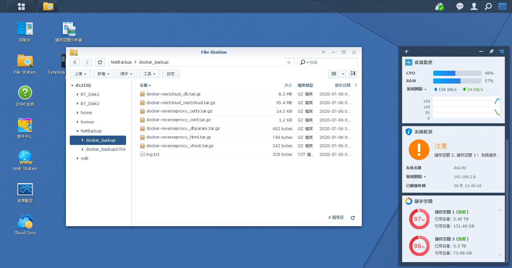](rsync5.png)

<span class="hide align-right">爆了 (´ﾟдﾟ`)</span>


**upload.sh 不能在 host 直接執行**，因為密碼檔是以 docker secrets 的方式處理，此路徑在 host 不存在。


我做了簡易的 log，記錄下執行時間和 IP

[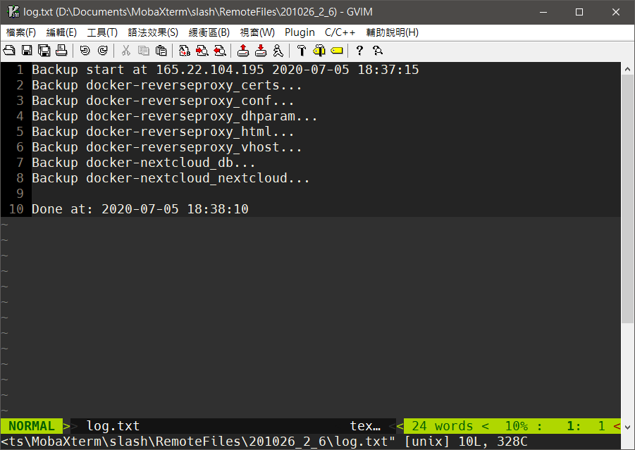](16.png)

### 還原

把備份檔案放回 Main Server 的 `/backup` 資料夾下  
這部份沒有特別建立管道，我是以區網 Samba 連到 NAS，再拖曳進 MobaXterm 的 SFTP 傳輸  
因為安全性考量，我不希望建立能自動從我家 NAS 輸出資料的管道

假若前面有申請了新的正式 SSL 證書想要保留，<span class="danger">留下 reverseproxy 字樣的備份不覆蓋</span>

執行 Restore

```bash
./shellScript/restore.sh && ./shellScript/startContainer.sh
```

若 restore 後不希望自啟動，去掉 && 後那一段


restore 邏輯

1. 由 tag 為 nextcloud 和 proxy 的現存 volume 中取得清單
2. 去 /backup 資料夾找檔案做複原
   故運行前**要先有 volume 存在**，意即必須得先 docker-compose up 一次建立 volume，後做 restore  
   **在建立的過程中不會帶有 backup.sh 需要的 label**，所以要由 docker-compose up 來建立



renameVolume.sh 的用法如下

```bash
renameVolume.sh oldVolumeName newVolumeName
```

rename 邏輯

1. 如果新 volume 不存在就建立，否則清空延用 volume
2. 將舊 volume 的檔案傳到新的 volume
3. 砍掉舊的 volume



## img 圖片縮址

### img 網域的縮址如下

<mark>https://img.domain.com/OOXX</mark>  
\=  
<mark>https://nextcloud.domain.com/index.php/apps/sharingpath/\<NEXTCLOUDUSERNAME\>/Public/OOXX</mark>

### 在 Cloudflare 操作

* 先確定是否有按照[前面的小節](#dnsSetting)做 Cloudflare 設定
* 如果你是第一次使用 Cloudflare Worker，你可能需要閱讀[官方手冊](https://developers.cloudflare.com/workers/learning/getting-started)，直至可以建立一般的線上 worker
* 建一個 Worker，內容把[這些 Code](https://github.com/jim60105/docker-Nextcloud/blob/master/CloudflareWorker/worker.js) 複製進去
* 修改前三行的內容
  * `NextCloudUserName` = 你在 nextcloud 的 username
  * `SourceHost` = 你的 img 網域
  * `TargetHost` = 你的 nextcloud 網域
* Route `img.domain.com/*` 到這個 Worker

> 延伸閱讀  
> 我另外寫了一個[此 Cloudflare Worker 的持續部屬專案](https://github.com/jim60105/worker-img%5Frouter)

### 在 Nextcloud 操作

1. 安裝 Nextcloud 應用程式: **Sharing Path**  
   右上角「應用程式→Files 分類」，裝上 Sharing path

   
   Sharing Path 會開啟「以路徑直鏈訪問公開檔案」功能  
   這雖然方便，但會導致路徑可猜的資安問題  
   故**建議此 Nextcloud 只存放低敏感度資料**
   

2. 右上角「設定→個人 - 分享→Sharing Path」，勾上 Enable sharing path
3. 「設定→管理 - 分享」，勾選以下項目
   * 允許 apps 使用分享 API
   * 允許使用者透過連結分享
     * 允許公開上傳
   * 允許使用者名稱自動補齊在分享對話框
   * 允許這台伺服器上的使用者發送分享給其他伺服器
   * Search global and public address book for users
4. 在 Nextcloud 根目錄新增 Public 資料夾，此資料夾開啟外部唯讀分享，做為分享的根目錄
5. Public 資料夾下放做為 img 網域的 favicon.ico，即 `Public/favicon.ico`

## 客戶端

最後，你會需要一個 Nextcloud 客戶端，做自動同步  
[>> 官網 <<](https://nextcloud.com/install/#install-clients)  ლ(・̀ω・́) っ  
在這裡可以取得，而且安裝非常簡單

安裝時請填入**沒有過 proxy 的 nextcloud 網域**

## 附註: Nextcloud 升級

因為用了 docker，內建的升級功能會有問題，必須在 docker image 層面升級

參考[官方指南](https://github.com/nextcloud/docker#update-to-a-newer-version)

```bash
docker-compose pull
docker-compose up -d
```


一次只能升級一版
意即如果要從 17 升 19，要 17 升 18；18 再升 19


[這裡有所有可用的版號](https://github.com/docker-library/docs/blob/amd64/nextcloud/README.md#supported-tags-and-respective-dockerfile-links)

## 附註: Content-Security-Policy 問題

我不確定什麼情況會讓 Nextcloud 觸發 Content-Security-Policy Error

這個問題的解法是在 Nextcloud 目錄下之 `.htaccess` file 加上設定  
這個檔案會在升級時被重置

```bash
docker exec -it docker-nextcloud_app_1 bash
apt-get update && apt-get install vim -y
vim .htaccess
```

在最後面加上以下幾行，記得把 \*.domain.com 換成你的域名

```xml
<IfModule mod_headers.c>
  Header set Content-Security-Policy " \
      img-src 'self' *.domain.com www.google-analytics.com *.nextcloud.com data: blob:; \
  "
</IfModule>
```

## 附註: 讓 Blogger 過牆 {#Wall}

Blogger 是放在 Google 的伺服器，預設狀態牆內無法瀏覧，但我們能用一些方式讓它過牆

這裡有兩個要素要更動: **域名** 和 **IP**，只要這倆個都不是掛在 Google 就能通過

* 購買一個自己的網域，並在 Blogger 後台設定一個子網域給 blogger 使用。  
  像本站是 [blog.maki0419.com](https://blog.maki0419.com/)
* 將此網域通過 Cloudflare DNS Proxy，這會改變出站 IP  
  隱藏伺服器的真實 IP 也有一定的資安保護做用

[](2020-07-07%2000%2028%2041.png)

以上簡單的操作可讓 Blogger 本站過牆，<span class="danger">但 Blogger 內建的圖片上傳功能並不會套用自訂網域在圖片網址上</span>

這使得我們只能使用外鏈圖片，不能用 Google 內建的圖片上傳

而架設這個「外鏈圖片站」，就是本專案的核心目標 (・\`ω´・)
