+++
title = "[Docker] Opencart 購物網站建置"
description = "Opencart是一套開源的購物網站方案，擴充性高、資源豐富。本文以Docker技術，用最少的步驟讓你快速架起自己的Opencart購物網站。"
date = 2020-08-27T04:36:00.100Z
updated = 2021-10-31T11:08:31.463Z
draft = false
aliases = [ "/2020/08/docker-opencart.html" ]

[taxonomies]
tags = [ "Container", "Docker" ]

[extra]
banner = "preview.jpg"
+++

## 前言


<aside>
{{ image(url="opencart-logo.jpg", alt="Opencart logo") }}
</aside>

[Opencart](https://www.opencart.com/) 是一套開源的購物網站方案，擴充性高、資源豐富。基本框架免錢，好用的收費模組很多，且台灣的支援度高。

對於一般商家而言，個人較推薦在大型電商開賣場，像是 PChome、蝦皮、露天、Yahoo 拍賣等  
好處是<span class="success">建置簡單、曝光率高、客戶熟悉度高</span>。重點是開場成本低，大多是採用賣出時抽成  
自建商店的話，不只<span class="danger">初始架站有一筆開銷</span>，之後還有<span class="danger">每個月的伺服器維護費</span>....

說真的，沒有特殊需求別來折騰這個 (ㆆᴗㆆ)

所謂的 **特殊需求** 是什麼呢，讓我舉幾個例子:

* 希望使用自己的域名，做 SEO 考量
* 一頁式購物、訂閱制購物
* 客戶未登入前不顯示價格
* 新客戶註冊採審核制
* 對不同的客戶分組採用不同價格、不同優惠

不限於這些，還有許多在大型電商不能做到的事  
<span class="success">自由度高</span>，讓不少店家仍希望擁有自己的購物網站

本文以 Docker 技術，用<span class="success">最少的步驟</span>讓你快速架起自己的 Opencart 購物網站<!--more-->

購物網站方案選擇也有不少，而我選用 Opencart 的理由非常簡單 ── [台灣有廠商](https://www.osec.tw/opencart.html)在收費維護。

<figure>


<figcaption>誒我是說真的，這不是業配 (((ﾟДﾟ;)))</figcaption>
</figure>

**對於營業主而言，能花錢解決問題是很重要的一環**，怕的是找不到人提供服務  
今天我們架站不用花錢，但萬一哪天站點出事無力解決，總不能雙手一攤 Let it go 吧?  
你若不是資訊專家，最好給吃飯的工具留個保險

<span class="success">另外還有幾個贏過其它方案的優點:</span>

* 台灣的幾家第三方支付 ([綠界](https://www.ecpay.com.tw/Service/Appcntr%5FShpcar)、[藍新](https://www.newebpay.com/website/Page/content/download%5Fapi#2)、[歐付寶](https://www.newebpay.com/website/Page/content/download%5Fapi#2)、[紅陽](https://github.com/RedSunTech/OpenCart)等) 大都有對 Opencart 推出模組，很容易就能成功串接
* 有 [Facebook 官方支援](https://www.facebook.com/business/help/1494437460610744)，可在右下角顯示 Messenger 聯絡圖標，還能同步上架到 Facebook 粉專商店
* 核心語言是 PHP；伺服器搭 MySQL；推薦架在 Apache 或 Nginx<span class="hide">，說直白點就是核心確實不要錢</span>
* [有中文社群](https://www.facebook.com/groups/opencart.taiwan/)、[中文論壇](https://forum.opencart.com/viewforum.php?f=64)、[英文論壇](https://forum.opencart.com/)，各路大神們聚在一起，有疑難雜症能找人問

我不是大神，也不寫 PHP  
只是喜歡玩 Docker 架站，有問題請去上面找專家 ♥(´∀\`) 人 (甩鍋)

## 概觀

### 本專案核心目標

* 以<span class="success">最少的步驟</span>建立整個 server
* **定時備份**功能
* 後台網址從前台網域切離  
  (意即由 www\.domain.com/admin 無法訪問後台，必需從 otheradmin.domain.com 訪問)

### 本專案特徵

* **使用 OSEC.tw 提供之「[OpenCart 台灣優化版](https://www.osec.tw/opencart.html)」**，萬一出問題找得到人服務
* 以 docker-compose file 將<span class="success">需要填入的部份獨立出來並降到最少</span>
* 分開 nginx reverse proxy 和 opencart 的 compose file，實現擴充彈性
* 前後台網域分離，<span class="success">讓駭客不能猜到你的後台界面網址</span>

### 本文適合對象

* 初級以上的 linux 操作基礎
* 有自己的主機或 NAS，沒有可以[現在租](/Container/linux-docker-setup-reverse-proxy#DigitalOcean) (不然你檔案想放哪裡?)

## 流程簡述

1. [Linux 主機之 Docker 安裝和 ReverseProxy 建置](/2020/11/linux-docker-setup-revese-proxy.html)
2. git clone 下來 docker-compose 建置檔案和 config 檔案
3. 密碼類的個別設定
4. docker-compose up -d
5. (選) Restore 既有資料和 config

## 硬體架構

機器有兩台，放在我家的 NAS 做備份伺服器；DigitalOcean 租的 VPS 做主要 Server

若不備份，Rsync Server 就不是必須的。本文會講解不做備份的設定方式

```
┌ Synology NAS (Rsync Server)
WWW
└ DigitalOcean Droplet (Main Server)
```

## Main Server 系統架構

```
WWW  
│  
Reverse Proxy (nginx Server) (SSL 證書申請、Renew)  
├ Jobber (Cron) (定時備份 Docker volume，備份完送至 rsync server)
├ Opencart 前台 (nginx Server)  
│ ├ MariaDB 資料庫 (網路只對 Opencart 前後台)  
└ Opencart 後台 (nginx Server)
```

## DNS 設定和 Cache 設定 {#dnsSetting}

我使用 Cloudflare 做 DNS 和 Cache  
若用其它 DNS 商請略過 Cache 設定

**SSL 和 PageRule 設定如此是為了讓 Let's Encrypt 能成功訪問**，請留意

DNS Record 有三條，一條 A 指向 SERVER\_IP，另倆 CNAME 指向 A Record

* DNS
  * A: `opencart.domain.com` → SERVER\_IP **(DNS Only)**
  * CNAME: `shop.domain.com` → `opencart.domain.com` (Proxied)
  * CNAME: `shopadmin.domain.com` → `opencart.domain.com` (Proxied)
* SSL/TLS
  * Always Use HTTPS: **Off**
  * HTTP Strict Transport Security (HSTS): **Disabled**
  * Automatic HTTPS Rewrites: (Can enable if needed)
* Caching
  * Caching Level: Standard
* Page Rule
  1. `*domain.com/.well-known/acme-challenge*`
     * **Disable Everything**
     * Cache Level: Bypass

## 架設 {#build}

### Linux 主機和 Docker 安裝

請完成此文的 **建置** 章節

👉 [\[Docker\] Linux 主機之 Docker 安裝和 ReverseProxy 建置](/Container/linux-docker-setup-reverse-proxy#build)

### Opencart 建置

* cd 到 root 家目錄

  ```bash
  cd
  ```

* git clone 專案

  ```bash
  git clone https://github.com/jim60105/docker-Opencart-tw.git
  ```

* 進入 docker-opencart 資料夾

  ```bash
  cd docker-Opencart-tw 
  ```

* 填入.env 檔案  

  ```bash
  cp .env_sample .env && vim .env
  ```

  [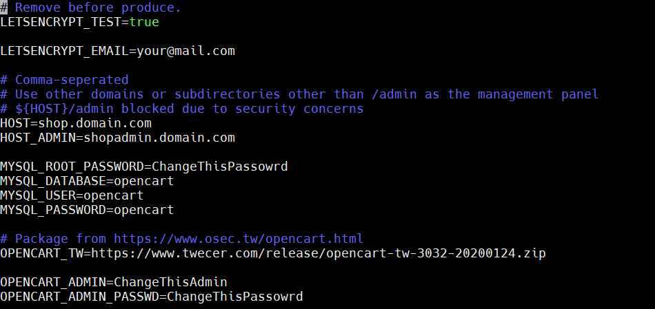](10.png)

  | 環境變數 | 說明 |
  | -------- | ---- |
  | LETSENCRYPT_TEST | 此為設定申請測試 SSL 證書，現在給 true，**最後上線前才改 false** |
  | LETSENCRYPT_EMAIL | Let's Encrypt 在證書到期時通知你用的 email，不會透過這個做驗證。同時用於 Opencart Admin 帳號，建議正確填入。 |
  | HOST | 網站前台網域 |
  | HOST_ADMIN | 網站後台管理界面網域 |
  | MYSQL_ROOT_PASSWORD | Database 的 root 密碼 |
  | MYSQL_PASSWORD | Opencart 程式專用帳號的 Database 密碼 |
  | OPENCART_TW | Opencart 的下載網址，由 [OSEC.tw](https://www.osec.tw/opencart.html) 取得 |
  | OPENCART_ADMIN | 創建後台 Opencart 管理員帳號 |
  | OPENCART_ADMIN_PASSWD | 創建後台 Opencart 管理員密碼 |

* 修改 jobber 部份:
  * 你有 Rsync Server，且會按照本文設定  
    → 建立\~/ssh.pas 檔案過 build，密碼我們後面再填入

    ```bash
    touch ~/ssh.pas
    ```

  * 你沒有 Rsync Server，定時備份後留在 Main Server 就好  
    → 編輯 docker-compose.yml，刪除 JOB\_COMMAND1 的後半段、secrets 相關內容

    [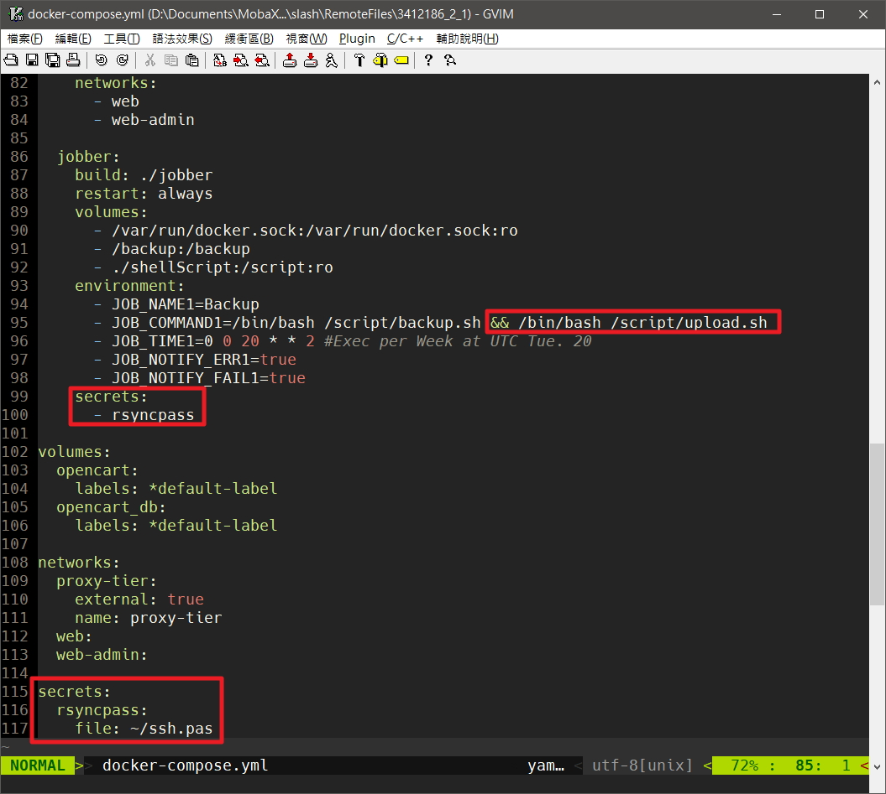](18.jpg)

  * 你完全不想執行備份  
    → 編輯 docker-compose.yml，刪除 secrets 相關內容和整個 jobber

    [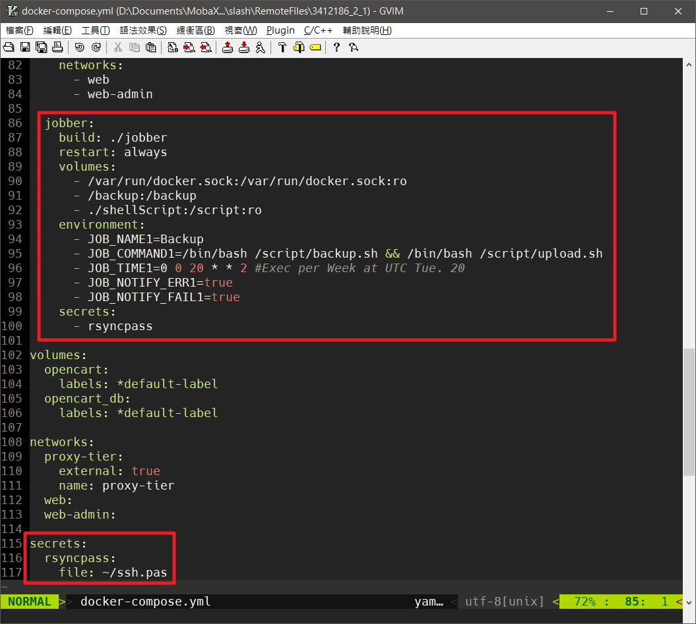](17.jpg)

* 起機囉\~\~

  ```bash
  docker-compose up -d
  ```

* 檢查 Container 是否都有起來  

  ```bash
  docker ps -a
  ```

  [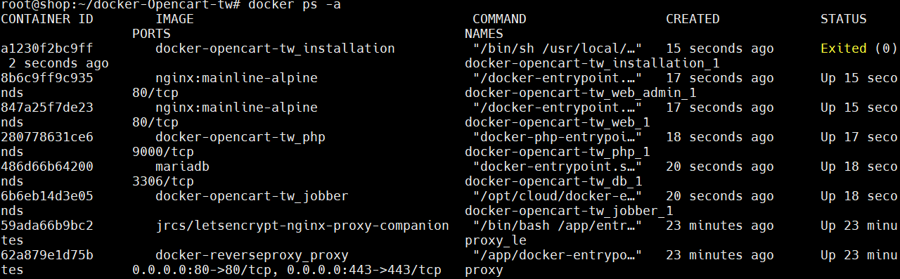](11.png)

* 檢查 SSL 是否成功  

  ```bash
  docker logs proxy_le -f
  ```

  <figure>
  
  [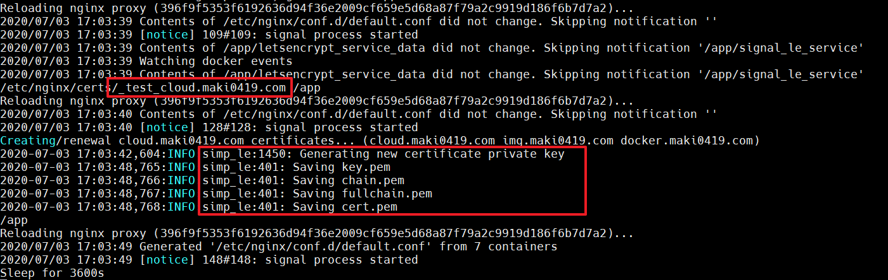](12.png)
  <figcaption>注意紅框處，這樣就是成功</figcaption>
  </figure>

* 將 SSL 申請改為正式申請  

  ```bash
  vim .env
  ```

  第一行 `LETSENCRYPT_TEST` 改為 `false`

  
  因為 Let's Encrypt 針對網域正式申請有次數限制，**不論成功與否**，做太多次就會鎖住  
  發布前一定要測試成功再轉正，並於申請成功後備份 cert
  
  
  重啟 docker compose
  
  ```bash
  docker-compose down -v && docker compose up -d
  ```

  <figure>

  [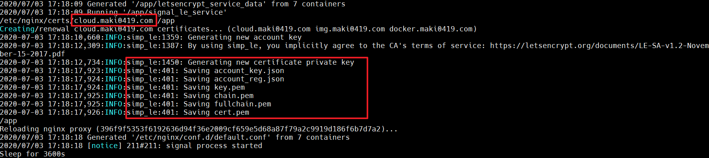](13.png)  
  <figcaption>
  檢查是否有成功要到正式證書<br>
  注意紅框處，已沒有 _test_ 字樣
  </figcaption>
  </figure>

  
  <span class="danger">SSL 更新失敗</span>

  Opencart 架設完成後，<span class="danger">請保持此「Use SSL」選項為「否」</span>  
  SSL 更新驗證會透過 NonSSL 進行，此設定會導致驗證失敗  
  SSL 自動跳轉請[透過 Cloudflare 設定](#dnsSetting)

  [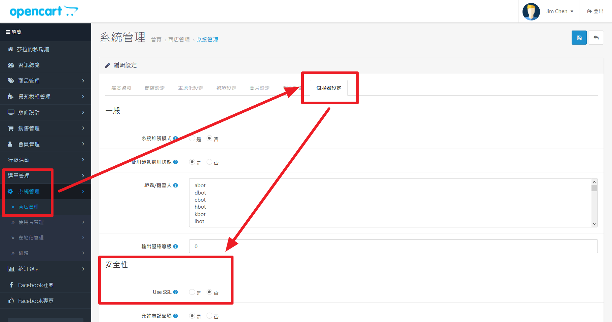](SSL.png)

  

## Rsync Server 設定和備份還原

### Rsync Server 設定

* Synology rsync server 設定
  * Rsync 是 DSM 內建功能，開啟「控制台 → 檔案服務 → rsync」  
    啟動 rsync 服務，port 可改 (或者由上層的 router，外自訂轉內 22)  

    [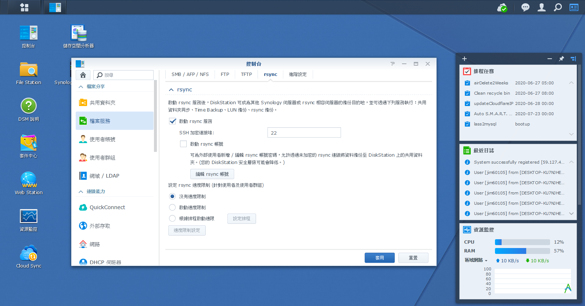](rsync1.png)

  * 「使用者帳號 → 新增使用者」  
    使用者名**必須為 rsync**，密碼記起來  

    [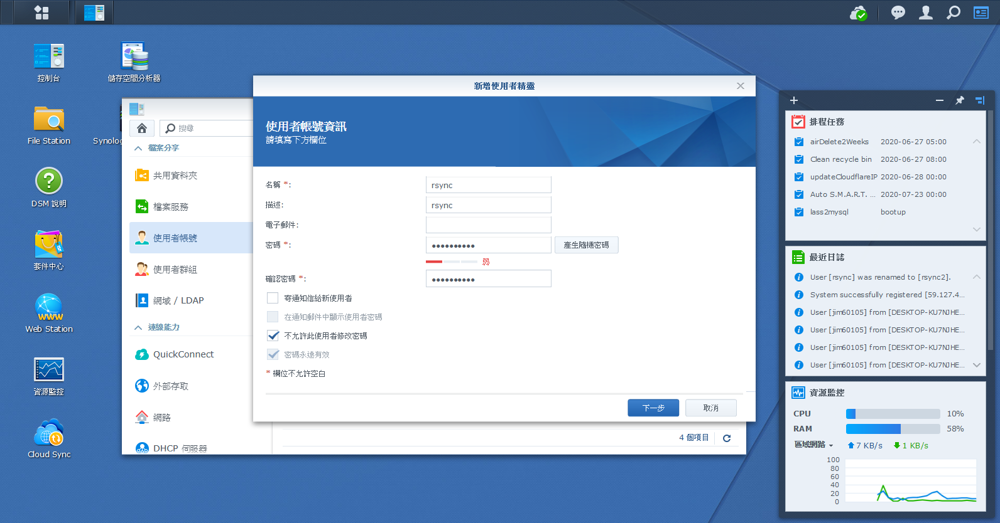](rsync2.png)

  * 設定 NetBackup 為可讀寫，其餘禁止  
    (這 rsync 專用的共用資料夾**必須名為 NetBackup**)  

    [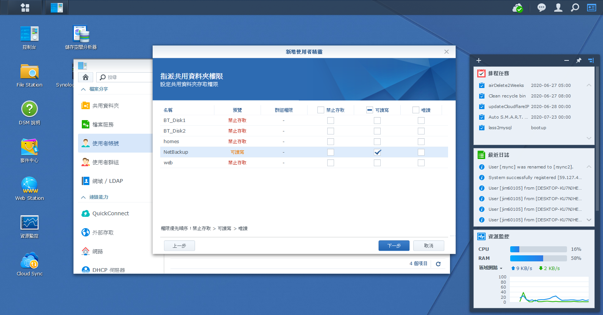](rsync3.png)

  * 使用者建立後，選中 rsync 使用者「編輯」 → 「應用程式」頁籤  
    全選禁止，再選中「rsync 服務 → 針對 IP 設定」  
    「允許清單 → 新增 IP 位址 → 單一主機」，填入 **Main Server 的 IP**  

    [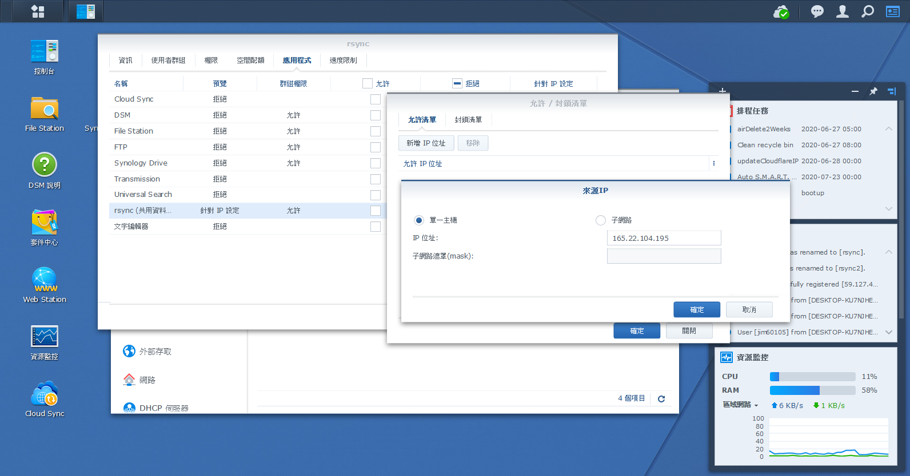](rsync4.png)

* 回到 Main Server，修改 upload.sh 的設定  
  
  ```bash
  cp shellScript/upload.sh_sample shellScript/upload.sh && vim shellScript/upload.sh
  ```

  最後兩行修改如下，填入你的 RSYNC\_SERVER\_IP 和 PORT  

  ```bash
  su - root -c "ssh-keyscan -p 你的PORT 你的RSYNC_SERVER_IP >> ~/.ssh/known_hosts"
  su - root -c "sshpass -f /run/secrets/rsyncpass rsync -e 'ssh -p 你的PORT' -avz --no-p --no-g /backup/ rsync@你的RSYNC_SERVER_IP::NetBackup/shop/"
  ```

* 將 shellScript 下的檔案權限都改為可執行  
  
  ```bash
  chmod 744 shellScript/* && ls -al shellScript/
  ```

  <figure>

  [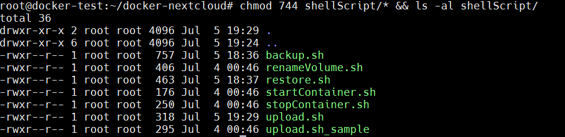](14.png)
  <figcaption>root 權限應為 rwx</figcaption>

* 設定 rsync server 的 ssh 密碼，填入 Rsync Server 上 rsync 使用者的密碼  

  ```bash
  echo "你的密碼" > ~/ssh.pas
  ```

* 修改密碼檔權限為 -rw-------

  ```bash
  chmod 600 ~/ssh.pas
  ```

### 備份

測試定時備份功能，下面這段的意思是  
「在名為 docker-opencart\_jobber\_1 的 container 中，執行 jobber test 指令，測試名為 Backup 的定時工作」

```bash
docker exec -it docker-opencart_jobber_1 jobber test Backup
```

Stderr 會報說下載了 docker image 和加入 SSH-Key, 但只要有輸出 rsync 資訊就是成功

[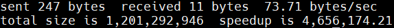](15.png)

也別忘了到 Rsync Server 確認檔案是否存在

[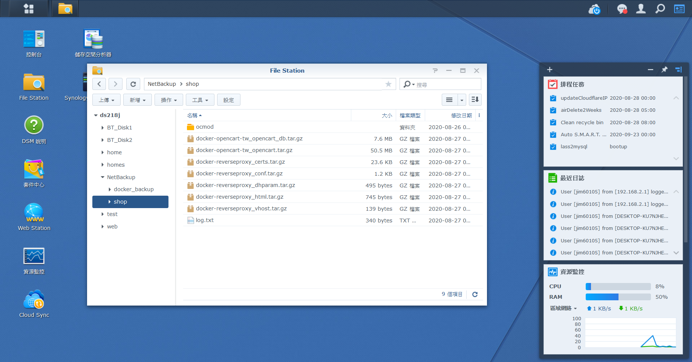](rsync5.png)


upload.sh 不能在 host 直接執行，因為密碼檔是以 docker secrets 的方式處理  
此路徑在 host 不存在


我做了簡易的 log，記錄下執行時間和 IP

[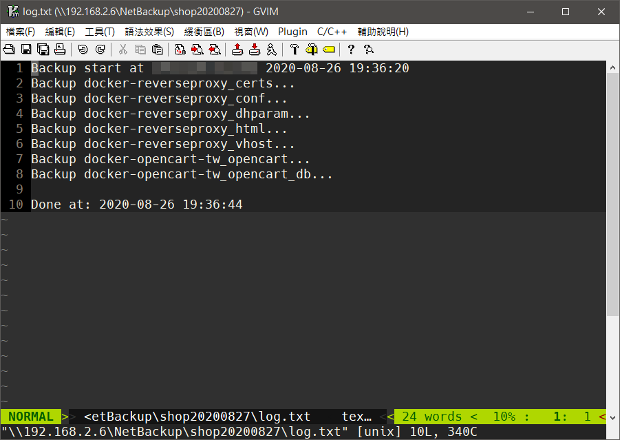](16.png)

### 還原

* 把備份檔案放回 Main Server 的 **/backup** 資料夾下  
  這部份沒有特別建立管道，我是以區網 Samba 連到 NAS，再拖曳進 MobaXterm 的 SFTP 傳輸  
  因為安全性考量，我不希望建立能自動從我家 NAS 輸出資料的管道

  假若前面有申請了新的正式 SSL 證書想要保留，<span class="danger">留下 reverseproxy 字樣的備份不覆蓋</span>

* 執行 Restore
  
  ```bash
  ./shellScript/restore.sh && ./shellScript/startContainer.sh
  ```

  若 restore 後不希望自啟動，去掉 && 和其後那一段


restore 邏輯

1. 由 tag 為 opencart 和 proxy 的現存 volume 中取得清單
2. 去 /backup 資料夾找檔案做複原  

故運行前 **要先有 volume 存在**，意即必須得先 docker-compose up 一次建立 volume，後做 restore  



renameVolume.sh 的用法如下

```bash
renameVolume.sh oldVolumeName newVolumeName
```

rename 邏輯

1. 如果新 volume 不存在就建立，否則清空延用 volume
2. 將舊 volume 的檔案傳到新的 volume
3. 砍掉舊的 volume  

**在建立的過程中不會帶有 backup.sh 需要的 label**，所以要由 docker-compose up 來建立


## 附註: 本專案測試版號

> 這是在 2020 年 8 月測試可用的版號，僅供參考  

docker-compose file 內用的是 latest，拉下來可能會不同

| 服務       | 版本              |
| -------- | --------------- |
| Opencart | v3.0.3.2 台灣優化版  |
| DB       | MariaDB v10.5.5 |
| Web      | Nginx v1.19.2   |
| PHP      | v7.3-fpm        |

## 附註: 修改 Opencart 網址

此專案在每次 docker-compose up 時都會修改網址設定，使之使用寫在 .env 的環境變數設定  
謹將修改記錄在此

後台

```bash
docker exec -it docker-opencart-tw_web_admin_1 vi /var/www/html/upload/admin/config.php
```

原始:

```php
// HTTP
define('HTTP_SERVER', 'http://shop.domain.com/admin/');
define('HTTP_CATALOG', 'http://shop.domain.com/');
// HTTPS
define('HTTPS_SERVER', 'http://shop.domain.com/admin/');
define('HTTPS_CATALOG', 'http://shop.domain.com/');
```

前幾行被我修改如下:

```php
// HTTP
define('HTTP_SERVER', 'http://'.getenv('HOST_ADMIN').'/');
define('HTTP_CATALOG', 'http://'.getenv('HOST').'/');
// HTTPS
define('HTTPS_SERVER', 'http://'.getenv('HOST_ADMIN').'/');
define('HTTPS_CATALOG', 'http://'.getenv('HOST').'/');
```

這樣就會取 php container 的環境變數使用

code 在此

<script src="https://emgithub.com/embed.js?target=https%3A%2F%2Fgithub.com%2Fjim60105%2Fdocker-Opencart-tw%2Fblob%2Fmaster%2Finstallation%2Finstall.sh%23L48-L49&amp;style=an-old-hope&amp;showBorder=on&amp;showLineNumbers=on&amp;showFileMeta=on"></script>

前台同樣

```bash
docker exec -it docker-opencart-tw_web_admin_1 vi /var/www/html/upload/config.php
```

原始:

```php
// HTTP
define('HTTP_SERVER', 'http://shop.domain.com/');
// HTTPS
define('HTTPS_SERVER', 'http://shop.domain.com/');
```

修改如下:

```php
// HTTP
define('HTTP_SERVER', 'http://'.getenv('HOST').'/');
// HTTPS
define('HTTPS_SERVER', 'http://'.getenv('HOST').'/');
```

code

<script src="https://emgithub.com/embed.js?target=https%3A%2F%2Fgithub.com%2Fjim60105%2Fdocker-Opencart-tw%2Fblob%2Fmaster%2Finstallation%2Finstall.sh%23L50-L50&amp;style=an-old-hope&amp;showBorder=on&amp;showLineNumbers=on&amp;showFileMeta=on"></script>

## 附註: 現有 Opencart 網站移用

此專案中的 nginx web server，其網站檔案是放在 volume 之下的 upload 資料夾中  
每次 up 時會檢查是否有 upload 資料夾存在，不存在就做初始化，所以一定要將網站放在 upload 下

假設要複製的既有網站資料位在 host 的 /html；mysqldump 出的既有 db sql file 位在 host 的 /opencart.sql  
請讓資料結構如下

```
/html
├storage
└upload
　├admin
　├catalog
　├image
　├system
　├config.php
　├index.php
　└php.ini
/opencart.sql
```

先完成此[架設](#build)章節，至能訪問預設網站

* 修改權限

  ```bash
  chown -R www-data /html && chmod -R 755 /html
  ```

* 把檔案複寫入 container

  ```bash
  docker cp /html/. docker-opencart-tw_web_1:/var/www/html
  docker cp /opencart.sql docker-opencart-tw_db_1:/
  ```

* 進入 db container

  ```bash
  docker exec -it docker-opencart-tw_db_1 bash
  ```

* 進入 bash 後將 sql 倒入，完成後砍了  
  
  ```bash
  mysql -p opencart < /opencart.sql && rm /opencart.sql
  ```

  之後 `exit` 離開即可


這裡進入 bash 後再操作 mysql 是資訊安全考量  
如果無視的話，sql 部份能用這樣的一條處理完  
<span class="hide">docker exec -i docker-opencart-tw_db_1 mysql -p密碼 opencart < /opencart.sql</span>

