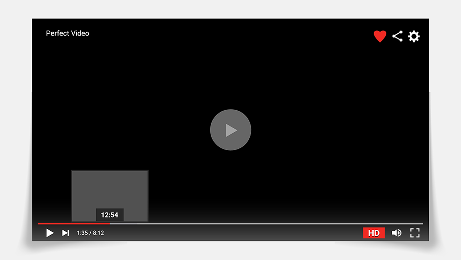
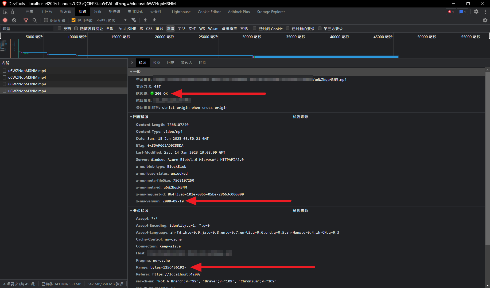
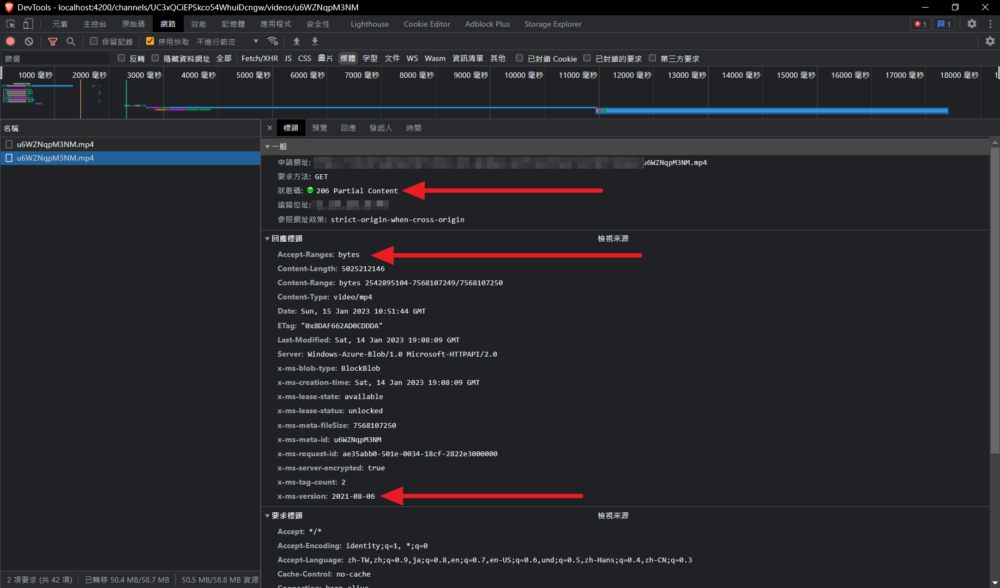

+++
title = "在 Azure Blob Storage 啟用 206 Partial Content 以支援 mp4 串流播放"
description = "我正在開發一個網頁上的影片播放器，使用套件來播放儲存在 Azure Blob Storage 的 mp4 檔案。雖然影片可以成功從頭播放，但是卻無法從指定的時間開始播放，並且拉動時間軸時也無法進行跳轉。Storage 未回應 206 Partial Content。這篇文章將說明如何解決此問題。"
date = 2023-01-15T11:21:00.005Z
updated = 2023-01-16T05:12:26.999Z
draft = false
aliases = [ "/2023/01/azure-blob-storage-206-partial-content.html" ]

[taxonomies]
tags = [ "Azure" ]
licenses = [ "GFDL 1.3" ]

[extra]
card = "preview.png"
iscn = "iscn://likecoin-chain/DRhAnHi6Vd38TifJUX0HTnBBg9JywfCa_JvFp1HrS-E/1"
+++


在這篇文章中，我將解釋 Azure Blob Storage 預設使用舊的規格版本導致無法支援206 Partial Content 並無法達到 mp4 串流播放的問題，並提供解決方案。

206 Partial Content 是 HTTP 協定中的一項功能，允許客戶端只請求並下載特定範圍的內容，而不是整個檔案。本文將提供 Azure CLI 指令，讓你可以在 Azure Blob Storage 中適當地設定預設版本，啟用 206 Partial Content 使其能夠支援 mp4 串流播放，解決影片無法串流的問題。

<!-- more -->

## 先說結論

在 Azure CLI 執行

```bash
az storage account blob-service-properties update --default-service-version 2021-08-06 -n yourstorageaccount -g yourresourcegroup
```

記得在 yourstorageaccount, yourresourcegroup 帶入你的 Storage Account 和 Resource Group 名稱

這解決了我的問題，但是不一定能解決你的。  
請繼續閱讀了解我為什麼這麼做。

## 遇到問題

我正在開發一個網頁上的影片播放器，使用 [ngx-videogular](https://github.com/videogular/ngx-videogular) 套件來播放儲存在 Azure Blob Storage 的 mp4 檔案。雖然**影片可以成功從頭播放**，但是卻<span class="danger">無法從指定的時間開始播放</span>，並且拉動時間軸時也無法進行跳轉。

我在使用 F12 開發人員工具檢查時，發現前端程式碼<span class="success">有向伺服器發出了 `Range: bytes` 的要求</span>，而**伺服器則回應了 200**，並且從檔案的開頭開始傳輸。我相信前端套件是沒有問題的，這個狀況應該是後端伺服器（在這裡是 Azure Blob Storage）未回應 Partial Content。

它無法理解我們「請從檔案的第 n 個 bytes 傳給我」的要求。

[](before.png)

正常的情況下，伺服器應該要回應 206 並從指定的 bytes 開始傳輸。

[](after.png)

## 發現問題

開什麼玩笑，堂堂 Azure 不支援 Partial Content?

我查了一下，這問題在兩年前有人問過: [Stack Overflow](https://stackoverflow.com/q/61672811/8706033) ，下方的三個解答<span class="spoiler">罕見的</span>都是正確的。  
做了更多功課後，我發現其實這有寫在 doc: [Microsoft Learn](https://learn.microsoft.com/en-us/rest/api/storageservices/Versioning-for-the-Azure-Storage-Services?redirectedfrom=MSDN#for-general-purpose-storage-accounts)  

> If an anonymous request to a general-purpose storage account does not specify the x-ms-version header, and the default version for the service has not been set using Set Blob Service Properties, then the service uses the earliest possible version to process the request. However, if the container was made public with a Set Container ACL operation performed using version 2009-09-19 or newer, then the request is processed using version 2009-09-19.

簡而言之，**不是不支援，是預設沒支援**，你需要指定你要用新版本。  
<span class="spoiler">這是 feature 不是 bug!</span>

## 解決問題

要解決這個問題，我們有兩種選擇。

* 在發出 request 時添加 `x-ms-version` header，指定要使用的新版本
* 設定 storage account 的預設版本

由於我的 request 是由套件處理，因此不太方便加上標頭。而且由於這是一個新專案和新的 storage account，所以我決定選擇第二種方法 —— 更改預設版本。如果你有過往的專案使用相同的 storage account，**請注意更改預設版本是否會導致其他問題。**

要設定 storage account 預設版本只能透過 Azure CLI 設定:  

```bash
az storage account blob-service-properties update --default-service-version 2021-08-06 -n yourstorageaccount -g yourresourcegroup
```

記得在 yourstorageaccount, yourresourcegroup 帶入你的 Storage Account 和 Resource Group 名稱。

## 如果這沒解決你的問題

可能造成影片無法串流的原因還有另一個，那就是檔案本身不支援。

在實體檔案串流播放時，需要注意影片索引的問題。**關鍵幀索引表** 用於快速查找影像資料 —— mp4 是寫在 moov 中； mkv 是稱為 Cues —— 都是寫在影片檔案的末尾。

影像資料在寫入完後，才能夠根據資料建立索引，所以它是寫在影像資料的後方。這個設計在本地讀取時沒什麼問題，播放器可以直接存取到整個檔案，但是在線上串流時就很糟糕了。<span class="danger">播放器必須要下載完一整個檔案，取得最末尾的索引資訊，才有辦法搜尋時間軸。</span>無法索引的檔案會從檔案的起始開始緩衝，直到當下選取的時間點為止。

例如說，點選了 02:00:00 (2小時) 處，這時就會把前面兩小時的影片資料都緩衝下載回來，然後才開始播放。<span class="danger">使用者體驗就是轉圈轉個半天等到天荒地老</span>，然後影片才開始播。然後，接著點選時間軸 01:23:00 處，因為沒有索引資料，比較笨的播放器可能會再從頭緩衝一次。

為了解決這個問題，你要把索引搬到影像資料的前面。影片檔案普通的寫入完成後，再一對一複製為第二個檔案，不過這次改變順序，先寫索引再寫影像資料，並且依照 offset 修改索引內容。

具體的工具、指令可以參考我另一篇文章的最後尾附錄。關鍵字為 <mark>mp4 faststart</mark>。

> 延伸閱讀
>
> ---
> [影片下載轉檔筆記 ( Youtube 、 Twitch 、 TwitCasting 、 Twitter Spaces 音訊空間 、 ffmpeg、yt-dlp )](@/Livestream/youtube-download-ytdlp-ffmpeg/index.md)

## 參考資料

* [Versioning for the Azure Storage services | Microsoft Learn](https://learn.microsoft.com/en-us/rest/api/storageservices/Versioning-for-the-Azure-Storage-Services?redirectedfrom=MSDN#for-general-purpose-storage-accounts)
* [video streaming - Does Azure Blob Storage supports partial content 206 by default... - Stack Overflow](https://stackoverflow.com/a/74650457/8706033)
* [206 Partial Content - HTTP | MDN](https://developer.mozilla.org/en-US/docs/Web/HTTP/Status/206)
* [琳的備忘手札: 雲端硬碟影片檔串流播放之研究手札 ( OneDrive 、 Google Drive 、 MEGA ) #附錄: mp4 faststart、mkv cues\_to\_front (mkclean)](@/Livestream/streaming-video-files-in-network-space/index.md#mp4-faststart)
