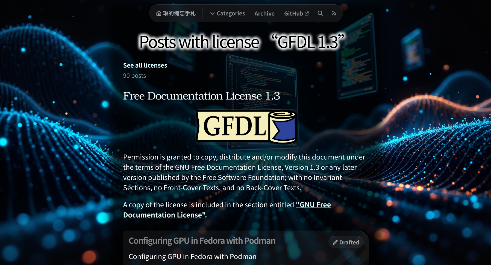

+++
title = "從 Blogger 到 Zola：重建我的個人部落格"
description = "本站由 Blogger 遷移至 Zola 啦！這篇文章中詳細記錄了將個人部落格從 Blogger 遷移到 Zola 的全過程。作為一名網頁開發者，我分享了選擇 Zola 的原因、遷移過程中遇到的挑戰以及我的解決方案。我深入探討了新平台帶來的改進，包括我如何實現自定義功能、優化 SEO 和提升用戶體驗。"
date = "2024-12-08T17:27:17.048Z"
updated = "2024-12-08T21:28:33.026Z"

[taxonomies]
licenses = [ "All Rights Reserved" ]
tags = [ ]

[extra]
card = "preview.png"
iscn = "iscn://likecoin-chain/5eVo7Oyp780kXYXk14RZLf9rijMdh84tzSd0ZssrKzY/1"

  [extra.comments]
  id = "113619523325348567"
+++
> 本篇文章透過「[筆韻智匠 Quill Sage🖋️✨](https://www.coze.com/s/Zs8k6GASu/)」和 Claude 3.5 Sonnet 聯合創作

{{ image(url="preview.png", alt="preview", no_hover=true) }}

## 本站由 Blogger 遷移至 Zola 啦

身為一名網頁開發者，我長期以來都有個心願：將我的部落格從 Blogger 平台遷移到一個更適合我需求的地方。這個想法在我腦海中盤旋多年，卻一直沒有付諸行動。直到最近，我發現了一個讓我眼前一亮的**部落格範本**，這成為了我最終下定決心進行搬遷的契機。

這次的搬遷工程並非一朝一夕就能完成。從 2024 年 10 月 5 日開始動工，到 2024 年 12 月 7 日正式上線，整整花費了兩個月的時間。在這段期間，我經歷了許多思考、規劃和實作的過程，這篇文章將記錄下我在搬家過程中的種種考量和心得。

有趣的是，我常常被問到：

*「作為一個專業的網頁開發者，你怎麼會使用 Blogger 呢？」*

這個問題的答案其實很簡單：

*「因為我在 2010 年開始寫部落格的時候，還不是一個網頁開發者。」*

時過境遷，我的技能和需求都有了顯著的變化，是時候讓我的部落格平台也跟上這些改變了。

這次的遷移不僅僅是一次簡單的平台更換，更是對我個人技術成長的一種見證。從一個單純的部落格寫手，到能夠自主選擇和定制自己的部落格平台，這個過程體現了我在網頁開發領域的進步和專業成長。

接下來，讓我們一起深入探討這次遷移的細節，看看為什麼最終選擇了 Zola，以及在這個過程中我所面臨的挑戰和收穫。

## 我選的其實是範本?

在眾多靜態網站生成器中，如 Hugo、Hexo、Jekyll、Gatsby 等，為什麼最終我選擇了 Zola？

事實上，這些靜態網站生成器都有其獨特的優點，功能上也大同小異。正是因為它們都很優秀，我們才無法簡單地說 *「一律選擇某某某就對了」*。在這種情況下，選擇往往取決於個人偏好和特定需求。

對我來說，  
**選擇 Zola 的決定性因素是我發現了一個令我心動的範本 —— [Duckquill](https://duckquill.daudix.one/)。**

這個範本吸引我的原因主要有三：

### 視覺風格

Duckquill 的整體設計簡潔而不失特色。它散發著一種「技術宅的小小自由天地」的氛圍，完美符合我對個人技術部落格的想像。這種風格既展現了程式設計師的創意品味，又不會顯得過於複雜或花俏。


### Mastodon 留言系統整合

作為一個 Mastodon 住民，看見這個功能真的是眼前一亮！傳統上，靜態部落格的留言系統通常採用 [Disqus](https://disqus.com/)（第三方中心化服務）或 [Utterances](https://github.com/utterance/utterances), [giscus](https://github.com/giscus/giscus)（需要 GitHub 帳號）。而 Duckquill 將 Fediverse 整合進來，這個解決方案既去中心化又不失便利性，可以說是恰到好處。


### 開源精神


[Duckquill 的專案托管在 Codeberg.org](https://codeberg.org/daudix/duckquill)，採用 MIT 授權。作為一個開源愛好者，看到專案首頁上大大的 MIT 標語，我感受到了濃厚的開源精神。這不僅意味著我可以自由使用和修改，也代表著一個活躍的社群和持續的維護。


## 選定 Zola 的必要條件

雖然我之前提到選擇哪個靜態網站生成器都可以，但實際上，我還是有一些必要條件需要考慮。這些條件不僅適用於 Zola，也是我評估其他靜態網站生成器的標準。以下是我認為必不可少的幾個特性：

- **支援 Markdown**： 在 2024 年，這幾乎是不言而喻的要求。Markdown 的簡潔性和易用性使它成為技術寫作的首選格式。能夠直接用 Markdown 撰寫文章，可以讓我專注於內容創作，而不是 format 排版。
- **支援 HTML**： 雖然 Markdown 已經能滿足大部分需求，但有時候我還是需要更靈活的表現方式。能夠直接嵌入 HTML 讓我可以實現一些特殊的排版效果，例如文字上色、嵌入複雜的網頁元素，或是創造獨特的視覺呈現。
- **支援修改模板**： 作為一個網頁開發者，我希望能夠根據自己的喜好調整網站的外觀和功能。重要的是，這種修改應該是局部的、可控的，而不是完全重寫整個模板。這樣我才能在保留原有設計精髓的同時，又能加入個人特色，同時也方便日後與上游 Duckquill 模板進行合併，避免 Git 衝突的噩夢。
- **純靜態網頁**： 作為一位專業的系統工程師，我深知最好維護的伺服器就是不需要維護的伺服器。靜態網頁不僅降低了維護成本，也提高了網站的安全性和穩定性。
- **VSCode 友好的寫作環境**： 經歷過 Blogger 後台那令人頭疼的所見即所得編輯器後，我渴望一個更舒適的寫作環境。能夠在 VSCode 中進行寫作和編輯，讓我可以充分利用這個強大編輯器的各種功能，例如版本控制、擴充功能、VIM 等，提升寫作效率。
- **內建 code block**： 作為一個技術部落格，程式碼區塊是我網站中最重要的元素之一，這對我來說是一個必不可少的功能。

除了這些必要條件外，還有一些加分項目：

- **serve & watch 功能**： 在開發過程中能即時預覽修改結果，這對於偵錯網站非常重要。
- **支援 Linux**： 這確保了我可以輕鬆地整合 CI/CD 流程和使用 devContainer。

最後，雖然這可能是最不重要的一點

Hugo 是 Golang；  
Hexo 是 Node.js；  
Jekyll 是 Ruby；  
Gatsby 是 React.js；  
**Zola 是 {{color(body="Rust", color="orange")}}**。

<figure>
<div style="min-width: 20vw; width: 250px; margin: 0px auto">


</div>
<figcaption>

你知道嗎?  
Rustacean 光是聽見 Rust 就心有所屬了
</figcaption>
</figure>

選擇了 Zola 和 Duckquill 範本，不僅滿足了我對靜態網站生成器的技術需求，更契合了我對部落格平台的美學追求和價值理念。這個選擇讓我感到，我不只是在搭建一個網站，更是在打造一個能夠真正代表我的網路居所。

## 遷移過程

將部落格從 Blogger 遷移到 Zola 涉及多個複雜的步驟，每一步都需要仔細的規劃和執行。

### Blogger 平台導出

**首先，我面臨的是如何從 Blogger 平台導出所有內容。** Blogger 提供了一個內建的匯出功能，它會生成一個 XML 檔案。這個檔案本質上是一個 Atom feed，包含了所有的設定值、文章內容和讀者留言。然而，將這個 XML 檔案轉換成 Zola 可用的格式並不是一件容易的事。我在網路上並沒有找到現成的解析工具，因此我決定自己動手做一個。


這個自製的解析工具 [jim60105/blogger-content-parser](https://github.com/jim60105/blogger-content-parser)，我將它開源在 GitHub 上。它的主要功能是將 Blogger 的 XML 檔案解析成一系列獨立的 Markdown 文件。不僅如此，它還能自動生成每篇文章所需的 frontmatter，包括標題、發佈日期、轉址資訊和標籤等重要資料。雖然這個工具是為 Zola 設計的，但經過簡單的修改它也能適用於其他靜態網站生成器。

### 文章內容重整

**接下來的挑戰是內容的清理和重整。** 早期使用 Blogger 的所見即所得編輯器撰寫的文章中，包含了大量雜亂的 HTML 標籤。這些標籤在轉換為 markdown 時會全部丟失，這就需要我手動檢查每一篇文章。在接下來的兩個月裡，我投入了大量時間重新整理全部 130 多篇文章。這不僅僅是簡單的格式轉換，更是一次徹底的內容整理。我仔細檢查每一篇文章，確保內容的完整性，並維持文章的原始模樣。十年前的文章有很多的黑歷史，我認為它保留了我成長的痕跡，因此我不希望對它們做太多的修改。

### 圖片管理

**圖片管理是另一個需要認真考慮的方面。** 在 Blogger 時期，我的圖片管理策略經歷了幾次變化。最早期，我使用 Blogger 內建的圖片上傳功能。後來，我轉向了一個更先進的解決方案，[使用 Nextcloud 配合 Cloudflare Worker 來處理圖片路由](@/Container/nextcloud/index.md#img-router)。然而，在這次遷移中，我決定採取一個更簡單且更具控制力的方法：將所有圖片直接存放在網站專案內。這樣做雖然增加了專案的體積，但提高了網站的獨立性和穩定性，不再依賴外部服務。

### 重構分類系統

**最後，我著手重構整個分類系統。** Zola 提供了比 Blogger 更豐富的內容組織方式，這給了我重新思考內容結構的機會。Blogger 只有「標籤」這一種分類方式，而 Zola 提供了「Sections」和「Taxonomies」兩種分類機制。除了 Duckquill 內建的 tag taxonomy 之外，我還引入了新的 taxonomy: Licenses，用於明確標示每篇文章的授權方式。



Zola 的靈活性允許我為不同的分類使用不同的範本。這意味著我可以為特定的分類，比如[使用 GFDL 1.3 授權的文章分類](/licenses/gfdl-1-3)設計專門的列表頁面，清楚地展示相關的版權資訊。這種細緻的控制讓整個網站在內容呈現上更加專業和規範。

總的來說，這次從 Blogger 到 Zola 的遷移不僅僅是一次平台轉換複製貼上，更是一次徹底的內容重組和整理。通過這個過程，我不僅提升了網站的結構和呈現品質，也為未來的內容管理和擴展奠定了更好的基礎。

## 新網站的特色

在將部落格遷移到 Zola 平台並採用 Duckquill 主題後，我進一步為網站注入了一系列獨特的功能和改進。

### Color Shortcode

我充分利用了 Zola 的 Shortcode 功能，**這是一個允許在 Markdown 中插入自定義 HTML 或其他內容的強大工具**。我寫了幾個專門用於文字上色的 shortcode，極大地簡化了為文章添加顏色標記的過程。這意味著我不再需要在每次想要改變文字顏色時都手動編寫 HTML 標籤。這個看似簡單的功能，實際上能顯著提高我的效率。

{{ color(body="some orange text in bold tag", color="orange", element="b") }}

```
{{/* color(body="some orange text in bold tag", color="orange", element="b") */}}
```

{{ cr(body="some red text") }}

```
{{/* cr(body="some red text") */}}
```

### ISCN 識別碼以及 Writing NFT Widget

> <a rel="noopener noreferrer" href="https://app.like.co/view/iscn%3A%2F%2Flikecoin%2Dchain%2F5eVo7Oyp780kXYXk14RZLf9rijMdh84tzSd0ZssrKzY%2F1" target="_blank"> </a>
>
> ---
> ISCN 全寫 International Standard Content Number，是每筆內容在 LikeCoin chain 區塊鏈上註冊的元數據。
>
> ISCN  的用途有如書籍出版所用的國際書號 ISBN，把內容出版到 LikeCoin chain 區塊鏈的概念也相似，註冊獨一無二的 ISCN，附帶包括作者、日期、授權方式、內容指紋等元數據。因為區塊鏈的特性，ISCN 和元數據不可篡改。  
> —— [ISCN | LikeCoin](https://docs.like.co/zh/depub/what-is-iscn)

> <div style="margin:2rem auto" id="likerContainer"><iframe sandbox="allow-scripts allow-same-origin allow-popups allow-popups-to-escape-sandbox allow-storage-access-by-user-activation" src="https://button.like.co/in/embed/iscn/button?iscn_id=iscn://likecoin-chain/5eVo7Oyp780kXYXk14RZLf9rijMdh84tzSd0ZssrKzY/1" class="writingNFT" frameborder="0" scrolling="no"></iframe></div>
>
> ---
> 顧名思義，Writing NFT 是一種非同質化代幣 (NFT)，代表著某篇文字作品的所有權，像是文章或任何其他形式的文字，無論附帶插圖與否。換句話說，它是證明某段數位文字內容所有權的證據。  
> —— [Writing NFT 常見問題 | LikeCoin](https://docs.like.co/zh/depub/writing-nft)

我個人很喜歡 [LikeCoin 的讚賞理念](https://docs.like.co/zh/general-guides/dapp/liker-land/like)，因此我引入了 ISCN 識別碼和 Writing NFT Widget。**任何網站和只需安裝讚賞鍵就能化讚為賞 —— 讀者每一按讚，作者都能獲得收入。** 這兩個功能的加入不僅體現了我對數位內容所有權的重視，也為讀者提供了一種新的方式來支持和擁有我的作品。這種創新的內容價值認證方式，為我的文字創作賦予了更深層的意義和價值。

### View Counter

> <div> {{ image(url="https://view-counter.jim60105.workers.dev/?style=classic&labelColor=141414&color=555&scale=1#badge", alt="View counter badge", no_hover=true, pixels=true, badge=true) }} </div>
>
> ---
> [\[個人專案\] 網頁計數器徽章 View Counter Badge —— 瀏覧數別再送人啦！以 Cloudflare Workers D1 實作適合純前端網頁的計數器](@/SideProject/view-counter-badge-cloudflare-workers-d1/index.md)

這次我也將這個計數器加入到了我的部落格中，你可以在每一頁的最下方找到這個小小的計數器。

### 重構 \<head\> 元素

作為一個了解網頁極致調校的網頁開發者，我對網站的 \<head\> 元素進行了全面的重構。這包括優化 meta 標籤的排序和內容，增加必要的 preconnect 標籤，以及添加結構化的 ld+json 數據。**這些看似微小的調整，實際上對提升網站在搜索引擎中的排名和整體性能有著顯著影響。**

### Nav 上的 Feed 按鈕改為複製功能

最後，我對導航欄上的 Feed 按鈕進行了改進。原本點擊後直接跳轉到 RSS 頁面的按鈕，現在被改造成了一個更加用戶友好的功能。**現在，當讀者點擊這個按鈕時，我的 RSS 訂閱連結會被自動複製到剪貼板。** 這個小小的改動大大提高了訂閱流程的便利性，讀者不再需要在不同頁面之間來回切換。

這些特色和改進雖然各自看似微小，但它們共同構建了一個更加友好、高效且具有個人特色的部落格平台。每一項功能的加入都經過深思熟慮，旨在提升讀者的閱讀體驗，同時也反映了我對技術創新和內容價值的追求。通過這些改進，讓我的新網站在功能上更加豐富。

## 結語與展望

回顧這兩個月的遷移歷程，從 Blogger 到 Zola 的轉換不僅是技術上的升級，更是一次深刻的內容重整和自我審視。這個過程讓我重新檢視了十多年來的寫作，重新梳理了自己的寫作歷程，也重新思考了部落格對我的意義。新平台的靈活性和強大功能，為我開啟了更多內容創作的可能性，我期待能在這裡與讀者分享更多關於網頁開發、雲端技術和開源專案的見解。

展望未來，我希望這個平台能成為與讀者更好互動的橋樑。我計劃專注於技術文章的撰寫，同時探索新的內容形式。在這個資訊快速變遷的時代，保持學習和分享的熱情至關重要。**我誠摯地邀請各位讀者提供寶貴的反饋，無論是對網站設計的建議，還是對內容主題的想法。** 讓我們一起，在這個數位天地中，繼續探索、學習、成長，共同打造一個充滿思想碰撞和知識分享的空間。
