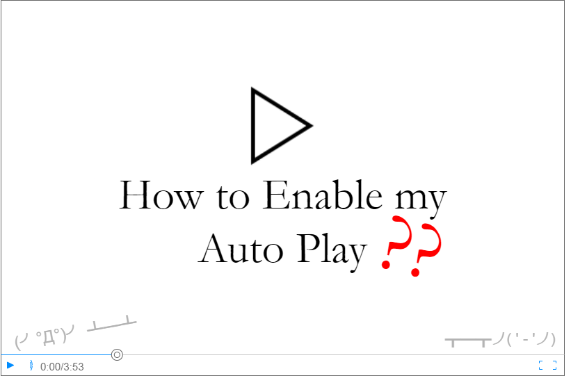
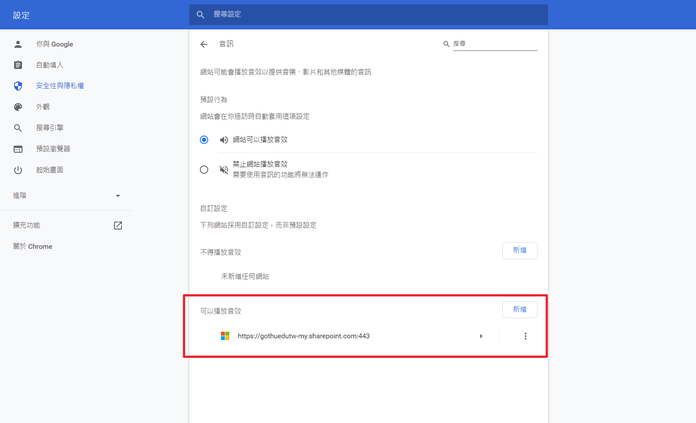
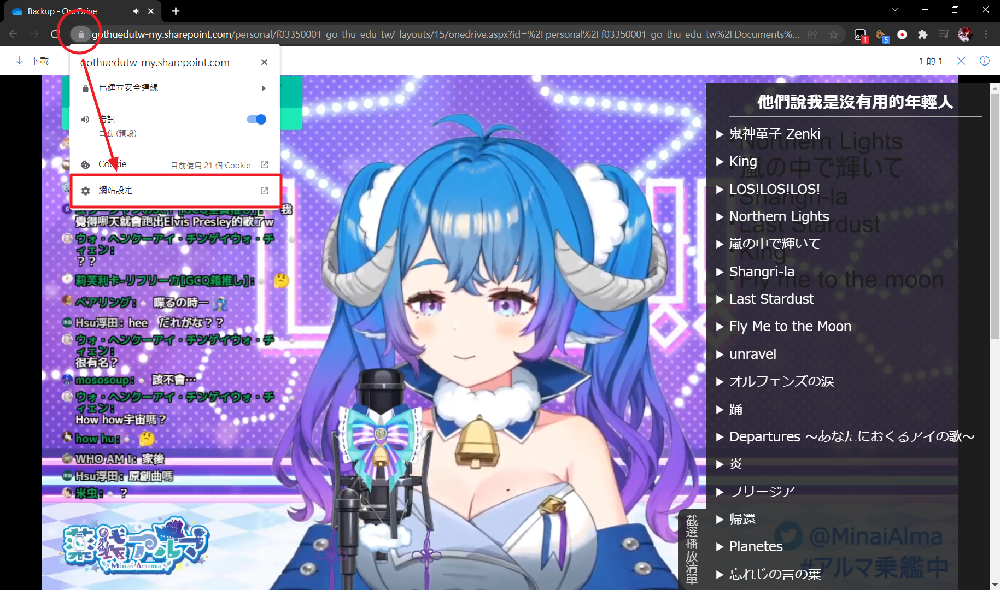
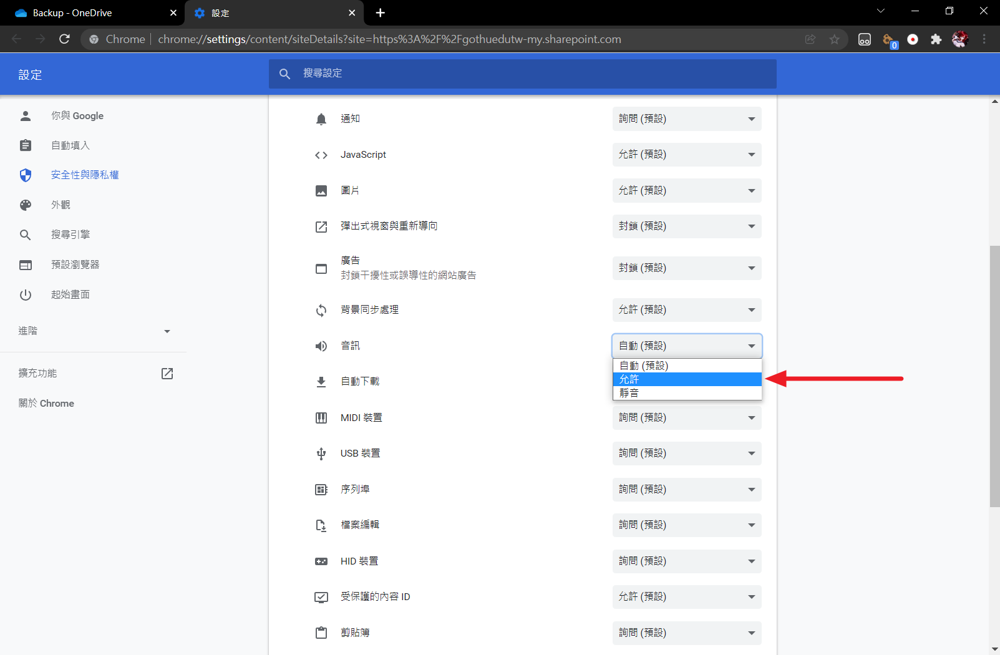
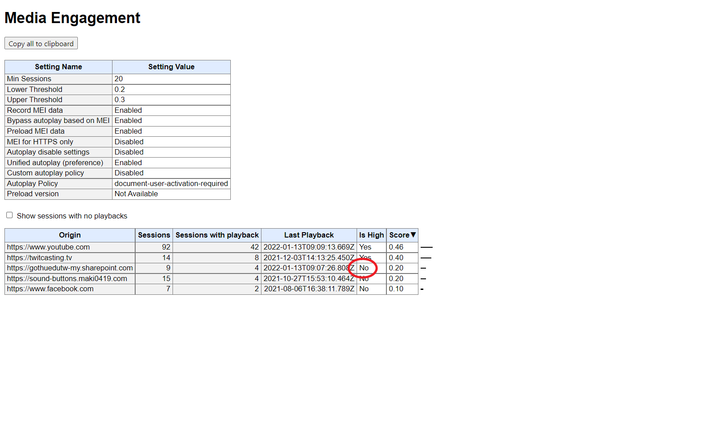
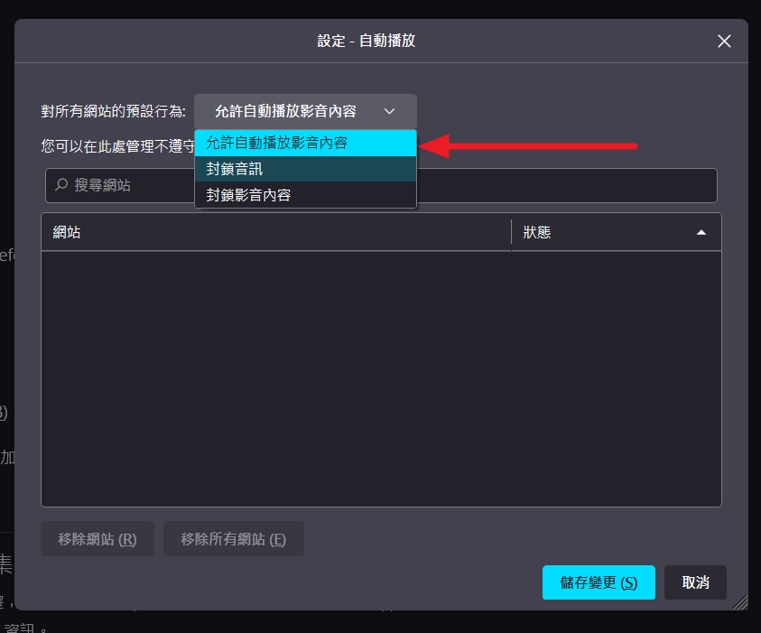
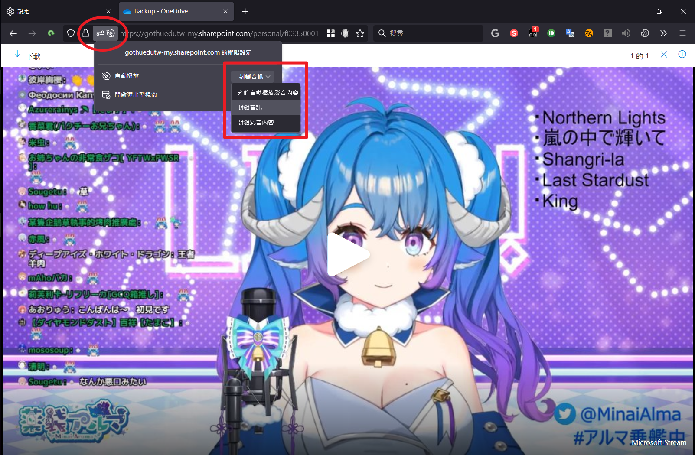
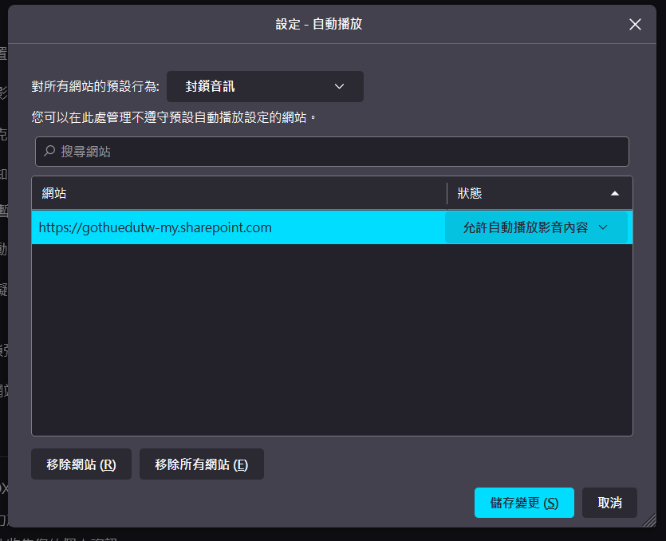

+++
title = "瀏覧器影音自動播放之研究手札 (Chrome、Firefox)"
description = "瀏覧器影音自動播放之研究手札 (Chrome、Firefox)"
date = 2022-01-29T19:25:00.053Z
updated = 2022-12-16T09:47:19.053Z
draft = false
aliases = [ "/2022/01/media-autoplay-on-browser.html" ]

[taxonomies]
tags = [ "JavaScript" ]

[extra]
card = "preview.png"
iscn = "iscn://likecoin-chain/bc90szsMlh6oskq44wAPlhoXk5Ja_s3HilwziYp5irM/1"
+++



我在做[影片截選播放清單](https://blog.maki0419.com/2020/12/userscript-youtube-clip-playlist.html)時，遇到播放時會停住的問題，並發現在各瀏覽器、各網站的表現不同，用戶回報給我的狀況也都不同。我對這件事做了些研究，並撰寫下此文記錄。為了改善用戶體驗，瀏覽器正朝著更嚴格的自動播放政策發展。它的目的是讓用戶對播放有更大的控制權，並 ([Chrome 稱](https://developer.chrome.com/blog/autoplay/#new-behaviors)) 讓有合法用途的出版商受益。

這篇文章會提及 Chrome、Firefox 的自動播放規則，身為**網站開發者**我們該怎麼處理前端；身為**用戶**我們該怎麼手動允許特定網站的自動播放。

## 「阻擋自動播放」行為的明確定義

**「自動播放 (Autoplay)」是指在用戶沒有明確要求開始播放的情況下，導致音頻開始播放的任何功能。** 這既包括 *使用 HTML 屬性來自動播放媒體* ，也包括在沒有互動就 *使用 JavaScript 程式開始播放。*

換句話說

- `<audio src="/music.mp3" autoplay>`
- `audioElement.play();`

都會被阻止。

具體來說，此規則套用在 HTML [<audio\>](https://developer.mozilla.org/en-US/docs/Web/HTML/Element/audio) 、[<video\>](https://developer.mozilla.org/en-US/docs/Web/HTML/Element/video) 、 元素，以及 [Web Audio API](https://developer.mozilla.org/en-US/docs/Web/API/Web%5FAudio%5FAPI)。

## Chrome 的自動播放規則

- 始終允許靜音影片的自動播放
- 在以下條件允許自動播放:
  - 使用者當前已經與該 domain 進行了互動、點擊
  - 在桌面裝置上，使用者的 Media Engagement Index 已經超過閾值，也代表用戶以前曾在此網站播放多次帶聲音的媒體
  - 在手機裝置上，使用者已將該網站加到他們的手機主畫面上，或在桌面裝置上安裝為 [PWA](https://developer.mozilla.org/zh-TW/docs/Web/Progressive%5Fweb%5Fapps)
- 使用者可以針對個別網站添加例外
- 上層可以將自動播放權限傳遞給他們的 iframe

### Media Engagement Index (MEI)


這東西是 Chrome 獨有的。Media Engagement Index 直譯是「媒體參與指數」，Chrome 會計算使用者對各網域的媒體互動程度，並以此評分。

算分數時有如下限制

- 媒體 (音頻、視頻) 的播放必須大於 7 秒
- 音頻必須存在並且沒有靜音
- 有影片的該頁籤是 active
- 影片的大小必須大於 200px \* 140px

簡單來說，你看越久影片，該網站分數就越高。而當它超過一定值，就會啟動自動播放。

Chrome 使用者可以訪問 `about://media-engagement` 查看自己的 MEI。

## Firefox 的自動播放規則 {#firefox}

Firefox 的自動播放預設為「封鎖音訊」，即允許靜音影片的自動播放。此跨站預設值可由使用者自行修改。

- 「封鎖音訊」:  允許靜音影片的自動播放，封鎖其它影片的自動播放，直到使用者當前已經與該 domain 進行了互動、點擊 (這是預設值)
- 「封鎖影音內容」: 封鎖所有影片的自動播放，即使它是靜音影片
- 「允許自動播放影音內容」: 字面意思，全面允許自動播放
- 使用者可以針對個別網站添加例外
- 上層可以將自動播放權限傳遞給他們的 iframe

## 我們開發者怎麼活 (╯°Д°)╯ ┻━┻

兩條路

- 靜音播放，並顯示按鈕要使用者手動按 unmute。這個「按按鈕」的行為是互動，會允許音頻播放。Facebook, Instagram, Twitter, YouTube 都是這麼做。

  ```html
  <video id="video" muted autoplay>
  <button id="unmuteButton"></button>
  
  <script>
    unmuteButton.addEventListener('click', function() {
      video.muted = false;
    });
  </script>
  ```

- 對 video 元素 play ()，並處理 fallback，請使用者手動點擊。  

  ```javascript
  var promise = document.querySelector('video').play();
 
  if (promise !== undefined) {
    promise.then(_ => {
      // Autoplay started!
    }).catch(error => {
      // Autoplay was prevented.
      // Show a "Play" button so that user can start playback.
    });
  }
  ```

> 延伸閱讀
>
> ---
> 請確認此章 Chrome 部落格給開發者的建議
>
> <https://developer.chrome.com/blog/autoplay/#best-practices-for-web-developers>
>
> 若你有用到 iframe，也注意一下 iframe-delegation 這個章節
>
> <https://developer.chrome.com/blog/autoplay/#iframe-delegation>

## 我們使用者怎麼活 ┬─┬ ノ (' - ' ノ)

### Chrome 的手動允許方法

#### 方法一

來到此頁面 `chrome://settings/content/sound` ，在最下方的「可以播放音效」添加要允許自動播放的網站

[](1.png)

#### 方法二

方法二結果同方法一，都學起來

直接打開目標網站，點擊網址列左側的小鎖頭  
(不要理會這裡的音訊開關，它沒用)

[](2.png)

在 siteDetails 頁往下捲，找到 🔊音訊 ，選擇 允許

[](3.png)

如此操作後，即使我在此站的 MEI 並未是 High，它仍能自動播放

[](4.png)

### Firefox 的手動允許方法

#### 調整預設設定

來到設定的「隱私與安全性」頁面 `about:preferences#privacy` ，下拉到「自動播放」，點右側「設定」

[](5.png)

在「對所有網站的預設行為:」下拉選單中，選中你想要的預設行為，三選項的[詳細意義見此](#firefox)

[](6.png)

#### 調整個別例外

如果你預設設定是選擇封鎖，可以再針對個別網頁設定例外。來到站點觸發一次阻擋 Autoplay，網址列左方會多一個「禁止播放」的符號，此時點它就能在下拉選單中設定自動播放的例外規則。

[](7.png)

如果你回到「隱私與安全性」這裡，下方可以管理所有允許過的例外規則。

[](8.png)

## 參考資料

- Allow or block media autoplay in Firefox | Firefox Help  
  <https://support.mozilla.org/en-US/kb/block-autoplay>

- Autoplay policy in Chrome - Chrome Developers  
  <https://developer.chrome.com/blog/autoplay/>

- Autoplay guide for media and Web Audio APIs - Web media technologies |  
  MDN  
  <https://developer.mozilla.org/en-US/docs/Web/Media/Autoplay%5Fguide>

## 附註

我在爬文時讀到下方這篇，其中關於 Chrome enterprise policy 的說明是錯誤的。

> Day20 Autoplay 與 mute - iT 邦幫忙
>
> <https://ithelp.ithome.com.tw/articles/10218679>

此處的 Policy 是指群組原則、Chrome 政策，而不是什麼特殊人與人關係。這是由企業管理員對網域內的電腦做 Chrome 原則設定。這和電腦沒加網域的一般使用者無關。

更多資訊請確認下方文件:

- Windows 版 Chrome 瀏覽器 (內部部署管理) - Google Chrome Enterprise說明  
  <https://support.google.com/chrome/a/topic/6242754>
- Autoplay policy in Chrome - Chrome Developers #Chrome enterprise  
  policies  
  <https://developer.chrome.com/blog/autoplay/#chrome-enterprise-policies>
