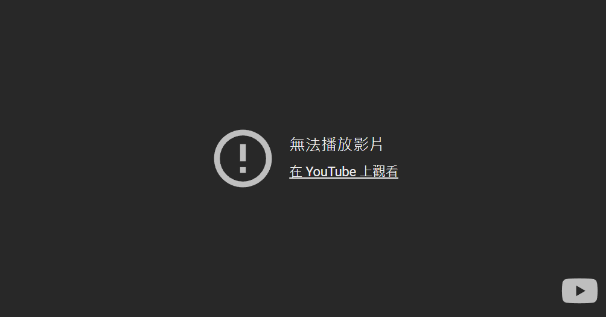
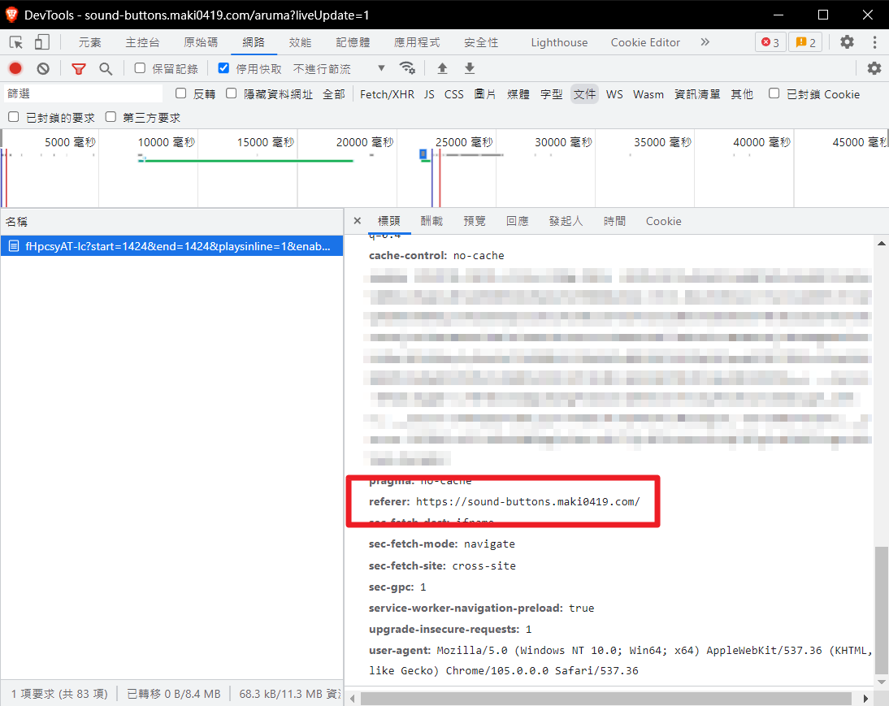

+++
title = "Youtube iframe 嵌入錯誤: 「無法播放影片 在 YouTube 上觀看」"
description = "「Video unavailable Watch on YouTube」Youtube iframe  嵌入「在某些影片」無法顯示，出現如圖的灰畫面。根據我的觀察，這些影片的共通點是「原影片有(音樂)版權宣告」。而且我在localhost開發是正常的，上到正式站台後才有問題。 "
date = 2022-09-24T23:47:00.021Z
updated = 2022-12-16T10:59:52.849Z
draft = false
aliases = [
  "/2022/09/youtube-iframe-embed-Video-unavailable-Watch-on-YouTube.html"
]

[taxonomies]
tags = [ "Azure", "Youtube" ]

[extra]
card = "preview.png"
iscn = "iscn://likecoin-chain/ri4TS9iFmP3Tzs_JyBE0vKXB5eQk6Nk7MJi7AAlqYeY/1"

  [extra.comments]
  id = "109456089331773003"
+++


> 這個錯誤的英文訊息為「Video unavailable Watch on YouTube」

## Youtube iframe嵌入錯誤: 「無法播放影片 在 YouTube 上觀看」

Youtube iframe 嵌入在「某些影片」無法顯示，出現如圖的灰畫面，這些影片的共通點是「原影片有(音樂)版權宣告」。

而且我在 `ng serve` 的 localhost 開發是正常的，部署到 **Azure Static Web Apps** 站台後才有問題。

這是我在做 [sound-buttons](https://github.com/jim60105/sound-buttons) 專案時遇到的問題，卡了我好幾個月無法解決。  
我一直以為這些影片就是被設定無法嵌入，直到我發現同一個影片別人的站台可以嵌入...只有我有問題？！

## 釐清問題

Youtube iframe 大概(?)會檢查 `referer` 標頭決定要不要理你，請確認以下幾點

* iframe 向 Youtube 取得文件的 request header 存在 `referer` 標頭
* request 是走 https
* `referer` header 內容  
  * 是 https 協定  
  * 和當前 **origin** 一致  
  * domain 不是 IP 型式，例如不能是 `https://23.123.123.123/`  
  * domain 可以被公開訪問，Youtube 可以找得到你 (除了 localhost 為特例)
* request parameters
  * `origin`: 和當前 **origin** 一致，[文件](https://developers.google.com/youtube/player%5Fparameters#origin)提到是用於 security measure
  * `widget_referrer`: 和當前 **href** 一致，[文件](https://developers.google.com/youtube/player%5Fparameters#widget%5Freferrer)提到是用於 Analytics

## 解決問題

[](referer.png)

我的狀況是缺少了 `referer` header。

一般來說瀏覧器的 Referrer-Policy 預設為 `strict-origin-when-cross-origin`，會送出 `referer` header 才對... 但我的網站「被」配置為了 `same-origin`。  
兇手除了 Azure Static Web Apps 站台還能是誰?

那麼解法也很明朗了，在 `index.html` 加上 `meta` tag:

```html
<meta name="referrer" content="strict-origin-when-cross-origin" />
```

> 
>
> ~~為什麼我寫「大概(?)」  
> 因為沒有錯誤訊息沒有文件沒有證據啊  
> 叫我通靈王啦~~
>
> [找到證據啦！](https://github.com/Azure/static-web-apps/issues/2#issuecomment-907507087)

## 參考文件

* [YouTube Embedded Players and Player Parameters | YouTube IFrame Player API | Google Developers](https://developers.google.com/youtube/player%5Fparameters)
* [Getting Video unavailable error on an embedded URL - YouTube Community](https://support.google.com/youtube/thread/20562339/getting-video-unavailable-error-on-an-embedded-url)
* [javascript - Embedded YouTube video doesn't work on local server - Stack Overflow](https://stackoverflow.com/a/56419165)
