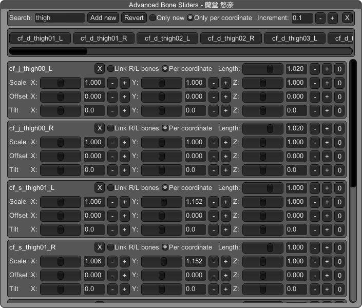

+++
title = "[Koikatu] コイカツ！ ( Koikatu / Koikatsu / 戀愛活動 ) 教你做絕領咬肉肥腿腿！"
description = "此方法使用ABMX插件，快速的教你如何製作圖中的咬肉效果"
date = 2020-09-12T12:50:00.014Z
updated = 2021-10-31T11:05:44.762Z
draft = false
aliases = [ "/2020/09/koikatu-abmx-zettai-ryoiki.html" ]

[taxonomies]
tags = [ "Koikatu" ]
licenses = [ "GFDL 1.3" ]

[extra]
banner = "preview.JPG"
+++
此方法使用 [ABMX 插件](https://github.com/ManlyMarco/KKABMX/releases)，快速的教你如何製作圖中的效果

<!-- more -->

因為可以做出此效果的 Bone，其相對於襪子的高度是固定的，只有一部份的襪子能吻合  
在開始調整前必須先換上可對應的過膝襪，包括但不限於圖中這雙

在角色編輯器的右下角打開 Advanced Bonemod Window

在 ① 處鍵入關鍵字，此處輸入 `j_thigh`、`s_thigh` 做過濾，**在 ② 點擊**我們要修改的大腿項

③ 處可以關聯左右對應的骨骼，例如此處是指左右腿

**在修改數值前將 ④ 處勾選**，這會讓設定獨立於其它的服裝  
舉例: 在校內服裝做此設定，由校內切換到泳裝時她的腿會回到原始設定，當然也可以在每一套設定不同的數值

在此附上一份我使用的腿腿

|||
| --------------------------- | --------------------------- |
|  |  |

以上數值供參，創造你自己的咬肉腿腿吧!

