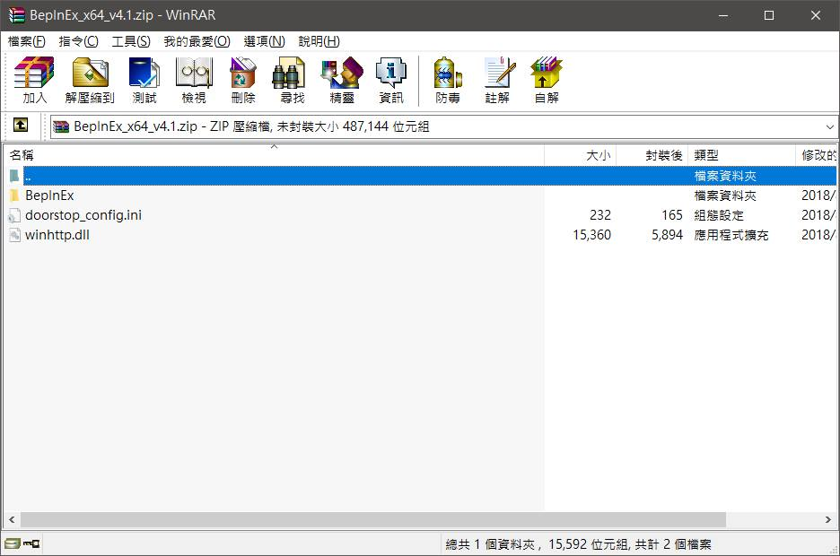
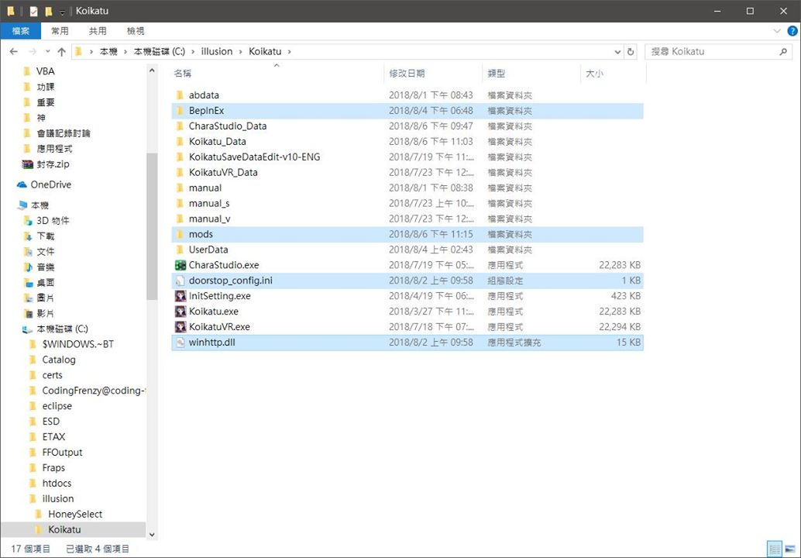
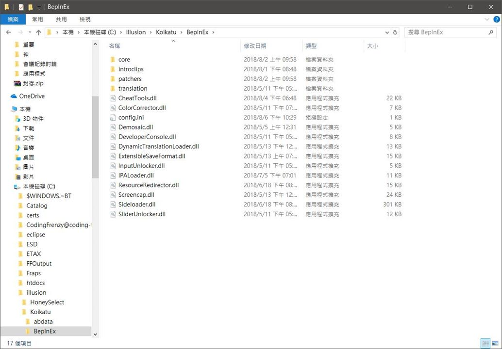
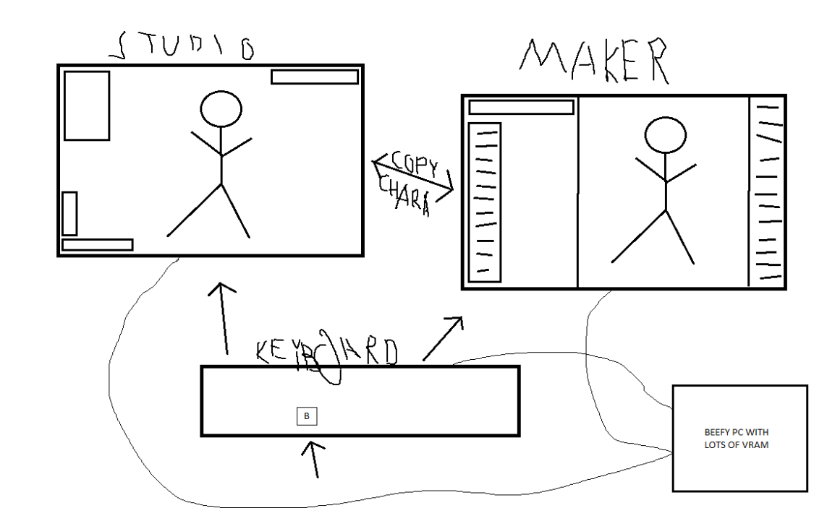
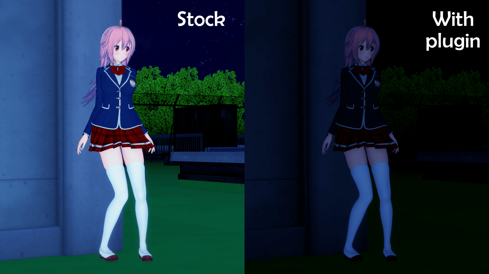
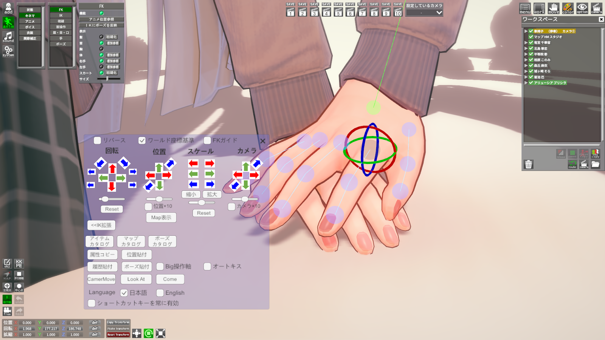

+++
title = "[封存][Koikatu][BepInEx v4.X] コイカツ！ ( Koikatu / Koikatsu / 戀愛活動 ) 主程式 + mod + plugin 安裝指南"
description = "[封存][Koikatu][BepInEx v4.X] コイカツ！ ( Koikatu / Koikatsu / 戀愛活動 ) 主程式 + mod + plugin 安裝指南"
date = 2018-10-31T10:04:00.023Z
updated = 2019-10-24T05:41:59.260Z
draft = false
aliases = [ "/2018/10/koikatu-bep4-plugin-guide.html" ]

[taxonomies]
tags = [ "Koikatu" ]

[extra]
banner = "preview.jpg"
archive = """
這篇指南是BepInEx v4.X的最後版本  
資料已過時, 僅留給考古學家參考  
請前往[對應BepInEx v5.X之安裝指南](/Koikatu/bep5-plugin-guide)"""
+++
文章最後更新時間: 2019/10/24  

<figure>
{{ image(url="preview.jpg") }}
<figcaption>Amazon JP直送¥18369，真香</figcaption>
</figure>

## 簡單說一下Koikatu怎麼裝起來，首先你要找齊這些東西
<!-- more -->
* 主程式 + 付費DLC: [官方DL版](https://dlshop.illu-member.jp/products/detail.php?product%5Fid=201) (下載版、數位版)  
  內含:  
  * コイカツ!(DL版)  
  * コイカツ!-性格追加パック-(DL版)  
  * コイカツ!アフタースクール(DL版)  
  2020/07/19網友回報 下載不需要日本IP

> 至於Steam上的Koikatsu Party....
>
> 只要它的主程式和Koikatu不相同，我就會要你把它丟進垃圾桶因為以下的東西94.87%你都裝不上去

* 免費DLC (一定要裝，否則插件會出問題):  
  分流: [https://mega.nz/#F!G5hXmbAb!ZjVPbbnuQlURe9UgGFGz1g](https://mega.nz/#F!G5hXmbAb!ZjVPbbnuQlURe9UgGFGz1g)  
  官網: <http://www.illusion.jp/preview/koikatu/download/update.php>  
  使用方法，圖片點擊放大  
  
  {{ image(url="UNInhXC.jpg") }}

  下載koikatu\_02plus\_cdp0201hbtks\_all ，有玩VR再多下載koikatu\_03vr\_d0111  
  將來如果有其他更新包，可只下載sub來增加
* 其他官方特典包: 必須要安裝Darkness  
  (補充: 性格追加パック內附的泳裝有包含在免費更新中，並不算是特典)
  * コイカツ！ (Koikatu!) 相關特典
    * コイカツ！ オフィシャル予約特典 軍服 (軍服)
    * コイカツ！ オフィシャル早期予約特典 セクシーランジェリー (貓咪內衣)
    * コイカツ！ 予約特典 魔法少女衣装データ (魔法少女)
    * コイカツ！ 数量限定特典 ハイクオリティメイド衣装データ (妹抖服)
    * コイカツ！ ソフマップ限定予約特典 キュートナース衣装データ (護士服)
    * 同梱特典 挿入歌「青空アドベンチャー」マキシシングル／榊原ゆい (音樂)
  * コイカツ！ アフタースクール (Koikatu! After School) 相關特典
    * 予約特典 和メイド衣装セット (和衣裝)
    * オフィシャル早期予約特典 裸エプロン (裸體圍裙)
    * オフィシャル予約特典 キャビンアテンダント (乘務員服)
    * パッケージ版購入特典 「RunningDreamer」マキシシングル／民安ともえ (音樂)
  * エモーション・クリエイターズ (Emotion Creators) 相關特典
    * オフィシャル 予約特典 セクシーセーター (開背毛衣)
    * オフィシャル 早期予約特典 マイクロビキニ (小比基尼)
    * コイカツ！ ダークネス (Koikatu! Darkness)
    * コイカツ！ 追加性格＋コンバートセット (几帳面+一堆新服裝)
    * チャイナ服追加データセット (旗袍，這個一起打包在コンバートセット裡面)

> 安裝注意: Darkness必須要最後安裝，且Darkness被諸多插件列為依賴  
  意即若未安裝Darkness，插件會無法正常運作

## 有上面這些就可以普通遊玩了，以下講必裝外掛

* [BepInEx\_v4.1.2](https://github.com/BepInEx/BepInEx/releases/tag/v4.1.1): 這是最基礎的外掛，有了它其他東西才會生效  
  這裡下載BepInEx\_x64\_v4.1.2.zip回來，把三個東西丟進遊戲目錄  
  然後在遊戲目錄新增一個資料夾叫做 "mods" 裡面放sideloader mod  
    
  
  
* [BepisPlugins.r11.2.1](https://github.com/bbepis/BepisPlugins/releases/tag/r11.2.1): 搭配上面這個外掛的基礎外掛包  
  載回來以後整個丟進BepInEx資料夾  
  
* 國外Discord群整理好的sideload mod包: [Sideloader modpack](https://mega.nz/#F!upYGBTAZ!S1lMalC33LYEditk7GwzgQ!G9JFwCBL)  
  整個載下來丟進mods資料夾  
  裡面的zipmod壓縮檔不要解開，像圖右打開有個manifest.xml的就是  
  直接放置如圖左，可使用子資料夾  
  
  sideloader modpack裡所有mod全部都是sideloader mod(又稱zipmod)，他可以是「.zipmod」和「.zip」格式，並可以被各種壓縮軟體打開  
  如果這個檔案裡包含了manifest.xml，則他就是一個zipmod，把他放到mods文件夾下  
  如果沒有則說明他是一個hardmod，建議把他丟了，或是去研究一下怎麼把他轉成zipmod  
    
    
  
* 立體步兵補丁: 騎兵有馬，步兵(ry)。最新的外掛可以對不同角色使用不同的模組
   1. 下載[KKAPI.dll](https://github.com/ManlyMarco/KKAPI/releases/tag/v1.5.1) ，丟進「BepInEx」資料夾底下  
   (MakerAPI.dll已經過時，立刻給我把他丟了)
   2. 下載[KK\_UncensorSelector.zip](https://github.com/DeathWeasel1337/KK%5FPlugins/releases/tag/v97) ，解壓縮  
   將「KK\_UncensorSelector.dll」丟進「BepInEx」資料夾底下  
   將「KK\_UncensorSelector Base.zipmod」丟進「mods」資料夾底下
   3. 把這些都下載下來，丟進「mods」資料夾底下: <https://mega.nz/#F!upYGBTAZ!S1lMalC33LYEditk7GwzgQ!S0IzlILZ>
   4. 在CharaMaker裡的「身體>全體」選單下方可以選擇模組，設定完記得儲存卡片  
   
   5. 在F1裡可以設定「當角色Uncensor未設定」時要顯示的預設模組，也可以選擇「隨機」選項  
   

## 以下外掛皆可選，除了特別標註的以外，基本上可以全塞  

注意: 所有版本號以對應Darkness程式為基準  

* [jim60105/KK](https://github.com/jim60105/KK) ~~首先，我要安麗我自己寫的東西ww~~
  * [Koikatu StudioCoordinateLoadOption v3.0.2](@/Koikatu/coordinate-load-option/index.md) Studio載入服裝卡片時，可以選擇要載入的細項，包括飾品個別選擇  
   
  * [Koikatu StudioAllGirlsPlugin v1.3.1](@/Koikatu/studio-transgender-loading/index.md) 這會將Studio SceneData內所有男性以女性讀入，實現跨性別替換角色功能  
   
  * [Koikatu StudioSimpleColorOnGirls v1.0.4](@/Koikatu/studio-simple-color-on-girls/index.md) 使女性支持單色化功能，用意在於彌補全女插件所造成的限制  
   
  * [Koikatu StudioCharaOnlyLoadBody v1.3.4](@/Koikatu/studio-chara-only-load-body/index.md) 保留衣服和飾品，只替換人物  
   
  * [Koikatu StudioReflectFKFix v1.0.2](@/Koikatu/studio-reflect-fk-fix/index.md) 改造了「IK→FK」按鈕的功能，並增加了一個複製當前脖子方向到FK「→FK(首)」的功能
  * [Koikatu StudioTextPlugin v1.1.0](@/Koikatu/studio-text-plugin/index.md) 在Studio內添加文字物件
  * [Koikatu StudioAutoCloseLoadingSceneWindow v1.0.0](@/Koikatu/studio-auto-close-loading-scene-window/index.md) Studio Load Scene視窗處，在Import或Load後自動關閉視窗  
   
* [KKAPI v1.5.1](https://github.com/ManlyMarco/KKAPI/releases/tag/v1.5.1) 先裝這個再裝下面幾個常用MOD  
  (MakerAPI.dll已經過時，立刻給我把他丟了)
  * [Koikatsu ABMX V3.3](https://github.com/ManlyMarco/KKABMX/releases/tag/v3.3) 增加更多的捏角選項
  * [Koikatsu Overlay Mods v5.0.2](https://www.patreon.com/posts/28914300) 在身體、衣服、眼睛上套用圖片，做客制化服裝者之必備插件
  * [KK\_SkinEffects v1.6.3](https://github.com/ManlyMarco/KK%5FSkinEffects/releases/tag/v1.6.3) 增加幾個皮膚上效果(流汗、流水、流血)，需要KKAPI版本1.3.2、Overlay Mods v4.2.2
  * [Koikatsu: Become Trap v2.0](https://github.com/ManlyMarco/KK%5FBecomeTrap/releases/tag/v2.0) 讓男角變成偽娘，本篇遊戲裡的角色互動會變不同，詳見網頁說明
  * [KK\_Pregnancy v1.1.2](https://www.patreon.com/posts/28537409) 懷♀孕mod，需要KKAPI v1.3.6.1和 KKABMX v3.2.3
  * [Koikatu HeightBar v3.1](https://github.com/ManlyMarco/KK%5FHeightBar/releases/tag/v3.1) CharaMaker中顯示換算的實際身高(多少cm)，僅供參考
  * [Koikatu ClothingStateMenu v2.3.1](https://github.com/ManlyMarco/KK%5FClothingStateMenu/releases/tag/v2.3.1) 遊戲中新增服裝狀態操作選單，可以半脫，CharaMaker右下角可以勾選開閉功能，需要Koikatu More\_Accessories\_v1.0.3
  * [KK\_QuickAccessBox v2.0](https://www.patreon.com/posts/30932746) Studio中可以用關鍵字快速檢索item，Left Control + Space打開介面(可至F1更改熱鍵設定)([縮圖產生說明](https://github.com/ManlyMarco/KK%5FQuickAccessBox#how-to-add-thumbnails-for-your-items))
* [Keelhauled/KoikatuPlugins](https://github.com/Keelhauled/KoikatuPlugins/releases/tag/2019-08-09)
  * CharaStateX 讓Studio裡某些物件可以同時編輯，用Shift/Ctrl選擇複數個人物，然後就可以同時加載姿勢、改眨眼狀態、更改動畫、更改服裝狀態、更改關節補強等等(這些舉例是原說明的描述)
  * DefaultParamEditor 儲存預設環境/角色參數，普通的設定好以後到設定裡面做儲存，下次開程式就會直接載入該設定
  * GraphicsSettings 開啟更多的詳細畫面設定
  * HideAllUI 隱藏UI介面(預設:空白鍵)，和HideHInterface、Specter衝突，若不使用Specter就選這個，反之選另兩個
  * LockOnPluginKK 鏡頭追尾外掛
  * MakerBridge 使用快捷鍵(B)將選擇的角色從CharaMaker送到Studio，或是反之。附上作者畫的圖  
   
  * TitleShortcuts 新增主選單快捷
  * UnlockHPositions 不需要存檔直接開啟所有H姿勢
* [DeathWeasel1337/KK\_Plugins](https://github.com/DeathWeasel1337/KK%5FPlugins#kk%5Fplugins)  
  * [CharaMakerLoadedSound v1.0](https://github.com/DeathWeasel1337/KK%5FPlugins/releases/tag/v1) 載入完成時跳音效  
  * [StudioSceneLoadedSound v1.0](https://github.com/DeathWeasel1337/KK%5FPlugins/releases/tag/v1) 載入完成時跳音效  
  * [ForceHighPoly v1.2](https://github.com/DeathWeasel1337/KK%5FPlugins/releases/tag/v70) 強制遊戲全程使用高模。增加模型精細度，但是同時增加運行附載  
   ※正篇遊戲也會強制高模，注意電腦附載※  
  * [GUIDMigration v1.5.4](https://github.com/DeathWeasel1337/KK%5FPlugins/releases/tag/v110) 讓你更新mod的時候避免舊卡片跑掉  
  * [ReloadCharaListOnChange v1.5.1](https://github.com/DeathWeasel1337/KK%5FPlugins/releases/tag/v91) 在角色卡/衣服卡變更的時候重整遊戲內瀏覽器  
  * [InvisibleBody v1.3](https://www.patreon.com/posts/28424780) 讓人透明，用來顯示沒人穿的衣服、配件，可以隨著存檔儲存隱形狀態  
  * [InputHotkeyBlock v1.2](https://www.patreon.com/posts/29761547) 打字時不會觸發快捷鍵  
  * [UncensorSelector v3.7](https://github.com/DeathWeasel1337/KK%5FPlugins/releases/tag/v97) 前面裝過的步兵外掛，可以為不同的角色選擇不同的步兵補丁  
  * [Subtitles v1.4](https://www.patreon.com/posts/27699376) H場景和說話場景顯示字幕  
  * ~~[AnimationController v2.1](https://github.com/DeathWeasel1337/KK%5FPlugins/releases/tag/v57) 可以把IK節點綁定到運動物體，讓角色做非預設的動作，需要KKAPI v1.2~~ 建議改用NodeConstraints  
  * [ClothingUnlocker v1.1](https://github.com/DeathWeasel1337/KK%5FPlugins/releases/tag/v62) 讓衣服男女通穿  
  * [EyeShaking v1.0](https://github.com/DeathWeasel1337/KK%5FPlugins/releases/tag/v38) 處女H中會視線顫抖，需要KKAPI  
  * [RandomCharacterGenerator v1.0](https://github.com/DeathWeasel1337/KK%5FPlugins/releases/tag/v47) 在CharaMaker中，可以產生隨機角色，需要KKAPI  
  * [PoseFolders v1.0](https://www.patreon.com/posts/31127973) 只要在「userdata/studio/pose」內新增資料夾，並把pose檔放進去，就會以資料夾顯示在Studio的Pose讀取清單  
  * [TranslationSync v1.2](https://github.com/DeathWeasel1337/KK%5FPlugins/releases/tag/v61) 將翻譯插件([Koikatsu Translation](https://github.com/DeathWeasel1337/Koikatsu-Translations) project)進行正確格式化的插件，只有翻譯者會需要這個  
  * [ListOverride v1.0](https://github.com/DeathWeasel1337/KK%5FPlugins/releases/tag/v65) 覆蓋官方列表文件，像是可以為一些官方連褲襪提供半脫狀態  
  * [HairAccessoryCustomizer v1.1.2](https://www.patreon.com/posts/27712341) CharaMaker的頭髮飾品處，新增更多方便的調整功能，需要KKAPI v1.3、MoreAccessories 1.0.4  
  * [FreeHRandom v1.1.1](https://github.com/DeathWeasel1337/KK%5FPlugins/releases/tag/v91) 在Free H選項那裏新增隨機挑選按鈕  
  * [Colliders v1.0](https://github.com/DeathWeasel1337/KK%5FPlugins/releases/tag/v37) 對地板、奶子、手和裙子添加碰撞器，需要KKAPI，取代Koikatu Atari  
  * [MaterialEditor v1.5.1](https://github.com/DeathWeasel1337/KK%5FPlugins/releases/tag/v109) 讓你可以編輯模型材質的細部屬性  
  * [MaleJuice v1.1](https://www.patreon.com/posts/28608195) 你現在也可以在H和Studio中讓男孩子髒髒  
  * [StudioObjectMoveHotkeys v1.0](https://www.patreon.com/posts/28743884) 以快捷鍵在Studio內移動物品，使用Y/U/I改變X/Y/Z軸數值，縮放時按T同時變更三軸  
  * [FKIK v1.1](https://www.patreon.com/posts/29928651) 可以同時啟動一部份的FK和IK，需要KKAPI v1.5.1  
  * \~實驗性功能\~  
    * [ANIMATIONOVERDRIVE v1.0](https://github.com/DeathWeasel1337/KK%5FPlugins/releases/tag/v42) Studio裡的動作速度輸入框，支援輸入小於9999999的數字  
    * [HCharaAdjustment v1.0](https://github.com/DeathWeasel1337/KK%5FPlugins/releases/tag/v46) H中透過快捷鍵改變女角位置，使用「POILKJMNB」九鍵調整([詳細](https://github.com/DeathWeasel1337/KK%5FPlugins/blob/master/KK%5FHCharaAdjustment/KK%5FHCharaAdjustment.cs#L40))
* [Koikatu VN\_Game\_Engine(VNGE) v13.1](https://mega.nz/#F!oiB2wAQK!ojGIzlAN-1B-263uUDEalQ?43ZCBSSa) VN引擎，用來做文字選項遊戲，也可以透過他寫很多Script，超她媽強大的東西。以下外掛建立在他之上:
  * [Scene Save State 7.6](https://mega.nz/#F!oiB2wAQK!ojGIzlAN-1B-263uUDEalQ?xqpQHCLA) ([使用教學](https://mega.nz/#F!U2wADQRD!7Qzfk4D3qoU%5FZ0P26cgLLg))在Scene裡儲存角色狀態，讓你不需要放一大堆人物，改而用同一個人物去改變動作、位置等，以減輕Scene的負擔。3.0版起可以在Studio內簡單改變角色的身體外觀，如身高、頭尺寸、胸尺寸等
  * [Auto Chara Moments 3.1](https://mega.nz/#F!oiB2wAQK!ojGIzlAN-1B-263uUDEalQ?UzITQATA) 自動為選擇的角色卡&複數場景卡拍攝截圖，使用安裝教學詳見內文
* [KoikatuFixes v1.2](https://github.com/IllusionMods/IllusionFixes/releases/tag/v1.2)
  * CharacterListOptimizations CharacterList效能優化
  * CenteredHSceneCursor 修正H介面的游標沒有對準中央的問題
  * ExpandShaderDropdown 修正ShaderDropdown往上跑的問題
  * MainGameOptimizations 主遊戲效能優化
  * MakerOptimizations 角色編輯器效能優化
  * ModdedHeadEyeliner 讓非官方頭型正常顯示
  * NullChecks 移除程式內的部分錯誤Null值(頭部飾品相關)
  * PartyCardCompatibility 讓Koikatu Party產生的存檔可以在其他版本讀取
  * PersonalityCorrector 角色卡用到沒有的性格時自動修正防止崩潰，記得在教室加新同學的時候檢查一下性格
  * PoseLoad 修正Koikatsu中加載Honey Select姿勢時產生的錯誤(FK右手腕等)
  * ResourceUnloadOptimizations 大幅度減少Studio Scene讀取時間，增進校園模式載入效能
  * SettingsVerifier 啟動時檢查遊戲啟動器設定(分辨率、全螢幕/視窗化等)
  * ShowerAccessories 在淋浴間偷窺時不再移除主要飾品，很適用在使用飾品拼湊頭髮的角色
  * UnlimitedMapLights 解除Studio中只能使用三個地圖光的限制，但並非所有物品都支援三個以上的光源
* [Koikatu More\_Accessories\_v1.0.5](https://www.patreon.com/posts/27384738) 增加無限多的裝飾品洞，需要Darkness特典
* [KK\_MoreAccessoryParents v1.0](https://www.patreon.com/posts/kk-v1-0-24129495) 更多的裝飾品安裝基準點，需要上面的More\_Accessories
* [Koikatu KKUS\_v1.0.0](https://www.patreon.com/posts/kk-kkus-1-0-0-22881567) 在Studio增加數個功能
* [Koikatu KKPE\_v1.2.0](https://www.patreon.com/posts/26165956) CharaStudio內透過選單調整IK，三軸移動不會再因為旋轉而歪掉了 (簡單來說就是更好擺姿勢)  
※已知會導致某些SceneData無法讀取，其徵狀為「讀取中程式直接閃退」※
* [Koikatu Expression\_Control\_v0.2.2](https://ux.getuploader.com/56e4%5FxXVv/download/92) 按L快速調整角色表情 (這是IPA插件)
* [Koikatu Bra\_Push-Up\_Mod\_v0.2.0](https://ux.getuploader.com/56e4%5FxXVv/download/75) 穿奶罩時會把奶子往內擠一些，奶罩不是裝飾品惹 (這是IPA插件)
* [Koikatu HeadUtl 0.2.1](https://ux.getuploader.com/56e4%5FxXVv/download/87) H場景第一人稱視角，注意閱讀Readme文件，快捷鍵描述在裡面 (這是IPA插件)
* [KK\_ClothesLoadOption v 0.2.1](https://ux.getuploader.com/56e4%5FxXVv/download/91) CharaMaker載入服裝卡片時，可以選擇要載入的細項
* [KK\_HCtrl 0.1.0](https://ux.getuploader.com/56e4%5FxXVv/download/90) 自動H插件，解放你的雙手
* [KK\_GaugeSlider 0.2.2](https://ux.getuploader.com/56e4%5FxXVv/download/81) 讓以下幾個數值可編輯: 移動中的主角狀態、移動/對話場景的H感度、H時的男\\女感度 (這是IPA插件)
* [KK\_Crawl 0.0.1](https://ux.getuploader.com/56e4%5FxXVv/download/76) 主遊戲移動場景的第一人稱視角插件，快捷鍵見Readme (這是IPA插件)
* [KK\_DisableKinematicsOnChangeAnime 0.0.0](https://ux.getuploader.com/56e4%5FxXVv/download/89) 在Studio選擇Anime動作時，自動disable IK和FK
* [Koikatu BrowserFolders v1.3](https://www.patreon.com/posts/24997113) 讓選擇器支援子資料夾讀取
* [IllusionDragAndDrop.Koikatu 2019-08-05](https://github.com/Keelhauled/IllusionDragAndDrop/releases/tag/2019-08-05) 在載入圖檔時可以用視窗外拖曳檔案的方式。支援在Studio、Maker、FreeH、Stage拖入角色卡、場景卡、衣裝卡；支援Studio拖入Pose存檔；支援KK\_Party(Steam)
* [Koikatu Mod\_Discover\_v1.0](http://www.mediafire.com/file/fo8wvaxmb95ngy7/Koikatu%5FMod%5FDiscover%5Fv1.0.rar/file) 在角色編輯器內時，按F12顯示當前使用到的mod，要發布chara的人必裝
* [Koikatu Image\_Series\_Recorder\_v1.0](https://www.patreon.com/posts/22927657) 按Left Shift + R打開視窗，連續拍圖功能，用來製作GIF用  
※小心使用，用高設定值會直接讓電腦當機※
* [KK\_NightDarkener v1.1.1](https://github.com/ManlyMarco/Koikatu-Gameplay-Mod/releases/tag/v1.4.2) 讓夜晚濾鏡變得更黑  

* [Koikatu Gameplay Mod v1.4.2](https://github.com/ManlyMarco/Koikatu-Gameplay-Mod/releases/tag/v1.4.2) 對主遊戲增加一些功能
* [KK\_OrthographicCamera v1.0](https://github.com/ManlyMarco/Koikatu-Gameplay-Mod/releases/tag/o1.0) 按鍵I切換至平行視角相機
* [Koikatu Gampad Support v1.0.1](https://github.com/ManlyMarco/KK%5FGamepadSupport/releases/tag/v1.0.1) 添加搖桿支持
* [Koikatu JannieReplacer v1.4](https://github.com/Kokaiinum/JannieReplacer/releases/tag/1.4) 可以把Darkness裡的校工換掉，在F1裡頭設定
* [Better Color Picker v1.0.1](https://github.com/ManlyMarco/KK%5FBetterColorPicker/releases/tag/v1.0.1) 顏色設定時，選取調色盤外的顏色，可以直接去點其他衣服部位做同步
* [Koikatu! Trainer and Debugging Tools v2.6](https://github.com/ManlyMarco/KoikatuCheatTools/releases/tag/v2.6) 遊戲作弊器，裡面有解鎖FreeH所有體位，及解鎖婚禮所有性格的功能，快捷是Pause鍵(Plugin開發者的好幫手)，需要額外安裝[Runtime Unity Editor v1.9](https://github.com/ManlyMarco/RuntimeUnityEditor/releases/tag/v1.9)
* [Koikatu VMDPlay\_v0.0.14](https://mega.nz/#!9AQylI7Z!FWeRrkve%5FAsgSNqivL5I4Frq-sBcRCS7te5tPXVxc8I) 可以在Studio內撥放MMD的VMD動作檔、相機檔、放音樂，Ctrl+Shift+V開啟視窗  
(將config.ini中的CacheGagEyesTexture設為False，否則眼睛載入會有問題)
* [Koikatu 100% SaveData](http://www.mediafire.com/file/wqmi262icfp1q1v/Koikatu%5F-%5F100%2525%5FSave.rar/file) 100%存檔，覆蓋注意
* [KoikatuSaveDataEdit-v16](https://github.com/kiletw/KoikatuSaveDataEdit/releases) 主遊戲存檔修改器
* [KoikatuCharaReader](https://cdn.discordapp.com/attachments/519705409486061588/520094678864101398/KoikatuCharaReader.rar) Scene中Chara之提取器
* [KKキャラ抽出改変 ver1.1](https://drive.google.com/file/d/1UN80tl9x0BLmXu9va4ZTIxtddX6VhmNQ/view?usp=sharing) Scene中Chara之複數提取器，是上面的進階版 ([原始連結](http://uppervolta-3d.net/illu/upload.php?id=0082)似乎死了)
* [Koikatu KKManager v0.7.0](https://www.patreon.com/posts/kkmanager-v0-7-0-29189588) Koikatu的人物卡和mod管理器，支援sideloader mod的自動更新
* [KK\_UniformUniforms v1.0](https://github.com/cptgrey/KK%5FUniformUniforms/releases/tag/v1.0) 本篇遊戲內的人物制服更換器，一鍵幫大家穿校服
* [Koikatu Fashion Sense v2.1](https://github.com/FairBear/AYCABTM/wiki) 在遊戲中，角色可以在進入指定的位置後隨機更換服裝、髮型，詳見連結內Wiki
* [KK\_CrossEye 1.5](https://github.com/Mantas-2155X/KK%5FCrossEye/releases/tag/1.5) 交叉眼睛注視略為錯位的兩個畫面，顯示3D效果
* [KK\_HCameraLight 1.2](https://github.com/Mantas-2155X/KK%5FHCameraLight/releases/tag/1.2) H介面固定燈光方向(原始的燈光會跟著相機轉，永遠看不到背光面)
* ~~[KK\_DynamicBoneUpdateRate 2.0](https://github.com/Mantas-2155X/KK%5FDynamicBoneUpdateRate) 修改動態骨骼的模型更新頻率，能某種程度的消除裙子抽動現象~~，作者說有Bug待修
* [KK\_Archetypes v1.0.1](https://github.com/cptgrey/KK%5FArchetypes/releases/latest) 將不同的角色部位加入最愛，並將它們重新組合成新角色
* [KK\_ExperienceLogic 1.0.1](https://github.com/ManlyMarco/KK%5FExperienceLogic/releases/tag/v1.0.1) 妹子只要被幹過其中一個洞，就會成為「有經驗」的狀態
* [Koikatu HideHInterface v1.1](https://github.com/Kokaiinum/HideHInterface/releases/tag/v1.1) 隱藏H Scene的UI介面(預設:空白鍵)，和HideAllUI衝突
* [KK\_RemoveToRecycleBin v1.0](https://www.patreon.com/posts/26336449) 遊戲內刪除\\覆蓋角色卡、服裝卡、場景卡時會送入資源回收桶，避免瞬間丟失數據
* [MinUnity3D](https://github.com/kkdevs/MinUnity3D/releases) 用這工具可以大幅降低整體檔案大小還有RAM的消耗量
* [Unity3D file compression script](https://www.patreon.com/posts/unity3d-file-28988648) 此工具功能同上者，注意閱讀使用說明
* [KK\_NodesConstraints 1.0.1](https://www.patreon.com/posts/26357789) 允許使用者將原本無法連結的物體連結在一起([詳細說明](https://www.patreon.com/posts/26326273))
* [Koikatu Specter\_v0.12](http://cactus-cafe.blog.jp/archives/1074437165.html) 一堆好功能的集合體，點擊文章上方的ux.getuploader.com網址進入下載倉庫，遊戲內按U顯示設定菜單
  * Studio
    * 空白鍵: UI的顯示/隱藏，和HideAllUI鍵位衝突，若要使用Specter就選這個+HideHInterface，反之選HideAllUI
    * F12: 將畫面順時針轉90度
    * 左Shift+F12: 將畫面逆時針轉90度
    * 左Shift+F11: 除了普通截圖以外，再多拍一張包含UI的截圖 此快捷跟BepisPlugins裡的Screencap之快捷衝突
    * Item的檢索和讀取，要增加物品時如果知道名字就不用去清單裡找了
    * 更多Studio特效調整
    * 鏡頭自動操作，畫面會盯著角色隨機轉圈
    * ~~透明人~~ 建議用DeathWeasel1337/KK\_InvisibleBody替代
    * 從URL讀取外部Scene
    * ~~乳尻碰撞器，取代Added\_Dynamic\_Bone\_Collider(AddDBCollider)，可以用其他物件去瞧奶子的形狀~~，建議改用KKPE Advanced mode功能取代之
    * Lanove機能，用來做視覺小說，詳見: <http://cactus-cafe.blog.jp/archives/1073647491.html>
    * 可以保存/加載Effect設置和Object操作內容
    * 背景、圖框清單的實時更新
    * 添加了在開始遊戲後更改視窗大小(解析度)的功能
    * 將角色燈光和標準燈光(地圖燈光)統合，功能默認關閉
    * 右下角顯示一個大的操作盤
    * 複製功能動作後，會自動選取到新複製出來的東西
  * 本篇遊戲
    * 對話回數無制限化
    * 狀態上升點(某種程度的)使用無制限化 (用一用偶爾狀態點會消失，不過作者說他沒打算要修)
    * 超簡易H場景輔助功能，(只)能顯示當前女角狀態
* [KoikPlugins(kPlug) v2.0](https://www.patreon.com/Katarsys/overview) (這個我沒用過，也並不推薦使用)  
這是一個比較特別的外掛，他對本篇遊戲的改變非常大，增加很多新體驗，但是和其他數個外掛有衝突。建議重新安裝在另一乾淨的遊戲環境，然後只上BepInEx和其他最小限度必須品就好，免得發生不預期狀況。  
請下載以後打開檔案內的kPlugManual.html，依照指示安裝使用，這是說明書  
我沒有辦法對如此龐大的Plugin做精確介紹，請自己讀讀看  
這裡附上一個日語整理的快捷鍵清單: <https://seesaawiki.jp/the%5Foyajimaru%5F06/d/Plugins/Mods>
* [DirectorNeoKK](https://www.patreon.com/kantoku2018/posts)  
注意，**這是一個收費外掛**，在[作者的Patreon](https://www.patreon.com/kantoku2018/posts)贊助3美元/月可以拿到。雖然我不喜歡收費外掛，然而我認為這有其價值。功能: 利於微調的操作版、圖像化的(官方)地圖選單、圖像化的小道具選單、平面座標圖、VR、動作&表情複製。([詳細說明](https://www.zodgame.us/forum.php?mod=viewthread&tid=214767))  

## 最後補充一些網站

* (コイカツ) - Koikatu Pastebin  
   <https://pastebin.com/SzSz1yZt>
* Illusion Game Cards  
   <https://illusioncards.booru.org/index.php?page=post&s=list&tags=koikatsu>  
   I社卡片分享站，關鍵字請下koikatsu或koikatsu scene
* Koikatu Booru  
   <https://kenzato.uk/booru/category/KK>  
   新的卡片分享站
* Koikatu Wiki  
   <https://wiki.anime-sharing.com/hgames/index.php?title=Koikatu>  
   基本的操作教學，注意看一下Studio的部分
* ZODGAME論壇 - 戀活版 (需註冊)  
   <https://zodgame.xyz/forum.php?mod=forumdisplay&fid=98>
* 中文Discord ←我在這  
   <https://discord.gg/UJEA9nr>
* 英文Discord  
   <https://discord.gg/Jbg8c8S>

<figure>
{{ image(url="CharaStudio-2020-07-24-01-21-26-Render.png") }}
<figcaption>(角色是我家的，但是原始Scene不是我做的)</figcaption>
</figure>

## 附上人權

