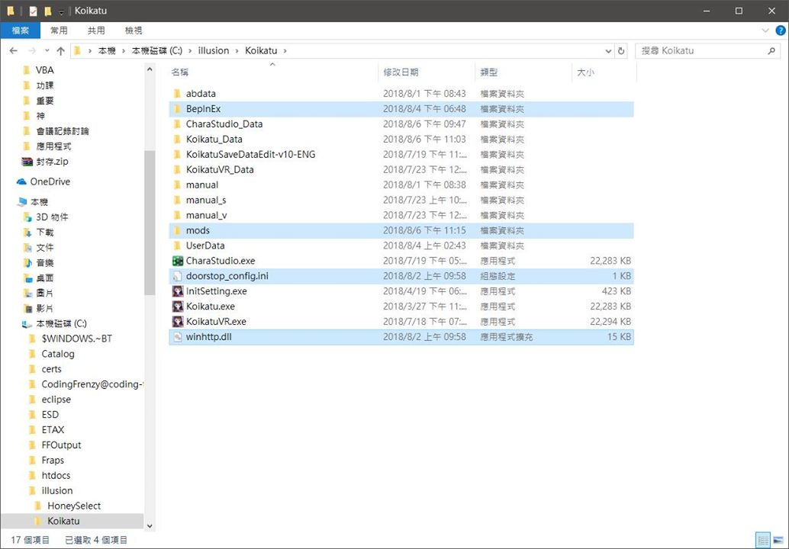
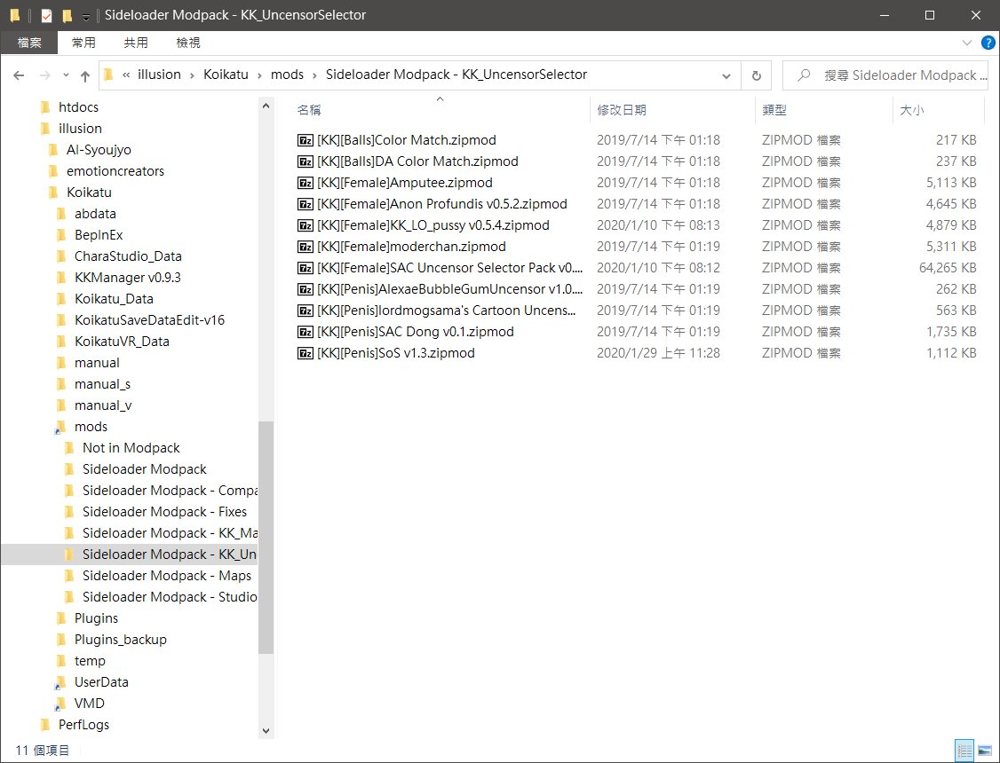
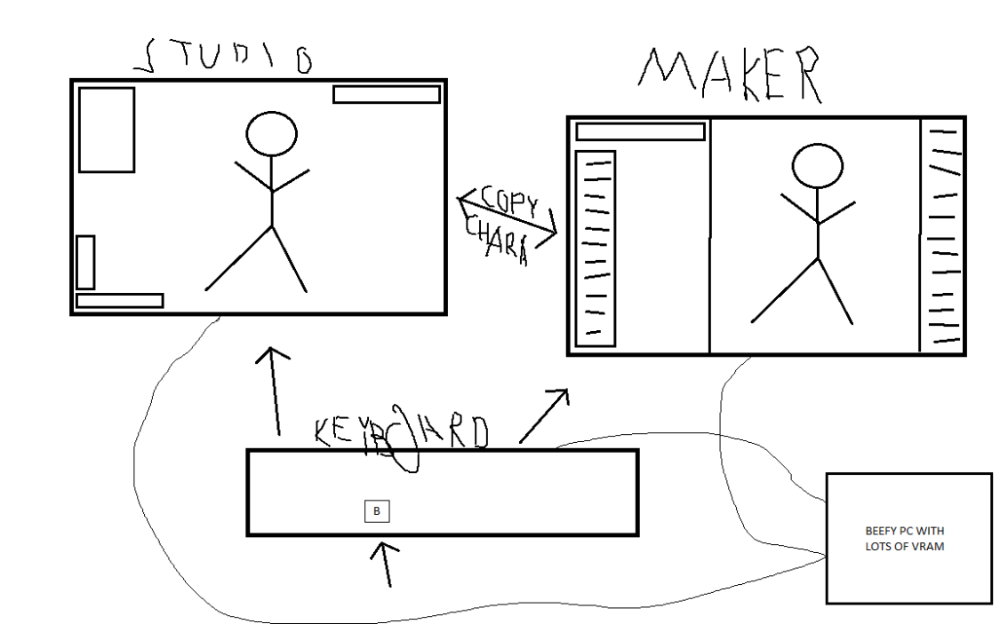
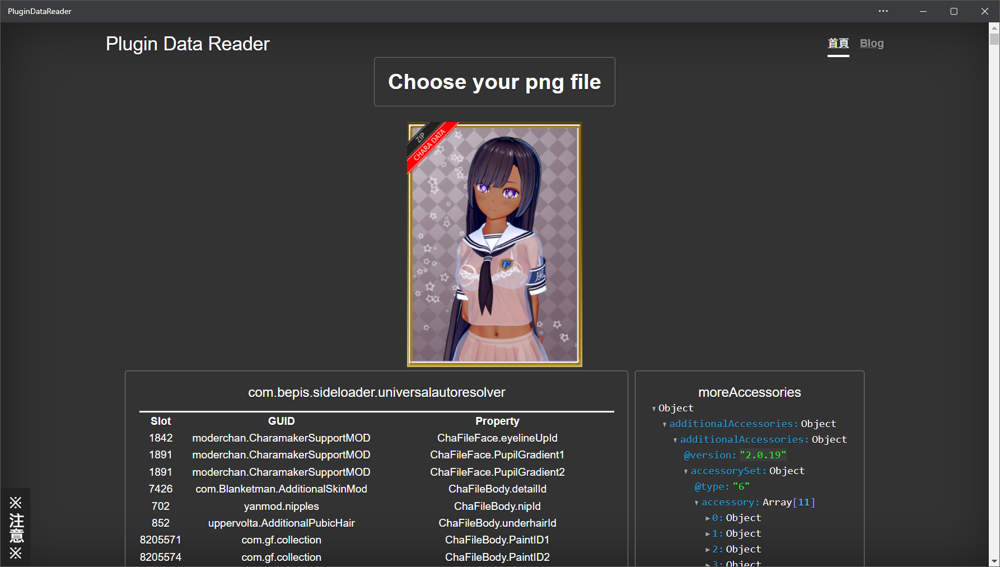

+++
title = "[Koikatu] コイカツ！ 中文安裝指南"
description = "此篇文章旨在列出所有Koikatu插件清單，並簡單點上注意事項。 ( Koikatu / Koikatsu / 戀愛活動 / コイカツ！ ) "
date = 2022-02-09T06:20:00.024Z
updated = 2022-02-09T06:20:00.024Z
draft = false
aliases = [
  "/2020/09/koikatu-bep5-plugin-guide.html",
  "/2019/11/koikatu-V5.html",
  "/2018/10/koikatu.html"
]

[taxonomies]
tags = [ "Koikatu" ]

[extra]
card = "preview.jpg"
trigger = "由於 イリュージョン 收攤，本文的官網連結已全數死去"
archive = """
本篇指南為對應 MoreAccessories **v1.1.0** 的最終版本號 
 
MoreAccessories (以下簡稱 MoreAcc) 是飾品增加插件，給你第 20 格之後的飾品 
MoreAcc v2.0 是 jalil49 違反原作者 Joan6694 的 License 所做出的山寨版本 
並且由於 KKAPI 從 v1.26 起改為使用 MoreAcc v2.0，導致依賴像病毒一樣的擴散 
 
**截至文章更新日，除了搞爆插件依賴以外，MoreAcc v2.0 沒有任何有價值的新機能** 
我決定將此文章定版號為支援 MoreAccessories v1.1.0 的最終版本 
請注意所有標註的版本號和連結，它們是能配合運作的版本號 
 
Koikatu 已經是四年前的老遊戲了，讓它留在穩定版本吧！"""
iscn = "iscn://likecoin-chain/wNXXrjwe_0oKckEePztstQcK8ywEuL4XXbJRttN598Q/1"
featured = true
hot = true
+++

<figure>
{{ image(url="preview.jpg", alt="(角色是我家的，但是原始Scene不是我做的)") }}
<figcaption>(角色是我家的，但是原始Scene不是我做的)</figcaption>
</figure>

## 序言

此篇文章旨在列出所有 Koikatu 的插件清單，文章最後更新時間: 2022/02/09

安裝順序簡述如下:

1. 安裝主程式
2. 安裝所有免費、付費 DLC (Darkness 要最後安裝)
3. 安裝{{cr(body="所有")}}必裝外掛
4. 安裝**所需**之其它外掛

官方 DLC 的**模組**基本上都沒有順序問題，設計上是分離檔案；**程式**部份會有覆寫狀況，而 Darkness 是最後一版程式更新，所以請最後裝

其它外掛我會盡量寫上前置依賴，**除了列在必裝清單上的東西**  
就是被太多東西依賴我才會列為必裝  
我就不再贅述，反正都裝上去<!--more-->

## 主程式 + 各式 DLC 介紹

* 主程式 + 付費 DLC: [DLsite](https://www.dlsite.com/pro/work/=/product%5Fid/VJ015722.html) (下載版、數位版)  
  內含:
  * コイカツ!(DL 版)
  * コイカツ!- 性格追加パック -(DL 版)
  * コイカツ! アフタースクール (DL 版)

  > 至於 Steam 上的 Koikatsu Party....  
  > 由於它的主程式和 Koikatu 不相同，我會要你把它丟進垃圾桶  
  > {{cr(body="以下的東西 87% 你都裝不上去，而且存檔還有一堆鳥毛相容問題")}}  
  > 別拿 KKP 的問題來問，問就是丟掉

* 免費 DLC:  
  分流: <https://mega.nz/#!YZIQXCBT!EehC3TtWZUnr-5B2Q9CMWRXlKq5t4yrHSulthLXXHC4>  
  官網: <http://www.illusion.jp/preview/koikatu/download/update.php> (要日本 IP)  
  分流只有 koikatu\_02plus\_cdp0201hbtks\_all ，有玩 VR 要去官網下載 koikatu\_03vr\_d0531hg

  <figure>
  {{ image(url="UNInhXC.jpg", alt="使用方法") }}
  <figcaption>使用方法，圖片點擊放大</figcaption>
  </figure>

* 其他官方特典包:  
  {{ch(body="(補充: 性格追加パック內附的泳裝有包含在免費更新中，並不算是特典)")}}
  * コイカツ！ (Koikatu!) 相關特典
    * コイカツ！ オフィシャル予約特典 軍服 (軍服)
    * コイカツ！ オフィシャル早期予約特典 セクシーランジェリー (貓咪內衣)
    * コイカツ！ 予約特典 魔法少女衣装データ (魔法少女)
    * コイカツ！ 数量限定特典 ハイクオリティメイド衣装データ (妹抖服)
    * コイカツ！ ソフマップ限定予約特典 キュートナース衣装データ (護士服)
    * 同梱特典 挿入歌「青空アドベンチャー」マキシシングル／榊原ゆい (音樂)
  * コイカツ！ アフタースクール (Koikatu! After School) 相關特典
    * 予約特典 和メイド衣装セット (和衣裝)
    * オフィシャル早期予約特典 裸エプロン (裸體圍裙)
    * オフィシャル予約特典 キャビンアテンダント (乘務員服)
    * パッケージ版購入特典 「RunningDreamer」マキシシングル／民安ともえ (音樂)
  * エモーション・クリエイターズ (Emotion Creators) 相關特典
    * オフィシャル 予約特典 セクシーセーター (開背毛衣)
    * オフィシャル 早期予約特典 マイクロビキニ (小比基尼)
    * **コイカツ！ ダークネス (Koikatu! Darkness)  
      ※這是 Emotion Creators (慾望工坊) 的預約特典※**
    * コイカツ！ 追加性格＋コンバートセット (几帳面 + 一堆新服裝)
    * チャイナ服追加データセット (旗袍，這個一起打包在コンバートセット裡面)


Darkness 必須要最後安裝，且 Darkness 被諸多插件列為依賴  
意即若未安裝 Darkness，以下許多插件就不會正常運作  
我們沒什麼理由不從最完整的版本開始開發

<figure>
{{ image(url="2019-12-08%2004%2016%2045.png", alt="Darkness主程式資訊") }}
<figcaption>Darkness主程式資訊</figcaption>
</figure>


## 必裝外掛介紹 {#necessary_plugins}

> 特別注意: 如果你從 BepInEx 4.X 要升級上來，請參考這篇  
> [コイカツ! BepInEx 框架 v4.X→v5.X 升級指南](@/Koikatu/bepinex-upgrade-guide/index.md)
>
> 如果遇到安裝問題，請參考這篇  
> [コイカツ! 插件安裝方式、問題判斷及排除指南](@/Koikatu/install-and-debug-guide/index.md)

* [BepInEx v5.4.18](https://github.com/BepInEx/BepInEx/releases/tag/v5.4.18): 這是最基礎的外掛框架，有了它其他東西才會生效  
  這裡下載 BepInEx\_x64\_5.4.\*.zip 回來，把所有東西解壓進遊戲根目錄  
  然後在遊戲根目錄新增一個資料夾叫做 "mods"，裡面放後述的 sideloader mod  
  

  

* [BepisPlugins.r16.8.1](https://github.com/IllusionMods/BepisPlugins/releases/tag/r16.8.1): 搭配上面這個外掛的基礎外掛包  
  下載 KK\_BepisPlugins\_r\*.zip 回來後整個解壓進遊戲根目錄，建議參考壓縮檔資料夾結構放置，依賴後面提到的 XUnity.AutoTranslator  
  
* [BepInEx.BepInEx4Upgrader v1.0.0.0](https://github.com/BepInEx/BepInEx.BepInEx4Upgrader/releases/tag/v1.0.0.0): BepInEx v4 插件的自動升級器  
  將 BepInEx.BepIn4Patcher.dll 放在「根目錄 \BepInEx\patchers」，注意路徑  
  
* [BepInEx.MessageCenter v1.1.1](https://github.com/BepInEx/BepInEx.Utility/releases/tag/r5): 將重要度為「Message」的訊息顯示在遊戲畫面頂端  
  將 BepInEx.MessageCenter\_v\*.zip 載回來以後解壓縮丟進遊戲根目錄，建議參考壓縮檔資料夾結構放置
* [BepInEx.ConfigurationManager v16.4](https://github.com/BepInEx/BepInEx.ConfigurationManager/releases/tag/v16.4): 遊戲內設定修改器  
  將 BepInEx.ConfigurationManager\_v\*.zip 載回來以後解壓縮丟進遊戲根目錄，建議參考壓縮檔資料夾結構放置
* [BepInEx.IPALoaderX v1.2.4](https://github.com/BepInEx/IPALoaderX/releases/tag/v1.2.4) Bepinex 5 版本的 IPALoader  
  將 Bepinex.IPALoader.v\*.zip 解壓縮丟進遊戲根目錄，建議參考壓縮檔資料夾結構放置
* Sideloader modpack: ~~由 DeathWeasel 整理~~ 改由 ScrewThisNoise 整理的 sideload mod 包
  1. 使用 [KKManager](#other_tools) 來做自動更新
  2. 由這個下載站取得: <https://sideload.betterrepack.com/>  
     此站內容 (作者說) 會和 KKManager 同步，這裡適合用來尋找單一 mod

  sideloader modpack 裡所有 mod 都是 sideloader mod (又稱 zipmod)  
  他可以是「.zipmod」或「.zip」格式，並可以被各種壓縮軟體打開  
  如果這個壓縮檔裡包含了 manifest.xml，那他就是一個 zipmod，把他放到 mods 文件夾下，不要解開  
  直接放置如圖左，可使用子資料夾  
  

* [KKAPI v1.25](https://github.com/IllusionMods/IllusionModdingAPI/releases/tag/v1.25): 超級多插件的依賴，他是一個程序 API 接口  
  將 KKAPI\_1.25.zip 載回來以後解壓縮丟進遊戲根目錄，建議參考壓縮檔資料夾結構放置  
  
* [XUnity.AutoTranslator 4.21.0](https://github.com/bbepis/XUnity.AutoTranslator/releases/tag/v4.21.0): 機器翻譯  
  **就算不啟用也一定要安裝**，BepisPlugins/Sideloader 對他有依賴  
  下載 XUnity. AutoTranslator-BepIn-5x-\*.zip，解壓縮丟進遊戲根目錄  
  可依照以下步驟關閉機器翻譯:
  1. 啟動一次遊戲，讓插件產生 ini 設定檔案，進到主畫面後再關閉遊戲
  2. 用文字編輯器開啟「根目錄 \BepInEx\config\AutoTranslatorConfig.ini」
  3. 找到 \[TextFrameworks] 段落，將其下的選項全部改成 False  
     

## 其他外掛介紹 {#other_plugins}


以下所有版本號以對應 Darkness 程式為基準，且必須安裝上列必裝外掛


> ※標有 ☆ 符號者為推薦外掛，如果想要正常讀別人的存檔，你最好安裝他們  
> (請善用 Ctrl+F 搜尋 ☆ 符號)

2019/10/23 經歷了一次 BepInEx 4→5 的重要框架升級，從此插件分為三種安裝方式:

* BepInEx 5 插件:  
  直接將 \*.dll 等檔案放置於「**根目錄/BepInEx/plugins/**」之下，例如「C:\illusion\Koikatu\BepInEx\plugins」  
  BepInEx 5 開始插件支援子資料夾，可以放置在 BepInEx/plugins 底下的任何多層資料夾內，但推薦參考原始壓縮檔之結構放置
* BepInEx 4 插件:  
  **需要 BepInEx4Upgrader**，這能將之自動升級為「符合 BepInEx5 框架的 BepInEx4 插件」  
  之後將 \*.dll 等檔案放置於「**根目錄/BepInEx/**」之下，例如「C:\illusion\Koikatu\BepInEx」
* IPA:  
  直接將 \*.dll 等檔案放置於「**根目錄/Plugins/**」之下，例如「C:\illusion\Koikatu\Plugins」  
  **需要 IPALoaderX**，運作有機會異常，若遇到錯誤請移除該個別插件

所有在 2019/10/23 以前發布的 BepInEx 插件皆是 BepInEx 4 插件，而在那之後的請參考各插件 Readme。 本文將三種插件分別標示，請**特別注意插件種類**

> 更多詳細敘述請參考[コイカツ！ BepInEx v5.X 之資料夾結構說明](@/Koikatu/bepinex-upgrade-guide/index.md#bepinex5-folder-structure)

### BepInEx 5 插件

* [jim60105/KK](@/Koikatu/personal-koikatu-plugin/index.md) {{ch(body="對，這些是我寫 der")}}

  > 請到 [\[Koikatu\] コイカツ！ ( Koikatu / Koikatsu / 戀愛活動 ) 個人插件介紹匯整](@/Koikatu/personal-koikatu-plugin/index.md)  
  > 閱讀專門介紹頁
  
  * [Koikatu Coordinate Load Option v1.1.8.1](@/Koikatu/coordinate-load-option/index.md)  
    載入服裝卡片時，可以選擇要載入的細項，包括飾品個別選擇。取代 KK\_ClothesLoadOption
  * [Koikatu Studio Transgender Loading v1.0.1](@/Koikatu/studio-transgender-loading/index.md)  
    實現 Studio 跨性別替換角色功能，取代 Studio All Girls Plugin
  * ☆[Koikatu Studio Simple Color On Girls v1.1.0](@/Koikatu/studio-simple-color-on-girls/index.md)  
    使女性支持單色化功能
  * [Koikatu Studio Chara Only Load Body v1.3.9](@/Koikatu/studio-chara-only-load-body/index.md)  
    保留衣服和飾品，只替換人物
  * [Koikatu Studio Reflect FK Fix v1.0.4](@/Koikatu/studio-reflect-fk-fix/index.md)  
    修正「IK→FK」功能會重置手勢和脖子的問題，並增加了一個複製當前脖子方向到 FK「→FK (首)」的功能
  * ☆[Koikatu Studio Text Plugin v1.1.6](@/Koikatu/studio-text-plugin/index.md)  
    在 Studio 內添加文字物件
  * [Koikatu Studio Auto Close Loading Scene Window v1.0.4](@/Koikatu/studio-auto-close-loading-scene-window/index.md)  
    Studio Load Scene 視窗處，在 Import 或 Load 後可以自動關閉視窗
  * [Plugin List Tool v1.1.0](@/Koikatu/plugin-list-tool/index.md)  
    導出當前遊戲中**已加載的** BepInEx 插件和 IPA 插件清單
  * [Koikatu FBI Open Up v1.1.3](@/Koikatu/fbi-open-up/index.md)  
    此插件可依照原始角色，將她們向模板角色轉變。預設為蘿化，也可以用來做三頭身化。
  * ~~[Koikatu Chara Overlays Based On Coordinate v1.3.8](@/Koikatu/chara-overlays-based-on-coordinate/index.md)~~  
    ~~讓所有角色 Overlay (Iris、Face、Body Overlay) 隨著服裝變更，反映在人物存檔和服裝存檔上~~  
    被 Overlay Mods v6.0 實作部份功能，並被標為不相容。我對此有點意見，可點連結看看八卦。
  * [Koikatu PNG Capture Size Modifier v1.5.5](@/Koikatu/png-capture-size-modifier/index.md)  
    可調所有 PNG 存檔的拍照尺寸、調整 Maker 中的檔案選擇器顯示列數、放大 Studio SceneData 選擇器的選中預覧、給 PNG 存檔加上浮水印角標
  * [Koikatu Studio Chika Replacer v1.1.1](@/Koikatu/studio-chika-replacer/index.md)  
    一鍵把 Studio 內的所有女角色都換成千佳 (預設角色)，並保留原始人物的身形數據
  * [Koikatu Studio Chara Light Linked To Camera v1.1.7](@/Koikatu/studio-chara-light-linked-to-camera/index.md)  
    將 Studio 角色光和視角間之旋轉值連動，詳見[預覧](@/Koikatu/studio-chara-light-linked-to-camera/index.md)對比
  * [Koikatu Studio Dual Screen v1.1.1](@/Koikatu/studio-dual-screen/index.md)  
    啟用 Studio 的第二顯示器功能，**必需要有實體雙顯示器才能使用**
  * [Koikatu Studio Save Workspace Order Fix v1.0.1](@/Koikatu/studio-save-workspace-order-fix/index.md)  
    以 Studio 的存檔邏輯，工作區中，在第一層之物件排序是以加入順序儲存 → 修改為以實際順序儲存
  * [Koikatu Studio Body Overwrite Script v1.0.0.1](@/Koikatu/studio-body-overwrite-script/index.md)  
    一鍵覆寫角色身體
  * [Koikatu Transparent Background v1.0.1](@/Koikatu/transparent-background/index.md)  
    透明視窗和背景，可顯示和點擊視窗下的東西
  * ☆[Koikatu Save Load Compression v1.4.0](@/Koikatu/save-load-compression/index.md)  
    使用 LZMA 對 CharaFile、CoordinateFile、Studio SceneData 存檔做壓縮  
    提供網頁版壓縮 / 解壓縮工具: <https://slcweb.maki0419.com>
  * [Koikatu Coordinate Capture Pose Unlock v1.0.1](@/Koikatu/coordinate-capture-pose-unlock/index.md)  
    解除拍照服裝存檔時的姿勢限制
  * [Koikatu Studio Menu Scrolling Text v1.2.1](@/Koikatu/studio-menu-scrolling-text/index.md)  
    在 Studio 的添加物品清單添加滾動顯示功能，並在分類清單顯示自訂文字
  * [Koikatu What are you saying? Script v1.0.0](@/Koikatu/what-are-you-saying/index.md)  
    本年度最無用作品，核心功能是讓你看不懂他們在說啥
* ☆立體步兵補丁和動態開合 (騎兵有馬，步兵 (ry))  
  和 kPlug 衝突
  * 下載並安裝 [Koikatsu Overlay Mods v6.0.7](https://www.patreon.com/posts/37785162)
  * 下載並安裝 [KK\_UncensorSelector.v3.11.4](https://github.com/IllusionMods/KK%5FPlugins/releases/tag/v207)
  * 下載並安裝 [BetterPenetration v4.5.0](https://github.com/Animal42069/BetterPenetration/releases/tag/4.5.0)  
    它在那裡加了碰撞器，能提供動態開合。注意，必須完整安裝，否則你可能會看到裙子裡有空氣雞雞！
  * 由 Sideloader Modpack 中，將「Sideloader Modpack - KK\_UncensorSelector」資料夾下載下來，丟進「根目錄 \mods\」之下  
    
  * 在 CharaMaker 裡的「身體 > 全體」選單下方可以選擇模組，設定完記得儲存卡片
  * 在 F1 裡可以設定「當角色 Uncensor 未設定」時要顯示的預設模組，也可以選擇「隨機 (Random)」選項  
    
* [DeathWeasel1337/KK\_Plugins](https://github.com/IllusionMods/KK%5FPlugins/tree/b9c5d78b3cc26c5107a78b40e24d7977e66fec6f):
  * [CharaMakerLoadedSound v1.0](https://github.com/IllusionMods/KK%5FPlugins/releases/tag/v210) 載入完成時跳音效
  * [StudioSceneLoadedSound v1.1](https://github.com/IllusionMods/KK%5FPlugins/releases/tag/v132) 載入完成時跳音效
  * ☆[ForceHighPoly v1.2.2](https://github.com/IllusionMods/KK%5FPlugins/releases/tag/v150) 強制遊戲全程使用高模。增加模型精細度，但是同時增加運行附載  
    ※正篇遊戲也會強制高模，**注意電腦附載**※
  * [ReloadCharaListOnChange v1.5.2](https://github.com/IllusionMods/KK%5FPlugins/releases/tag/v189) 在角色卡 / 衣服卡變更的時候重整遊戲內瀏覽器
  * ☆[InvisibleBody v1.4](https://github.com/IllusionMods/KK%5FPlugins/releases/tag/v184) 讓人透明，用來顯示沒人穿的衣服、配件，可以隨著存檔儲存隱形狀態
  * ☆UncensorSelector v3.11.4 前面裝過的步兵外掛，可以為不同的角色選擇不同的步兵補丁，需要 KCOX
  * [Subtitles v2.3.1](https://github.com/IllusionMods/KK%5FPlugins/releases/tag/v207) H 場景和說話場景顯示字幕
  * ~~[AnimationController v2.3](https://github.com/IllusionMods/KK%5FPlugins/releases/tag/v206) 可以把 IK 節點綁定到運動物體，讓角色做非預設的動作~~ 建議改用 NodeConstraints，但你可以安裝它以讀取那些過度時期製作的老 Scene
  * ☆[ClothingUnlocker v2.0.2](https://github.com/IllusionMods/KK%5FPlugins/releases/tag/v203) 讓衣服男女通穿，以及解除某些不能同時穿的上下衣限制
  * [EyeShaking v1.2](https://github.com/IllusionMods/KK%5FPlugins/releases/tag/v184) 處女 H 中會視線顫抖
  * [RandomCharacterGenerator v2.0](https://github.com/IllusionMods/KK%5FPlugins/releases/tag/v177) 在 CharaMaker 中，可以產生隨機角色 (上帝拉霸機！)
  * [PoseFolders v1.0](https://github.com/IllusionMods/KK%5FPlugins/releases/tag/v120) 只要在「userdata/studio/pose」內新增資料夾，並把 pose 檔放進去，就會以資料夾顯示在 Studio 的 Pose 讀取清單
  * [ListOverride v1.0](https://github.com/IllusionMods/KK%5FPlugins/releases/tag/v65) 覆蓋官方列表文件，像是可以為一些官方連褲襪提供半脫狀態
  * ☆[HairAccessoryCustomizer v1.1.6](https://github.com/IllusionMods/KK%5FPlugins/releases/tag/v203) CharaMaker 的頭髮飾品處，新增更多方便的調整功能
  * [FreeHRandom v1.2](https://github.com/IllusionMods/KK%5FPlugins/releases/tag/v172) 在 Free H 選項那裏新增隨機挑選按鈕
  * ☆[Colliders v1.2](https://github.com/IllusionMods/KK%5FPlugins/releases/tag/v184) 對地板、奶子、手和裙子添加碰撞器，取代 Koikatu Atari
  * ☆[MaterialEditor v3.1.10](https://github.com/IllusionMods/KK%5FPlugins/releases/tag/v208) 讓你可以編輯模型材質的細部屬性
  * [MaleJuice v1.3](https://github.com/IllusionMods/KK%5FPlugins/releases/tag/v200) 你現在也可以在 H 和 Studio 中讓男孩子髒髒
  * [StudioObjectMoveHotkeys v1.0](https://github.com/IllusionMods/KK%5FPlugins/releases/tag/v122) 以快捷鍵在 Studio 內移動物品，使用 Y/U/I 改變 X/Y/Z 軸數值，縮放時按 T 同時變更三軸
  * ☆[FKIK v1.1.2](https://github.com/IllusionMods/KK%5FPlugins/releases/tag/v206) 可以同時啟動一部份的 FK 和 IK。像是用 IK 來擺手腳，並用 FK 來調手指、脖子、奶子
  * [AnimationOverdrive v1.1](https://github.com/IllusionMods/KK%5FPlugins/releases/tag/v124) Studio 裡的動作速度輸入框，支援輸入小於 1000 的數字
  * [Character Export v1.0](https://github.com/IllusionMods/KK%5FPlugins/releases/tag/v131) 可將遊戲內當前載入的所有角色導出，例如 Studio 已載入的 Scene、主遊戲的學校內人物，快捷鍵是 Ctrl+E (和 Studio 提取工具的差別為，這是在遊戲內運作的插件，需要先成功載入角色才能導出)
  * [Koikatsu HCharaAdjustment v2.0](https://github.com/IllusionMods/KK%5FPlugins/releases/tag/v135) H 戰鬥時微調角色位置，可以手動解決 % 蘿莉時錯位問題，快捷鍵: O 第一女角、P 第二女角、I 男角、右 Ctrl 加上述按鍵重置位置 (可至 F1 更改熱鍵設定)
  * [StudioSceneSettings 1.3.2](https://github.com/IllusionMods/KK%5FPlugins/releases/tag/v197) 隱藏擋在鏡頭和人物之間的地圖牆壁
  * ☆[Pushup v1.3.1](https://github.com/IllusionMods/KK%5FPlugins/releases/tag/v203) 可以在穿奶罩時改變女性胸型，取代 Koikatu Bra\_Push-Up\_Mod (KK\_Kiyase)
  * [PoseQuickLoad v1.0](https://github.com/IllusionMods/KK%5FPlugins/releases/tag/v148) 在點選 Studio 的 Pose 時直接讀取，省去一個點 Load 按鈕的動作。預設是關閉，到 F1 打開它才會生效。
  * ☆[StudioImageEmbed v1.0.2](https://github.com/IllusionMods/KK%5FPlugins/releases/tag/v207) 將存檔中使用到的 bg、pattern、pattern\_thumb、frame 之圖片塞入 Scene 存檔中，解決「必須有同一張圖片在 UserData 中才能讀取」的問題
  * [MakerDefaults v1.0.1](https://github.com/IllusionMods/KK%5FPlugins/releases/tag/v190) 設定進入 Maker 時的預設值，省去每次開啟 Maker 都要調一次姿勢、表情等
  * [StudioCustomMasking v1.1.1](https://github.com/IllusionMods/KK%5FPlugins/releases/tag/v207) 可以將 MapMask 功能套用在以 Items 拼出的場景物件上，需要 StudioSceneSettings
  * [ItemBlacklist v1.1](https://github.com/IllusionMods/KK%5FPlugins/releases/tag/v176) 對捏人中的 item 縮圖按右鍵，將其從列表中隱藏，也能顯示出該 mod 的相關資訊
  * [FadeAdjuster v1.0.1](https://github.com/IllusionMods/KK%5FPlugins/releases/tag/v195) 允許您調整淡入淡出的顏色或禁用淡入和淡出效果
  * [Profile v1.0.1](https://github.com/IllusionMods/KK%5FPlugins/releases/tag/v183) 捏人中的加一個大文字框，讓你可以在其中寫寫筆記
  * [Autosave v1.1.1](https://github.com/IllusionMods/KK%5FPlugins/releases/tag/v207) Maker 和 Studio 中每過幾分鐘就自動儲存。這功能可以非常惱人並把你的磁碟塞滿，但它可能會救你一命
  * [EyeControl v1.0.1](https://github.com/IllusionMods/KK%5FPlugins/releases/tag/v190) 在角色上設定最大張眼數值，設定為零就會是個閉眼角色
  * [AccessoryQuickRemove v1.0](https://github.com/IllusionMods/KK%5FPlugins/releases/tag/v191) Maker 中按下 Delete 鍵刪除飾品
  * [DynamicBoneEditor v1.0.4](https://github.com/IllusionMods/KK%5FPlugins/releases/tag/v203) 在 Maker 中修改飾品的 DynamicBone
  * ☆[AccessoryClothes v1.0.1](https://github.com/IllusionMods/KK%5FPlugins/releases/tag/v206) 配合此插件做的飾品能像一般衣服，隨著身體彎曲，隨角色的滑塊變化而縮放等。也就是說，modder 現在能把衣服做成飾品了。記得帶上 Madevil 的 AccessoryClothesDynamicBoneSupport。
  * ~~[PoseUnlocker v1.0](https://github.com/IllusionMods/KK%5FPlugins/releases/tag/v197) Removes the gender restriction on saved Studio poses.~~ 這是 Studio Transgender Loading 已經內含的功能，如果你裝了就別裝這個。
  * [LightingTweaks v1.0.1](https://github.com/IllusionMods/KK%5FPlugins/releases/tag/v207) 提高陰影分辨率以提高畫質，修復主遊戲和 Studio 之間陰影強度不匹配的問題  
    注意，個案出現把顯卡的 3D 運算效能炸到 100%，導致遊戲 FPS 剩下個位數，並拖垮整台電腦。
  * ~~[MoreOutfits v1.1](https://github.com/IllusionMods/KK%5FPlugins/releases/tag/v215) Allows characters to have more than the default number of outfit slots.~~ 這是寫給 KKS 的東西，它可能跟任何會動到服裝的插件衝突，裝在 KK 你一定把自己搞死
  * [TwoLut v1.0](https://github.com/IllusionMods/KK%5FPlugins/releases/tag/v205) 讓你自由選擇 Studio 中的應用的兩個濾鏡 (原始設計中永遠有一個是昼)。並在濾鏡選單旁加「上一個 / 下一個」按鈕
* ☆[IllusionFixes v19](https://github.com/IllusionMods/IllusionFixes/releases/tag/v19.0)
  * CameraTargetFix 禁用相機時在 Studio 中隱藏游標
  * CenteredHSceneCursor 修正 H 介面的游標沒有對準中央的問題
  * CharacterListOptimizations CharacterList 效能優化
  * DataCorruptionFixes 在各個讀取方法外 Catch Exception，以避免讀取壞檔造成的遊戲崩潰
  * DynamicBonesFix 修復如果 FPS 高於 60，動態骨骼快速振蕩的問題
  * ExpandShaderDropdown 修正 ShaderDropdown 往上跑的問題
  * GarbageTruck 修改了一些遊戲功能，以提高效率並減少垃圾產生，從而減輕 Unity GC 的負擔
  * GuideObjectsFix 使捏人飾品的箭頭始終顯示在角色上方
  * HairShadows 修正啟用「眼睛穿透前髮顯示」時，前髮無法照上影子的問題
  * Heterochromia 可以加載有不同類型的瞳孔，而不會重置它
  * InvalidSceneFileProtection 添加 Studio Scene 的載入前驗證，避免錯誤 / 損壞存檔將遊戲崩潰
  * MainGameOptimizations 主遊戲效能優化
  * MakerOptimizations 角色編輯器效能優化
  * ManifestCorrector 避免某些製作錯誤的 sideloader mod manifest 在故事模式造成的崩潰
  * ModdedHeadEyeliner 讓非官方頭型正常顯示
  * NullChecks 移除程式內的部分錯誤 Null 值 (頭部飾品相關)
  * PartyCardCompatibility 讓 Koikatu Party 產生的存檔可以在其他版本讀取
  * PersonalityCorrector 角色卡用到沒有的性格時自動修正防止崩潰，記得在教室加新同學的時候檢查一下性格
  * PoseLoad 修正 Koikatsu 中加載 Honey Select 姿勢時產生的錯誤 (FK 右手腕等)
  * ResourceUnloadOptimizations 大幅度減少 Studio Scene 讀取時間，增進校園模式載入效能。如果 RAM 大於 16G 時，可以斟酌至設定關閉自動卸載資源功能 (以 RAM 空間換取讀取時間)
  * RestoreMissingFunctions 對沒有 Darkness 的遊戲程式加回 Head 選擇清單
  * SettingsVerifier 啟動時檢查遊戲啟動器設定 (分辨率、全螢幕 / 視窗化等)
  * ShowerAccessories 在淋浴間偷窺時不再移除主要飾品，很適用在使用飾品拼湊頭髮的角色
  * StudioOptimizations Studio 效能優化，當安裝了許多 mod 時，Studio 啟動時間大大改善
  * UnlimitedMapLights 解除 Studio 中只能使用三個地圖光的限制，但並非所有物品都支援三個以上的光源
* [Madevil](https://mega.nz/folder/LaxGWSZZ#8RuhvTFig50K-6LXdPdYfg) **他的東西是以完整插件整合包發布，並且不擔保擅自添加、修改任一插件後造成的異常狀況**
  * JetPack Madevil 有數個插件依賴他運作，有用他的插件就請安裝
  * ☆AAAPK 使用角色身上任何一個骨骼節點當作飾品的親屬
  * ☆KK\_AccStateSync 飾品隨著衣物穿著狀態顯示 / 隱藏
  * CharacterAccessory 指定飾品成為角色飾品，套用服裝卡的時候會自動附加一份
  * HemorrhoidsBuster 同時移動數個飾品的所在座標
  * ☆BonerStateSync 角色骨骼參數綁定衣物穿著狀態
  * MaterialRouter 改名 / 複製角色身上任一個物件的材質
  * KK\_MovUrAcc 批次搬移 / 刪除角色的飾品槽位
  * CumOnOver 自動補上衣物缺少設定的白果醬效果
  * StudioCharaSort 工作室人物卡瀏覽視窗的排列紀錄
  * ☆SMAP 大量增加角色飾品可用的親屬點，取代 KK\_MoreAccessoryParents
  * AccGotHigh 捏人的飾品列表介面, 滑鼠移到槽位按鈕時對應的飾品以高亮效果顯示；設定調成 Number Mode 能更方便的看出飾品貼圖位置
    \== 以下標示為測試作品 ==
  * ABMXHelper 匯出 / 匯入角色的 abmx 資料
  * ☆AccessoryClothesDynamicBoneSupport 修復 AccessoryClothes 的 DynamicBone 和 ModBoneImplantor 支援，需要 ModBoneImplantor v1.1
  * DynamicBoneEditorBatchSettings 匯出 / 匯入 / 批次設定角色的 DynamicBoneEditor 資料
  * MapNavi 工作室地圖座標移動
  * MaterialEditorBatchSettings 批次設定角色的 MaterialEditor 資料
  * MaterialEditorHelper 匯出 / 匯入角色的 MaterialEditor 資料
  * ParentSwitch 保持座標不變的情況下切換指定飾品的親屬設定
  * ShadowSettings 工作室裡陰影顯示微調
  * StartupCameraRecall 增加快速鍵, 呼叫出 SD 紀錄時的攝影機設定
  * StudioCameraRotate 增加快速鍵, 工作室攝影機順時鐘 / 逆時鐘 90 度轉向
  * StudioCharaReload 工作室重新載入角色 (刷新重整)
  * StudioEffectSettings 紀錄 Specter 的 effects 設定至 SD
* [Keelhauled/KoikatuPlugins](https://github.com/IllusionMods/KeelPlugins/releases/tag/build-268)
  * AnimeAssAssistant  
    An assistant to help you manage your huge card collections. It provides a few shortcuts in maker that let you go through your cards quickly while deciding which cards to keep. Enable the plugin in the maker sidebar for the hotkeys to work.
  * CameraFrameMask 屏蔽在讀取角色時會出現的 ugly frames
  * CharaStateX  
    * 讓 Studio 裡某些物件可以同時編輯，用 Shift/Ctrl 選擇複數個人物，然後就可以同時加載姿勢、改眨眼狀態、更改動畫、更改服裝狀態、更改關節補強等等 (這些舉例是原說明的描述)  
    * Studio H 動作同步: 通過選擇一個男性和一個女性，然後在按住 ctrl 鍵的同時單擊列表中的 H 動畫，插件將根據性別自動選擇合適的 H 動畫。
  * ClothingStateMenuX 增加捏人右側欄的穿衣狀態選項，和 ClothingStateMenu 選一個用就好，我是覺得 X 這個的 UI 設計蠻擋的
  * DefaultParamEditor 儲存預設環境 / 角色參數，普通的設定好以後到設定裡面做儲存，下次開程式就會預設載入該設定
  * DefaultStudioScene 開啟 Studio 時載入設定的 Scene
  * FreeHDefaults 開啟 FreeH 時載入的設定
  * ItemLayerEdit 一鍵讓物品在角色層和地圖層調動，這和光影影響有關係
  * LightManager 聚光燈可以追尾指定角色
  * LockOnPlugin 鏡頭追尾外掛 (範例圖是 HS，請注意功能演示就好)
  * MakerBridge 使用快捷鍵 (B) 將選擇的角色從 CharaMaker 送到 Studio，或是反之。  
    附上作者畫的圖  
    
  * RealPOV H 戰鬥的第一人稱插件，預設快捷鍵 Backspace，和 KK\_HeadUtl 各有特色
  * MaterialLink  
    Plugin that automatically sets the correct skin material on clothing that has the MaterialLink monobehaviour (for example, skindentation thighhighs)
  * StudioAddonLite 在 Studio 內，使用快捷鍵操作 X 軸、Y 軸、Z 軸旋轉移動等
  * TitleShortcuts 新增主選單快捷
  * [UnityLogFilter](https://github.com/Keelhauled/KeelPlugins/releases/tag/build-185) Unity log 過濾器，這是 patchers。一般來說你不會用到他
* [GraphicsSettings v1.2.1](https://github.com/BepInEx/BepInEx.GraphicsSettings/releases/tag/v1.2.1) 開啟更多的詳細畫面設定
* [BepInEx Utility r5](https://github.com/BepInEx/BepInEx.Utility/releases/tag/r5)
  * CatchUnityEventExceptions v1.0  
    Makes sure all event handlers subscribed to commonly used UnityEngine events are executed, even if some of them crash.
  * EnableFullScreenToggle v1.0 以 Alt+Enter 切換全螢幕
  * EnableResize v1.5 可以直接透過拖曳畫面邊角改變視窗大小
  * InputHotkeyBlock v1.4 打字時不會觸發快捷鍵，需移除「KK\_Plugins\KK\_InputHotkeyBlock」
  * ☆MessageCenter v1.1.1 將重要度為「Message」的訊息顯示在遊戲畫面頂端
  * MuteInBackground v1.1 在視窗失焦時自動靜音遊戲，功能需要在 Config 中啟用
  * OptimizeIMGUI v1.0 減少 Unity IMGUI (OnGUI) 顯示介面的不必要 GC 分配
  * SuppressGetTypesErrorsPatcher v1.0  
    A patcher that hooks Assembly.GetTypes() and handles ReflectionTypeLoadException. Useful when game code is using Assembly.GetTypes() without handling the exception, and it crashes on plugin assemblies that have types that can't be loaded.
* ☆[Koikatu More\_Accessories v1.1.0](https://www.patreon.com/posts/39203275) 增加無限多的裝飾品洞
* [KK\_BrowserFolders v2.6.2](https://www.patreon.com/posts/40644638) 讓選擇器支援子資料夾讀取
* [HideAllUI v2.3.2](https://github.com/IllusionMods/HideAllUI/releases/tag/v2.3.2) 隱藏 UI 介面 (預設: 空白鍵)，和 HideHInterface、Specter 衝突，若不使用 Specter 就選這個，反之選另兩個
* ☆[DragAndDrop v1.2.3](https://github.com/IllusionMods/DragAndDrop/releases/tag/v1.2.3) 在載入圖檔時可以用視窗外拖曳檔案的方式。
  * 支援在 Studio、Maker、FreeH、Stage 拖入角色卡、場景卡、衣裝卡
  * 支援 Studio 拖入 Pose 存檔
  * 支援 KK\_Party (Steam)
  * Studio 中按著 Shift 拖入可為 import 功能  
    (Need to focus the game, hold shift, and drag a scene in. Doesn't work if you click outside of the game and then drag in!)
* ☆[Illusion Overlay Mods v6.0.7](https://www.patreon.com/posts/37785162) 在身體、衣服、眼睛上套用圖片，做客制化服裝者之必備插件
* ☆[Koikatsu ABMX V4.4.6](https://www.patreon.com/posts/37819916) 增加更多的捏角選項
* ☆[KK\_SkinEffects v1.9](https://www.patreon.com/posts/31646040) 增加幾個皮膚上效果 (流汗、流水、流血)，需要 Overlay Mods
* [KK\_ExpandMaleMaker v1.1](https://github.com/Kokaiinum/KK%5FExpandMaleMaker/releases/tag/1.1) 給男角色增加某些原本被限定在女編輯器才有的調整項，像是身高和 X 毛，需注意若大幅調整身高會導致 H 時錯位問題，所以此功能預設為關閉
* [KK\_QuickAccessBox v2.4.4](https://www.patreon.com/posts/quickaccessbox-2-38060886) Studio 中可以用關鍵字快速檢索 item
  * Left Control + Space 打開介面 (可至 F1 更改熱鍵設定)
  * 請閱讀[縮圖產生說明](https://github.com/ManlyMarco/KK%5FQuickAccessBox#how-to-add-thumbnails-for-your-items)
  * 為使英文搜尋生效，請按以下步驟安裝:
    1. 請下載 [IllusionMods/KoikatsuTranslation](https://github.com/IllusionMods/KoikatsuTranslation) 之最新 Release
    2. 此二檔案解壓縮後，將其中位於「BepInEx\Translation\en\Text」之下的檔案複製至遊戲資料夾內相對位置
    3. 開啟 Studio 後靜待數秒讓第一次的自動翻譯完成 (請注意 Console Log)
* [Koikatu HeightBar v3.4](https://www.patreon.com/posts/35859949) CharaMaker 中顯示換算的實際身高 (多少 cm)，僅供參考
* ☆[Koikatu KKPE\_v2.12.0](https://www.patreon.com/posts/hs-kk-ai-hs2-2-0-38673900) Studio 內可以調整 DynamicBones、調整 BlendShape、調整 Collider，調 BlendShape 可以做顏藝或鮑鮑開開
* [Koikatu KKUS v1.9.0](https://www.patreon.com/posts/hs-kk-ai-hs2-1-9-38675642) 增加以下功能
  * 使主遊戲和 Studio 中的 UI 可以縮放
  * Studio 中做刪除時有個確認視窗
  * Maker 中的搜尋框
  * Studio 中物品和角色的搜尋框
  * Studio 中左下角的 XYZ，支援點著拖曳
  * Studio 中縮放值可以是負值
  * 自動關節補正
  * Studio 中可以將眨眼預設為關閉
  * Studio 所有的畫面後處理都可關閉
  * 相機視角速度調整
* [RendererEditor 1.6.0](https://www.patreon.com/posts/hs-kk-ai-hs2-1-6-39556121) 材質編輯器，[說明影片](https://www.youtube.com/watch?v=lwHjQRKkzp0)，基本上沒人在用這個
* ☆[Timeline 1.1.0](https://www.patreon.com/posts/hs-kk-timeline-1-37188531) 可以在 Studio 中做關鍵幀動畫，將 Studio 動畫制作推到了另一個高度。視窗快捷是 Ctrl+T，[這裡](https://www.youtube.com/watch?v=LGq2g5kP7wg)和[這裡](https://www.youtube.com/watch?v=5hXl2MSYop4)有教學影片
* [VideoExport 1.2.1](https://www.patreon.com/posts/hs-kk-ai-hs2-1-2-40762879) 錄影輸出工具，可逐幀輸出，快捷是左 Ctrl + E，[說明書](https://joan6694.bitbucket.io/)
* [ShaderManagementTool V2.1](https://twitter.com/nHaruka%5FKK/status/1454766762197602309) Studio 中批量修改 Shader，可以搭配同作者的 KKUTS 使用，改變為寫實風格
* [KK\_CrossEye 1.6](https://github.com/Mantas-2155X/KK%5FCrossEye/releases/tag/v1.6) 交叉眼睛注視略為錯位的兩個畫面，顯示 3D 效果
* [HLightControl v1.2.4](https://www.patreon.com/posts/hlightcontrol-v1-45547422) H 介面固定燈光方向 (原始的燈光會跟著相機轉，這能加一個選項讓你固定他)
* [StudioAccessoryNames v1.1.1](https://github.com/Mantas-2155X/StudioAccessoryNames/releases/tag/v1.1.1) Studio 中，讓角色身上帶的飾品顯示具體名稱
* [StudioMiscSearch v1.2.0](https://github.com/Mantas-2155X/StudioMiscSearch/releases/tag/v1.2.0) Studio 的 Maps、Backgrounds、Music 選單加上搜尋框
* [MakerSearch v1.5.1](https://github.com/Mantas-2155X/MakerSearch/releases/tag/v1.5.1) 在 Maker 中可以做輸入搜尋
* [MakerAdditions v1.0.0](https://github.com/Mantas-2155X/MakerAdditions/releases/tag/v1.0.0) 給 Maker 新增功能:
  * 解鎖飾品移動的 - 100\~100 極限
  * 添加了更精確的飾品移動選項 (0.01 pos, 0.1 ang)
  * 新增了將相機燈光鎖定的 toggle
* [StudioPOV v1.1.1](https://github.com/Mantas-2155X/StudioPOV/releases/tag/v1.1.1) Studio 中的第一人稱插件，選中角色後按 P
* [Better Color Picker v2.0.3](https://www.patreon.com/posts/33587860) 顏色設定時，選取調色盤外的顏色，可以直接去點其他衣服部位做同步
* [KK\_RemoveToRecycleBin v1.1.1](https://www.patreon.com/posts/removetorecycleb-33827361) 遊戲內刪除 \ 覆蓋角色卡、服裝卡、場景卡時會送入資源回收桶，避免瞬間丟失數據
* [KK\_MobAdder v3.0](https://www.patreon.com/posts/kk-mobadder-v3-0-41427812) 在校園中生成 (單色) 背景人物
* [Koikatsu: Become Trap v2.1](https://github.com/ManlyMarco/IllusionTrapMods/releases/tag/v2.1) 讓男角變成偽娘，本篇遊戲裡的角色互動會變不同，詳見網頁說明
* [Koikatu Gameplay Modv2.1.1](https://www.patreon.com/posts/koikatugameplaym-39605273) 對主遊戲增加以下功能，和 kPlug 不相容
  * 合併了 KK\_ExperienceLogic: 妹子只要被幹過其中一個洞，就會成為「有經驗」的狀態
  * 上學人數上限由 38 升到 99
  * 能強上，但會讓她生氣
  * H Scene 用手時，可以不隱藏男角色的身體
  * [→其它](https://github.com/ManlyMarco/Koikatu-Gameplay-Mod/tree/master#some-of-the-features)
* [KK\_Bulge v1.0.2](https://www.patreon.com/posts/kk-bulge-v1-0-2-44997454) 讓大家下面多一包
* [StudioCameraObjectTweaks v1.0](https://www.patreon.com/posts/studiocameraobje-44720834) 修改 Studio 中的 Camera (透過 camera 按鈕添加的那一個)，讓它初始在當前視角而不是游標處，並初始為隱藏。
* [KK\_OrthographicCamera v1.1.2](https://www.patreon.com/posts/31909622) 按鍵 I 切換至平行視角相機
* ☆[KK\_NightDarkener v1.2](https://www.patreon.com/posts/25922951) 讓夜晚濾鏡變得更黑  
  
* [KK\_UniformUniforms v1.1](https://github.com/ManlyMarco/KK%5FUniformUniforms/releases/tag/v1.1) 本篇遊戲內的制服更換器，一鍵幫大家穿校服
* [Koikatu Gamepad Support v2.0.2](https://www.patreon.com/posts/41364207) 添加搖桿支持
* [KK\_WarpToCharacters v1.1.1](https://www.patreon.com/posts/kk-v1-0-39735695) 在校園中的角色名簿添加「跳躍至她身旁」的按鈕，取代 KK\_MoveMapFromCharaList
* [CharacterReplacer v1.6.2](https://github.com/IllusionMods/CharacterReplacer/releases/tag/1.6.2) 可以把 Darkness 的校工換掉，且可以變更 Maker 預設角色，在 F1 裡頭設定，請移除 JannieReplacer.dll
* [FPS Counter v3.1](https://www.patreon.com/posts/fps-counter-v3-0-35397322) 顯示遊戲 FPS
* [RimRemover v1.1](https://github.com/IllusionMods/RimRemover/releases/tag/v1.1) 移除遊戲中所有的輪廓光 (Rim Light)，需在 Config 啟用
* [KK\_Pregnancy v2.5.2](https://www.patreon.com/posts/kk-pregnancy-v2-40713494) 懷孕 mod，需要 KKABMX，[說明](https://github.com/ManlyMarco/KoikatuGameplayMods/blob/master/README.md#kk%5Fpregnancy--pregnancy-mod)
* [PregnancyPlus v5.5](https://github.com/thojmr/KK%5FPregnancyPlus/releases/tag/5.5) 懷孕 +，比 KK\_Pregnancy 做更細微的形狀調整。它是配合 KK\_Pregnancy 開發的，兩插件不衝突，請同時使用。
* ☆[ModBoneImplantor v1.1.2](https://github.com/IllusionMods/ModBoneImplantor/releases/tag/v1.1.2) 對一些 mod 衣服添加骨骼。記得帶上 Madevil 的 AccessoryClothesDynamicBoneSupport。
* [BreastPhysicsController v2.1](https://github.com/IllusionMods/BreastPhysicsController/releases/tag/v2.1) 按快捷鍵 P，調奶子
* [KK\_MoanSoftly v1.0](https://www.patreon.com/posts/32405964) H 戰鬥時的呻吟音量會隨著戰鬥進度改變
* [Koikatu ClothingStateMenuv3.0.1](https://www.patreon.com/posts/clothingstatemen-37378336) CharaMaker 中加上服裝狀態操作選單，可以半脫、隱藏身體，右下角可以勾選啟閉功能。和 ClothingStateMenuX 選一個用就好
* ☆[Koikatu VN\_Game\_Engine(VNGE) v33](https://mega.nz/folder/oiB2wAQK#ojGIzlAN-1B-263uUDEalQ/folder/Jm5xAIbA)  VN 引擎，用來做文字選項遊戲和寫 Script，語言是 Python。  
  相關插件: 將相關插件檔案 (應為 \*.py 和一些附加內容) 放入 VNGE 的「Console\Lib\」目錄下
  * Scene Save State ([使用教學](https://mega.nz/#F!U2wADQRD!7Qzfk4D3qoU%5FZ0P26cgLLg)) 在 Scene 裡儲存角色狀態，讓你用同一個人物去改變動作、位置等，取代複數的同一人物，以減輕電腦負擔。
  * VNText 這是 [Koikatu Studio Text Plugin](@/Koikatu/studio-text-plugin/index.md) 的 VN Port
  * VNAnime 制作關鍵幀動畫
  * VNScene 制作 VN (Virtual Novel)
  * Pose, Face, Status, Hands libraries 以標籤、群組分類保存 Pose 等等
  * Body and Face sliders 可以在 Studio 中簡單的修改角色身型數值
    \== 以上內建在 VNGE 中 ==
  * [Auto Chara Moments 4.5](https://mega.nz/folder/oiB2wAQK#ojGIzlAN-1B-263uUDEalQ/file/puoRUCYR) 自動為選擇的角色卡 & 複數場景卡拍攝截圖，使用安裝教學詳見內文，200% 幫你拍歪
  * [MMD Director v2.3.1](https://mega.nz/folder/NQhG3IjA#rwyaVwE0O1t3pJe5Fefv2Q) ([ZOD 發布帖和說明、教學](https://zodgame.xyz/forum.php?mod=viewthread\&tid=235560)) 定位為 MMD 製作工具，不僅是播放 VMD 動作，而且能夠編輯關鍵幀並協調場景內的其他道具
  * [KoiFighter!! 1.5](https://mega.nz/folder/oiB2wAQK#ojGIzlAN-1B-263uUDEalQ/file/oyw01baD) 在 Studio 中玩格 Game！詳見連結內影片
* [BepInEx Debug tools r9](https://github.com/BepInEx/BepInEx.Debug/releases/tag/r9) 插件開發工具，絕對只有開發者會需要這些。務必閱讀[詳細說明](https://github.com/BepInEx/BepInEx.Debug#tools-in-this-repo)
  * DemystifyExceptions 將錯誤日誌改為易讀的格式
  * ScriptEngine 從「BepInEx\scripts」文件夾中加載和重新加載 BepInEx 插件。可以通過在配置中定義的鍵盤快捷方式重新加載。預設的快捷鍵是 F6。
  * Startup Profiler 記錄各插件啟動時各階段的時間消耗
  * Simple Mono Profiler 看似也是時間記錄相關，明寫了會影響效能
  * MirrorInternalLogs 用以導出 Unity 內部的 log
  * CtorShotgun 用來判斷 class 初始化順序的工具
* ☆[KK\_CheatTools v3.1.1](https://www.patreon.com/posts/37889909) 遊戲作弊器，裡面有解鎖 FreeH 所有體位、解鎖婚禮所有性格、修改 MainGame 女角數值等功能。快捷是 Pause，需要 Runtime Unity Editor
* ☆[Runtime Unity Editor v2.6.1](https://github.com/ManlyMarco/RuntimeUnityEditor/releases/tag/v2.6.1) 遊戲修改器
* [GeBo1/GeBoPlugins](https://github.com/GeBo1/GeBoPlugins)
  * [GeBoCommon v1.1.2.1](https://github.com/GeBo1/GeBoPlugins/releases/tag/r27) 以下幾個插件會依賴他運作，有用這幾個就必須安裝
  * [GameDialogHelper v1.0.1.2](https://github.com/GeBo1/GeBoPlugins/releases/tag/r29) 在主遊戲中提示對話選項的正確答案
  * [GameDressForSuccess v1.2.0.2](https://github.com/GeBo1/GeBoPlugins/releases/tag/r34) 主遊戲中，在邀請或被邀請去游泳 / 運動時男主也會自動換裝
  * [StudioMultiselectChara v1.0.0.2](https://github.com/GeBo1/GeBoPlugins/releases/tag/r33) Studio 中先選取一個角色後按下快捷，就能一次將同角色全選。適合用在大量替換 Scene 中某人物的場合。
  * [StudioSceneNavigation v1.0.2.2](https://github.com/GeBo1/GeBoPlugins/releases/tag/r31) Studio 中可透過快捷鍵從 Scene Folder 中加載下一個 / 上一個 SceneData。
* [KK\_CrossFader v0.11](https://github.com/MayouKurayami/KK%5FCrossFader/releases/tag/0.11) HScene 時的動作切換由瞬間移動改為正常動作，這在 VR 中的效果改善特別顯著，需要 AfterSchool DLC
* [KK\_HSceneOptions v3.2.1](https://github.com/MayouKurayami/KK%5FHSceneOptions/releases/tag/3.2.1) H Scene 新增一些功能性選項和許多快捷鍵，都需要到 Config 中設定
* [KK Lipsync 0.1.3](https://github.com/01010101lzy/kk-lipsync/releases/tag/v0.1.3) 讓角色說話時的嘴形符合語句內容
* [GetTapped v0.3.1](https://github.com/lynzrand/gettapped/releases/tag/gettapped-v0.3.1) 對觸控螢幕操作上的修正，你沒用觸控螢幕就別裝它
* [Koikatu Expression\_Control\_v0.2.3](https://ux.getuploader.com/56e4%5FxXVv/download/93) 按 L 快速調整角色表情
* [KK\_DisableKinematicsOnChangeAnime 0.0.1](https://ux.getuploader.com/56e4%5FxXVv/download/95) 在 Studio 選擇 Anime 動作時，自動 disable IK 和 FK，和 FKIK 同時使用可能造成不遇期操作
* [KK\_HCtrl 0.1.1](https://ux.getuploader.com/56e4%5FxXVv/download/96) 自動 H 插件，解放你的雙手
* ☆[KK\_NodesConstraints 1.2.1](https://www.patreon.com/posts/hs-kk-ai-hs2-1-2-40763065) 允許使用者將原本無法連結的物體連結在一起 ([詳細說明](https://www.patreon.com/posts/26326273))
* サバカン Sabakan\_Plugins: 他的插件發佈在英文 Discord 的 #mod-sharing 和 uppervolta  
  {{ch(body="窩 4 不桿用")}}
  * Breastmilk 絶頂時母乳が出るようになる
  * CyuNoVR キスシーンがベロチューに代わるプラグイン
  * DisplayofThumbnails KK\_Fix\_MakerOptimizations の Width of maker item lists が 8 を想定した UI に変更する
  * Fix\_StudioWindow スタジオの UI を広げるプラグイン
  * KK\_Fix\_MainParam 本編でのキャラメイクで名前などのキャラ情報を編集できる
  * KK\_FixationalEyeMovement H シーンの目の動きを固視微動に変更
  * KK\_GirlsClothesChange ショートカットキーを使用して服の状態や靴の種類を切り替えるプラグイン
  * KK\_LiveStageAudience ライブステージの観客（サイリウム）数を調整できるプラグイン
  * KK\_MapFriendlyOutfit フリー H で着る最初の衣装を変更するプラグイン
  * KK\_QuickLoadOption 確認ダイアログを省略出来たりキャラメイクやフリーＨ選択の初期設定を出来る
  * LoadRandomMap フリー H 選択画面での map ランダム切り替えが可能
* KK\_LewdCrest v0.12 [upillusion0320](http://uppervolta-3d.net/illu/upload.php) 給你的妹子上淫紋、斷面圖，設定不好時會超級卡頓
* KK\_FreeHFullAuto v0.0.2 [upillusion0349](http://uppervolta-3d.net/illu/upload.php) FreeH 自動駕駛、多視角。  
  H 鍵開車，Y 鍵開啟多鏡頭，(Shift/Ctrl)+Y 切換 (前 / 後) 一組鏡頭，並把 Menu Icon 變得世界小
* [AdvIKPlugin v1.6.8](https://github.com/OrangeSpork/AdvIKPlugin/releases/tag/1.6.8) 他在 IK 上多做了些微妙的功能。它 bug 時可能會讓你婆變成長頸鹿，最好是別用
* ~~KK\_PantyRobber v0.2 [upillusion0321](http://uppervolta-3d.net/illu/upload.php) 在校園裡使出和真的「竊盜」~~  
  在非日文語系有 bug
* ~~[Koikatu Bra\_Push-Up\_Mod(KK\_Kiyase)\_v0.2.1](https://ux.getuploader.com/56e4%5FxXVv/download/97) 穿奶罩時會把奶子往內擠一些，奶罩不是裝飾品惹。~~  
  被 Pushup plugin 取代
* ~~[KK\_ClothesLoadOption v0.2.2](https://ux.getuploader.com/56e4%5FxXVv/download/94) 載入服裝卡片時，可以選擇要載入的細項，並不處理包括 Material Editor 在內的所有插件資料~~  
  被 [Koikatu Coordinate Load Option](@/Koikatu/coordinate-load-option/index.md) 取代
* ~~[KK\_MoreAccessoryParents v1.2.0.0](https://www.patreon.com/posts/kk-v1-1-24129495) 更多的裝飾品安裝基準點，需要 More\_Accessories~~  
  被 SMAP 取代
* ~~[KK\_SliderHighlight v2.1.1](https://www.patreon.com/posts/kk-v2-0-44119450) 在捏人中高亮現正調整的滑桿位置，能清楚的知道你正在調整什麼部位。~~  
  和 AccGotHigh 不相容，而 AccGotHigh 在飾品上的功能更完善
* ~~[KKVMDPlay v0.3.4](https://mega.nz/file/MEoFnQKD#Lg8DFf7s96GwhnvYzkZsyzdIlxnJvN-FCQR3b8gMC-s) (發布於匿名討論串) 可以在 Studio 內撥放 MMD 的 VMD 動作檔、相機檔、放音樂，Ctrl+Shift+V 開啟視窗~~  
  ~~(將設定中的 CacheGagEyesTexture 禁用，否則 Darkness Studio 眼睛會消失)~~  
  被 MMD Director 取代

### BepInEx 4 插件

* [Koikatu Fashion Sense v2.1](https://github.com/FairBear/AYCABTM/wiki) 在遊戲中，角色可以在進入指定的位置後隨機更換服裝、髮型，詳見連結內 Wiki
* [KK\_CyuVR v1.1.2](https://github.com/MayouKurayami/KK%5FCyuVR/releases/tag/1.1.2) 在 VR 模式中新增親吻，需要 Afterschool DLC、官方 VR Patch 0531
* [Koikatu HideHInterface v1.1](https://github.com/Kokaiinum/HideHInterface/releases/tag/v1.1) 隱藏 H Scene 的 UI 介面 (預設: 空白鍵)，和 HideAllUI 衝突
* [Koikatu Specter\_v0.13](https://ux.getuploader.com/moistened%5Feye/download/131) ([詳細說明](http://cactus-cafe.blog.jp/archives/1074437165.html)) 一堆好功能的集合體，遊戲內按 U 顯示設定菜單
  * Studio
    * 空白鍵: UI 的顯示 / 隱藏，和 HideAllUI 鍵位衝突，若要使用 Specter 就選這個 + HideHInterface，反之選 HideAllUI
    * F12: 將畫面順時針轉 90 度
    * 左 Shift+F12: 將畫面逆時針轉 90 度
    * 左 Shift+F11: 除了普通截圖以外，再多拍一張包含 UI 的截圖此快捷跟 BepisPlugins 裡的 Screencap 之快捷衝突
    * Item 的檢索和讀取，要增加物品時如果知道名字就不用去清單裡找了，建議用 QuickAccessBox 替代
    * 更多 Studio 特效調整
    * 鏡頭自動操作，畫面會盯著角色隨機轉圈
    * ~~透明人~~ 建議用 DeathWeasel1337/KK\_InvisibleBody 替代
    * 從 URL 讀取外部 Scene
    * ~~乳尻碰撞器，可以用其他物件去瞧奶子的形狀~~，建議改用 KKPE Advanced mode 功能取代之
    * Lanove 機能，用來做視覺小說，詳見:<http://cactus-cafe.blog.jp/archives/1073647491.html>
    * 可以保存 / 加載 Effect 設置和 Object 操作內容
    * 背景、圖框清單的實時更新
    * 添加了在開始遊戲後更改視窗大小 (解析度) 的功能
    * 將角色燈光和標準燈光 (地圖燈光) 統合，功能默認為關閉
    * 右下角顯示一個大的操作盤，默認為關閉
    * ~~複製功能動作後，自動選取到新複製出來的東西。~~ 這功能不確定和什麼插件衝突，請關閉
  * 本篇遊戲
    * 對話回數無制限化
    * 狀態上升點 (某種程度的) 使用無制限化 (用一用偶爾狀態點會消失，不過作者說他沒打算要修)
    * 超簡易 H 場景輔助功能，(只) 能顯示當前女角狀態
    * 切換 (除了主角以外的) 所有角色全裸 / 全著
* ~~[Koikatu Image\_Series\_Recorder\_v1.0](https://www.patreon.com/posts/22927657) 按 Left Shift + R 打開視窗，連續拍圖功能，用來製作 GIF 用~~，建議以 VideoExport 替代
* ~~[KK\_DynamicBoneUpdateRate 2.0](https://github.com/Mantas-2155X/KK%5FDynamicBoneUpdateRate) 修改動態骨骼的模型更新頻率，能某種程度的消除裙子抽動現象~~，作者說有 Bug 且放棄修復
* ~~[KK\_Archetypes v1.0.1](https://github.com/cptgrey/KK%5FArchetypes/releases/latest) 將不同的角色部位加入最愛，並將它們重新組合成新角色~~ (久未更新，不相容於最新版 ABMX)

### IPA 插件

* [Koikatu HeadUtl 0.2.1](https://ux.getuploader.com/56e4%5FxXVv/download/87) H 場景第一人稱視角，預設快捷鍵為數字鍵盤 0，和 RealPOV 各有特色
* [KK\_GaugeSlider 0.2.2](https://ux.getuploader.com/56e4%5FxXVv/download/81) 讓以下幾個數值可編輯: 移動中的主角狀態、移動 / 對話場景的 H 感度、H 時的男 \ 女感度
* [KK\_Crawl 0.0.1](https://ux.getuploader.com/56e4%5FxXVv/download/76) 主遊戲移動場景的第一人稱視角插件，快捷鍵見 Readme
* [DirectorNeoKK](https://www.patreon.com/kantoku2018/posts)  
  注意，**這是一個收費外掛**，在[作者的 Patreon](https://www.patreon.com/kantoku2018/posts) 贊助 3 美元 / 月可以拿到。
* [KoikPlugins(kPlug) v2.X](javascript:void%280%29 "你只會被相容性搞死自己")  (這個我沒用過，也並不推薦使用)  
  這是一個閉源收費插件，他對本篇遊戲的改變非常大，增加很多新體驗，但是和其他數個外掛有衝突  
  建議重新安裝在另一乾淨的遊戲環境，然後依照說明書只裝相容插件，免得發生不預期狀況  
  請下載以後打開檔案內的 kPlugManual.html，依照指示安裝使用，那是說明書

## 其他工具 {#other_tools}

* ☆[Koikatu KKManager v0.18](https://www.patreon.com/posts/kkmanager-v0-14-41869238) Koikatu 的人物卡和 mod 管理器，支援 sideloader mod 的自動更新
* [Plugin Data Reader](https://plugindatareader.maki0419.com/)  
    
  此工具網站可以檢查角色卡所使用的 plugin 和 mod，[這裡有說明書](@/Koikatu/plugin-data-reader/index.md)。 {{ch(body="這是我寫 der")}}
* [fix registry & start.bat](https://mega.nz/file/JxxSVbrB#ENq3QFi%5FoWUittxqtuZu5ilvDkdRAF5AwV0Xpt2JG%5FY) ([英 Discord 發布](https://discordapp.com/channels/447114928785063977/447115303449657354/506071304726642706)) 註冊表修理 batch。移動遊戲目錄後，務必將它放在目錄下執行一次
* [Koikatu 100% SaveData](http://www.mediafire.com/file/wqmi262icfp1q1v/Koikatu%5F-%5F100%2525%5FSave.rar/file) 100% 存檔，覆蓋注意
* [IllusionLaunchers v3.0.0](https://github.com/IllusionMods/IllusionLaunchers/releases/tag/v3.2.0) 佬外做的啟動器，可方便的開啟遊戲資料夾，帶有註冊表修理功能。除此之外沒什麼用，建議用原版那個就夠了。
* [Card Image Replacer v1.0](https://www.patreon.com/posts/32927543) PNG 存檔圖面替換器。如果你只是想要讓它變高畫質，請改用 [Koikatu PNG Capture Size Modifier](@/Koikatu/png-capture-size-modifier/index.md)
* [KK キャラ抽出改変 ver1.2.3](https://mega.nz/folder/Fx5ikKzR#KsrxZ2VN939UHukgHKqeCA) ([uppervolta 發布](http://uppervolta-3d.net/illu/upload.php?id=0550)) Scene 中 Chara 之複數提取器
* ~~[KoikatuCharaReader](https://cdn.discordapp.com/attachments/519705409486061588/520094678864101398/KoikatuCharaReader.rar) Scene 中 Chara 之提取器~~，建議用上面這個取代
* ~~[KoikatuSaveDataEdit-v16](https://github.com/kiletw/KoikatuSaveDataEdit/releases) 主遊戲存檔修改器~~，有已知問題
* ~~[MinUnity3D](https://github.com/kkdevs/MinUnity3D/releases) 用這工具可以大幅降低整體檔案大小還有 RAM 的消耗量，對 abdata 執行~~ KK Manager 已內建此功能
* ~~[Unity3D file compression script](https://www.patreon.com/posts/unity3d-file-28988648) 此工具功能同上者，注意閱讀使用說明~~ KK Manager 已內建此功能

## 相關網站

* 官網 {{cr(body="已全數死去")}}
  * Illusion: <http://www.illusion.jp/>
  * 遊戲本體: <http://www.illusion.jp/preview/koikatu/index.php>
  * 性格追加: <http://www.illusion.jp/preview/koikatuex/index.php>
  * AfterSchool: <http://www.illusion.jp/preview/koikatu%5Fas/index.php>
  * CharaStudio: <http://www.illusion.jp/preview/charastudio/index.php>
  * 角色交換站: <http://up.illusion.jp/koikatu%5Fupload/chara/> (要日本 IP、已停更)
  * SceneData 交換站: <http://up.illusion.jp/koikatu%5Fupload/scene/index.php> (要日本 IP、已停更)
* コイカツ！(中文) - Discord 伺服器  
  
* Koikatsu! 英文 Discord 伺服器  
  <https://discord.gg/hevygx6>
* ZODGAME 論壇 - 恋爱活动版 (需邀請註冊)  
  <https://zodgame.xyz/forum.php?mod=forumdisplay&fid=98>
* uppervolta-3d (要日本 IP)  
  <http://uppervolta-3d.net/illu/upload.php>
* Pixiv  
  [角色配佈 TAG: キャラ配布 (コイカツ)](https://www.pixiv.net/tags/%E3%82%AD%E3%83%A3%E3%83%A9%E9%85%8D%E5%B8%83%28%E3%82%B3%E3%82%A4%E3%82%AB%E3%83%84%29)  
  [Studio Scene 配佈 TAG: シーン配布 (コイカツ!)](https://www.pixiv.net/tags/%E3%82%B7%E3%83%BC%E3%83%B3%E9%85%8D%E5%B8%83%28%E3%82%B3%E3%82%A4%E3%82%AB%E3%83%84!%29)  
  Pixiv 圖站，請注意要開啟原 png 圖檔再下載
* BepisDB  
  <https://db.bepis.io/>  
  Bepis 開的存檔搜刮網站，他會定期去 Pixiv、Discord 各大發佈站爬蟲。  
  他要求作者們「主動」向他回報盜卡，並以自己會撤下盜卡為榮。  
  請各位創作者們勤加上網站巡邏，替你自己回報盜卡，並等待 bepis 的施捨。  
  按照 bepis 的說法，至少有 20 位受害者很滿意這個流程，所以這是你們該做的。  
    
  [如果你想知道事情始末，請點這個連結](https://jim60105.github.io/discord-dm-20210825/)  
  [這是 bepis 對我個人的指控](https://jim60105.github.io/discord-bepisdb-rumor-20220512/)

  > 人的技術能力常常和人品道德成反比，但這絕對不是指 bepis。  
  > bepis 為人高尚，是我特別尊敬的一位。  
  > 他總是能基於證據說出有道理的話，並且為他自己的言論負責。  
  > 我不知道為什麼他總是針對我，但請各位不要討厭他。  
  > ¯\\\_(ツ)\_/¯

* Illusion Game Cards  
  <https://illusioncards.booru.org/index.php?page=post&s=list&tags=koikatsu>  
  I 社卡片分享站，關鍵字請下 koikatsu 或 koikatsu scene
* kenzato Booru  
  <https://kenzato.uk/booru/category/KK>  
  另一個卡片分享站
* Koikatu Wiki  
  <https://wiki.anime-sharing.com/hgames/index.php?title=Koikatu>  
  基本的操作教學，注目 Studio 的部分

## 人權

