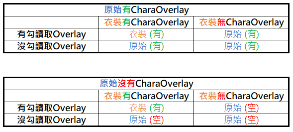
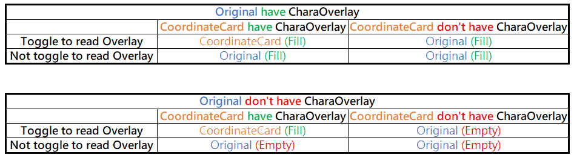

+++
title = "[Koikatu] 角色 Overlay 服裝變換 (Chara Overlays Based On Coordinate)"
description = "[Koikatu] 角色 Overlay 隨服裝變換 (Chara Overlays Based On Coordinate)"
date = 2020-01-14T15:58:00.029Z
updated = 2021-11-16T01:07:20.463Z
draft = false
aliases = [
  "/2020/01/koikatu-chara-overlays-based-on-coordinate.html",
  "/2020/01/koikatubepinex-v5x-overlay-iris-overlay.html"
]

[taxonomies]
tags = [ "Koikatu" ]

[extra]
banner = "../preview/demo10.gif"
archive = """
KSOX自v6.0起將此插件標為不相容 
它重新實作了此插件的主要功能，但沒有做「存入衣裝存檔」功能，並且沒有任何向後兼容方案 
如果你曾使用此插件創作作品，很遺憾，我們倆一起被Marco拋棄了 
你過往的作品無法再讀取，也再也無法把角色Overlay存入衣裝卡中 
 
我沒有選擇，你也沒有。"""
+++

> 2021/11/16 訊息  
> Marco 在[這個 commit](https://github.com/ManlyMarco/Illusion-Overlay-Mods/commit/6a18038131bd19743522871b25184e9acafd5738) 補上了舊插件資料轉換  
> 其中實作了圖像轉換，並捨棄掉單眼相關的儲存數據
>
> 另外它看似會覆寫 KSOX 本身的儲存數據
>
> 在這 8 個月的缺口內，你在 KSOX v6.0\~v6.0.5 所做的修改或許會出問題  
> 去檢查下你的老婆變成什麼模樣了吧！

{{ video(url="../preview/demo10-2.mp4", alt="Chara Overlays Based On Coordinate video", controls=true, loop=true, autoplay=true, muted=true) }}

* 讓所有角色 Overlay (Iris、Face、Body Overlay) 隨著服裝變更，反映在人物存檔和服裝存檔上
* 此插件在「讀存」跟「切換服裝」時覆蓋 Overlay，依賴 KSOX 運作
* **Iris Overlay 可選只覆蓋在單眼**，可用此功能做異色瞳
* {{cg(body="支援資源重用")}}，同樣的貼圖重複使用時只會佔一份空間
* <b>{{cg(body="產生的存檔可以和「無此插件的遊戲環境」相容")}}</b>，最後 KSOX 儲存的 Overlay 會被載入  
  (存檔時，當前套用的 Overlay 依然會儲存進去，並在無插件環境時被讀取出來)
<!-- more -->
## 注意事項

1. 特別需求 **KKAPI v1.9.5 & Illusion Overlay Mods v5.1.1** 以上版本
2. **預設不啟用服裝存檔功能，請至 Configuration Manager 確認所有儲存設定**
3. 以下狀況會顯示警示訊息 (警示可關閉)
   * 存角色時有 Overlay 未被儲存
   * 存服裝時存入了「全無 Overlay」狀態  
     (如果開啟了服裝 Coordinate 儲存功能，但是卻沒有存入任何角色 Overlay，載入時就會發生如「清除角色 Overlay」的效果)
4. 強烈建議**只在需要時開啟服裝儲存**功能
5. v1.2.3 後的版本產生的存檔不能在更舊的版本中讀取，請更新

## 換衣邏輯圖

## 需求依賴

* コイカツ！ ダークネス (Koikatu! Darkness)  
  這不相容於 Steam Koikatsu Party
* **BepInEx v5.1** (不支援 v5.0.X)
* BepisPlugins r15
* **KKAPI v1.13**
* **Illusion Overlay Mods v5.2 \~ v5.2.1**

## 安裝方式

* 將 \*.dll 放至「BepInEx/plugins/jim60105」資料夾之下

## 下載位置

<https://cloud.maki0419.com/s/rysioANejRAMBeZ>
