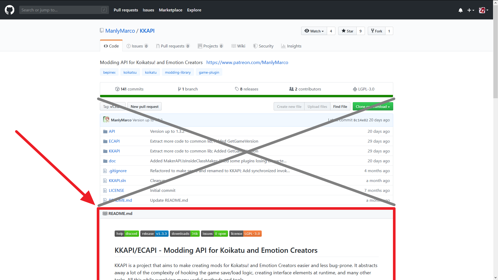
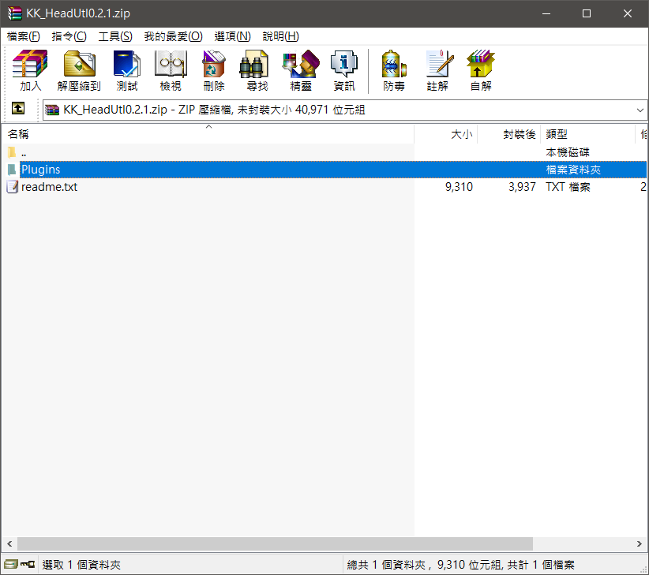
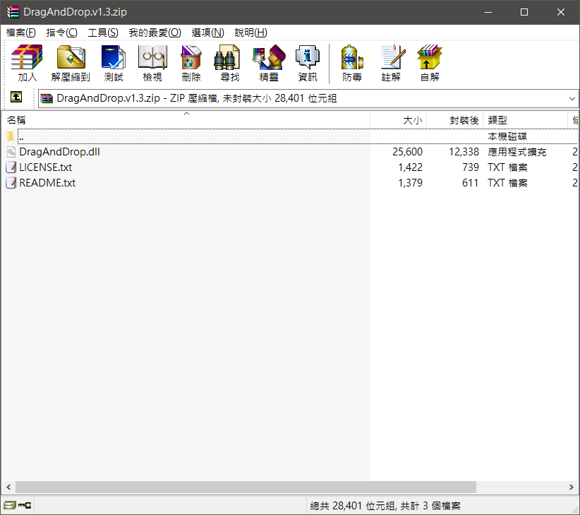

+++
title = "[Koikatu] コイカツ！ 插件安裝方式、問題判斷及排除指南"
description = "[Koikatu] コイカツ！ 插件安裝方式、問題判斷及排除指南"
date = 2019-07-09T08:20:00.054Z
updated = 2022-12-16T10:49:51.007Z
draft = false
aliases = [ "/2019/07/koikatu-install-and-debug-guide.html" ]

[taxonomies]
tags = [ "Koikatu", "Koikatsu Sunshine" ]

[extra]
card = "preview.png"
iscn = "iscn://likecoin-chain/BWUPj2auEdhCyjxSlZLITl4hEvRxPdMB1nkHjyS6wGs/1"
hot = true
+++

[](preview.png)

「大佬，為什麼我安裝了 ☆☆☆ 以後都沒有反應啊?」  
「請問進遊戲在 @%@% 處白屏了怎麼辦」  
「求救，我安裝了超級無敵終極霹靂宇宙第一天上天下唯我獨尊整合包，加上了不知道哪裡來的一堆插件，然後遊戲打不開」

我怎麼知道? 我又不會通靈 σ ﾟ∀ ﾟ) ﾟ∀ﾟ)σ

這篇文章要告訴你這些插件的正確安裝方式、遇到問題的檢測流程，以及如何給出足夠的錯誤資訊讓別人幫你
<!--more-->
## 正確的下載插件

### GitHub

大部分的插件都是發佈在 GitHub 上，我遇到很多天兵把源碼下載回來蓋進遊戲目錄，然後問說他怎麼不動。請務必按此流程操作:

1. {{cr(body="閱讀作者的 Readme!!!!!!!!!!!!!!!!!!")}}  
   [](2.png)  
   所有的重要事項都會寫在這裡  
   說明事項大部分都是簡單英語，有小學水平就該能讀個大概  
   讀不懂就把翻譯機拿出來用  
   更別說有的發布者是直接把下載連結放在 Readme 裏頭  
   [](3.png)
2. {{cr(body="查看 Release")}}，那是發佈的意思。通常插件開發到一段落，開發者就會釋出一版 Release 給使用者  
   (其中打叉的部分是源碼，通常裏頭沒有你要的東西)  
   [](4.png)

   Release 頁，檔案一般會放在 **Latest Release** 的 **Assets** 裡面 (最底下打叉的倆 Source Code 是源碼)  
   因為發布格式都是自由的，有些人是做一整包，有些人是分很多項目，也有的人發 Release 不會把所有插件包一起  
   關鍵是多看頁面上的文字做判斷  
   [](5.png)

### Patreon

Patreon 是一個可以讓各位斗內開發者的平台，不少大佬會在這裡發東西  
一般來說是拉到頁面最下面，{{cr(body="尋找迴紋針圖示的夾帶檔案")}}  
同樣，上方的 Readme 非常重要，請重點閱讀  
{{cg(body="(右側綠框是斗內按鈕，請踴躍投錢讓程序猿買香蕉)")}}

[](6.png)

### Mega

Mega 如果不會下載，我應該幫不到你

[](7.png)

### uploader.jp

日本人喜歡把東西發佈在這裡  
日本開發者不喜歡用 BepInEx 和 sideloader 插件，{{cr(body="需要特別注意是不是 IPA 或者 Hardmod 形式")}}  
選擇要下載的插件

[](8.png)

拉到下面按這個日文的下載按紐

[](9.png)

**再點一次「Download Now」才會開始下載**

[](10.png)

## 正確的安裝插件

東西下載到了，接下來講安裝  
插件一般會有幾種形式:

### \*.dll

遇到 dll 副檔名，請判斷他是 BepInEx4 插件還是 BepInEx5 插件  
如果發布時間在 2019/10/23 以前，那他大概是個 BepInEx4 插件

但少部分是 IPA 插件，IPA 插件要放在「遊戲根目錄\Plugins」資料夾

> 更多詳細請參考
>
> ---
> [コイカツ！ BepInEx框架 v4.X→v5.X升級指南](@/Koikatu/bepinex-upgrade-guide/index.md)

[](../bepinex-upgrade-guide/1.png)

[](../bepinex-upgrade-guide/2.png)

### \*.zip

這是一個壓縮檔，遇到這壓縮檔有數種情況需要判斷

1. 裡頭包含一個「manifest.xml」:  
   他是一個 Sideloader mod，{{cr(body="不要解開")}}，直接把他放到「遊戲根目錄\mods」資料夾下即可  
   [](13.png)
2. 很明顯包含了「BepInEx」，同時也可能有「mods」和「UserData」資料夾，但不包含其他遊戲目錄文件:  
   直接蓋進遊戲目錄  
   [](14.png)
3. 有一個「Plugins」資料夾:  
   他很有可能是一個 IPA 插件，請詳細閱讀 Readme 看是否有任何說明  
   Plugins 資料夾也是直接蓋進遊戲目錄 (沒有 Plugins 目錄就自己新增)  
   [](15.png)
4. **包含了遊戲目錄，但並不是上述幾種情況**，且安裝說明叫你蓋進遊戲目錄  
   <b>{{cr(body="注意！這是一個 Hard mod！")}}</b> 建議按照[這篇說明](https://github.com/bbepis/BepisPlugins/wiki/Creating-.zip-mods)將他 sideloader 化，或是直接丟了  
   [](16.png)
5. 其他情況，就自己判斷囉  
   [](17.png)

### \*.zipmod

其實他跟 zip 是一樣的東西，但是他絕對是一個 sideloader mod  
{{cr(body="不要解開")}}，直接把他放到「遊戲根目錄\mods」資料夾下  
你如果用壓縮軟體去開，會發現他跟前面那個是一樣的結構

[](18.png)

### \*.rar、\*.7z

他就是一個壓縮檔  
看都不用看，我給你三秒把他解壓縮

> 安裝還有一點要注意，那就是**依賴**  
> 大部分的人如果不是死在安裝出錯，就是死在依賴沒裝對  
> 而這些全都會寫在插件的 Readme 裡頭  
> 並且請特別{{cr(body="特別注意版本號")}}!!!!!!!!!!!!!!!!!!!!!!

## 簡述除錯方式

你很努力地安裝完成了，但是他依然沒有正確運作 {{ch(body="(或是程序猿出錯讓他故障了⊂彡☆))д\`))")}}

這時候請檢查 output\_log，裡面會有運行時產生的所有輸出資訊

> 「Koikatu」本篇遊戲 和 捏人: 「遊戲根目錄\Koikatu\_Data\output\_log.txt」  
> 「CharaStudio」工作室: 「遊戲根目錄\CharaStudio\_Data\output\_log.txt」
>
> 如果你要向任何人尋求協助  
> {{cr(body="務必提供這個檔案")}}  
> {{ch(body="我真的不會通靈")}}

這個檔案會在每次程式重新啟動時被重新產生

**如果檔案太大**，請這麼做:

將遊戲關閉重啟  
→ 再次觸發錯誤讓他確實記錄  
→ 直接關閉遊戲  
→ 之後將此檔案備份出來保存

### 開啟 command line 視窗

1. 除錯時建議開啟 command line 視窗  
   編輯「遊戲根目錄\BepInEx\config\BepInEx.cfg」檔案，將 \[Logging.Console] 和 \[Logging.Disk] 底下這兩個啟用  
   [](19.png)
2. 若你有安裝 VNEngine，可能還需再修改此處 (沒有安裝就跳過)  
   編輯「遊戲根目錄\BepInEx\plugins\Console\Lib\vngameengine.ini」檔案，將 \[Options] 的 HideConsoleAfterStart 改為 0 或 2  
   [](20.png)

### 簡述 output log

首先開頭紀錄了你的系統資訊，還有遊戲主文件的載入資訊  
如果你的 log 在這裡載入就卡住了，代表根本連主遊戲都沒起來

```
Initialize engine version: 5.6.2f1 (a2913c821e27)
GfxDevice: creating device client; threaded=1
Direct3D:
    Version:  Direct3D 11.0 [level 11.1]
    Renderer: NVIDIA GeForce GTX 1060 3GB (ID=0x1c02)
    Vendor:   NVIDIA
    VRAM:     2988 MB
    Driver:   26.21.14.3200
Begin MonoManager ReloadAssembly
Platform assembly: C:\illusion\Koikatu\CharaStudio_Data\Managed\UnityEngine.dll (this message is harmless)
Loading C:\illusion\Koikatu\CharaStudio_Data\Managed\UnityEngine.dll into Unity Child Domain
.
.
.(省略)
Loading C:\illusion\Koikatu\CharaStudio_Data\Managed\Vectrosity.dll into Unity Child Domain
- Completed reload, in  0.025 seconds
```

接著是 BepInEx 和外掛插件載入  
這裡可以確認插件清單和版本，判斷安裝資訊就看這段  
如果插件放錯位置應該是炸在這

```
[Message:Preloader] BepInEx 5.0.1.0 - CharaStudio
[Info:Preloader] Running under Unity v5.6.2.10654012
[Info:Preloader] CLR runtime version: 2.0.50727.1433
[Info:Preloader] Supports SRE: True
[Message:Preloader] Preloader started
[Info:Preloader] Loaded 1 patcher methods from BepInEx.BepIn4Patcher, Version=1.0.0.0, Culture=neutral, PublicKeyToken=null
[Info:Preloader] Loaded 1 patcher methods from BepInEx.IPAHarmonyShimmer, Version=1.2.2.0, Culture=neutral, PublicKeyToken=null
[Info:Preloader] Loaded 1 patcher methods from BepInEx.IPAVirtualizer, Version=1.2.2.0, Culture=neutral, PublicKeyToken=null
[Info:Preloader] Loaded 1 patcher methods from DemystifyExceptions, Version=1.0.1.0, Culture=neutral, PublicKeyToken=null
[Info:Preloader] 5 patcher plugin(s) loaded
[Info:Preloader] Shimming IPA plugins
[Info:Preloader] Patching [UnityEngine] with [BepInEx.Chainloader]
[Info:Preloader] Starting BepInEx4 Migrator!
[Info:Preloader] Initializing BepInEx 4
[Info:Preloader] Patching [Assembly-CSharp] with [BepInEx.IPAHarmonyShimmer.HarmonyShimmer]
[Info:Preloader] Patching [Assembly-CSharp] with [BepInEx.IPAVirtualizer.IPAVirtualizer]
[Message:Preloader] Preloader finished
[Message:BepInEx] Chainloader ready
[Message:BepInEx] Chainloader started
[Info:BepInEx] 137 plugins to load
[Warning:BepInEx] Skipping because of process filters [Character Replacer 1.6.1]
[Warning:BepInEx] Skipping because of process filters [HeightBarX 3.3]
.
.(省略)
[Warning:BepInEx] Skipping because of process filters [Add mob characters to roam mode 1.0]
[Info:BepInEx] Loading [UnityConsole 0.1.0.0]
.
.
.(省略)
```

接著是 Sideloader mods 載入，關於 sideloader mod 的錯誤要查這裡  
**請檢查這些「Multiple versions detected, only "...." will be loaded. Skipped versions: "...."」**  
這是說有重覆的插件存在，系統從中挑了一個載入。  
你最好手動移除舊的，因為它不一定是挑了對的那一個。

```
[Info:Sideloader] Found 1296 zipmods in directory: C:\illusion\Koikatu\mods
Platform assembly: C:\illusion\Koikatu\CharaStudio_Data\Managed\I18N.West.dll (this message is harmless)
[Warning:Sideloader] Multiple versions detected, only "Sideloader Modpack - Compatibility Pack\murara\[murara]kimono_jacket_t.zipmod" will be loaded. Skipped versions: "Sideloader Modpack - Compatibility Pack\[murara]Kimono Jacket.zipmod"
[Warning:Sideloader] Multiple versions detected, only "Sideloader Modpack - Compatibility Pack\[murara]Shoulder Over Jacket v1.0.zipmod" will be loaded. Skipped versions: "Sideloader Modpack - Compatibility Pack\murara\[murara]jacket_acc v1.0.zipmod"
.
.
.(省略)
[Info:Sideloader] Successfully loaded 1284 mods out of 1296 archives in 3224ms
[Warning:Sideloader] Could not load 12 mods, see previous warnings for more information. File names of skipped archives:
Sideloader Modpack\[Mysto]Modpack v1.0.5 (edit).zipmod | ...(省略)
```

在 plugin 載入中，可注意 KKAPI 這邊

```
[Info:BepInEx] Loading [Modding API 1.11.1]
Non platform assembly: C:\illusion\Koikatu\BepInEx\plugins\KKAPI.dll (this message is harmless)
[Debug:Modding API] Game version 5.1 running under en-US culture
[Debug:Modding API] Installed DLC: 01 02 03 04 05 06 08 09 10 11 12 13 14 15 16 17 18 19 20 21 22 23 24 25 26 50 51 52 53 54 55 56 100
[Debug:Modding API] Processor: Intel(R) Core(TM) i5-9400F CPU @ 2.90GHz (6 threads @ 2904MHz); RAM: 16301MB (53% used); OS: Windows 10  (10.0.0) 64bit
```

IPA 載入

```
[Info:BepInEx.IPALoader] ----------------------------------------
[Info:BepInEx.IPALoader] IPALoader found 2 plugins in "C:\illusion\Koikatu\Plugins"
[Info:BepInEx.IPALoader] KK_GaugeSlider: 0.2.2
[Info:BepInEx.IPALoader] KK_HeadUtl: 0.2.1
[Info:BepInEx.IPALoader] ----------------------------------------
```

最後 Studio 載入完成

```
[Debug:Modding API] SceneManager.activeSceneChanged - from  to Studio
[Debug:Modding API] SceneManager.sceneLoaded - Studio in Single mode
```

遊戲中不時會跑一些不重要資訊，像是下面這種完全可以忽略

(這個說的是他做了內存整理)

```
Unloading 2166 unused Assets to reduce memory usage. Loaded Objects now: 23654.
Total: 124.891304 ms (FindLiveObjects: 1.418400 ms CreateObjectMapping: 0.852400 ms MarkObjects: 121.572800 ms  DeleteObjects: 1.046500 ms)
```

接下來就是觸發你的錯誤  
看他有沒有跳 Error，或者是 LOG 斷在哪裡，死機在哪裡來進行判斷  
基本上都是按照錯誤資訊來判斷而已

舉個例子

```
[Error] IsolatedStorageException: Could not find file "C:\illusion\Koikatu\UserData\chara\female\Koikatu_F_20181202110656420".
[Error] Stack trace:
System.IO.FileStream..ctor (string,System.IO.FileMode,System.IO.FileAccess,System.IO.FileShare,int,bool,System.IO.FileOptions) <0x007ae>
System.IO.FileStream..ctor (string,System.IO.FileMode,System.IO.FileAccess,System.IO.FileShare,int,bool,bool) <0x00059>
(wrapper dynamic-method) System.IO.FileStream..ctor_Patch1 (object,string,System.IO.FileMode,System.IO.FileAccess) <0x0006c>
ModDiscover.Hooks.LoadCharaFilePostHook (ChaFileControl,bool,string,byte,bool,bool,bool,bool,bool) <0x0017b>
(wrapper dynamic-method) ChaFileControl.LoadFileLimited_Patch3 (object,string,byte,bool,bool,bool,bool,bool) <0x002fc>
HSUS.HSUS.LoadCustomDefault (string) <0x0009e>
HSUS.HSUS.<onlevelwasinitialized>b__52_0 () <0x00124>
ToolBox.Extensions/<executedelayed_routine>d__15.MoveNext () <0x0007e>
UnityEngine.SetupCoroutine.InvokeMoveNext (System.Collections.IEnumerator,intptr) <0x00058>
```

首先聲明這是很久遠的案例了，現在的 KKUS 應沒有這個事情

從這個錯誤可以看到是 HSUS 發生了 **IO 相關**的錯誤，而資訊是說他找不到某個角色存檔

從報錯位置看出他是發生在進入女編輯器，剛載入後發生，且 function 名稱有個 **LoadCharaFile**PostHook 字眼

判斷:
應該是那個更改預設載入角色的功能，因為我把設定的角色卡移除了，他找不到才跳這個錯

大概就是這種感覺

最後祝各位都能順利安裝、順利除錯
