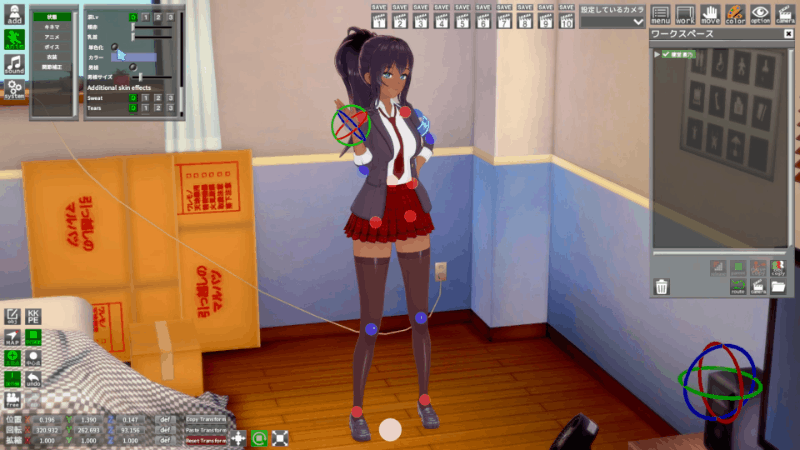
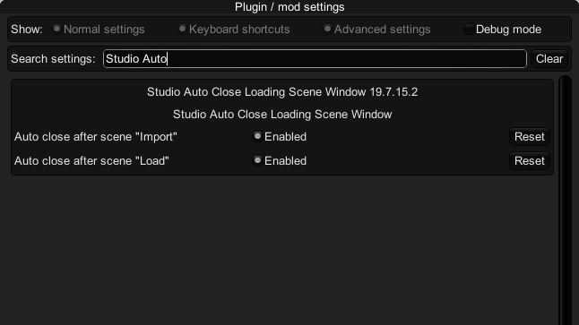
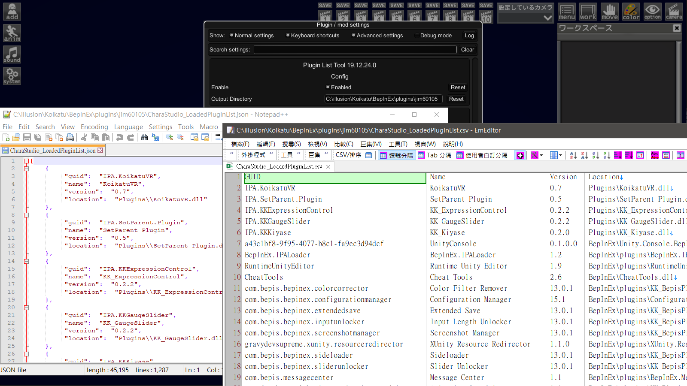
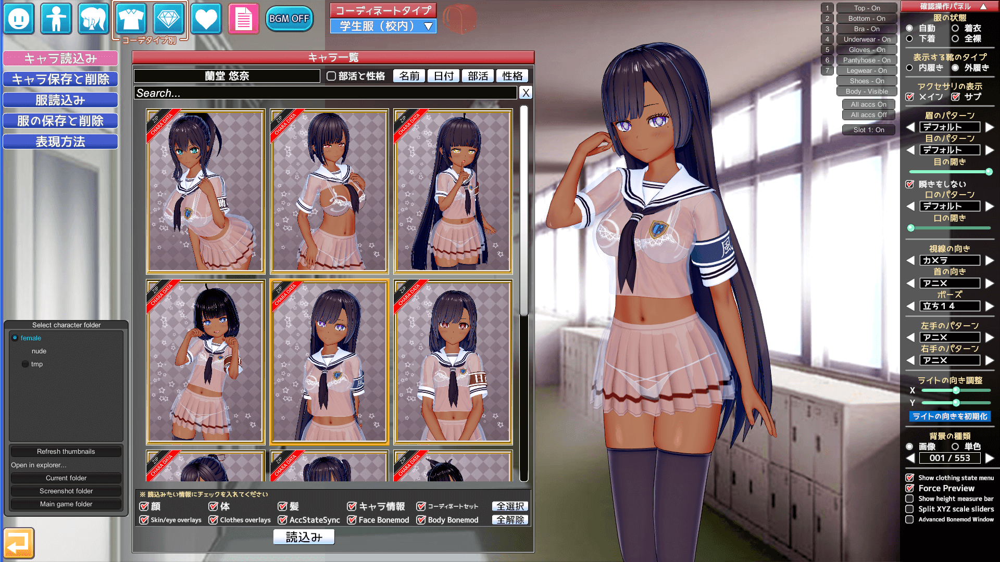
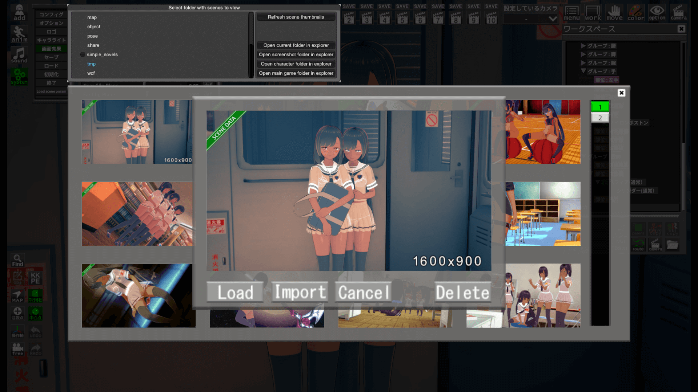
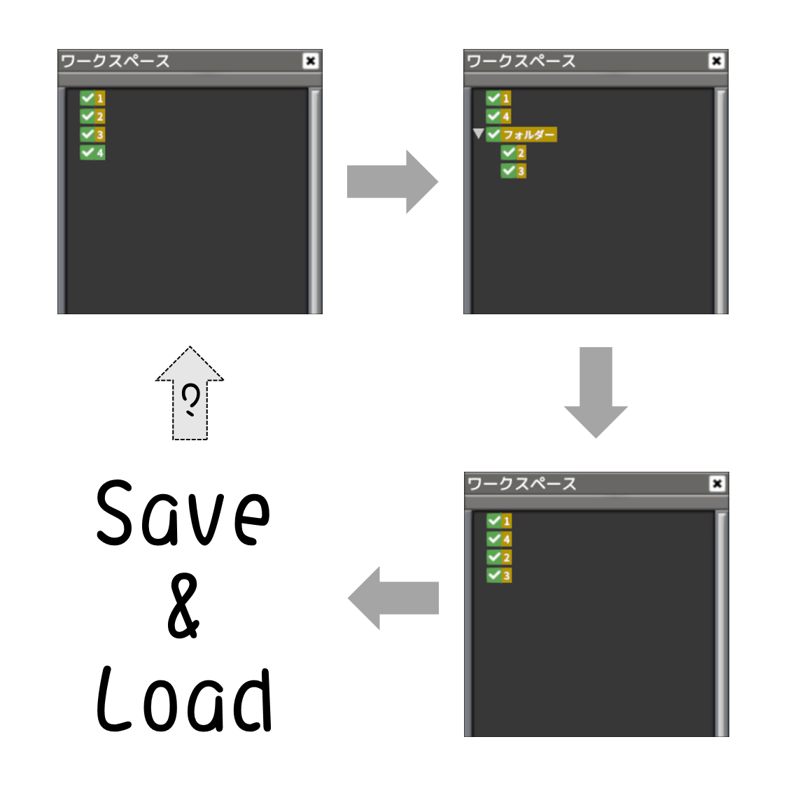
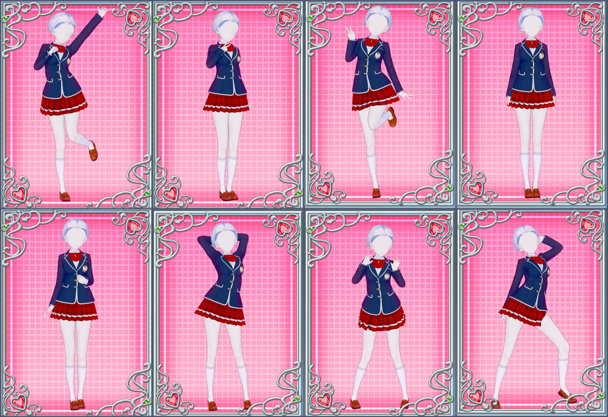
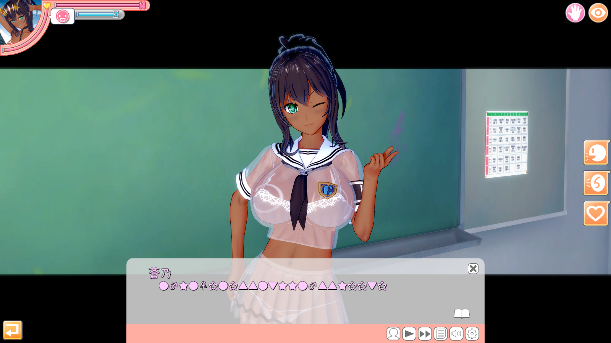

+++
title = "[Koikatu] コイカツ！ 個人插件介紹匯整 (Koikatsu Sunshine / 戀愛活動) "
description = "此文列出我所有的 Koikatu 插件作品。"
date = 2020-07-28T19:44:00.072Z
updated = 2023-05-19T14:01:59.489Z
draft = true
aliases = [ "/2020/05/personal-koikatu-plugin.html" ]

[taxonomies]
tags = [ "Koikatsu Sunshine", "Koikatu", "C#" ]

[extra]
banner = "CharaStudio-2019-12-22-14-45-35-Render.JPG"
featured = true
scripts = [ "Koikatu/personal-koikatu-plugin/flip-button.js" ]
+++

<figure>
{{ image(url="CharaStudio-2019-12-22-14-45-35-Render.JPG") }}
<figcaption>(角色是我家的，但是原始Scene不是我做的)</figcaption>
</figure>


以下所有插件皆為 **BepInEx 5** 插件，且以 **Darkness** 為基準程式碼開發

如果遇到安裝問題，請參考這篇  
[コイカツ! 插件安裝方式、問題判斷及排除指南](@/Koikatu/install-and-debug-guide/index.md)

**更新記錄**請見  
**アップデートログ**はこちら  
Click here for **update logs**  
[>> コイカツ！ 個人插件更新記錄 <<](@/Koikatu/plugin-update-logs/index.md)
<!--more-->

<!--語言切換FlipButton-->

  中文
  日本語
  English

  <!--中文-->
  

    <h2><a href="/2019/03/koikatu-studio-coordinate-load-option.html" target="_blank">服裝卡選擇性載入插件</a></h2>
    載入服裝卡片時，可以選擇要載入的細項，包括飾品個別選擇 
    
<video
             class="video-js" controls="" data-setup="{}" loop="loop" preload="auto"
             style="height: 100%; left: 0; position: absolute; top: 0; width: 100%;">
        <source src="../demo1.mp4" type="video/mp4">
        </source>
      </video>

    <h2><a href="/2019/04/koikatu-studio-all-girls-plugin.html" target="_blank">Studio跨性別讀取</a></h2>
    實現Studio跨性別替換角色功能 
    

    <h2><a href="/2019/04/koikatu-studio-simple-color-on-girls.html" target="_blank">Studio女體單色化插件</a></h2>
    使女性支持單色化功能 
    

    <h2><a href="/2019/05/koikatu-studio-chara-only-load-body.html" target="_blank">Studio換人插件</a></h2>
    保留衣服和飾品，只替換人物 
    

    <h2><a href="/2019/05/koikatu-studio-reflect-fk-fix.html" target="_blank">Studio IK→FK修正插件</a></h2>
    修正「IK→FK」功能會重置手勢和脖子的問題，並增加了一個複製當前脖子方向到FK「→FK(首)」的功能 
    
<video
             class="video-js" controls="" data-setup="{}" loop="loop" poster="../demo5-3.png" preload="auto"
             style="height: 100%; left: 0; margin-left: 1em; margin-right: 1em; position: absolute; top: 0; width: 100%;">
        <source src="../demo5-1.mp4" type="video/mp4">
        </source>
      </video>

    
<video
             class="video-js" controls="" data-setup="{}" loop="loop" poster="../demo5-4.png" preload="auto"
             style="height: 100%; left: 0; margin-left: 1em; margin-right: 1em; position: absolute; top: 0; width: 100%;">
        <source src="../demo5-2.mp4" type="video/mp4">
        </source>
      </video>

    <h2><a href="/2019/06/koikatu-studio-text-plugin.html" target="_blank">Studio文字插件</a></h2>
    在Studio內添加文字物件 
    
<video
             class="video-js" controls="" data-setup="{}" loop="loop" poster="../demo6-2.JPG" preload="auto"
             style="height: 100%; left: 0; margin-left: 1em; margin-right: 1em; position: absolute; top: 0; width: 100%;">
        <source src="../demo6.mp4" type="video/mp4">
        </source>
      </video>

    <h2><a href="/2019/07/koikatu-studio-auto-close-loading-scene-window.html" target="_blank">Studio自動關閉Scene載入視窗</a>
    </h2>
    Studio Load Scene視窗處，在Import或Load後可以自動關閉視窗 
    

    <h2><a href="/2020/01/koikatubepinex-v5x-plugin-list-tool.html" target="_blank">插件清單工具</a></h2>
    導出當前遊戲中<b>已加載的</b>BepInEx插件和IPA插件清單 
    

    <h2><a href="/2020/01/koikatu-fbi-open-up.html" target="_blank">開門查水表！</a></h2>
    此插件可依照原始角色，將她們向模板角色轉變。預設為蘿化，也可以用來做三頭身化。 
    
<iframe
              allowfullscreen="" class="YOUTUBE-iframe-video" data-thumbnail-src="../demo9.png" frameborder="0"
              src="https://www.youtube.com/embed/0-286KH6ZQA?feature=player_embedded"
              style="height: 100%; left: 0; position: absolute; top: 0; width: 100%;"></iframe>

    <h2><a href="/2020/01/koikatubepinex-v5x-overlay-iris-overlay.html" target="_blank">角色Overlay隨服裝變換</a></h2>
    讓所有角色Overlay(Iris、Face、Body Overlay)隨著服裝變更，反映在人物存檔和服裝存檔上 
    
<video
             class="video-js" controls="" data-setup="{}" loop="loop" preload="auto"
             style="height: 100%; left: 0; position: absolute; top: 0; width: 100%;">
        <source src="../demo10-2.mp4" type="video/mp4">
        </source>
      </video>

    <h2><a href="/2020/02/koikatubepinex-v5x-png-capture-size.html" target="_blank">PNG存檔尺寸調整工具</a></h2>
    可調所有PNG存檔的拍照尺寸、調整Maker中的檔案選擇器顯示列數、放大Studio SceneData選擇器的選中預覧、給PNG存檔加上浮水印角標 
    

    

    <h2><a href="/2020/02/koikatubepinex-v5x-studio-studio-chika.html" target="_blank">Studio千佳替換器</a></h2>
    一鍵把Studio內的所有女角色都換成千佳(預設角色)，並保留原始人物的身形數據 
    

    <h2><a href="/2020/03/koikatubepinex-v5x-studio-studio-chara.html" target="_blank">Studio角色光綁定視角</a></h2>
    將Studio角色光和視角間之旋轉值連動，詳見預覧對比 
    
<video
             class="video-js" controls="" data-setup="{}" loop="loop" preload="auto"
             style="height: 100%; left: 0; position: absolute; top: 0; width: 100%;">
        <source src="../demo13.mp4" type="video/mp4">
        </source>
      </video>

    <h2><a href="/2020/03/koikatubepinex-v5x-studio-studio-dual.html" target="_blank">Studio雙螢幕</a></h2>
    啟用Studio的第二顯示器功能，<b>必需要有實體雙顯示器才能使用 
    </b>
    
<video
             class="video-js" controls="" data-setup="{}" loop="loop" preload="auto"
             style="height: 100%; left: 0; position: absolute; top: 0; width: 100%;"> 
        <source src="../demo14.mp4" type="video/mp4">
        </source> 
      </video>
 
    <h2><a href="/2020/05/koikatubepinex-v5x-studio-studio-save.html" target="_blank">Studio儲存工作區順序修正</a></h2>
    以Studio的存檔邏輯，工作區中，在第一層之物件排序是以加入順序儲存 → 修改為以實際順序儲存 
    

    <h2><a href="/2020/05/koikatubepinex-v5x-studio-studio-body.html" target="_blank">Studio角色覆寫腳本</a></h2>
    一鍵覆寫角色身體 
    
<video
             class="video-js" controls="" data-setup="{}" loop="loop" preload="auto"
             style="height: 100%; left: 0; position: absolute; top: 0; width: 100%;">
        <source src="../demo15.mp4" type="video/mp4">
        </source>
      </video>

    <h2><a href="/2020/05/koikatubepinex-v5x-transparent.html" target="_blank">透明背景</a></h2>
    透明視窗和背景，可顯示和點擊視窗下的東西 
    
<iframe
              allowfullscreen="" class="YOUTUBE-iframe-video"
              data-thumbnail-src="https://i.ytimg.com/vi/1ooTUL_F4_s/0.jpg" frameborder="0"
              src="https://www.youtube.com/embed/1ooTUL_F4_s?feature=player_embedded"
              style="height: 100%; left: 0; position: absolute; top: 0; width: 100%;"></iframe>

    <h2><a href="/2020/06/koikatubepinex-v5x-save-load-compression.html" target="_blank">存檔壓縮</a></h2>
    使用LZMA對CharaFile、CoordinateFile、Studio SceneData存檔做壓縮 
    
 

    <h2><a href="/2020/06/koikatubepinex-v5x-coordinate-capture.html" target="_blank">服裝拍攝姿勢解鎖</a></h2>
    解除拍照服裝存檔時的姿勢限制 
    
 

    <h2><a href="/2020/09/koikatu-studio-menu-scrolling-text.html" target="_blank">Studio選單跑馬燈</a></h2>
    在Studio的添加物品清單添加滾動顯示功能，並在分類清單顯示自訂文字 
    
<video
             class="video-js" controls="" data-setup="{}" loop="loop" preload="auto"
             style="height: 100%; left: 0; position: absolute; top: 0; width: 100%;">
        <source src="../demo20.mp4" type="video/mp4">
        </source>
      </video>

    <h2><a href="/2020/09/koikatu-what-are-you-saying.html" target="_blank">りしれ供さ小</a></h2>
    本年度最無用作品，核心功能是讓你看不懂他們在說啥 
    
 

  

  <!--日文-->
  

    <h2><a href="/2019/03/koikatu-studio-coordinate-load-option.html" target="_blank">Coordinate Load Option</a></h2>
    衣裝データをロードするとき、アクセサリーの個別の選択を含む、ロードする詳細を選択できます。 
    
<video
             class="video-js" controls="" data-setup="{}" loop="loop" preload="auto"
             style="height: 100%; left: 0; position: absolute; top: 0; width: 100%;">
        <source src="../demo1.mp4" type="video/mp4">
        </source>
      </video>

    <h2><a href="/2019/04/koikatu-studio-all-girls-plugin.html" target="_blank">Studio Transgender Loading</a></h2>
    これにより、Studio内のトランスジェンダーの役割置換機能を実現します。 
    

    <h2><a href="/2019/04/koikatu-studio-simple-color-on-girls.html" target="_blank">Studio Simple Color On Girls</a>
    </h2>
    女性がモノクロ機能をサポートできるようにします。  
    

    <h2><a href="/2019/05/koikatu-studio-chara-only-load-body.html" target="_blank">Studio Chara Only Load Body</a></h2>
    服とアクセサリーをそのまま、キャラクターのみを変更できる 
    

    <h2><a href="/2019/05/koikatu-studio-reflect-fk-fix.html" target="_blank">Studio Reflect FK Fix</a></h2>
    「IK→FK」機能がジェスチャーと首をリセットする問題を修正しました、現在の首の方向をFK「→FK（首）」にコピーする機能を追加した。 
    
<video
             class="video-js" controls="" data-setup="{}" loop="loop" poster="../demo5-3.png" preload="auto"
             style="height: 100%; left: 0; margin-left: 1em; margin-right: 1em; position: absolute; top: 0; width: 100%;">
        <source src="../demo5-1.mp4" type="video/mp4">
        </source>
      </video>

    
<video
             class="video-js" controls="" data-setup="{}" loop="loop" poster="../demo5-4.png" preload="auto"
             style="height: 100%; left: 0; margin-left: 1em; margin-right: 1em; position: absolute; top: 0; width: 100%;">
        <source src="../demo5-2.mp4" type="video/mp4">
        </source>
      </video>

    <h2><a href="/2019/06/koikatu-studio-text-plugin.html" target="_blank">Studio Text Plugin</a></h2>
    Studioでテキストオブジェクトを追加します。 
    
<video
             class="video-js" controls="" data-setup="{}" loop="loop" poster="../demo6-2.JPG" preload="auto"
             style="height: 100%; left: 0; margin-left: 1em; margin-right: 1em; position: absolute; top: 0; width: 100%;">
        <source src="../demo6.mp4" type="video/mp4">
        </source>
      </video>

    <h2><a href="/2019/07/koikatu-studio-auto-close-loading-scene-window.html" target="_blank">Studio Auto Close Loading
        Scene Window</a></h2>
    Studio Load Sceneウィンドウでは、インポートまたはロード後にウィンドウを自動的に閉じることができます。 
    

    <h2><a href="/2020/01/koikatubepinex-v5x-plugin-list-tool.html" target="_blank">Plugin List Tool</a></h2>
    導出當前遊戲中<b>已加載的</b>BepInEx插件和IPA插件清單 
    現在のゲームに<b>読み込まれて</b>いるBepInExプラグインとIPAプラグインのリストをエクスポートします。 
    

    <h2><a href="/2020/01/koikatubepinex-v5x-fbi-open-up.html" target="_blank">FBI Open Up</a></h2>
    このプラグインは、元のキャラクターに合わせてテンプレートキャラクターに変更。 デフォルトはロリ化です。これは三頭身化を作成するためにも使用できます。 
    
<iframe
              allowfullscreen="" class="YOUTUBE-iframe-video" data-thumbnail-src="../demo9.png" frameborder="0"
              src="https://www.youtube.com/embed/0-286KH6ZQA?feature=player_embedded"
              style="height: 100%; left: 0; position: absolute; top: 0; width: 100%;"></iframe>

    <h2><a href="/2020/01/koikatubepinex-v5x-overlay-iris-overlay.html" target="_blank">Chara Overlays Based On
        Coordinate</a></h2>
    すべてのキャラクターオーバーレイ（アイリス、フェイス、ボディオーバーレイ）を衣装で変更し、キャラクターカードや衣装カードに反映させます 
    
<video
             class="video-js" controls="" data-setup="{}" loop="loop" preload="auto"
             style="height: 100%; left: 0; position: absolute; top: 0; width: 100%;">
        <source src="../demo10-2.mp4" type="video/mp4">
        </source>
      </video>

    <h2><a href="/2020/02/koikatubepinex-v5x-png-capture-size.html" target="_blank">PNG Capture Size Modifier</a></h2>
    すべてのPNGアーカイブの写真サイズを調整し、Makerのファイルセレクターに表示される列の数を調整し、Studio
    SceneDataセレクターの選択したプレビューを拡大し、PNGアーカイブに透かしを追加します 
    

    

    <h2><a href="/2020/02/koikatubepinex-v5x-studio-studio-chika.html" target="_blank">Studio Chika Replacer</a></h2>
    ワンクリックでStudioのすべての女性キャラクターを千佳（デフォルトキャラクター）に変更し、オリジナルのフィギュアデータを保持します。 
    

    <h2><a href="/2020/03/koikatubepinex-v5x-studio-studio-chara.html" target="_blank">Studio Chara Light Linked To
        Camera</a></h2>
    Studioキャラクターライトと視野角の間の回転値をリンクします。詳細については、プレビューの比較を参照してください。 
    
<video
             class="video-js" controls="" data-setup="{}" loop="loop" preload="auto"
             style="height: 100%; left: 0; position: absolute; top: 0; width: 100%;">
        <source src="../demo13.mp4" type="video/mp4">
        </source>
      </video>

    <h2><a href="/2020/03/koikatubepinex-v5x-studio-studio-dual.html" target="_blank">Studio Dual Screen</a></h2>
    Studioのデュアルモニター機能を有効にします。<b>&nbsp;使用するには2つのモニターが必要です。 
    </b>
    
<video
             class="video-js" controls="" data-setup="{}" loop="loop" preload="auto"
             style="height: 100%; left: 0; position: absolute; top: 0; width: 100%;"> 
        <source src="../demo14.mp4" type="video/mp4">
        </source> 
      </video>

    <h2><a href="/2020/05/koikatubepinex-v5x-studio-studio-save.html" target="_blank">Studio Save Workspace Order
        Fix</a></h2>
    Studioのアーカイブロジックに基づいて、ワークスペースの最初のレイヤーのオブジェクトの順序は、追加の順序で格納されます→実際の順序で格納されるように変更されます。 
    

    <h2><a href="/2020/05/koikatubepinex-v5x-studio-studio-body.html" target="_blank">Studio Body Overwrite Script</a>
    </h2>
    ワンクリックでキャラクターのボディを上書き。 
    
<video
             class="video-js" controls="" data-setup="{}" loop="loop" preload="auto"
             style="height: 100%; left: 0; position: absolute; top: 0; width: 100%;">
        <source src="../demo15.mp4" type="video/mp4">
        </source>
      </video>

    <h2><a href="/2020/05/koikatubepinex-v5x-transparent.html" target="_blank">Transparent Background</a></h2>
    透明なウィンドウと背景、ウィンドウの下にあるものを表示してクリックできます 
    
<iframe
              allowfullscreen="" class="YOUTUBE-iframe-video"
              data-thumbnail-src="https://i.ytimg.com/vi/1ooTUL_F4_s/0.jpg" frameborder="0"
              src="https://www.youtube.com/embed/1ooTUL_F4_s?feature=player_embedded"
              style="height: 100%; left: 0; position: absolute; top: 0; width: 100%;"></iframe>

    <h2><a href="/2020/06/koikatubepinex-v5x-save-load-compression.html" target="_blank">Save Load Compression</a></h2>
    LZMAを使用して、CharaFile、CoordinateFile、Studio SceneDataアーカイブを圧縮します。 
    
 

    <h2><a href="/2020/06/koikatubepinex-v5x-coordinate-capture.html" target="_blank">Coordinate Capture Pose Unlock</a>
    </h2>
    衣装カード保存ファイルをキャプチャするときの姿勢制限を削除します。 
    
 

    <h2><a href="/2020/09/koikatu-studio-menu-scrolling-text.html" target="_blank">Studio Menu Scrolling Text</a></h2>
    Studioでアイテムリストにスクロール表示機能と文字入力機能を実現しています。 
    
<video
             class="video-js" controls="" data-setup="{}" loop="loop" preload="auto"
             style="height: 100%; left: 0; position: absolute; top: 0; width: 100%;">
        <source src="../demo20.mp4" type="video/mp4">
        </source>
      </video>

    <h2><a href="/2020/09/koikatu-what-are-you-saying.html" target="_blank">What are you saying?</a></h2>
    今年で最も役に立たないMOD、文字を読まないようにするだけ 
    
 

  

  <!--English-->
  

    <h2><a href="/2019/03/koikatu-studio-coordinate-load-option.html" target="_blank">Coordinate Load Option</a></h2>
    When loads the coordinate card, you can select the details to be loaded,
    including the individual selection of accessories. 
    
<video
             class="video-js" controls="" data-setup="{}" loop="loop" preload="auto"
             style="height: 100%; left: 0; position: absolute; top: 0; width: 100%;">
        <source src="../demo1.mp4" type="video/mp4">
        </source>
      </video>

    <h2><a href="/2019/04/koikatu-studio-all-girls-plugin.html" target="_blank">Studio Transgender Loading</a></h2>
    This will enable Studio transgender character replacement function. 
    

    <h2><a href="/2019/04/koikatu-studio-simple-color-on-girls.html" target="_blank">Studio Simple Color On Girls</a>
    </h2>
    To enable female to support the simple color
      function. 
    

    <h2><a href="/2019/05/koikatu-studio-chara-only-load-body.html" target="_blank">Studio Chara Only Load Body</a></h2>
    Keep clothes and accessories and only replace characters. 
    

    <h2><a href="/2019/05/koikatu-studio-reflect-fk-fix.html" target="_blank">Studio Reflect FK Fix</a></h2>
    Fix the problem that the "IK→FK" function will reset gestures and neck, and add a function to copy the current neck
    direction to FK. 
    
<video
             class="video-js" controls="" data-setup="{}" loop="loop" poster="../demo5-3.png" preload="auto"
             style="height: 100%; left: 0; margin-left: 1em; margin-right: 1em; position: absolute; top: 0; width: 100%;">
        <source src="../demo5-1.mp4" type="video/mp4">
        </source>
      </video>

    
<video
             class="video-js" controls="" data-setup="{}" loop="loop" poster="../demo5-4.png" preload="auto"
             style="height: 100%; left: 0; margin-left: 1em; margin-right: 1em; position: absolute; top: 0; width: 100%;">
        <source src="../demo5-2.mp4" type="video/mp4">
        </source>
      </video>

    <h2><a href="/2019/06/koikatu-studio-text-plugin.html" target="_blank">Studio Text Plugin</a></h2>
    Add text objects in Studio. 
    
<video
             class="video-js" controls="" data-setup="{}" loop="loop" poster="../demo6-2.JPG" preload="auto"
             style="height: 100%; left: 0; margin-left: 1em; margin-right: 1em; position: absolute; top: 0; width: 100%;">
        <source src="../demo6.mp4" type="video/mp4">
        </source>
      </video>

    <h2><a href="/2019/07/koikatu-studio-auto-close-loading-scene-window.html" target="_blank">Studio Auto Close Loading
        Scene Window</a></h2>
    In the Studio Load Scene window, the window can be automatically closed after
    Import or Load. 
    

    <h2><a href="/2020/01/koikatubepinex-v5x-plugin-list-tool.html" target="_blank">Plugin List Tool</a></h2>
    Export the <b>loaded</b> BepInEx plugin and IPA plugin list in the current
    game. 
    

    <h2><a href="/2020/01/koikatubepinex-v5x-fbi-open-up.html" target="_blank">FBI Open Up</a></h2>
    This plugin can change body to template chara according to the original chara. The default behavior is lolify, which can also be used to chibify. 
    
<iframe
              allowfullscreen="" class="YOUTUBE-iframe-video" data-thumbnail-src="../demo9.png" frameborder="0"
              src="https://www.youtube.com/embed/0-286KH6ZQA?feature=player_embedded"
              style="height: 100%; left: 0; position: absolute; top: 0; width: 100%;"></iframe>

    <h2><a href="/2020/01/koikatubepinex-v5x-overlay-iris-overlay.html" target="_blank">Chara Overlays Based On
        Coordinate</a></h2>
    Make all character's Overlay (Iris, Face, Body Overlay) change with the costume. Can be saved with character file
    and coordinate file. 
    
<video
             class="video-js" controls="" data-setup="{}" loop="loop" preload="auto"
             style="height: 100%; left: 0; position: absolute; top: 0; width: 100%;">
        <source src="../demo10-2.mp4" type="video/mp4">
        </source>
      </video>

    <h2><a href="/2020/02/koikatubepinex-v5x-png-capture-size.html" target="_blank">PNG Capture Size Modifier</a></h2>
    You can adjust the capture size of save files, adjust the number of rows
    displayed by the file selector in Maker, enlarge the selected preview of the Studio SceneData selector, and add
    watermarks at corners. 
    

    

    <h2><a href="/2020/02/koikatubepinex-v5x-studio-studio-chika.html" target="_blank">Studio Chika Replacer</a></h2>
    One click to change all female characters to Chika (default chan) in Studio, and retain
      the original body data. 
    

    <h2><a href="/2020/03/koikatubepinex-v5x-studio-studio-chara.html" target="_blank">Studio Chara Light Linked To
        Camera</a></h2>
    Link the rotation value between the Studio chara light and the viewing angle, see the preview comparison for
    details.
    
<video
             class="video-js" controls="" data-setup="{}" loop="loop" preload="auto"
             style="height: 100%; left: 0; position: absolute; top: 0; width: 100%;">
        <source src="../demo13.mp4" type="video/mp4">
        </source>
      </video>

    <h2><a href="/2020/03/koikatubepinex-v5x-studio-studio-dual.html" target="_blank">Studio Dual Screen</a></h2>
    To enable Studio's second monitor function, <b>you must have two physical monitors to
        use it. 
    </b>
    
<video
             class="video-js" controls="" data-setup="{}" loop="loop" preload="auto"
             style="height: 100%; left: 0; position: absolute; top: 0; width: 100%;"> 
        <source src="../demo14.mp4" type="video/mp4">
        </source> 
      </video>
 
    <h2><a href="/2020/05/koikatubepinex-v5x-studio-studio-save.html" target="_blank">Studio Save Workspace Order
        Fix</a></h2>
    Based on Studio's save file logic, the order of objects in the first layer in the workspace is stored in the order of addition → modified to be stored in the actual
      order. 
    

    <h2><a href="/2020/05/koikatubepinex-v5x-studio-studio-body.html" target="_blank">Studio Body Overwrite Script</a>
    </h2>
    Overwrite the character's body with one click. 
    
<video
             class="video-js" controls="" data-setup="{}" loop="loop" preload="auto"
             style="height: 100%; left: 0; position: absolute; top: 0; width: 100%;">
        <source src="../demo15.mp4" type="video/mp4">
        </source>
      </video>

    <h2><a href="/2020/05/koikatubepinex-v5x-transparent.html" target="_blank">Transparent Background</a></h2>
    Transparent windows and backgrounds, can display and click things under the
    windows. 
    
<iframe
              allowfullscreen="" class="YOUTUBE-iframe-video"
              data-thumbnail-src="https://i.ytimg.com/vi/1ooTUL_F4_s/0.jpg" frameborder="0"
              src="https://www.youtube.com/embed/1ooTUL_F4_s?feature=player_embedded"
              style="height: 100%; left: 0; position: absolute; top: 0; width: 100%;"></iframe>

    <h2><a href="/2020/06/koikatubepinex-v5x-save-load-compression.html" target="_blank">Save Load Compression</a></h2>
    Use LZMA to compress CharaFile, CoordinateFile, Studio SceneData save
    files. 
    
 

    <h2><a href="/2020/06/koikatubepinex-v5x-coordinate-capture.html" target="_blank">Coordinate Capture Pose Unlock</a>
    </h2>
    Remove the pose restriction when capturing the coordinate save file. 
    
 

    <h2><a href="/2020/09/koikatu-studio-menu-scrolling-text.html" target="_blank">Studio Menu Scrolling Text</a></h2>
    Add scrolling display function to the list of add&gt;&gt;items in Studio, and
    display custom text in the category list. 
    
<video
             class="video-js" controls="" data-setup="{}" loop="loop" preload="auto"
             style="height: 100%; left: 0; position: absolute; top: 0; width: 100%;">
        <source src="../demo20.mp4" type="video/mp4">
        </source>
      </video>

    <h2><a href="/2020/09/koikatu-what-are-you-saying.html" target="_blank">What are you saying?</a></h2>
    The most useless work of the year. The core function is to make you unable to read
      what they are saying. 
    
 

  

<!--語言切換FlipButton-->

  中文
  日本語
  English

