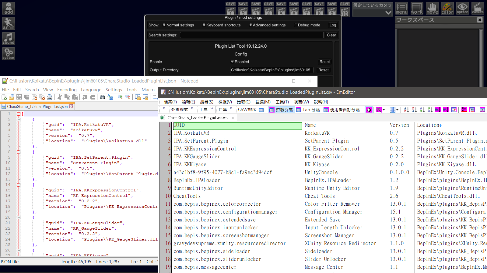

+++
title = "[BepInEx] 插件清單工具 (Plugin List Tool)"
description = "此工具可導出當前遊戲中已加載的BepInEx插件和IPA插件。"
date = 2020-01-05T10:05:00.008Z
updated = 2021-10-31T11:15:26.958Z
draft = false
aliases = [
  "/2020/01/koikatu-plugin-list-tool.html",
  "/2020/01/koikatubepinex-v5x-plugin-list-tool.html"
]

[taxonomies]
tags = [ "Koikatu", "Koikatsu Sunshine" ]

[extra]
banner = "../preview/demo8.png"
+++

* 此工具可導出當前遊戲中已加載的 BepInEx 插件和 IPA 插件
* 格式為 Json 和 CSV
* 適配 IPALoaderX v1.2 以上版本
* 重新 Enable 後會立即倒出當前加載清單

## 銘謝

此插件和 Madevil 共同開發

## 需求依賴

* **BepInEx v5.0.1**

## 安裝方式

參考壓縮檔結構，將文件放進「BepInEx/plugins/jim60105」資料夾之下

## 下載位置

<https://cloud.maki0419.com/s/bY2d4a4A4xa5Co9>
