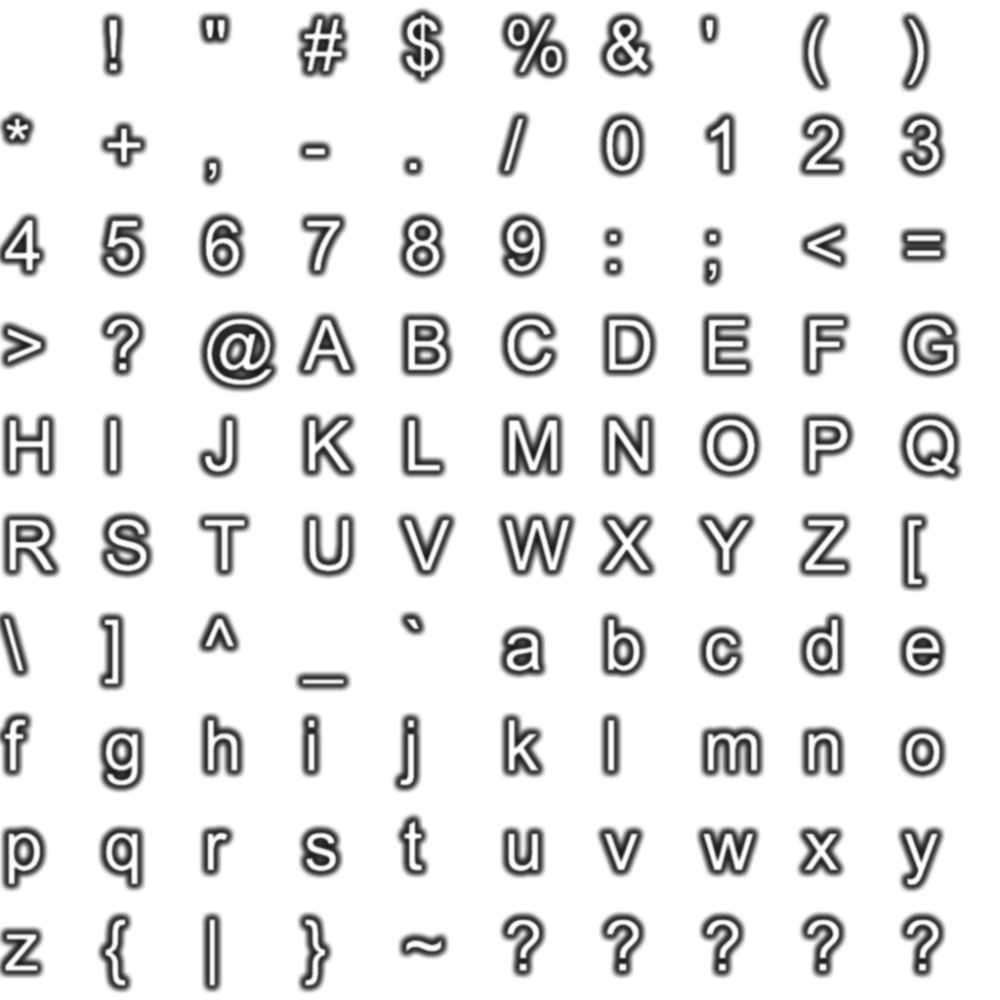

+++
title = "[Koikatu / Koikatsu Sunshine] PNG 存檔尺寸調整工具 (PNG Capture Size Modifier)"
description = "可調存檔 PNG 的拍照尺寸；可調 CharaMaker 中角色、服裝檔案選擇器的顯示列數；給角色存檔、 Studio 存檔加上浮水印角標"
date = 2020-02-16T17:08:00.021Z
updated = 2021-10-31T11:14:02.021Z
draft = false
aliases = [
  "/2020/02/koikatu-png-capture-size-modifier.html",
  "/2020/02/koikatubepinex-v5x-png-capture-size.html"
]

[taxonomies]
tags = [ "Koikatu", "Koikatsu Sunshine" ]
licenses = [ "GFDL 1.3" ]

[extra]
card = "../preview/demo11.png"
+++

> 這個插件會給你更大的預覧圖像，預設值每個存檔將會增加約 1.5MB  
> 如果你無法接受，請在 F1 設定中調整放大倍率為 1 倍，以只使用其它的功能

* 可調角色存檔、服裝存檔、Studio 存檔的拍照尺寸
* 可調 CharaMaker 中角色、服裝檔案選擇器的顯示列數
* 放大 Studio SceneData 選擇器的選中預覧
* 給角色存檔、Studio 存檔加上浮水印角標
* 可**自訂分辨率文字圖像**
* 可自訂分辨率位置、大小
* 分辨率可單獨開啟

<!-- more -->

**請至設定中調整這些功能**

## 注意

* 因為改變了存檔圖片尺寸，**強烈建議不要禁用 Studio SceneData 浮水印**，以利區分存檔 PNG 和普通截圖 PNG
* **開啟浮水印角標時分辨率不可關閉**
* 產生的存檔可以在「無此插件的遊戲環境」讀取
* 如果你不需要拍攝大圖，請至 Config 調整截圖倍率為 1 倍
* 若要客製化分辨率文字圖像，請製作如下的圖片，建議大小為 1024\*1024  
  將會使用 0\~9 和小寫 x  
  

## 需求依賴

### Koikatu

* コイカツ！ ダークネス (Koikatu! Darkness)  
  這不相容於 Steam Koikatsu Party
* **BepInEx v5.1** (不支援 v5.0.X)

### Koikatsu Sunshine

* **BepInEx v5.4.15**

## 安裝方式

* 將 \*.dll 放至「BepInEx/plugins/jim60105」資料夾之下

## 下載位置

<https://cloud.maki0419.com/s/B7GYNikLxX6at65>
