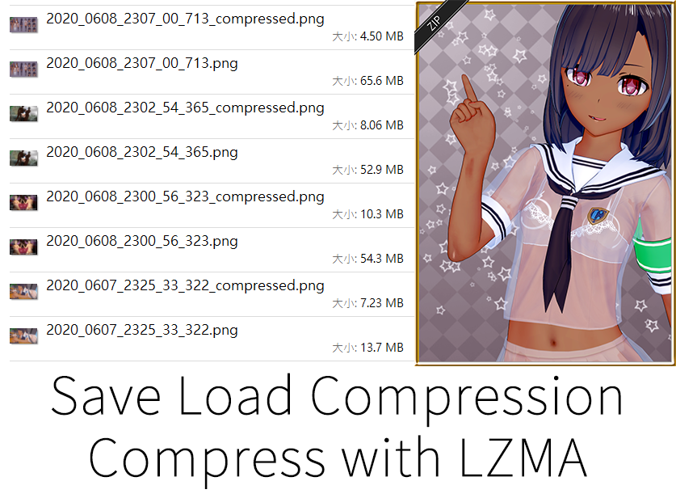
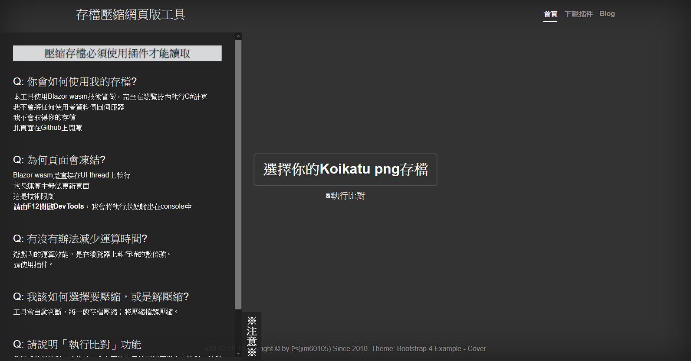
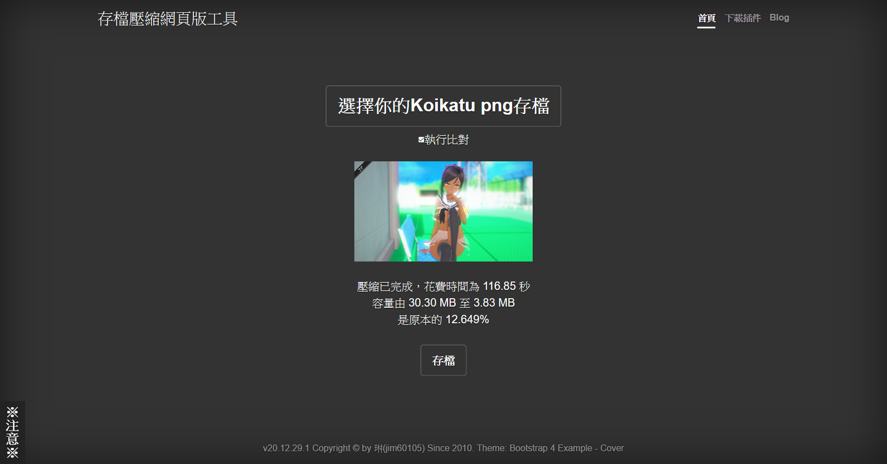
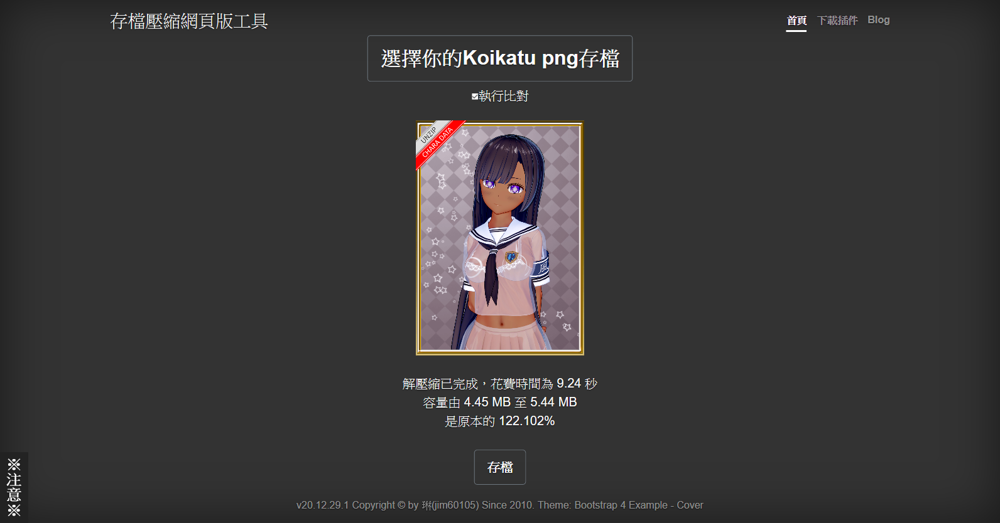

+++
title = "[Koikatu / Koikatsu Sunshine] 存檔壓縮 (Save Load Compression)"
description = "使用 LZMA 對 CharaFile、CoordinateFile、Studio SceneData 存檔做壓縮"
date = 2020-06-09T10:42:00.027Z
updated = 2021-10-31T11:11:37.299Z
draft = false
aliases = [ "/2020/06/koikatu-save-load-compression.html" ]

[taxonomies]
tags = [ "Koikatsu Sunshine", "Koikatu", "C#" ]

[extra]
card = "../demo18.png"
featured = true
+++


經過壓縮的檔案不能在無此插件的遊戲中讀取


* 使用 LZMA 對檔案做壓縮 (壓縮率因實際狀況而異，近似於將檔案以「極致壓縮」壓縮為.7z 之效果)
* 安裝後預設不開啟儲存壓縮功能，請至 ConfigurationManager 啟用
* 作用於 **CharaFile、CoordinateFile、Studio SceneData**，**不作用於 MainGame SaveData**
* 多執行緒運作，不會凍結遊戲
* 壓縮時在螢幕右下角顯示狀態
* 壓縮完成後顯示之 Message 可在 Config 關閉
* 具備 Bytes Compare 檢查，可在 Config 禁用
* 可啟用覆寫原檔功能 (這會捨棄檔名末尾的「\_compressed」，直接覆寫於原位置)
* 軟相容於:
  * InvalidSceneFileProtection v1.12.0
  * CharacterListOptimizations v1.12.0
  * DragAndDrop v1.2.0
  * CharacterReplacer v1.6.2
* Koikatsu Sunshine:  
  支援遊戲啟動時的「由 Koikatu 升級存檔至 Sunshine」功能，安裝插件後如常操作即可

## **注意**

* 要啟動儲存功能，必須要在 Config 中開啟兩個 Enable

* **經過壓縮的檔案無法在沒有此插件的遊戲中讀取**

* 帶有「\_compressed」檔名的檔案會和未壓縮的同名檔案識別為一組  
  在儲存時，**無論是選擇覆寫哪一個** **檔案，都會一併修改同名的一組檔案**

## 網頁版工具

我以 Blazor wasm 技術撰寫了網頁版工具: <https://slcweb.maki0419.com>

* 完全在瀏覧器中執行 C# 運算，不會回傳你的存檔至 server
* 自動判斷，將一般存檔壓縮；將壓縮檔解壓縮
* 在做存檔分享時，若別人不想安裝插件，可以在此網頁解壓使用
* 中 / 英文多國語系，依照瀏覧器語言設定切換

### 需求依賴

#### Koikatu

* コイカツ！ ダークネス (Koikatu! Darkness)  
  這不相容於 Steam Koikatsu Party
* **BepInEx v5.3 (不支援 v5.0.X)**

#### Koikatsu Sunshine

* **BepInEx v5.4.15**

### 安裝方式

參考壓縮檔結構，將文件放進「BepInEx/plugins/jim60105」資料夾之下

### 下載位置

<https://cloud.maki0419.com/s/agGygXXaqrLW37Q>
