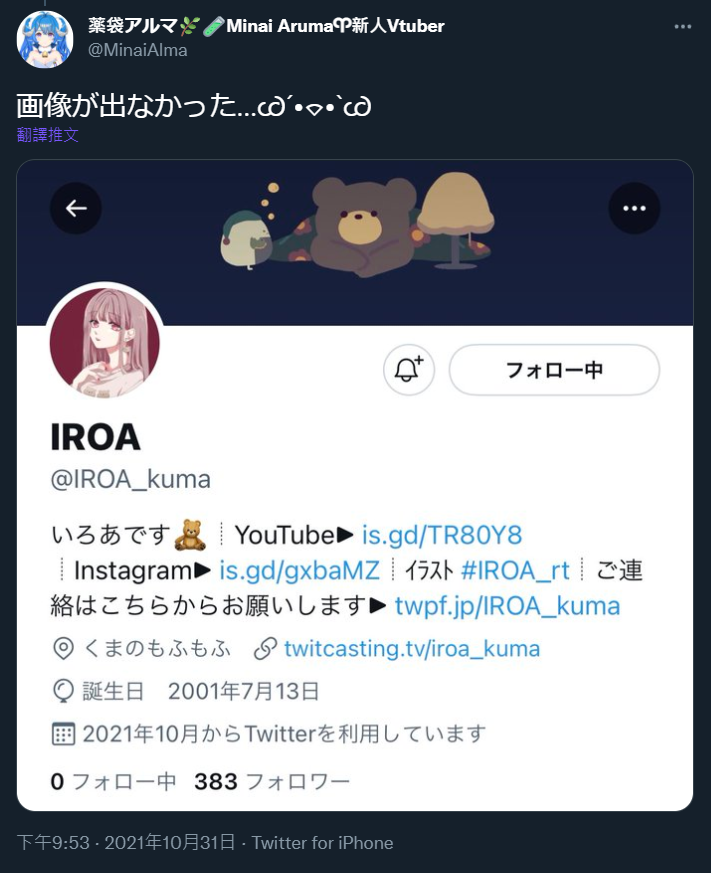
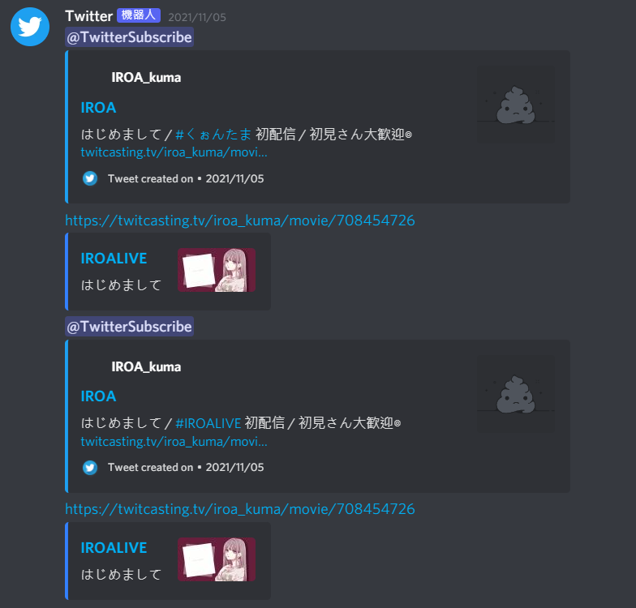
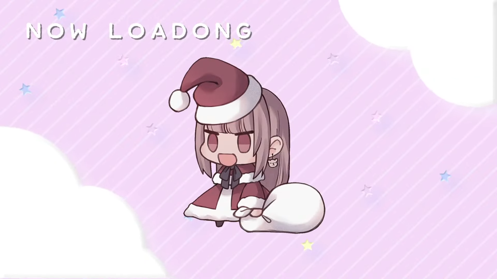

+++
title = "IROA 🧸 (音樂人) 推廣介紹專文"
description = "IROA是2021年11月出道的音樂人，在 Youtube 發表 Cover曲，在 twitcasting 平台唱歌直播。她擁有另一個 VTuber 身份，久遠たま。本文將簡單對她做推廣介紹。 "
date = 2021-12-30T19:39:00.093Z
updated = 2023-05-12T09:40:24.072Z
aliases = [ "/2021/12/iroa-kuma.html" ]

[taxonomies]
tags = [ "Livestream", "Youtube" ]
licenses = [ "GFDL 1.3" ]

[extra]
banner = "preview.png"
archive = "IROA 身份長期處於未活動狀態"
+++
<a href="https://twitter.com/millet030/status/1454877885555265537" rel="noopener" target="_blank">圖源來自Millet</a>，由 IROA 加字作為youtube橫幅

> IROA channel - YouTube  
> <https://www.youtube.com/channel/UCO3RDKQclxKAb3CxNq0MOsQ>

> IROA (いろあ) です🧸  
> いろいろな曲を投稿していきますので、ぜひチャンネル登録よろしくお願いします！  
> いづれはオリジナル曲も出せるように頑張りますっ!!

---

### 簡介

<aside>
{{ image(url="RGB.webp", no_hover=true, transparent=true, no_srcset=true) }}
</aside>

IROA 是 2021 年 11 月出道的音樂人。她在 Youtube 發表 Cover 曲；在 twitcasting 平台唱歌直播；在 twitter 分享生活點滴；在 Instagram 分享... 她的狗。  
她一直想把 IROA 塑造成可靠的大姊姊，但始終都只是個生草女孩。

IROA 擁有另一個 VTuber 身份，[久遠たま](https://www.youtube.com/c/QuonTama)。
在以久遠たま的身份活動一年多後，她創立了 IROA 的身份做為音樂人活動。  
可能有些讀者對 VTuber 不熟悉，讓我直白一點的說，在麥克風另一端唱歌的是同一個人。

> 對 VTuber 生態有興趣的讀者請見這篇介紹，文內關於 VTuber 的背景知識寫得很棒  
> 【從小生放主到世界的偶像：hololive 與旗下 Vtbuer 的奇蹟之旅】  
> <https://www.facebook.com/neilnotnepal/posts/7106066942752039>

一般來說，VTuber 提及中之人是絕對 OUT 的行為，與之相對，中之人也不會直接明說自己是某位 VTuber。  
像 IROA、久遠たま如此互相明示是非常少見的，請不要將此模式套用到其它 VTuber 的身上。  
且她在身為久遠たま時有著自己的角色設定，在互動時請多注意。

---

🧸 残響散歌 / IROA (Cover)

{{ youtube(id="4DIzrQhcMu4") }}

---

<!-- more -->

### 大事記、生草事記

* 2021/10/31  
  在久遠たま的頻道首次公開資訊，宣佈隔日活動開始  
  <https://youtu.be/xxGLsTOkxOE?t=4887>
  {{ youtube(id="xxGLsTOkxOE?start=4887") }}
* 2021/10/31  
  在推特不小心公開生日年，還被薬袋アルマ截圖  
  <https://twitter.com/MinaiAlma/status/1454808711612878851>  
  <blockquote class="twitter-tweet">
画像が出なかった…Ꮚˊ•⌔•ˋᏊ <a href="https://t.co/Hq1PioJmEU">pic.twitter.com/Hq1PioJmEU</a>
&mdash; 薬袋アルマ🌿🧪Minai Aruma 🐏 1/4 21:00 3DLive (@MinaiAlma) <a href="https://twitter.com/MinaiAlma/status/1454808711612878851?ref_src=twsrc%5Etfw">October 31, 2021</a></blockquote> 
  <!--  -->
* 2021/11/1  
  在 Youtube 發佈第一支 Cover 影片  
  <https://youtu.be/NIS1CFTQ5W0>
  {{ youtube(id="NIS1CFTQ5W0") }}
* 2021/11/5  
  在 TwitCasting 進行初配信直播 (原影片已轉私人)  
  ~~<https://twitcasting.tv/iroa_kuma/movie/708454726>~~  
* 2021/11/5  
  TwitCasting 初配信發推時用到 #くぉんたま 的 tag  
  
* 2022/1/15  
  在 Youtube 進行初配信直播 (原影片已轉私人)  
  ~~<https://youtu.be/Lp0GnbqqUjQ>~~  
* 2022/1/15  
  Youtube 初配時打錯字成 LOADONG  
  

### 相關連結

  
  
  
  

> TwitCasting 平台的存檔密碼為數字 `0713` ，她的生日  
> 對於因平台性質未留檔的影片請至 [Discord 伺服器](#fan_server)來找，裡頭有備份

### 名詞、標籤

| | |
| ------- | --------- |
| 粉絲名     | HONEYs    |
| 粉絲 mark | 🧸🍯      |
| 綜合標籤    | #IROA     |
| 粉絲繪圖    | #IROA\_rt |
| 直播      | #IROALIVE |

### 粉絲社群 {#fan_server}

IROA 🧸 非公式 (中文) - Discord 伺服器  

IROA 非官方粉絲伺服器，提供聊天、動態通知、錄檔備份等服務。  
我們將她所有的社群動態集中在 discord，你可以在這裡獲得她的所有通知。  
這裡是 IROA 最大的集中式討論區，歡迎各位 HONEYs 加入討論。
