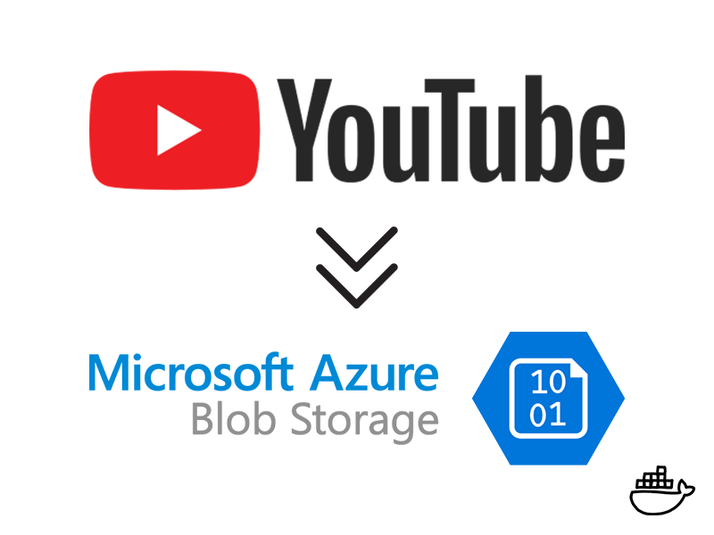
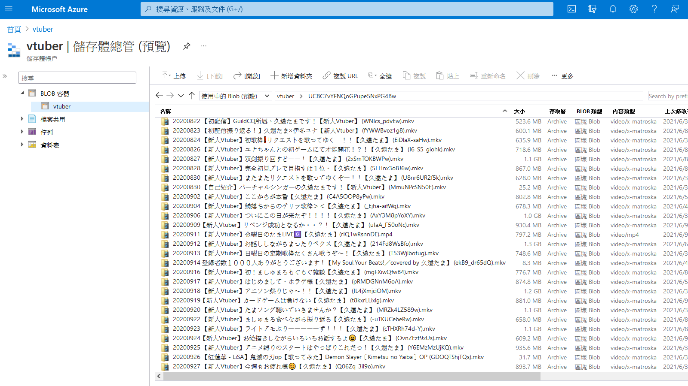

+++
title = "[Docker] Backup-dl - 備份 Youtube 影片至 Azure Blob Storage"
description = "[Docker] Backup-dl - 備份Youtube影片至Azure Blob Storage"
date = 2021-06-06T18:06:00.015Z
updated = 2021-10-31T10:57:22.346Z
draft = false
aliases = [ "/2021/06/backup-dl.html" ]

[taxonomies]
tags = [ "C#", "Container", "Livestream", "Youtube", "Azure" ]

[extra]
card = "preview.png"
featured = true
+++

## 簡介



    

此程式可以檢查 Youtube 頻道、播放清單，並備份影片至 Azure Blob Storage  
這是一支 .NET Core Console Application，並包裝為 Linux Container  
整合入我的「Youtube 錄影伺服器 (Docker Compose)」，可搭配使用

### 下載

```bash
docker pull ghcr.io/jim60105/backup-dl:latest
```

### 參數

#### 環境變數

| 環境變數                                       | 說明                                                                                                              |
| ------------------------------------------ | --------------------------------------------------------------------------------------------------------------- |
| AZURE\_STORAGE\_CONNECTION\_STRING\_VTUBER | Azure Blob Storage 的連接字串                                                                                        |
| CHANNELS\_IN\_ARRAY                        | 欲下載的頻道網址，以陣列傳入                                                                                                  |
| MAX\_DOWNLOAD                              | (可選) 每次執行的最大下載數量，預設為 10                                                                                         |
| FORMAT                                     | (可選) 自訂欲下載的格式，預設為 `bestvideo+bestaudio/best`，請參考 [yt-dlp 說明文件](https://github.com/yt-dlp/yt-dlp#format-selection) |

#### Volume Binding

* `cookies.txt:/app/cookies.txt` 若 bind 入，則會在下載時用做登入憑證

### 功能特性

#### 影片下載

* 底層使用 [yt-dlp](https://github.com/yt-dlp/yt-dlp) 做下載 (別人 fork youtube-dl 出來擴充的專案)
* 使用 archive.txt 做記錄，{{cg(body="不重覆下載影片")}}
* 可傳入多個 Youtube 頻道，或是 Youtube 播放清單
* **下載非 DASH 影片**  
  ([DASH 的解釋](https://zh.wikipedia.org/wiki/%E5%9F%BA%E4%BA%8EHTTP%E7%9A%84%E5%8A%A8%E6%80%81%E8%87%AA%E9%80%82%E5%BA%94%E6%B5%81)，簡單來說就是專給網路串流使用的技術格式，而這通常不是最好的影片)
* 可透過環境變數**設定下載格式**
* 可限制每次執行的最大下載數量
* **限制下載兩日前的影片**，避免下載到直播中和未轉檔完的影片

#### 影片後處理

* 使用 [ffmpeg](https://www.ffmpeg.org/) 做後處理
* 內嵌封面縮圖
* 將影片描述寫入 metadata
* 影片統一打包為 mkv

#### 上傳

[](storage.png)

* 上傳至 [Azure Blob Storage](https://azure.microsoft.com/zh-tw/services/storage/blobs/)
* 影片上傳為**封存存取層** ([存取層的官方說明文件](https://docs.microsoft.com/zh-tw/azure/storage/blobs/storage-blob-storage-tiers))

#### 其它

* 這是.NET Core Console Application，打包為 Linux Container
* 採用{{cg(body="非同步設計")}}
  * 每載完一部影片就會進入後處理 & 上傳程序
  * 多執行緒併行，最大化使用你的效能資源
  * 每片上傳完成後立刻更新 archive.txt，{{cg(body="不會因中斷 container 而遺失進度")}}
* 程式{{cg(body="重啟後重傳處理")}}  
  (程式啟動時會檢查是否有前次已下載，但未上傳完成的 mkv 暫存檔案，若有就直接重新上傳)

使用方式

1. 在本機環境變數中儲存 connection string，命名為「AZURE\_STORAGE\_CONNECTION\_STRING\_VTUBER」  
   連接字串的說明詳見[官方說明文件](https://docs.microsoft.com/zh-tw/azure/storage/common/storage-account-keys-manage?toc=%2Fazure%2Fstorage%2Fblobs%2Ftoc.json\&tabs=azure-portal#view-account-access-keys)
2. 啟動 Container，並傳入環境變數

   ```bash
   docker run 
          --env CHANNELS_IN_ARRAY="[\"https://www.youtube.com/channel/UCBC7vYFNQoGPupe5NxPG4Bw\", \"https://www.youtube.com/channel/UC7XCjKxBEct0uAukpQXNFPw\"]" 
          --env AZURE_STORAGE_CONNECTION_STRING_VTUBER 
          --env MAX_DOWNLOAD="10" 
          jim60105/backup-dl:latest
   ```

## LICENSE

* Distribute main code with MIT License.
* Use Xabe.FFmpeg with License Agreement under non-commercial use.
* Use YoutubeDLSharp under BSD 3-Clause License.
* Use yt-dlp under Unlicensed License
