+++
title = "通過 FortiGate 看 Youtube 很 LAG？"
description = "Youtube 直播在經過網頁過濾功能 (Web Filter) 時異常的慢，所以我決定把 Youtube 流量設 Policy，使之不經過任何資安過濾功能，最大的確保觀看影片時的流暢性。在設定時有幾個注意點，我想用這篇文記錄下來。"
date = 2021-12-05T14:11:00.008Z
updated = 2022-01-01T18:52:47.804Z
draft = false
aliases = [ "/2021/12/fortigate-passthrough-youtube.html" ]

[taxonomies]
tags = [ "Youtube", "FortiGate" ]
licenses = [ "All Rights Reserved" ]

[extra]
card = "preview.jpg"
+++
## 前言

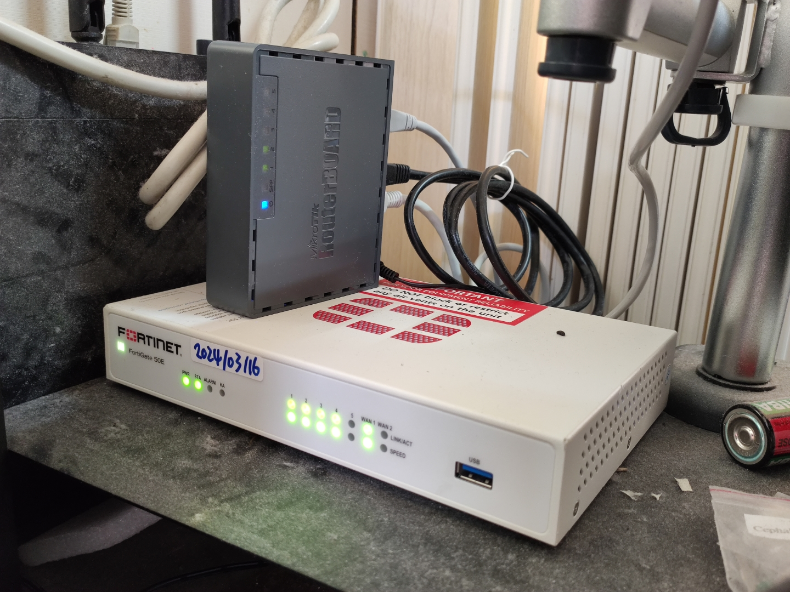

前幾天重新規劃了家裡的網路架構，買了一台 FortiGate FG-50E 防火牆擋在前面。我遇到一個問題 —— Youtube 直播在經過網頁過濾功能 (Web Filter) 時異常的慢。慢到什麼程度？播三秒卡轉圈，卡了十秒再播三秒，鬼才看得下去。所以**我決定把 Youtube 流量設 Policy，使之不經過任何資安過濾功能，最大的確保觀看影片時的流暢性。**

在設定時有幾個注意點，我想用這篇文記錄下來。

<!-- more -->


這必定會犠牲掉一點安全性，請自行評估是否值得。


## 新增位址物件

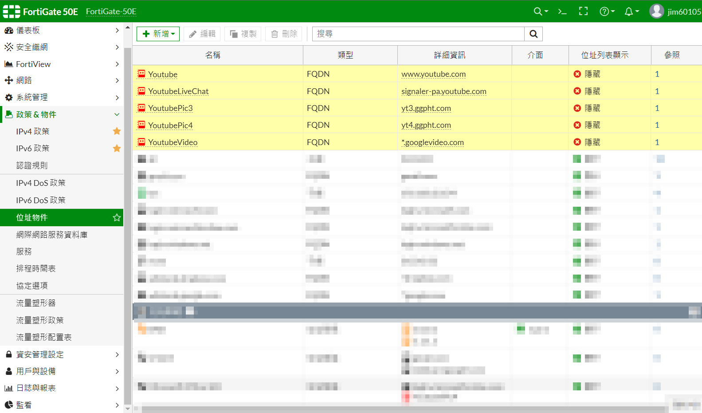

分別新增以下位址物件:

* www.youtube.com
* signaler-pa.youtube.com
* yt3.ggpht.com
* yt4.ggpht.com
* \*.googlevideo.com

| | |
| --- | --- |
| 類型 | FQDN |
| 位址 | *分別填入上面的 url* |
| 介面 | any |
| Show in address list | *不勾選* |

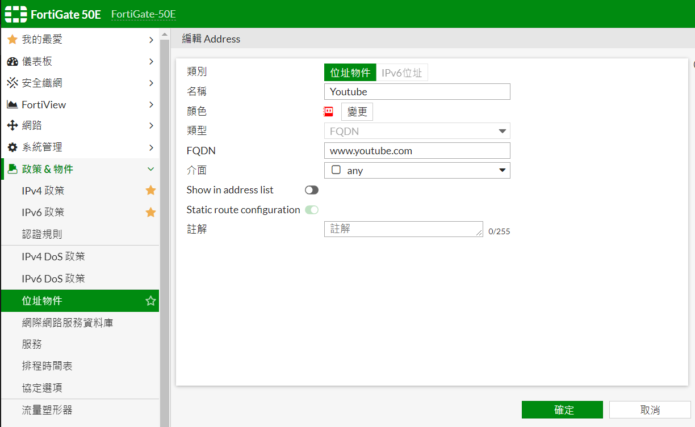

新增位址群組，把剛新增的所有位址物件加進去，勾上 *Show in address list*

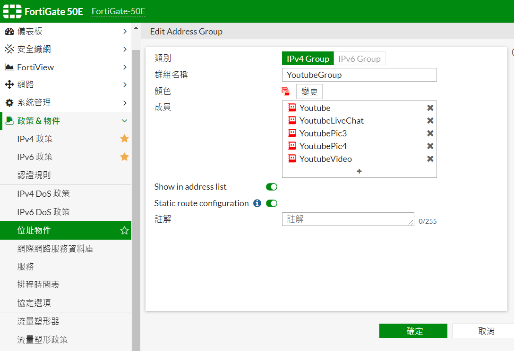

如果你有 IPv6，那麼也要新增一套 IPv6 位址物件 (Youtube 站台支援 IPv6，會優先走 IPv6)

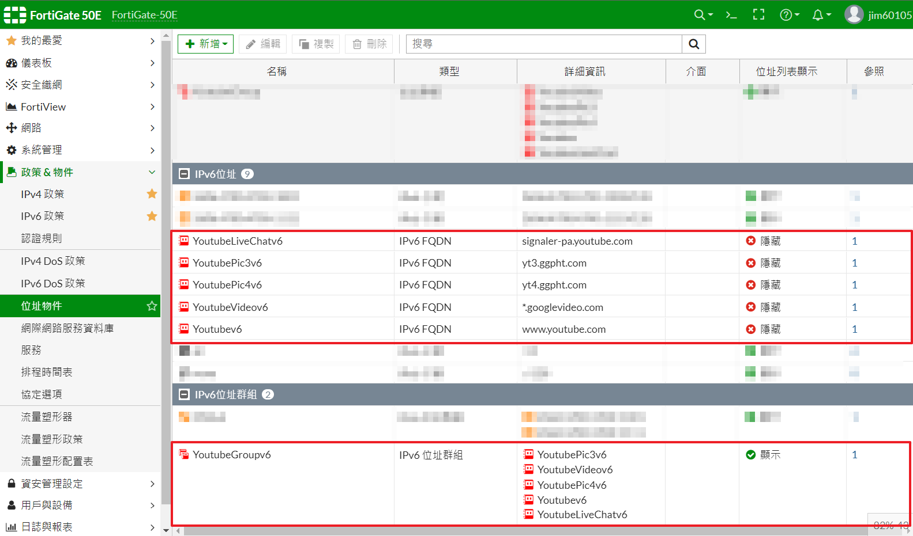

## 新增服務: QUIC

Chromium base 瀏覧器支援 QUIC 協定，這用在大部份的 Google 相關網站上，包括 Youtube  
詳情請見 [Wiki](https://zh.wikipedia.org/wiki/QUIC) 說明  
QUIC 協定在效能上較佳，但防火牆無法監控它  
我的情況不需要監控 Client 端，所以我將 QUIC 開放

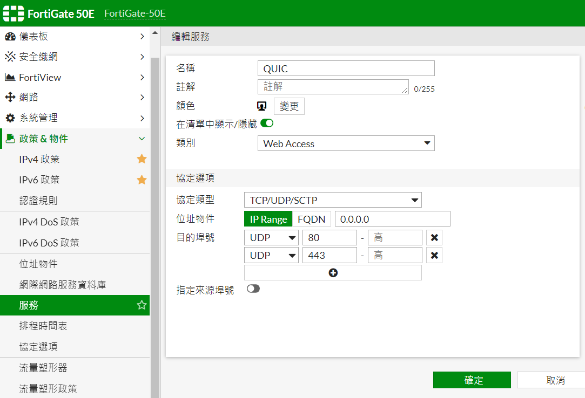

| | |
| --- | --- |
| 名稱 | QUIC |
| 目的埠號 | UDP `80`  UDP `443` |

## 新增政策

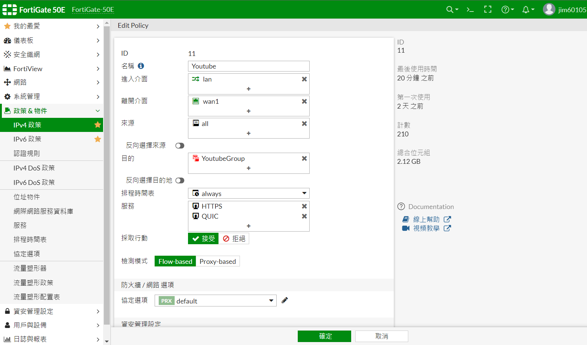

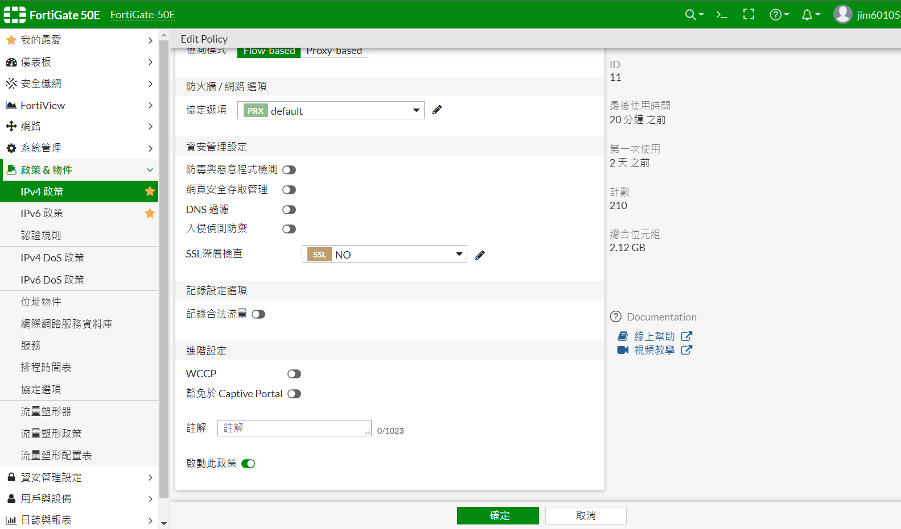

| | |
| --- | --- |
| 名稱 | Youtube  |
| 進入介面 | lan  |
| 離開介面 | wan  |
| 來源 | all  |
| 目的 | YoutubeGroup (前面建立的位址群組)  |
| 服務 | HTTPS、QUIC (前面建立的服務)  |
| 檢測模式 | Flow-based  |
| 資安管理設定 | *(全不選)* |

這條政策要放在 lan to wan 之上，讓 Youtube 流量匹配進去，如此來自 Youtube 的連線就會不做任何檢查，直接通過政策

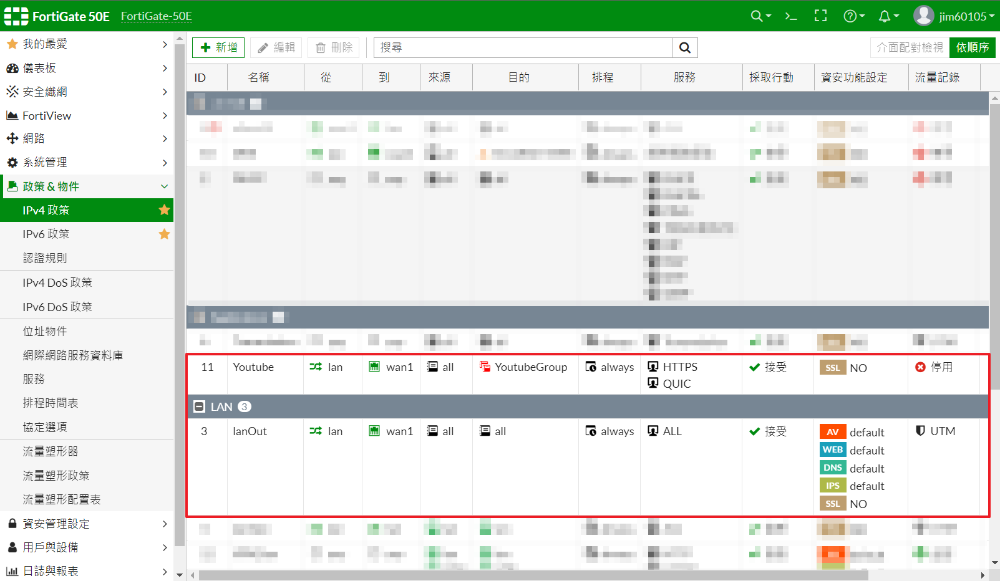

如果你有 IPv6，那麼也要新增一套 IPv6 位址物件 (Youtube 站台支援 IPv6，會優先走 IPv6)

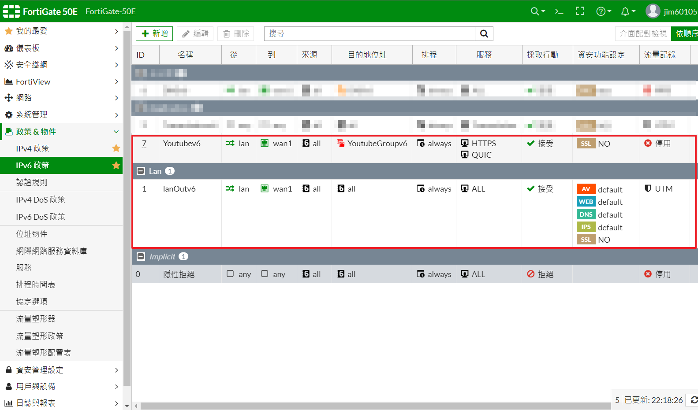

設定完成後請開幾個影片，並觀察 FortiView 政策是否有匹配進剛剛新增的政策

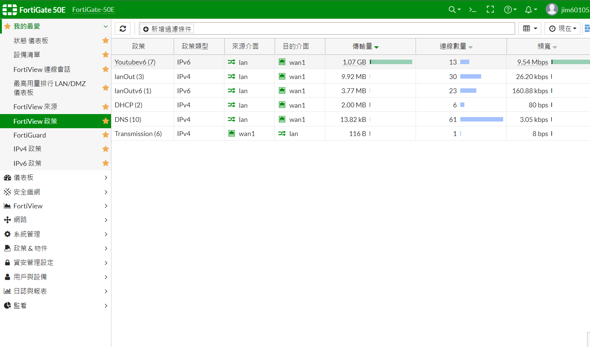
