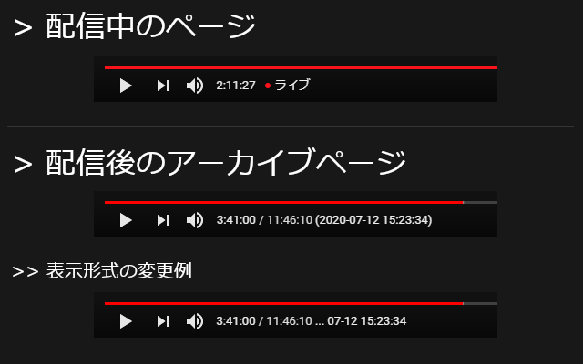
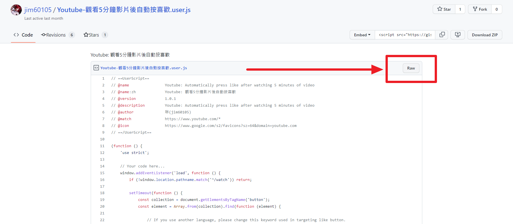

+++
title = "讓軟體工程師告訴你，我如何讓我的 V 豚 DD 生活更加舒適"
description = """
我大約從2020年中開始接觸 Vtuber ，然後就這樣陷入坑裡直到現在。
這篇文章會介紹我如何透過一些小工具豐富我的DD生活。"""
date = 2022-12-27T19:56:00.079Z
updated = 2024-03-31T16:16:21.346Z
draft = false
aliases = [ "/2022/12/my-vtuber-dd-life.html" ]

[taxonomies]
tags = [ "Livestream", "Youtube" ]

[extra]
card = "preview.jpg"
iscn = "iscn://likecoin-chain/fZaY2PGwsp6QR3iaS14KrvL1OygyQyhFUY46TnuYqyE/1"
featured = true

  [extra.comments]
  id = "109587905347725076"
+++


## 前言

這個主題想寫很久了，我有不少小玩具可以分享 ww

我大約從 2020 年中開始接觸 Vtuber ，然後就這樣陷入坑裡直到現在。  
軟體工程師是一種懶惰的生物，我們是為了未來的懶惰而努力。  
別人的工具我能用得起來，缺的東西我能自己造，這是我的吃飯本領。

因為有很多東西想寫，這篇文章是一篇大雜燴，未來也會回來更新。
<!--more-->
題外話，  
下面這隻笨狗是我的推し，請在讀文章時順道聽聽她的原創專輯。

  <iframe src="https://ototoy.jp/embed/player/album/1465616" style="border: 0px; height: 340px; max-width: 620px; left: 0px; top: 0px; width: 100%;" title="久遠たま / VIOLET ROSE on OTOTOY Music Store"></iframe>

## 瀏覧器擴充功能

### Enhancer for YouTube™

[](Enhancer%5Ffor%5FYouTube.png)

> 載點
>
> ---
> <https://www.mrfdev.com/enhancer-for-youtube>

這個可以算是瑞士刀了吧，一大堆功能，以下寫幾個亮眼的

* Youtube 專用擋廣告 (我使用它加上 AdGuard ，從來沒見過廣告)
* 彈出影片視窗 (搭配 FancyZones)
* 自動變更畫質 (Youtube 的 Auto 總是在搞事)
* 截圖功能
* 隱藏側邊欄的「相關影片」

### YouTubeLiveClock

> 載點
>
> ---
> <https://chrome.google.com/webstore/detail/youtubeliveclock/chpodcedholiggcllnmmjlnghllddgmj>

我覺得它的功能和名字不符合，功能超出「LiveClock」很多，應該改名為「打時間軸神器」之類的。

它的主要功能是，**在觀看直播存檔時顯示該秒數的直播時間。**

[](YouTubeLiveClock1.png)

它的次要 (?) 功能是，一個**很強大的時間軸筆記工具**，還附有一個**總覧介面**。很適合用在歌枠打歌單時軸，或是烤肉 man 剪精華筆記之類的。

[](YouTubeLiveClock2.png)

### Youtube 影片截選播放清單

{{youtube (id="xuc4Buob22o") }}
{{ch (body="這是我寫的")}}

這是截選播放清單擴充功能，在 Youtube/Onedrive/GoogleDrive/TwitCasting 上直接播放「起始\~ 結束時間」影片片段。  
此工具專門設計來聽 Vtuber 的歌枠，這是我對於歌回烤肉的程式解

> 專文介紹
>
> ---
> [琳的備忘手札: Youtube 影片截選播放清單 (Youtube Clip Playlist)](/2022/06/chrome-extension-youtube-clip-playlist.html#more)

### UserScript 腳本

UserScript 腳本是一種在網頁上運行的自訂程式，可以使用 [Tampermonkey (油猴)](https://www.tampermonkey.net/) 執行。請安裝好擴充功能後再繼續。

Youtube 上缺功能? 自己寫就好啦！

> 由 Gist 安裝 UserScript 的方法
>
> [](how-to-install-userscript.png)
>
> [](how-to-install-userscript2.png)

#### Youtube 觀看 5 分鐘影片後自動按喜歡

> 載點
>
> ---
> <https://gist.github.com/jim60105/9515346675ebc27b06ccc8f058d9da65>

只要裝了這個，不管 D 到哪都不用再手動幫影片按讚啦  
真的是懶人到極致 w

#### Youtube 自動拍手機器

> 載點
>
> ---
> <https://gist.github.com/jim60105/43b2c53bb59fb588e351982c1a14e273>

我平常一邊做事一邊放著聽歌枠，在唱完一首歌後要幫 vtuber 拍手，做事要打斷就有點懶得拍手。後來就寫了這個，{{cg(body="將拍手行為自動化！")}}

基本上它是「**別人拍手時跟著一起拍**」的設計。也能改變觸發語句和發送語句，把它變成自動打 call 功能。

我有加了一些判斷條件讓它盡量不誤觸發。使用前請依需求調整設定區塊。


使用時請自行負責，不要讓它變成垃圾留言產生器。


#### Twitch 自動拍手機器

> 載點
>
> ---
> <https://gist.github.com/jim60105/1654a245f3ed4e9707a2bd655a1ecffc>

同上，圖奇版本

#### Youtube 直播聊天室貼圖複製工具

> 載點
>
> ---
> <https://greasyfork.org/zh-TW/scripts/447599-yt-live-chat-emoji-copy-tool>

如果你曾經試著複製別人在 Youtube 聊天室發的貼圖，你會發現{{cr(body="貼圖是無法複製貼上的")}}。  
只要安裝這個腳本就能解決問題囉，它會為你自動轉換。

#### YTBetter

> 載點
>
> ---
> <https://pastebin.com/5EiDA3VL>

重新啟用 DVR ，直播中影片回放。

不建議長期啟動它，會造成直播逐漸脫離最新進度，在要用時再開啟就好。

直播主常常會鎖時間軸不讓你往回拉，以備在發生事故時能降低風險，但其實**鎖時間軸並不是安全性操作**。防君子不防小人，修改前端就能破解的東西毫無安全性可言，**而且還有能[從直播起始錄影](https://github.com/Kethsar/ytarchive)的工具喔！**


如果有 Vtuber 看見了請記住 —— 萬一不幸出事故，請你{{cr(body="立刻")}}把直播切掉，並且到 Youtube 後台{{cr(body="刪檔")}}。從出事到刪檔的空窗時間 = 影片備份時間，完全不存在鎖了回放很安全這回事。


### Stylebot

[Stylebot](https://stylebot.dev/) 可以在網頁上套用自訂的 CSS 。和油猴類似，只是油猴控制的是程式，Stylebot 控制 CSS。

網頁 UI 醜死? 自己改寫就好啦！

> Stylebot 的使用方式
>
> * 打開你要修改版面的網頁
> * 點擊右上角的 Stylebot 圖示
> * 選擇中間的「打開 Stylebot」
> * 在最下方選擇中間的「代碼」
> * 把提供的 css 貼進去
>
> [](stylebot%5Finstall.png)

#### Youtube 直播聊天室版面高度改善

> 載點
>
> ---
> <https://gist.github.com/jim60105/1dcd8178c92d2dcd7035cc20628c7c3e>

把聊天室改成和螢幕畫面一樣高

[](stylebot3.png)

#### Twitcasting 版面改寫

> 載點
>
> ---
> <https://gist.github.com/jim60105/486343171d23616770a6a28da4bf9997>

Twitcasting 這什麼垃圾 UI ，完全無法接受。

* 影片頁面，不往下滾無法看見完整影片
* 聊天室寬得莫名其妙，擠壓影片尺寸
* Live History 兩邊超大留白，讓中間的影片資訊超小
* 多餘的 banner 和影片上方的分類標籤，這對舊用戶只是干擾

我改過的 UI 較為擁擠，但{{cg(body="把所有功能都擠進可視範圍")}}，而且還{{cg(body="加大了影片尺寸")}}

Before

[](stylebot1.png)

After

[](stylebot2.png)

## 多窗工具

> 小提醒
>
> ---
> 只要「**在別的網站上**用 iframe 觀看 Youtube 直播」，就{{cr(body="無法投 SC")}}。

### Holodex

> 網址
>
> ---
> <https://holodex.net/>

Holodex 可以做到複雜的版面設定，而且還能做音訊管理。

<figure>
{{ image(url="holodex.png", alt="Holodex") }}

<figcaption><a href="https://home.gamer.com.tw/artwork.php?sn=5105969" rel="nofollow" style="text-decoration: none;" target="_blank">圖片出處</a></figcaption>
</figure>

### ViewSync

> 網址
>
> ---
> <https://viewsync.net/>

這個工具有點特殊，它的取向和其它多窗程式有點不一樣，它是 focus 在「**同步不同影片**」上面。它適合用來看多頻道聯動直播，將多個影片同步播放。

[這是作者提供的範例](https://viewsync.net/watch?v=qj8s89PE180\&t=191s\&v=wLCFsXMOBy0\&t=974s\&v=iiLqi4Op0hs\&t=114s)，注意三個影片的時間同步被記錄在這個範例連結中，你可以將調整成果分享給別人。

## 影片下載工具

[](../youtube-download-ytdlp-ffmpeg/ytdlp.png)

> 專文介紹
>
> ---
> [琳的備忘手札: 影片下載轉檔筆記 (Youtube 、 Twitch 、 TwitCasting 、 Twitter Spaces 音訊空間 、 ffmpeg、yt-dlp)](/2022/01/youtube-download-ytdlp-ffmpeg.html)

| | |
| ------- | ---------------------------------------------------------------------------------- |
| 存檔下載| [Youtube Segment Downloader](https://github.com/jim60105/YoutubeSegmentDownloader) |
| 直播中從頭下載 | [ytarchive](https://github.com/Kethsar/ytarchive)|
| 其它| [yt-dlp](https://github.com/yt-dlp/yt-dlp) |

## 監控下載工具

### Youtube 直播錄影伺服器

> 專文介紹
>
> ---
> [琳的備忘手札: \[Docker\] Youtube 直播錄影伺服器建置](/2020/11/docker-youtube-dl-auto-recording-live-dl.html)

### 備份 Youtube 影片至 Azure Blob Storage

> 專文介紹
>
> ---
> [琳的備忘手札: \[Docker\] Backup-dl - 備份 Youtube 影片至 Azure Blob Storage](/2021/06/backup-dl.html)

### 監控 Twitch、TwitCasting、Twitter Spaces

> 專文介紹
>
> ---
> [琳的備忘手札: \[Docker\] 直播監控、自動影片下載筆記 (Youtube、Twitch、TwitCasting、Twitter Spaces 音訊空間)](/2022/01/auto-monitor-youtube-download.html)

## 小工具

### PowerToys - FancyZones

[](https://learn.microsoft.com/zh-tw/windows/images/pt-fancyzones-quickswap.gif)

> 安裝指南
>
> ---
> <https://learn.microsoft.com/zh-tw/windows/powertoys/install>

> 操作指南
>
> ---
> <https://learn.microsoft.com/zh-tw/windows/powertoys/fancyzones>

這是能讓視窗貼齊在指定配置內的工具。  
推薦搭配 Enhancer for YouTube™ 的彈出影片功能使用。

PowerToys 是很強大的工具包，其它的功能也推薦嘗試。  
事實上我最常用的是 PowerToys Run。

### Youtube 歌單產生工具 (Youtube Timeline Builder)

[](/SideProject/youtube-timeline-builder/preview.png)

[](/SideProject/youtube-timeline-builder/1.png)

> 專文介紹
>
> ---
> [琳的備忘手札: \[Excel & VBA\] Youtube 歌單產生工具 (Youtube Timeline Builder)](/2022/09/youtube-timeline-builder.html)

這是用來編輯 Youtube 歌枠時間軸用的 Excel 工具。  
給幫忙寫歌枠歌單的人使用。

## 硬體

### ASUS 華碩 ZenScreen Touch MB16AMT

[](MB16AMT.jpg)

對，便攜式螢幕，且它的一大優點在於觸控功能。

我平常是雙螢幕工作者，這是第三個專門用來看 V 的小螢幕。我一邊做事一邊看 V，突然想要在聊天室打字互動的時候，我會{{cg(body="直接伸左手觸控聊天室輸入框")}}，然後打字輸入 <kbd>Enter</kbd>。這讓我的滑鼠不用移動過去再移回來，操作簡便很多。推薦加幾千選觸控式的型號。

另一個優點是這台{{cg(body="支援 DisplayLink 輸入")}}、 HDMI 輸入，換句話說，可以接電腦、接 Nintendo Switch、接 PS4 、**接幾乎所有的 Android 手機**。這個技術很重要，我甚至可以斷言，不支援 DisplayLink 的攜帶式螢幕都不推薦買。

這東西好用，真心不騙👍

## Youtube 隱藏密技

下面這些東西似乎沒什麼人知道，我把它整理如下。  
在開始以前我要先說明幾樣東西: 頻道 ID、使用者 ID、影片 ID

* 頻道 ID (Channel ID)
  * 可以在[這個網站](https://commentpicker.com/youtube-channel-id.php)查詢
  * <details>
       <summary>20230106補充: 此法已失效</summary>

    * 先點進隨便一支影片
    * 點擊影片資訊旁的頻道名稱
         [](channel%5Fid1.png)  
    * 網址的最後面這一段就是，UC開頭一長串  
         如圖，久遠たま的頻道 ID 為 <mark>UCBC7vYFNQoGPupe5NxPG4Bw</mark>
         [](channel%5Fid2.png)

    </details>
* 使用者 ID (User ID)
  * 把頻道 ID 去掉開頭的 <mark>UC</mark> 就是使用者 ID 了  
    久遠たま的使用者 ID 為 <mark>BC7vYFNQoGPupe5NxPG4Bw</mark>
* 影片 ID (Video ID)
  * 點進影片
  * 在網址列上找 v 參數，或是點擊「分享」的網址最後一段  
    如圖，這支影片的影片 ID 為 <mark>EOtfDd3ReSs</mark>  
    [](video%5Fid.png)
  * 或者，你也可以在[這個網站](https://commentpicker.com/youtube-video-id.php)查詢

以下我會用 <mark>頻道 ID</mark> 、 <mark>使用者 ID</mark> 、 <mark>影片 ID</mark> 來表示，請替換為上面取得的 ID

| 說明| 連結|
| --- | --- |
| Youtube 全頻道公開影片播放清單| <span>https://</span>www.youtube.com/playlist?list=UU<mark>使用者 ID</mark> |
| Youtube 全頻道會限影片播放清單| <span>https://</span>www.youtube.com/playlist?list=UUMO<mark>使用者 ID</mark> |
| Youtube 頻道 RSS feed <br> <small> RSS 會在影片公開、直播待機室公開時廣播 </small> | <span>https://</span>www.youtube.com/feeds/videos.xml?channel\_id=<mark>頻道 ID</mark> |
| Youtube 影片封面圖片 jpg 連結 <br><small> 不一定每種尺寸都存在 <br> 將 default 替換為數字 1、2、3，即為自動產生的第 1、2、3 張圖片 </small> | <span>https://</span>i.ytimg.com/vi/<mark>影片 ID</mark>/maxresdefault.jpg<br> <span>https://</span>i.ytimg.com/vi/<mark>影片 ID</mark>/hqdefault.jpg<br> <span>https://</span>i.ytimg.com/vi/<mark>影片 ID</mark>/mqdefault.jpg<br> <span>https://</span>i.ytimg.com/vi/<mark>影片 ID</mark>/sddefault.jpg<br> |
| Youtube 頻道直播連結 <br> <small>這個連結會直接打開現正直播中的影片 </small> | <span>https://</span>www.youtube.com/channel/<mark>頻道 ID</mark>/live |

### Youtube 上所有圖片的原始尺寸圖片

在 Youtube 網站上對任何圖片「右鍵→在新分頁中開啟」，如果它的網址中後方有 `=s{一個數字}` ，那就適用這個方法: 把它換成 `=s0`，後面全部刪掉即可。

舉例如下:

```
https://yt3.googleusercontent.com/KHB...6gShhJz=s176-c-k-c0x00ffffff-no-rj
↓
https://yt3.googleusercontent.com/KHB...6gShhJz=s0
```

> 延伸閱讀
>
> ---
> 這裡有個自動化開啟為原圖的 UserScript 腳本
> <https://greasyfork.org/en/scripts/2312-resize-image-on-open-image-in-new-tab>

<blockquote style="display: inline-block;">
  <div style="display: flex; align-items: center;">
    <div>
      {{ image(url="tama.png", alt="笨狗", no_hover=true, transparent=true) }}
    </div>
    <div>
      <audio controls="" preload="metadata"
             src="https://soundbuttons.azureedge.net/sound-buttons/tama/%E6%98%9F%E7%88%86%E4%B8%AD%E6%96%87.webm">
        星爆氣流斬！</audio><br />
      <audio controls="" preload="metadata"
             src="https://soundbuttons.azureedge.net/sound-buttons/tama/%E4%BD%A0%E5%A5%BD%E8%AC%9D%E8%AC%9D%E5%B0%8F%E7%B1%A0%E5%8C%85%E5%86%8D%E8%A6%8B.webm">
        你好，謝謝，小籠包，再見！</audio><br />
      <audio controls="" preload="metadata"
             src="https://soundbuttons.azureedge.net/sound-buttons/tama/%E9%80%99%E5%80%8B%E7%AF%80%E7%9B%AE%E6%98%AF%E4%BB%A5%E4%B8%8B%E8%B4%8A%E5%8A%A9%E5%95%86%E8%B4%8A%E5%8A%A9%E6%92%AD%E5%87%BA.webm">
        這個節目是以下贊助商贊助播出</audio><br />
      <audio controls="" preload="metadata"
             src="https://soundbuttons.azureedge.net/sound-buttons/tama/%E3%81%BE%E3%81%A3%E3%81%9F%E3%81%BE%E3%81%9F%E3%81%AD%EF%BD%9E_(%E9%97%9C%E5%8F%B0%E6%8B%9B%E5%91%BC%E8%AA%9E).webm">
        まったまたね～(關台招呼語)
      </audio>
    </div>
</blockquote>
