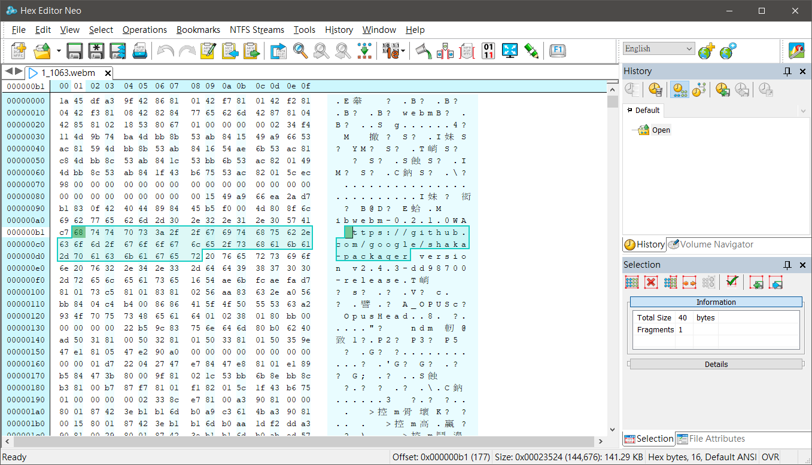
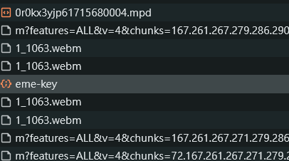
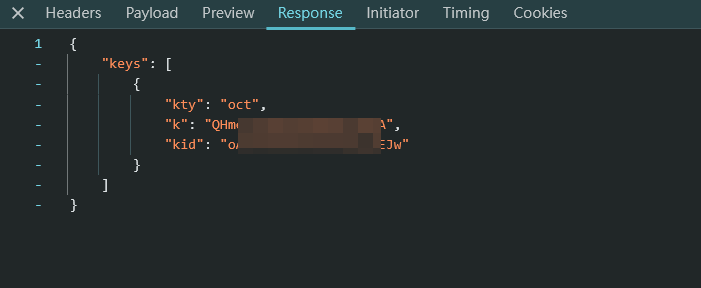
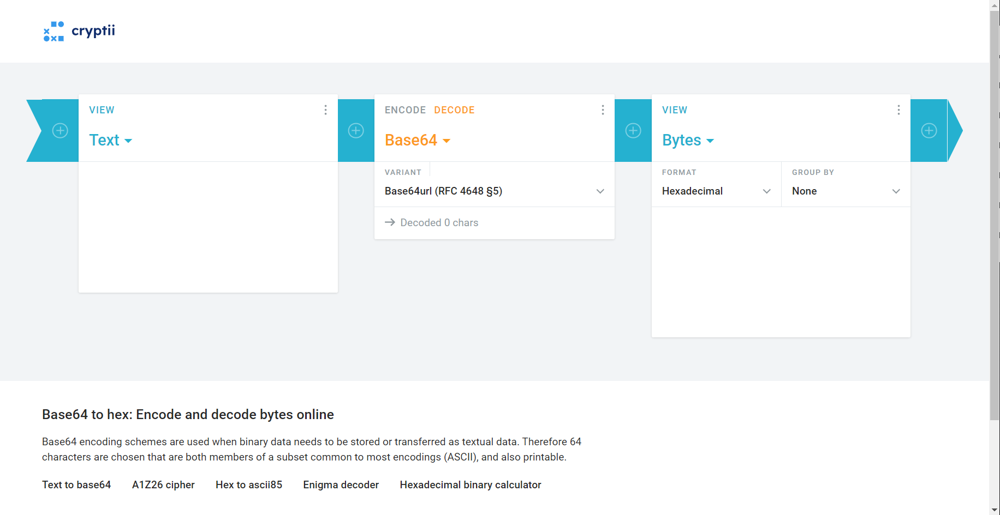
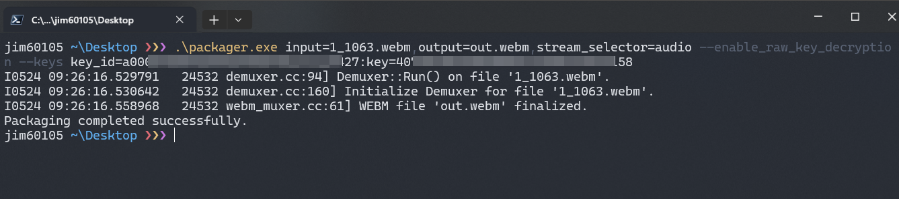

+++
title = "從使用者的角度解開 shaka-packager 加密影片"
description = "從使用者的角度解開 shaka-packager 加密影片"
date = 2024-07-04T13:53:00.002Z
updated = 2024-09-07T20:27:03.581Z
draft = false
aliases = [ "/2024/07/shaka-packager.html" ]

[taxonomies]
tags = [ "Livestream" ]
licenses = [ "GFDL 1.3" ]

[extra]
banner = "preview.png"
disclaimer = """
此筆記沒有任何「破解」要素<br>
我只是說明如何用你手上的鑰匙把鎖打開，<b>沒有鑰匙的人打不開鎖</b>"""
+++
<figure>
{{ image(url="preview.png") }}
<figcaption><a href="https://civitai.com/posts/6321883" target="_blank">Made with Flux.1-dev</figcaption>
</figure>

## 前言

寫得很簡略，是給未來的我讀的筆記  
{{ch(body="看不懂不要問我，我懶得答")}}

在開始以前請確認:

* 你可以在網頁中播放影片
* 影片使用 [shaka-packager](https://github.com/shaka-project/shaka-packager) 技術加密
* 你能取得 License Server 的 Clear Key Response 內容
<!--more-->
## Before Start: 如何得知影片是以 shaka-packager 加密

[](1.png)

## 取得加解密軟體

下載 shaka-packager

<https://github.com/shaka-project/shaka-packager/releases/latest>

## 取得被加密的影片

在網頁中 F12 → Network，找到要解密的影片檔案

本例中是 1\_1063.webm  
將 webm 檔案下載: 右鍵 → Open in new tab

> 
>
> 圖中有好幾個 webm 是因為 206 partial content download  
> 事實上它是在載同一個檔案的不同部份

## 取得 Clear Key

在下載檔案的附近尋找 Clear Key request

本例網頁是使用 [Shaka-player](https://github.com/shaka-project/shaka-player)，它問回來的 Clear Key 格式如下

重點是其中的 Key ID (kid) 和 Key (k)

[](3.png)

## 將 ClearKey 轉換為 hex 格式

使用 [online **base64 to hex converter**](https://cryptii.com/pipes/base64-to-hex) 將 Clear Key 轉換為 **32 碼**的 hex 格式，Key Id 和 Key 都要轉換

解碼使用 Base64URL，詳見 [wiki](https://zh.wikipedia.org/zh-tw/Base64#URL)

[](4.png)

## 使用 packager 解密影片

將指令中的

* `{EncryptedWebmFile}` 替換為加密影片路徑
* `{HexKeyID}`、`{HexKey}` 替換為前步驟轉出的 32 碼 Hex 字串
* `{stream_selector}` 替換為 `audio`,`video`, `text`，視影片內容而定  

> stream_selector (stream):
> Required field with value ‘audio’, ‘video’, ‘text’ or stream number (zero based).
> [_ref_](https://shaka-project.github.io/shaka-packager/html/documentation.html#stream-descriptors)

```powershell
packager.exe input={EncryptedWebmFile},output=out.webm,stream_selector={stream_selector} --enable_raw_key_decryption --keys key_id={HexKeyID}:key={HexKey}
```

[](5.png)

## 參考資料

* <https://shaka-project.github.io/shaka-packager/html/documentation.html>
* <https://github.com/shaka-project/shaka-packager>
* <https://wdpm.gitbook.io/web-fundamentals-media-chs/encrypted-media-extensions#clear-key>
* <https://stackoverflow.com/a/46897097/8706033>
