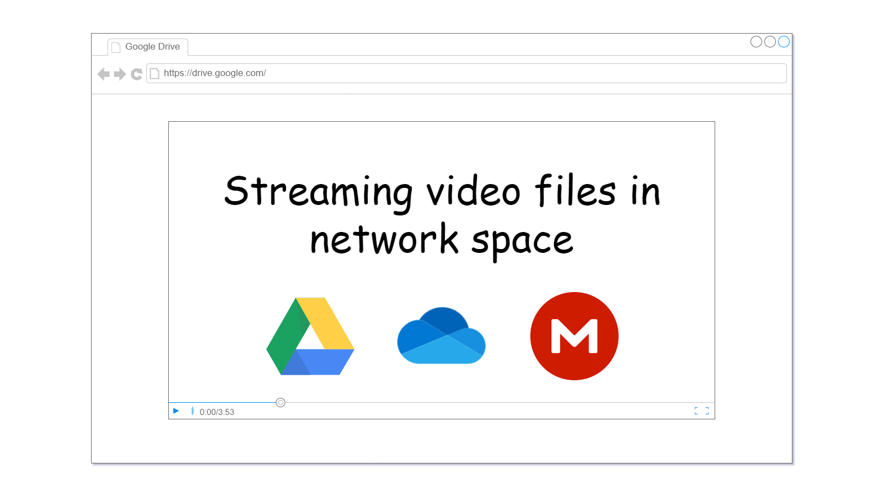
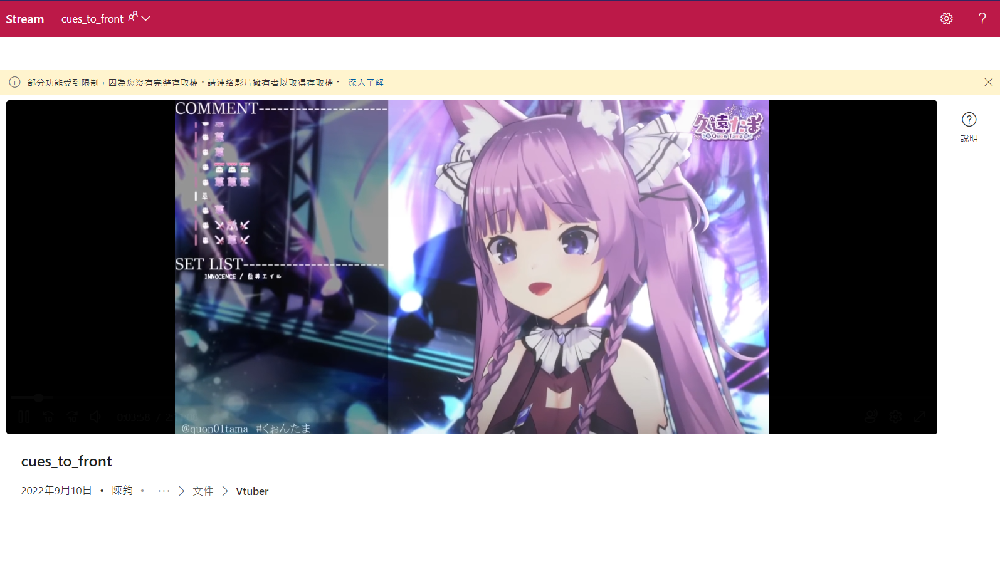
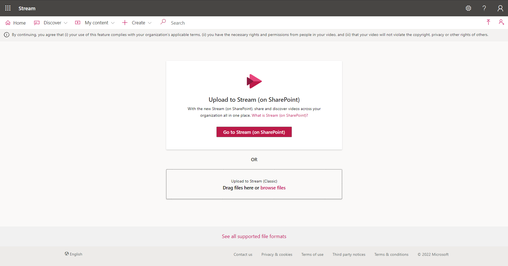
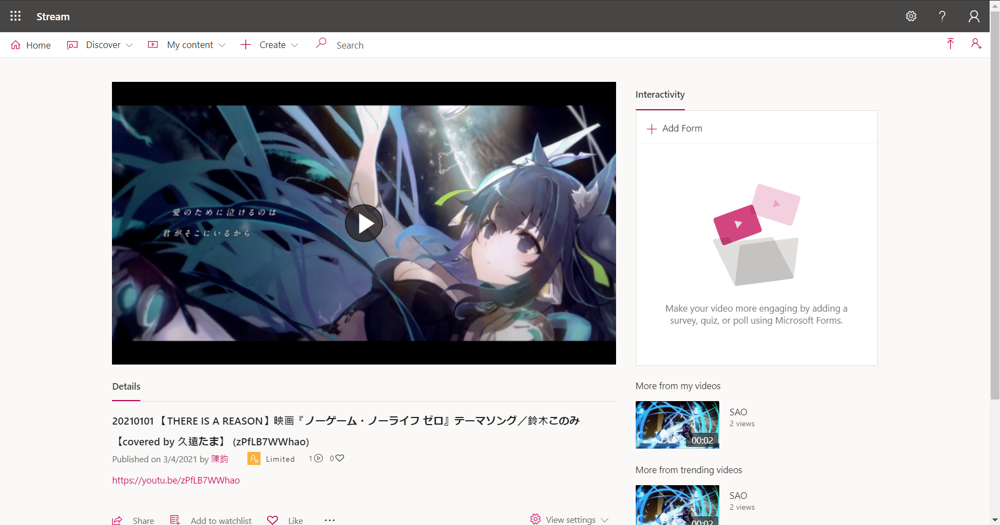
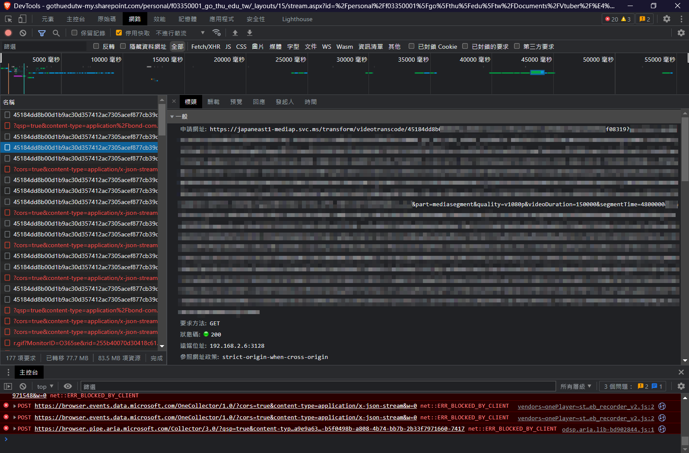
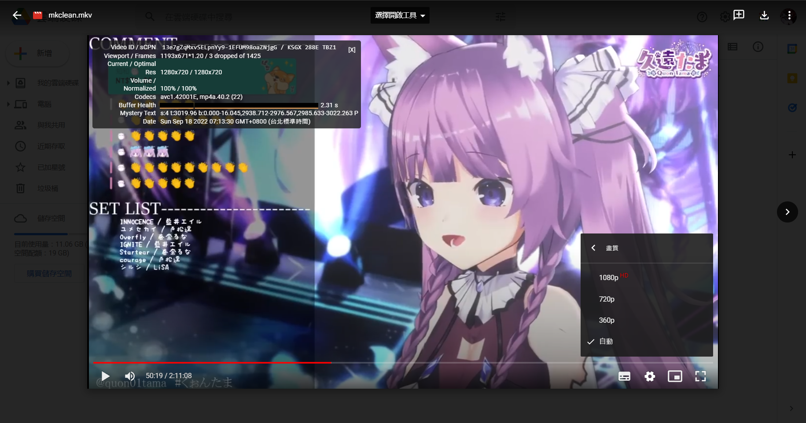
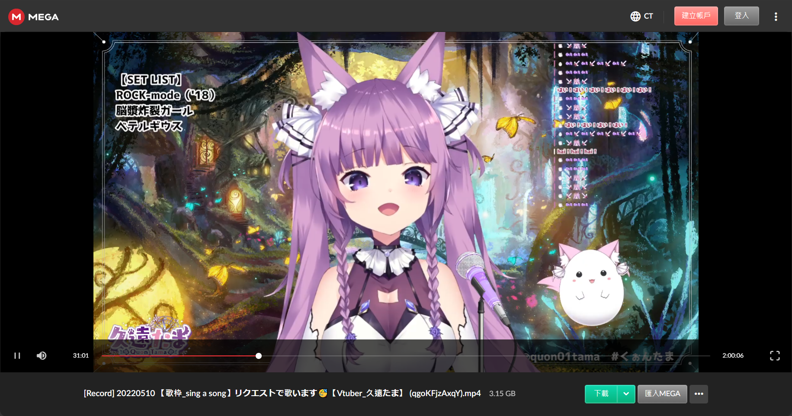
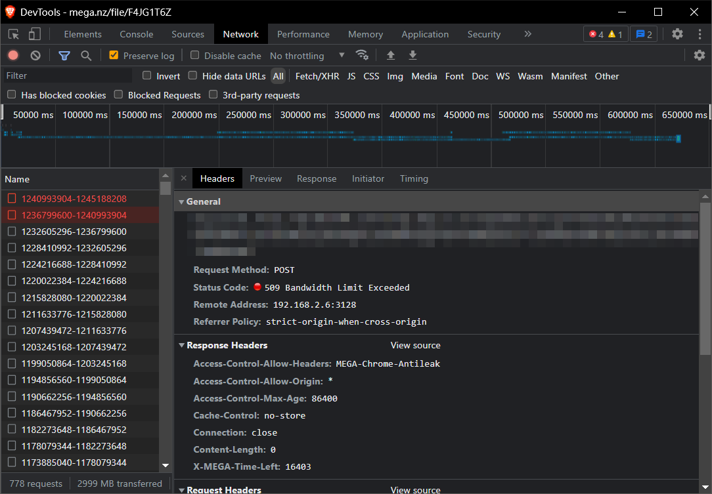

+++
title = "雲端硬碟影片檔串流播放之研究手札 (OneDrive、Google Drive、MEGA)"
description = "本文的核心目地是「將影片檔案上傳至雲端硬碟，公開分享連結，讓其它人在線上播放影片」，探討各個雲端硬碟在影片串流的處理方式，並最終選出一個合適的方案。"
date = 2022-09-18T00:16:00.022Z
updated = 2022-12-15T21:45:15.675Z
draft = false
aliases = [ "/2022/09/streaming-video-files-in-network-space.html" ]

[taxonomies]
tags = [ "Livestream" ]
licenses = [ "All Rights Reserved" ]

[extra]
card = "preview.png"
iscn = "iscn://likecoin-chain/nAmAldj-4khNWI_9lM5m9T5HZl5eOrSSt6X74NK0nRs/1"
featured = true
disclaimer = "本文內容僅來自筆者實際測試和推論，沒有官方文件的支持 撰於 2022/09/18，狀況隨時間變化"

  [extra.comments]
  id = "113498316676351460"
+++

## 序言

本文的核心目的是「將**影片檔案**上傳至**雲端硬碟**，公開分享連結，讓其它人在**線上播放影片**」，探討各個雲端硬碟在影片串流的處理方式，並最終選出一個合適的方案。

探討的雲端硬碟有 Google Drive、OneDrive、MEGA。Google Drive 的教育帳號無限大容量曾風光一時；OneDrive 如今仍提供我校每人 1TB 的存取容量；MEGA 提供免費帳號 50 GB 容量。除此之外，它們在台灣的傳輸速度、體驗、口碑等等都表現不錯，這是它們入選的原因。

在進入主題以前，我想說說我為什麼會有這種需求。
<!--more-->
## 為什麼不上傳 Youtube 就好?

一般來說，「分享影片**檔案**」、「分享影片**內容**」是兩個不同的取向。若著重在分享檔案，適合上傳至雲端硬碟，例如 Google Drive ；若著重在分享影片內容，適合分享至串流平台，例如 Youtube、Vimeo。串流平台是為了串流設計的，線上播放功能絕對沒有問題，為什麼我不選擇使用串流平台呢?

我的 [YoutubeClipPlaylist](@/SideProject/chrome-extension-youtube-clip-playlist/index.md) 專案兼容雲端硬碟做為播放來源之一，這些影片之所以在 Youtube 被下架多是因為版權因素： 直播主唱歌時使用到未授權的伴唱音源，**被** Youtube 平台自動偵測並警告，他們就會將影片下架。通常來說 (潛) 規則上，觀眾不能將直播主的影片**完整轉載**至串流平台，這侵犯到直播主的影片著作權，但對於這些**被**下架的影片檔案他們是睜一隻眼閉一隻眼。

Youtube 直播可以用 yt-dlp 錄影是公開的秘密。有人錄，下架的影片就會在粉絲之間傳播。只要下架緣由並不是有什麼怕人看的東西，上傳雲端硬碟的做法就是大家可接受的中間地帶。

這就是我的考量，  
那麼，你為什麼不上傳 Youtube 就好?

## 名詞解釋

雲端硬碟： 又稱雲端、網路硬碟、網路空間、免費空間、免空等。本文將提到 [Google Drive](https://drive.google.com/) 、[OneDrive](https://onedrive.live.com/) 、[MEGA](https://mega.nz/)、[TeraBox](https://www.terabox.com/) 。

影音串流平台： 以線上串流播放影片為設計目的之平台，例如 [Youtube](https://www.youtube.com/)、[Microsoft Stream](https://www.microsoft.com/zh-tw/microsoft-365/microsoft-stream)、[Vimeo](https://vimeo.com/) 等。

串流播放 (streaming)： 將影像壓縮後，經過網路分段傳送資料，即時傳輸影音以供觀賞的一種技術與過程。此技術使得資料封包得以像流水一樣傳送，如果不使用此技術，就必須在使用前下載整個媒體檔案。

## OneDrive

讓我從 [OneDrive](https://onedrive.live.com/) 開始。微軟提供我母校每人 1 TB 的儲存容量 (包含畢業生)，我司也提供每位員工 5 TB 的容量，這使得 OneDrive 成為我日常使用主力。嘛，但我不會把 Vtuber 影片放公司帳號啦。

提醒讀者，此處討論的是「播放放在 OneDrive 中的影片檔」，而非「播放上傳至串流平台 [Microsoft Stream](https://stream.office.com/) 的影片」。在 Office365 企業版或教育版中， OneDrive 上的影片現在可以用 Stream 服務開啟，不過事實上和直接在 OneDrive 中預覧檔案沒什麼區別。分享介面的左上角寫著「Stream」，但其實和「串流平台 Microsoft Stream」不同。

> 串流平台 Microsoft Stream
>
> 
>
> 

經過觀察發現，它會呼叫一個名為 videotranscode 的 API，**mkv 檔案的回應速度較慢，而 mp4 的回應速度可接受**。(我推測) 它是採用實時轉檔的方式，而測資 mkv 檔案的 VP9 格式轉為 dash 格式的處理效能不好。

顯然拿 OneDrive 做串流播放不是很完美。

## Google Drive

最棒的就是 [Google Drive](https://drive.google.com/) 了， Google Drive 會**將影片檔案預先轉檔**。

我上傳的檔案是 1080p mkv 影片，在等待一至兩天後它生成了 360p、720p、1080p 影片。在線上播放器中可以看到編碼格式變成了 avc1/mp4a ，而不是我的原始檔案的 vp9/opus。{{cg(body="不管原檔是 mkv 還是 mp4 ，系統轉檔完的影片都可以正常串流。")}}這很另人欣慰，{{cr(body="雖然要先等待轉檔時間")}}，但等待是值得的。

不過 Google Drive 勸退的是免費帳戶只給 15GB ，放 5 個影片就滿了。說好的教育帳戶大容量呢?

順帶一提，它使用了和 Youtube 同款的播放器。 Youtube 不愧是串流界龍頭，它家的播放器業界第一，毋庸置疑。

## MEGA

接下來是我的備備選，[MEGA](https://mega.nz/) 。

在 MEGA 的線上預覧中，{{cg(body="mp4 檔案只要經過 faststart 處理後就可以正常的索引")}}；但 {{cr(body="mkv 檔案即使經過 mkclean 也無法索引")}} (索引的詳細說明請見文末附錄)。

另外 MEGA 的免費 plan 有對於檔案下載的{{cr(body="流量限制")}}，這也套用在影片線上預覧串流上。大約是每 ip 每 5 小時上限 5G? 我沒有找到文件，但確實是會被限流。

需要注意的是，MEGA 在線上播放時除了限流外，還有一個大問題。MEGA 是以「檔案」的概念在處理影片，它將原始檔案分片做串流下載，直接塞進瀏覧器的記憶體，塞到 Out of Memory 分頁崩潰。一個容量 3G 多的檔案，線上看到一半分頁就崩潰了， Are you kidding me?

即使 MEGA 有諸多限制，但因為{{cg(body="免費方案提供了 50 GB 的大容量")}}，它仍是免費仔的選擇之一。  
{{ch(body="我？ 我是免費仔，但我有母校給的 1TB OneDrive。")}}

## ~~TeraBox~~

> TeraBox 是百度網盤海外版，台灣讀者應對資訊安全有所警惕

最後這是我曾放進口袋名單，但實際上並不合用的雲端 —— [TeraBox](https://www.terabox.com/)。

它最大的特色是{{cg(body="免費帳號有 1TB 的容量")}}，但是檔案分享的影片預覧是{{cr(body="隨機切 30 秒出來給你看")}}，和本文的目標不合。它適合用來傳檔、分享，讓別人下載回去，但不適合線上串流播放。

題外話，它還有一個叫做 [TeraTransfer](https://www.terabox.com/transfer) 的服務，適合分享射後不理的檔案。

## 結論

總結，我建議 **首選為 Google Drive，備選為 OneDrive、MEGA**，MEGA 要把檔案轉檔 mp4 (faststart)。

本文已經探討了三個雲端硬碟在線上預覧影片檔案時的表現，但其實進階玩家還有別的選擇 —— 把檔案存在 S3 / Blob Storage ，然後自己寫網頁套上播放器套件。 Storage 的儲存成本比雲端硬碟低很多，但它的流量要錢。視情況，這可能是更佳方案呢!

你決定好要把影片放在哪裡了嗎?


本文內容僅來自筆者實際測試和推論，沒有官方文件的支持  
撰於 2022/09/18，狀況隨時間變化


## 附錄: 錯誤 429 Too Many Requests

在測試 OneDrive 時多次出現{{cr(body="錯誤 429")}}，表現為{{cr(body="無限轉圈或是轉址到 throttle 頁面")}}。此狀況是跨檔案的，估計是 API 上的使用限制，而不是檔案流量上的限制。它在短時間內就會解除。

正常的使用方式應該不太常發生，但有時也是會遇到。像是... 呃... 反覆的來回點時間軸，讓它一直一直緩衝，而不是照著播放進度緩衝。

這不太需要擔心就是了。

## 附錄: mp4 faststart、mkv cues\_to\_front (mkclean) {#mp4-faststart}

在實體檔案串流播放時，需要注意影片索引的問題。**關鍵幀索引表**用於快速查找影像資料 —— mp4 是寫在 moov 中； mkv 是稱為 Cues —— 都是寫在影片檔案的末尾。

影像資料在寫入完後，才能夠根據資料建立索引，所以它是寫在影像資料的後方。這個設計在本地讀取時沒什麼問題，播放器可以直接存取到整個檔案，但是在線上串流時就很糟糕了。{{cr(body="播放器必須要下載完一整個檔案，取得最末尾的索引資訊，才有辦法搜尋時間軸。")}}

{{cg(body="OneDrive、Google Drive 因為有經過影片轉檔步驟")}}，它們在雲端做索引，所以不太有這個問題。但是**像 MEGA 是以檔案的概念直接往瀏覧器塞原始檔**，索引的位置就很重要了。無法索引的檔案會從檔案的起始開始緩衝，直到當下選取的時間點為止。

例如說，點選了 02:00:00 (2 小時) 處，這時就會把前面兩小時的影片資料都緩衝下載回來，然後才開始播放。{{cr(body="使用者體驗就是轉圈轉個半天等到天荒地老")}}，然後影片才開始播。然後，接著點選時間軸 01:23:00 處，因為沒有索引資料，比較笨的播放器可能會再從頭緩衝一次。

為了解決這個問題，我們要把索引搬到影像資料的前面。影片檔案普通的寫入完成後，再一對一複製為第二個檔案，不過這次改變順序，先寫索引再寫影像資料，並且依照 offset 修改索引內容。

具體的工具、指令請參考另一篇文章

> 延伸閱讀
>
> ---
> [影片下載轉檔筆記 (Youtube、Twitch、TwitCasting、Twitter Spaces 音訊空間、ffmpeg、yt-dlp)](@/Livestream/youtube-download-ytdlp-ffmpeg/index.md#mp4-faststart)
