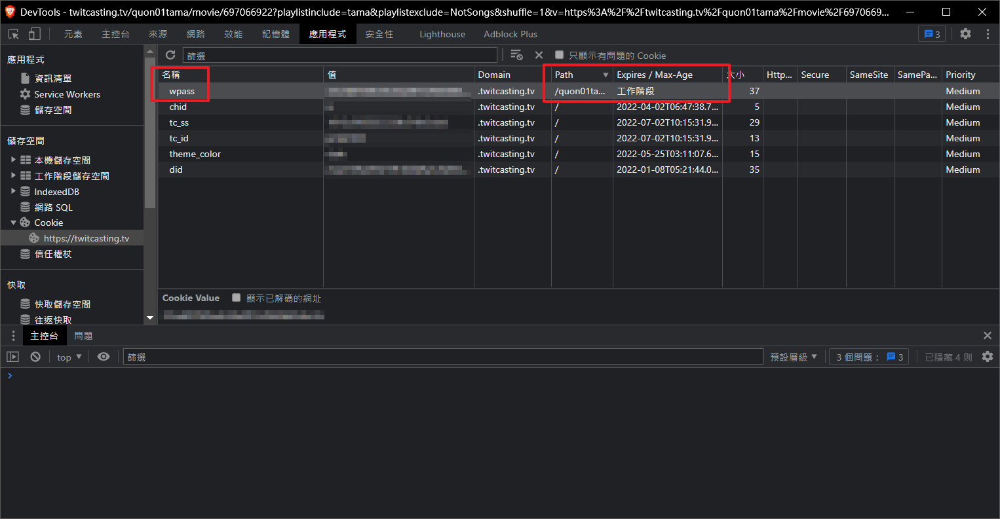

+++
title = "TwitCasting 每次播放都要求輸入密碼？不要一直問我！"
description = "TwitCasting 允許直播主將過往存檔上鎖，觀眾需輸入密碼才能觀看。這個密碼狀態只記憶在瀏覧器工作階段，每次重啟瀏覧器就要重新輸入，讓人不堪其擾。本文詳述了該怎麼解決這個問題。"
date = 2022-01-03T10:53:00.001Z
updated = 2022-01-03T10:55:27.104Z
draft = false
aliases = [ "/2022/01/twitcasting-cookie.html" ]

[taxonomies]
tags = [ "Livestream", "TwitCasting" ]
licenses = [ "All Rights Reserved" ]

[extra]
poor = true
banner = "preview.png"
+++

{{ch(body="其實上圖就是一切了....")}}

TwitCasting 允許直播主將過往存檔上鎖，觀眾需輸入密碼才能觀看。  
這個密碼狀態只記憶在瀏覧器工作階段，{{cr(body="每次重啟瀏覧器就要重新輸入")}}，讓人不堪其擾  
而解決辦法也很簡單... 改個 cookie 的儲存時長就能解決了！  
具體流程記述如下

<!-- more -->

1. 打開 TwitCasting，瀏覧到上鎖的影片  
2. **輸入密碼**
3. 在頁面中按 F12，開啟 DevTools
4. 參考上圖，在上方頁籤`應用程式`→左方`儲存空間`→`Cookie`→`https://twitcasting.tv`
5. 找到右側名為 `wpass` 的條目，雙擊時間欄位，填入 `2222`
6. 以後就不用再輸入啦！

> 這招在 TwitCasting 這裡能成功，只是正好此平台沒有對它做檢核  
> 這並不是什麼萬能招數喔！
