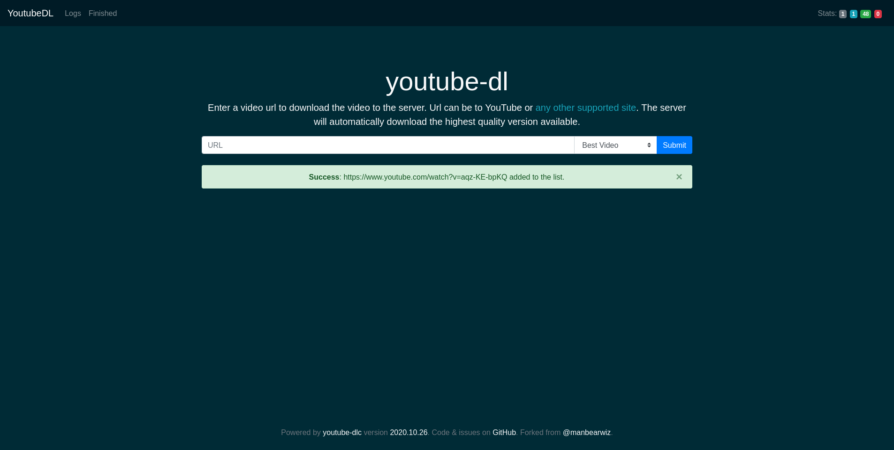
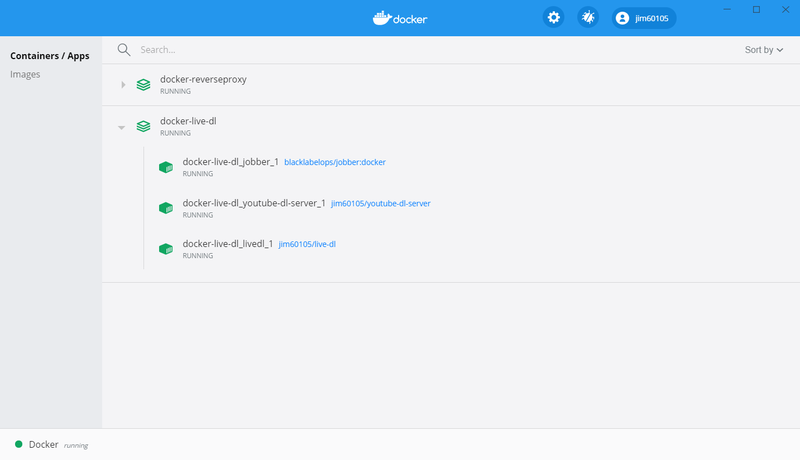
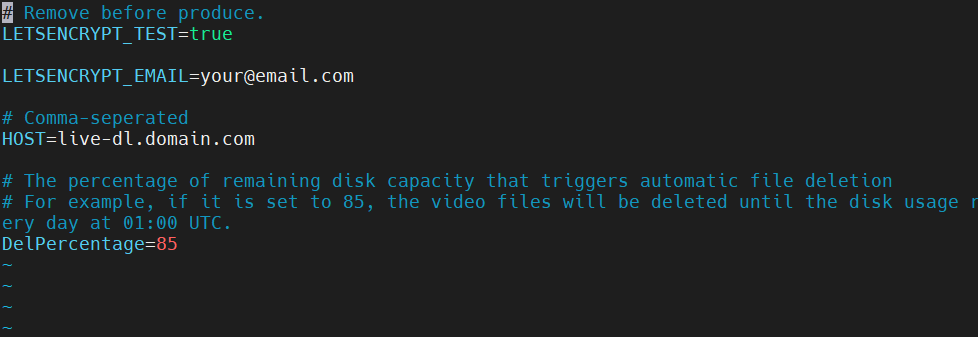
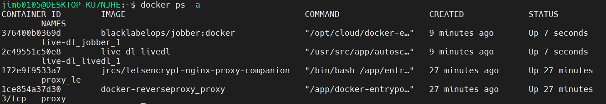
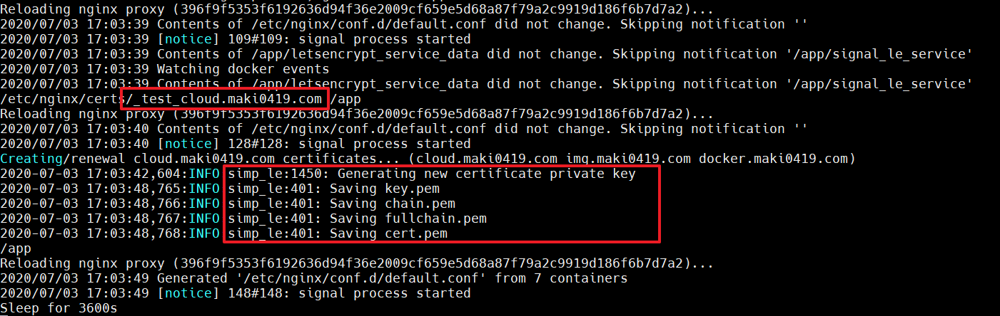
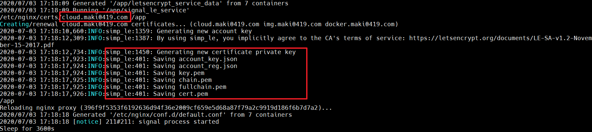
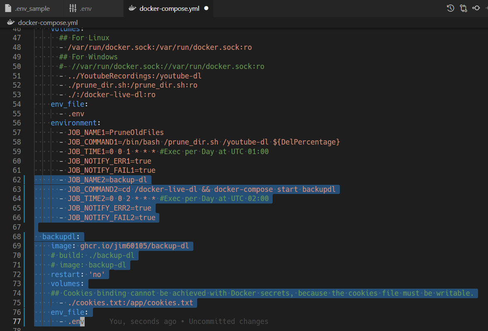
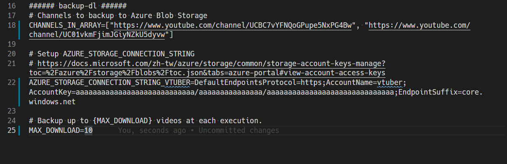
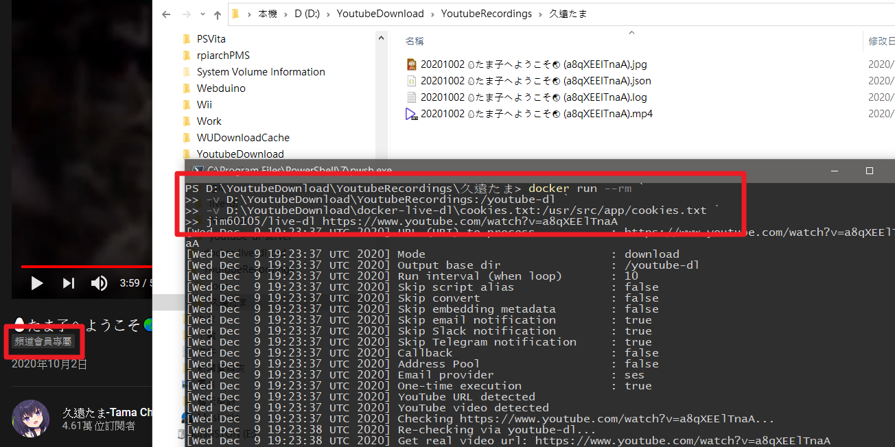

+++
title = "[Docker] Youtube 直播錄影伺服器建置"
description = "本文希望建置起能永久自動運作的Youtube直播備份機。此專案目標為「自動化影片備份」，盡量保存最好的影片，若砍檔我還有一份錄播的，能記錄下我推的每分每秒。 "
date = 2020-11-23T21:37:00.083Z
updated = 2023-03-07T01:58:58.902Z
draft = false
aliases = [ "/2020/11/docker-youtube-dl-auto-recording-live-dl.html" ]

[taxonomies]
tags = [ "Container", "Livestream", "Youtube", "yt-dlp" ]
licenses = [ "GFDL 1.3" ]

[extra]
card = "preview.png"
archive = '因我個人不再使用它，此專案已停止維護<br>請參考 <a href="https://github.com/sparanoid/live-dl" target="_blank">Upstream</a> 或是 <a href="https://github.com/Recorder-moe" target="_blank">我的新專案</a>'
iscn = "iscn://likecoin-chain/OkHAhjNWyZppmCu3ffbFJpRV2x33dNoiqkBNFyIzmec/1"
+++

## 前言

[](preview.png)

本文希望建置起能{{cg(body="永久自動運作")}}的 Youtube 直播備份機  
本專案包含三個部份:

* youtube-dl-server: 這是一個網頁 UI 界面，可以手動執行下載
* live-dl: 直播中錄播，用來對應版權砲、下播即砍，等等的狀況
* backup-dl: 定期封存所有影片，下載 Youtube 算完影片後較高品質的檔案

此專案目標為 **「自動化影片備份」**，盡量保存最好的影片，若砍檔我還有一份錄播的  
記錄下我推的每分每秒
<!--more-->
## 概觀

### 本專案核心目標

* 以 docker-compose 技術，將建置 server 的難度維持在... 還可以?
* 監控指定的頻道，{{cg(body="直播時自動錄製")}}功能
* {{cg(body="磁碟滿時自動刪除錄播檔")}}
* {{cg(body="能手動下載指定影片")}}
* 定期備份 Youtube 已算完的影片，並上傳封存

### 本文適合對象

* 初級以上的 linux 操作基礎
* 有自己的主機或 NAS，沒有可以[現在租](@/Container/linux-docker-setup-reverse-proxy/index.md#DigitalOcean) (不然你東西想放哪裡?)

### 功能說明

* 手動下載會儲存在主機的 `../YoutubeRecordings/` 之下，可以在 docker-compose.yml 修改
* 可以在錄影完成後執行 callback bash script
* Jobber 會在每日的 01:00 UTC 檢查磁碟使用率，並由舊檔案刪起，直到磁碟使用率降到設定值 (或直到沒有檔案)
* Jobber 會每日喚醒 backup-dl 執行備份封存

## 流程簡述

1. [Linux 主機之 Docker 安裝和 ReverseProxy 建置](@/Container/linux-docker-setup-reverse-proxy/index.md)
2. git clone 下來 docker-compose 建置檔案和 config 檔案
3. 設定要自動錄影的直播頻道
4. docker-compose up -d

## 架構

```
WWW
│
nginx Server (Reverse Proxy) (SSL 證書申請、Renew)
├ Jobber (Cron) (定時檢查磁碟使用率，在高於設定之百分比時，自動由舊起刪除錄影)
├┴ backup-dl (影片備份上傳機)
├ live-dl (直播監控錄影機)
└ youtube-dl-server (WebUI 下載器)
```

## 建置

### Linux 主機和 Docker 安裝

請完成此文的**建置**章節

> [琳的備忘手札: \[Docker\] Linux主機之Docker安裝和ReverseProxy建置](@/Container/linux-docker-setup-reverse-proxy/index.md)

另外，本專案完全可以部屬在 Windows10 機器上，以圖為證  
請自行轉換所有步驟在 Windows 執行

[](youtube-dl-win.png)

### live-dl、youtube-dl-server 建置

* cd 到**欲儲存影片的位置**，例如我想放在 `/YoutubeDL`

  ```bash
  mkdir /YoutubeDL && cd /YoutubeDL
  ```

* git clone 專案

  ```bash
  git clone https://github.com/jim60105/docker-youtube-dl.git
  ```

  > **本專案有 submodule**  
  > 如果想要 build docker image，請用 `git pull --recurse-submodules`

* 進入 docker-youtube-dl 資料夾  

  ```bash
  cd docker-youtube-dl
  ```

* 填入.env 檔案
  
  ```bash
  cp .env_sample .env && vim .env
  ```

  [](../../Container/linux-docker-setup-reverse-proxy/10.png)

  * `LETSENCRYPT_TEST`: 此為設定申請測試 SSL 證書，現在給 true，**最後上線前才改 false**
  * `LETSENCRYPT_EMAIL`: Let's Encrypt 在證書到期時通知你用的 email，不會透過這個做驗證。建議正確填入。
  * `HOST`: WebUI 網址
  * `DelPercentage`: 超過時要執行刪除功能的磁碟使用百分比  
    (此處請按照你的磁碟大小估算。例如，我的磁碟大小是 25G，我希望留下的空間至少為 3G，3G / 25G = 12%，設定為 88)

* 編輯 `config_live-dl.yml` 在 map 下建立名稱對應表，此表用於自動錄播時的資料夾建立

  ```bash
  vim config_live-dl.yml
  ```

* 參考 `Monitor/tama.sh` 建立要做自動錄影的頻道，所有 Monitor 資料夾下的檔案都會被執行  
  (資料夾內可以建立多個.sh 檔)  
  請自行為不同頻道替換 Youtube URL 和 Channel Name 的內容  
  目前內建的直播錄影設定的是[久遠たま](https://www.youtube.com/channel/UCBC7vYFNQoGPupe5NxPG4Bw)的頻道  
  
  ```bash
  cp Monitor/tama.sh Monitor/{{Channel Name}}.sh
  vim Monitor/{{Channel Name}}.sh
  ```

  內容  
  `nohup /bin/bash live-dl {{Youtube URL}} &>/youtube-dl/logs/live-dl-{{Channel Name}}.$(date +%d%b%y-%H%M%S).log &`

* 給所有 `*.sh` 執行權限

  ```bash
  find ./ -type f -iname "*.sh" -exec chmod +x {} \;
  ```

* 起機囉\~\~
  
  ```bash
  docker-compose up -d
  ```

* 檢查 Container 是否都有起來

  ```bash
  docker ps -a
  ```

  [](../../Container/linux-docker-setup-reverse-proxy/11.png)

* 檢查 SSL 是否成功

  ```bash
  docker logs proxy_le -f
  ```

  注意紅框處，這樣就是成功  

  [](../../Container/linux-docker-setup-reverse-proxy/12.png)

* 將 SSL 申請改為正式申請

  
  因為 Let's Encrypt 針對網域正式申請有次數限制  
  不論成功與否，做太多次就會鎖住  
  發布前一定要測試成功再轉正
  
  或者，若你不需要 SSL 就把 `proxy_le`container 停掉  
  

  ```bash
  vim .env
  ```

  第一行 `LETSENCRYPT_TEST` 改為 `false`  
  重新啟動 compose  
  
  ```bash
  docker-compose down && docker compose up -d
  ```

  檢查是否有成功要到正式證書  
  注意紅框處，已沒有\_test\_字樣  
  [](../../Container/linux-docker-setup-reverse-proxy/13.png)
  
* 檢查自動錄影是否正常  
  查看在`../YoutubeRecordings/logs` 下是否有 log 輸出，並查看檔案內容  
  
  ```bash
  ls ../YoutubeRecordings/logs
  ```

* 檢查 WebUI 是否正常  
  開啟你設定的 HOST 網址，看看是否能正常訪問網址

### backup-dl 建置


Backup 的封存位置是 Azure Blob Storage，不是每個人都適用  
相關設定全都是註解狀態，你要用再打開


* 在 Azure 開一個 Blob Storage，直到[取得 ConnectionString](https://docs.microsoft.com/zh-tw/azure/storage/common/storage-account-keys-manage?tabs=azure-portal#view-account-access-keys)  
  這有點複雜，且本文的重點不在這裡，請[參照官方文件](https://docs.microsoft.com/zh-tw/azure/storage/common/storage-account-create?toc=%2Fazure%2Fstorage%2Fblobs%2Ftoc.json\&tabs=azure-portal)
* 編輯 docker-compose.yml，把 backup-dl，和 jobber 下半部份取消註解

  ```bash
  vim docker-compose.yml
  ```

  [](backupdl1.png)

* 編輯.env 檔案，填入要下載的頻道和連接字串

  ```bash
  vim .env
  ```

  [](backupdl2.png)

  * `CHANNELS_IN_ARRAY`: Azure Blob Storage 的連接字串
  * `AZURE_STORAGE_CONNECTION_STRING_VTUBER`: 欲下載的頻道網址，以陣列傳入
  * `HOST`: WebUI 網址
  * `MAX_DOWNLOAD`: (可選) 每次執行的最大下載數量，預設為 10
  * `FORMAT`: (可選) 自訂欲下載的格式，預設為 bestvideo+bestaudio/best，請參考 [yt-dlp 說明文件](https://github.com/yt-dlp/yt-dlp#format-selection)

* 重新啟動 docker-compose

  ```bash
  docker-compose down && docker-compose up -d
  ```

* 檢查 log 看是否成功啟動，有沒有進入下載

  ```bash
  docker-compose logs -f
  ```

## 附註: 下載會員限定影片 {#member-only}

此專案支援以 youtube-dl 的 cookies file 方式登入，**可以**下載會限影片  
{{ch(body="(youtube-dl 的帳密登入從 2019 bug 到現在都沒有修好)")}}

[](youtube-dl-member.png)

* 安裝瀏覧器擴充功能，以匯出 Netscape HTTP Cookie File
  * Chrome: [Get cookies.txt LOCALLY](https://chrome.google.com/webstore/detail/get-cookiestxt-locally/cclelndahbckbenkjhflpdbgdldlbecc)
  * Firefox: [cookies.txt](https://addons.mozilla.org/zh-TW/firefox/addon/cookies-txt/)
* 瀏覧至 Youtube 網頁，登入你的帳號
* 以擴充功能匯出 `youtube.com` 網域的所有 cookie
* 將匯出之 cookie 檔案重命名為 `cookies.txt`
* 取代專案目錄下的 cookies.txt 檔或用於[後述](#single-run)的 volume bind


此 cookies file 包含了你的 Youtube 登入授權  
任何人只要取得這個檔案，即可由你的身份登入 Youtube  
請**務必妥善保管，把它當成你的帳號密碼看待**


## 附註: 不部屬之單次執行 live-dl {#single-run}

若要單次執行而不部屬，可直接 docker run  
我有 build 了 image 在此: <https://github.com/users/jim60105/packages/container/package/live-dl>

例如

```bash
docker run --rm
        -v D:\YoutubeDownload:/youtube-dl
        -v D:\YoutubeDownload\cookies.txt:/usr/src/app/cookies.txt
        ghcr.io/jim60105/live-dl https://www.youtube.com/watch?v=GDOQTShjTQs
```

此格式如下  
將 {{}} 填入你的內容，若不需要登入就不用傳入 cookies file  
cookies file 之相關說明請見[上一節](#member-only)

```bash
docker run --rm
        -v {{影片儲存資料夾}}:/youtube-dl
        -v {{cookies file，用於登入驗證}}:/usr/src/app/cookies.txt
        ghcr.io/jim60105/live-dl {{Youtube網址}}
```

## 附註: 錄影完成 Callback


本專案提供的 [download\_again.sh](https://github.com/jim60105/docker-live-dl/blob/master/download_again.sh) ，能在下載完成後等待一分鐘，再下載第二次  
由於串流中錄影容易有漏秒，所以我會在「直播結束後至 Youtube 版權砲前」再下載一次


### callback.sh 傳入之參數

```bash
__info "Calling callback function..."
local cmd=( "$CALLBACK_EXEC" "${OUTPUT_PATH}.mp4" "$BASE_DIR/" "$VIDEO_ID" "$FULLTITLE" "$UPLOADER" "$UPLOAD_DATE" )
nohup "${cmd[@]}" &>> "$OUTPUT_PATH.log" &
```

bash 參數

1. 產出檔案的完整路徑
2. 產出檔案之所在資料夾
3. 影片 id
4. 影片標題
5. 影片上傳者
6. 上傳日期

## 附註: Logging 相關設定

本專案 logging 經過調整，可搭配 [Seq Log Server](https://datalust.co/seq) 使用 (或是任何支援 GELF http post 的 log server)

* 參考這個 repo 部屬 Seq: <https://github.com/jim60105/docker-Seq>
* .env 正確設置 LOGSERVER 路徑，格式為 `IP:埠號`
* Monitor/\*.sh 註解掉 File logging，改用「STDOUT logging (with log tag)」方式呼叫
* download\_again.sh 註解掉 File logging，改用「Docker logs logging (with log tag)」方式呼叫
* 啟動指令改用 `docker-compose -f docker-compose.yml -f docker-compose.log-server.yml up -d`  
  或是將 `docker-compose.log-server.yml` 重命名為 `docker-compose.override.yml`，使 `docker-compose up -d` 可以自動應用 override 檔
