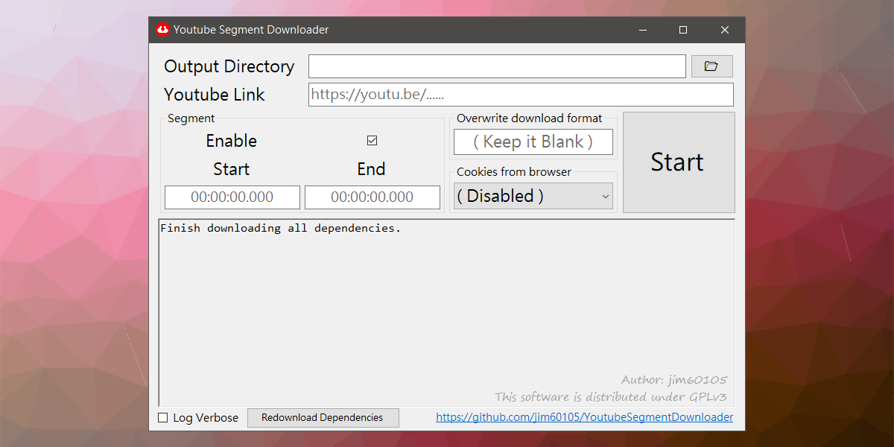
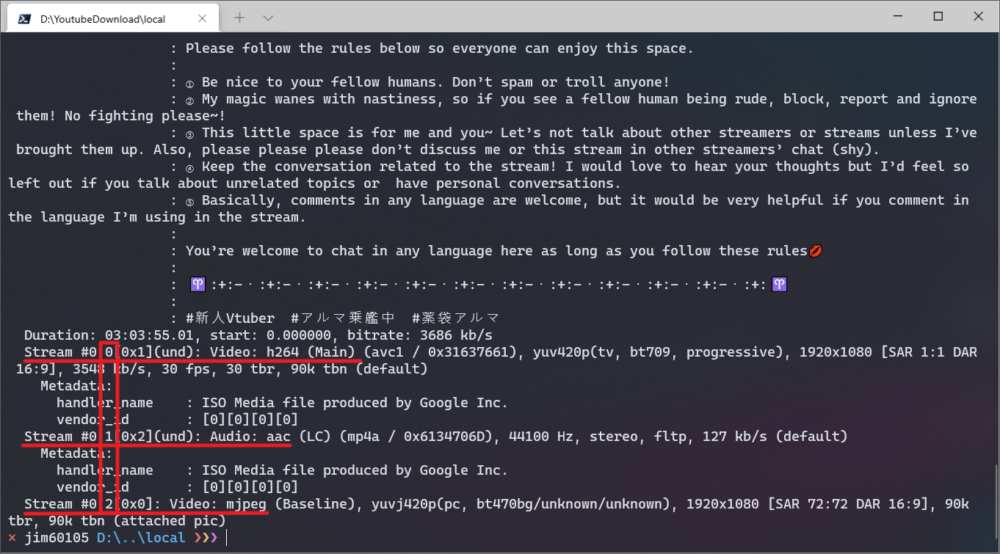

+++
title = "影片下載轉檔筆記 (Youtube、Twitch、TwitCasting、Twitter Spaces 音訊空間、fc2 live、ffmpeg、yt-dlp)"
description = "本文記述 Youtube 、 Twitch 、 TwitCasting 、 Twitter Spaces 音訊空間、fc2 live，下載和轉檔的常用工具和指令。yt-dlp和ffmpeg的常用指令介紹。 "
date = 2021-12-31T18:15:00.151Z
updated = 2023-12-23T18:45:04.951Z
draft = false
aliases = [ "/2022/01/youtube-download-ytdlp-ffmpeg.html" ]

[taxonomies]
tags = [ "Livestream", "TwitCasting", "Twitch", "Youtube", "yt-dlp" ]

[extra]
card = "ytdlp.png"
iscn = "iscn://likecoin-chain/69fa80Yx0lIjGsTIh4_3tbyd836EYAW2649Tngv8DUo/1"
featured = true
hot = true
+++


## 序言

本文記述下載 Youtube 、 Twitch 、 TwitCasting 、 Twitter Spaces 音訊空間，和影片轉檔的幾個常用工具和指令

> 延伸閱讀
>
> ---
> 關於 **監控、自動下載** 請見這篇  
> [\[Docker\] 直播監控、自動影片下載筆記 ( Youtube 、 Twitch 、 TwitCasting 、 Twitter Spaces 音訊空間)](/2022/01/auto-monitor-youtube-download.html)
>
> ---
> 你可能也想看  
> [讓軟體工程師告訴你，我如何讓我的 V 豚 DD 生活更加舒適](/2022/12/my-vtuber-dd-life.html)
<!-- more -->
## 下載: yt-dlp

| | |
| --- | --- |
| GitHub | <https://github.com/yt-dlp/yt-dlp> |
| 下載點 | <https://github.com/yt-dlp/yt-dlp/releases/latest> |

> yt-dlp 依賴於 ffmpeg 執行，請同時[安裝 ffmpeg](#ffmpeg)

yt-dlp 分家自 youtube-dl，它涵蓋 youtube-dl 的所有功能，並且有著更多的功能，更多的 patch，更活躍的開發社群。 除了 Youtube 外它也支援很多其它影片站，包括 niconico、twitch、twitcasting、twitter、facebook，[這裡是完整清單](https://github.com/yt-dlp/yt-dlp/blob/master/supportedsites.md)。 此處是完整的[說明書](https://github.com/yt-dlp/yt-dlp)、[輸出檔名說明](https://github.com/yt-dlp/yt-dlp#output-template)、[格式指定說明](https://github.com/yt-dlp/yt-dlp#format-selection)。

### 列出所有影片格式

這條並不會執行下載，它會 **印出能下載的所有格式** 後結束 (如同此文首圖)

```bash
yt-dlp -F [url]
```

### 下載指定的影片格式

如果你要下載最高畫質的格式，不要傳入此參數，{{cg(body="預設已是最高畫質！")}}
此預設值為 <mark>bestvideo*+bestaudio/best</mark>

<details>
<summary>
  有關於 <mark>bestvideo+bestaudio</mark> 和 <mark>best</mark> 的解釋
</summary>

<mark>best</mark>: 最好的格式  
<mark>bestvideo+bestaudio</mark>: 最好的影片格式、最好的音訊格式，並在下載完合併為一檔案

Youtube 對於影像音訊合一檔案最高只提供到 720p 畫質，再往上皆是分離格式，也就是說以 <mark>best</mark> 最多只能在 Youtube 下載到 720p 影片！  
這也是為什麼各個瀏覧器擴充、下載網站不會給你高於 720p 的影片，因為瀏覧器中無法進行合併作業，而在伺服器上運算會產生額外的主機開銷。
</details>

以下範例為「下載影像 137 格式、音訊 251 格式後合併檔案」

```bash
yt-dlp -f 137+251 [url]
```

### 帶入 cookie file 下載，以下載需要登入才能瀏覧的影片 {#cookies}

對於 **需要登入** 後才能瀏覧的影片，像是會員限定影片、Facebook 私密社團影片等，yt-dlp 支援傳入 cookies file 過驗證。

<details open="">
<summary>取得 cookies file 的方法</summary>

* 安裝瀏覧器擴充功能，以匯出 Netscape HTTP Cookie File
  * Chrome: [Get cookies.txt LOCALLY](https://chrome.google.com/webstore/detail/get-cookiestxt-locally/cclelndahbckbenkjhflpdbgdldlbecc)
  * Firefox: [cookies.txt](https://addons.mozilla.org/zh-TW/firefox/addon/cookies-txt/)
* {{cr(body="開啟無痕視窗！")}} 原因見[此 issue](https://github.com/yt-dlp/yt-dlp/issues/8227#issuecomment-1793513579)
* 瀏覧至 [Youtube 網頁](https://www.youtube.com/)，登入你的帳號
* 以擴充功能匯出 <mark>youtube.com</mark> 網域的所有 cookie
* 將匯出之 cookie 檔案重命名為 `cookies.txt`


此 cookies file 包含了你的 Youtube 登入授權  
任何人只要取得這個檔案，即可以你的身份操作 Youtube  
請**務必妥善保管，它比帳號密碼更加重要**

</details>

```bash
yt-dlp --cookies "cookies.txt" [url]
```

### 帶入**瀏覧器中的** cookie 下載，以下載需要登入才能瀏覧的影片


此功能目前故障中，[詳請](https://github.com/yt-dlp/yt-dlp/issues/10927)


yt-dlp 也能直接從你的瀏覧器扒出 cookie，以使用相關網站的登入狀態。  
支援的瀏覧器: brave， chrome， chromium， edge， firefox， opera， safari， vivaldi


在使用此指令時{{cr(body="必須關閉你的瀏覧器！")}} [原因](https://github.com/yt-dlp/yt-dlp/issues/7271)


```bash
yt-dlp --cookies-from-browser chrome [url]
```

### 在影片檔嵌入描述和影片縮圖

```bash
yt-dlp --embed-thumbnail --embed-metadata [url]
```

> 有時縮圖格式會是 webp，而 webp 無法顯示在檔案總管  
> 加上 `--convert-thumbnails jpg` 把它一律轉檔為 jpg
>
> ```bash
> yt-dlp --embed-thumbnail --convert-thumbnails jpg --embed-metadata [url]
> ```

### 輸出檔名範本

參數清單在此: <https://github.com/yt-dlp/yt-dlp#output-template>

```bash
yt-dlp -o "%(upload_date)s %(title)s (%(id)s).%(ext)s" [url]
```

### 使用 aria2c 下載器平行下載

下載點:<https://github.com/aria2/aria2/releases/latest>

串流處理過的影片會切成數個小段落傳輸，或是允許客戶端請求指定的檔案片段，這正好適合使用 aria2c 平行下載。  
下方的範例使用 16 條連線平行下載，**它幾乎可以吃到我 300M 的網速上限**

```bash
yt-dlp --external-downloader aria2c --external-downloader-args "-j 16 --retry-wait 10 --max-tries 10" [url]
```

### 下載並封裝為 mp4、mkv 格式

必需{{cr(body="注意編碼是否能封進對應的封裝格式")}}，否則請不要給此參數，yt-dlp 會自動選出合適的

```bash
yt-dlp --merge-output-format mp4 [url]
yt-dlp --merge-output-format mkv [url]
```

### 不下載 dash 檔案

dash 在 Youtube 是直播中提供的格式，{{cr(body="是轉檔前的格式")}}  
你可以用這個參數以避開它，yt-dlp 會在只有 dash 格式時報錯退出

```bash
yt-dlp --youtube-skip-dash-manifest [url]
```

### 下載開源格式

這裡的格式是指 Google 自己的 vp8、vp9 格式 webm。{{cg(body="它的壓縮率 (通常) 較 mp4 好")}}，但要等 youtube 轉檔完才有。

```bash
yt-dlp --prefer-free-formats [url]
```

### 直播由起始下載

對，就是和 ytarchive 一樣的功能。

> 不知道 yt-dlp 哪裡沒處理好，約 1/5 的機率它不會合併影片或是殘留碎片檔案。  
> 別用這個，用下一小節介紹的 ytarchive。  
> <https://github.com/yt-dlp/yt-dlp/issues/2137>

```bash
yt-dlp --live-from-start [url]
```

### 小結

把上面那串全部整理起來能得到下方幾個腳本

1. 下載 (通常壓縮率更好的) mkv
2. 下載 mp4
3. 下載 mkv，然後丟進 mkclean 處理，詳請見 [#mkclean](#mkclean)
4. 下載 mkv，然後執行 cues\_to\_front 處理，詳請見 [#mkv-cues\_to\_front](#mkv-cues_to_front)

<script src="https://gist.github.com/jim60105/9c96d19b7a4b1911fada1f46445bb04a.js"></script>

## 下載: ytarchive

| | |
| --- | --- |
| GitHub | <https://github.com/Kethsar/ytarchive> |
| 下載點 | <https://github.com/Kethsar/ytarchive/releases/latest> |
| Docker | <https://github.com/jim60105/docker-ytarchive> |

如果直播已開始，且你預測直播在結束後會直接砍檔，ytarchive 就能派上用場了！ yt-dlp 在錄直播時是從現時點開始錄，你會失去已過去的直播部份，而 **ytarchive 是由直播的開頭起始下載。**

> yt-dlp 在 2021/12/25 實作了 --live-from-start ，基本上完全取代了 ytarchive 的功能。  
> 但不知道 yt-dlp 哪裡沒處理好，約 1/5 的機率它不會合併影片或是殘留碎片檔案。  
> 這讓 ytarchive 留下了一條生路，ytarchive 表現非常穩定

### 下載直播

注意**格式是放在 url 後面**，它和 yt-dlp 的傳參數方式不相同

```bash
ytarchive -w [url] best
```

### 帶入 cookie 下載，以下載需要登入才能瀏覧的影片

對於 **需要登入** 後才能瀏覧的影片 (會員限定影片)，ytarchive 支援傳入 cookies file 過驗證。 取得 cookies file 的詳細步驟和上述相同，請見[這裡](#cookies)

```bash
ytarchive -w -c cookies.txt [url] best
```

### 在影片檔嵌入描述和影片縮圖

```bash
ytarchive -w --add-metadata -t [url] best
```

### 輸出檔名範本

參數清單和 youtube-dl 相同

```bash
ytarchive -w -o "%(upload_date)s %(title)s (%(id)s)" [url] best
```

## 下載: Youtube Segment Downloader (Youtube 片段下載器)

[](YoutubeSegmentDownloader.png)

| | |
| --- | --- |
| GitHub | <https://github.com/jim60105/YoutubeSegmentDownloader> |

Youtube 片段下載器，指定秒數而不用下載整部影片  
適合任何需要從 Youtube 下載影片段的人  
{{ch(body="這是我寫的")}}

## 下載: Streamlink

| | |
| --- | --- |
| GitHub | <https://github.com/streamlink/streamlink> |
| Docker | <https://github.com/rayou/docker-streamlink> |

Streamlink 是串流下載的專用工具，它是為 **twitch** 開發  
它也能用在 Youtube 直播，但 Youtube 上更推薦用 yt-dlp  
反過來也是，yt-dlp 在抓 twitch 時常遇到檔案損壞，twitch 請愛用 Streamlink

我很少載 twitch，用不到複雜的選項，完整的[說明書](https://streamlink.github.io/)在此

```bash
streamlink --twitch-disable-ads [url] "best"
```

## 下載: twitcasting-recorder

| | |
| --- | --- |
| GitHub | <https://github.com/jim60105/twitcasting-recorder> |
| Docker | <https://github.com/jim60105/docker-twitcasting-recorder> |

**這是 twitcasting 專用串流錄影工具**  
~~錄 twitcasting 這事我試了能我找到的所有工具，而這是唯一一個能運作的~~ ← 這是兩年前的經驗，現在 yt-dlp 能正常運行


{{cr(body="這是錄串流專用的")}}，如果是下載既有影片請用 yt-dlp


```bash
python main.py [url]
```

## 下載: fc2-live-dl

| | |
| --- | --- |
| GitHub | <https://github.com/HoloArchivists/fc2-live-dl> |
| Docker | <https://github.com/jim60105/docker-fc2-live-dl> |

**這是 live.fc2.com 專用串流錄影工具**，一般頻道和成人頻道都可使用


{{cr(body="這是錄串流專用的")}}，如果是下載既有影片請用 yt-dlp


安裝

```bash
pip install --upgrade fc2-live-dl
```

下載詳見 [Readme](https://github.com/HoloArchivists/fc2-live-dl#usage)

```bash
fc2-live-dl [url]
```

## 下載: twspace-dl

| | |
| --- | --- |
| GitHub | <https://github.com/HoloArchivists/twspace-dl> |

**這是 twitter space 音訊空間專用下載工具**  
{{ch(body="我參與了它的 dockerize")}}

> **下載完整存檔的方式**
>
> 1. 在結束後以 space url 下載，但 space 有可能被刪除
> 2. **在直播時取得 master url，並在結束後下載**，master url 會存活一個月

### 下載「正在開的」音訊空間

```bash
twspace_dl -U [twitter account url]
```

### 以 space url 下載音訊空間

```bash
twspace_dl -i [space url]
```

### 取得「正在開的」音訊空間的 master url

```bash
twspace_dl -U [twitter account url] -u -s
```

### 以 master url 下載完整的音訊檔案

```bash
twspace_dl -U [twitter account url] -f [master url]
```


由於 Twitter API 變更 2023 年 7 月 1 日後禁止用戶匿名存取 Twitter API 端點，因此必須 `-c cookies.txt` 帶入 cookie。


## 下載: Stream Recorder (Chrome 擴充功能)

| | |
| --- | --- |
| 官方站 | <https://www.hlsloader.com/> |
| 下載點 | <https://chrome.google.com/webstore/detail/stream-recorder-download/iogidnfllpdhagebkblkgbfijkbkjdmm> |

此工具適合用來下載 yt-dlp 未支援的其它小站點。  
**它是抓取網頁頁面中的影片流**，當其它工具失效時，此工具值得一試。

## 轉檔: ffmpeg {#ffmpeg}

| | |
| --- | --- |
| 官方站 | <https://ffmpeg.org> |
| 下載點 | <https://ffmpeg.org/download.html> |

轉檔就用 ffmpeg，沒有第二選擇。  
下方列幾個我常用的指令，完整指令表見[說明書](https://ffmpeg.org/ffmpeg.html)

### mp4 轉 mkv

**封裝格式是以附檔名指定**  
mkv 可以封裝所有 mp4 能裝的格式，所以可以加上 `-c copy` 使之複製內容，不重新編碼。  
反過來 mkv 轉 mp4 時可能不行，要看編碼格式。如果裝不進去就去掉 -c 參數讓它自動轉檔。

```bash
ffmpeg -i in.mp4 -c copy out.mkv
```

### 加封面圖至 mkv

這裡指的封面圖，是在檔案總管能讀出的縮圖

```bash
ffmpeg -i in.mkv -c copy -map 0 -dn -attach cover.png -metadata:s:t mimetype=image/png -metadata:s:t filename=cover.png out.mkv
```

### 加封面圖至 mp4

這裡指的封面圖，是在檔案總管能讀出的縮圖

```bash
ffmpeg -i in.mp4 -i cover.png -map 1 -map 0 -c copy -disposition:0 attached_pic out.mp4
```

### 移除某一個軌道 (移除指定的音軌、視訊、圖檔、字幕)

在移除前需要先確定要移除的軌道編號，這裡要使用和 ffmpeg 搭配的另一個工具: ffprobe

```bash
ffprobe video.mp4
```

此指令會印出所有軌道的內容，如下圖，第 0 軌是視訊、第 1 軌是音訊、第 2 軌是 jpg 附檔

[](ffprobe.png)

接下來使用反向 mapping： 將所有軌道導入後，減去不要的軌道  
下方示範去掉 jpg 附檔，也就是第 2 軌，關鍵在於 `-0:2`

```bash
ffmpeg -i in.mp4 -map 0 -map -0:2 -c copy out.mp4
```

> 更多有關 negative mapping 的範例請見
>
> * [How to remove one track from video file using ffmpeg? - Stack Overflow](https://stackoverflow.com/a/38162168)
> * [ffmpeg Documentation](https://ffmpeg.org/ffmpeg.html#Advanced-options)

### mp4 faststart

mp4 檔案的 moov atom (內包含了影片的索引) 預設是放在影片的最末尾。這不利於網路串流，無法查找索引，你必需從頭下載檔案才能播放。使用 `-movflags faststart` 參數以把 moov atom 移至片頭以解決這個問題。

**我<b>強烈建議</b>所有上傳網路分享的 mp4 檔都要做這道處理**，這樣線上預覧才能正確串流。`-movflags faststart` 參數可以和其它 mp4 轉檔指令合併使用。

> 原文說明: [出處](https://ffmpeg.org/ffmpeg-formats.html#Options-11)  
> Run a second pass moving the index (moov atom) to the beginning of the file. This operation can take a while， and will not work in various situations such as fragmented output， thus it is not enabled by default.

```bash
ffmpeg -i in.mp4 -c copy -map 0 -movflags +faststart out.mp4
```

### mkv cues\_to\_front {#mkv-cues_to_front}

> [請參考 mkclean](#mkclean)

mkv 檔案的索引 (在 mkv 稱做 cues) 預設是放在影片的最末尾。這不利於網路串流，無法查找索引，你必需從頭下載檔案才能播放。使用 `-cues_to_front yes` 參數以把 cues 移至片頭以解決這個問題。

**我建議將上傳空間分享的 mkv 檔做這道轉檔。**  
注意，這在 ffmpeg 算是個[新功能](https://github.com/FFmpeg/FFmpeg/commit/99a4d166583ba160627abf59dcff8f28c3c2d423)，從 **ffmpeg 5.1** 版開始支援。現時點不少網路空間並不支援 mkv cues\_to\_front 串流，它們照樣從頭開始下載。

> 原文說明: [出處](https://ffmpeg.org/ffmpeg-formats.html#toc-Options-11)  
> If set， the muxer will write the index at the beginning of the file by shifting the main data if necessary. This can be combined with reserve\_index\_space in which case the data is only shifted if the initially reserved space turns out to be insufficient.
>
> This option is ignored if the output is unseekable.

```bash
ffmpeg -i in.mkv -c copy -cues_to_front yes out.mkv
```

### 依時間剪切影片，不重新編碼

> 詳細說明請見
>
> * [Seeking - FFmpeg wiki](https://trac.ffmpeg.org/wiki/Seeking#Cuttingsmallsections)
> * [ffmpeg Documentation](https://ffmpeg.org/ffmpeg.html#toc-Main-options)


未重新編碼時，會因為關鍵幀位置導致起始畫面凍結，以及影片長度不準確  
移除 `-c copy` 參數以進行重編碼


注意參數順序造成的差異

以下範例為剪出「由第 1 分鐘起，長 2 分鐘」

```bash
ffmpeg -ss 00:01:00 -i in.mp4 -to 00:02:00 -c copy out.mp4
```

以下範例為剪出「由第 1 分鐘起，到第 2 分鐘止 (長 1 分鐘)」

```bash
ffmpeg -i in.mp4 -ss 00:01:00 -to 00:02:00 -c copy out.mp4
```

### 轉檔為 Youtube 的建議格式

> * [上傳影片時建議使用的編碼設定 - YouTube 說明](https://support.google.com/youtube/answer/1722171?hl=zh-Hant)
> * [Encode\_YouTube - FFmpeg](https://trac.ffmpeg.org/wiki/Encode/YouTube)

影片重編碼

```bash
ffmpeg -i in.mkv -c:v libx264 -preset slow -crf 18 -c:a copy -pix_fmt yuv420p out.mkv
```

影片、音訊重編碼，加上 `-movflags +faststart`

```bash
ffmpeg -i in.mkv -c:v libx264 -preset slow -crf 18 -c:a aac -b:a 192k -pix_fmt yuv420p -movflags +faststart out.mp4
```

### 把多個影片一個接一個的合併在一起

> * [h.264 - How to concatenate two MP4 files using FFmpeg - Stack Overflow](https://stackoverflow.com/a/11175851/8706033)
> * [Concatenate - FFmpeg](https://trac.ffmpeg.org/wiki/Concatenate)

有三種選擇，**如果不確定要使用哪種方法，請嘗試使用 concat demuxer。**

1. concat video filter

    如果你的多個資料 (影片、音訊等) 的**參數 (像是寬度、高度) 不一致或是格式和編碼方式不同**，或者你想要對資料做一些過濾處理的話，就可以使用這個方法。  
    請注意，{{cr(body="這個方法會重新編碼所有的資料。")}}如果不想重新編碼所有的資料，你可以只編碼不符合的那部分資料，讓它們有一致的編碼方式和其他參數。然後使用 concat demuxer 來避免重新編碼所有的資料。  

    ```bash
    ffmpeg -i opening.mkv -i episode.mkv -i ending.mkv -filter_complex "[0:v] [0:a] [1:v] [1:a] [2:v] [2:a] concat=n=3:v=1:a=1 [v] [a]" -map "[v]" -map "[a]" output.mkv
    ```

2. concat demuxer

    如果你不想重新編碼資料且你的格式不支援直接串接多個檔案，請使用這個方法。{{cg(body="適用在 MP4 格式。")}}  

    ```bash
    (echo file 'first file.mp4' & echo file 'second file.mp4' )>list.txt \
    ffmpeg -safe 0 -f concat -i list.txt -c copy output.mp4
    ```

    簡單解釋，你需要創建一個 txt 檔，其中列出了要合併哪些檔案，然後把這個 txt 檔傳入 `ffmpeg -f concat`

3. concat protocol

    這個方式只適用在支援直接串接多個檔案的格式，像是 MPEG-1、MPEG-2 PS 和 DV 格式。{{cr(body="不適用 MP4 格式。")}}  

    ```bash
    ffmpeg -i "concat:input1|input2" -codec copy output.mkv
    ```

## 附錄: mkclean {#mkclean}

| | |
| --- | --- |
| 官方站 | <https://www.matroska.org/downloads/mkclean.html> |
| 下載點 | <https://sourceforge.net/projects/matroska/files/mkclean/> |

mkclean 是一個命令列工具，可以清理和最佳化 Matroska (.mkv/.mka/.mks/.mk3d) 和 WebM (.webm/.weba) 這些已被合併的檔案。它會將 Element 重新排序，將 Cues 放在前面，這樣你的 Matroska 文件就可以在網絡上有效率地串流。

```bash
mkclean in.mkv out.mkv
```

> 延伸閱讀
>
> ---
>
> * [雲端硬碟影片檔串流播放之研究手札 (OneDrive 、 Google Drive 、 MEGA)](/2022/09/streaming-video-files-in-network-space.html)
> * [\[Docker\] 直播監控、自動影片下載筆記 ( Youtube 、 Twitch 、 TwitCasting 、 Twitter Spaces 音訊空間)](/2022/01/auto-monitor-youtube-download.html)
