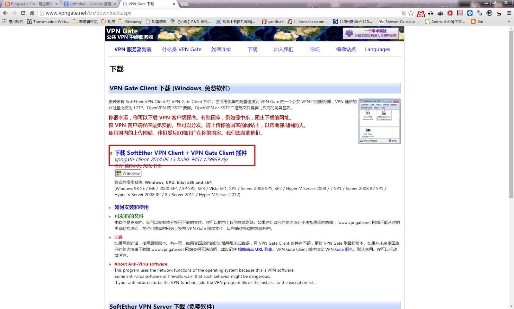

+++
title = '在 "台灣" 用 VPN 下載 "日本" Google Play 上遊戲的教學'
description = '在 "台灣" 用 VPN 下載 "日本" Google Play 上遊戲的教學'
date = 2014-06-12T17:44:00.006Z
updated = 2014-06-12T17:44:00.006Z
aliases = [ ]

[taxonomies]
tags = [ ]

[extra]
card = "preview.png"
archive = "明顯地已失效。"
+++

如果你沒有電腦的話，請直接上一頁離開謝謝

1. 在此下載 SoftEther VPN Client + VPN Gate Client 插件:  
  <http://www.vpngate.net/cn/download.aspx>

    

2. 安裝他，其中注意這裡選擇第一項

    

3. 安裝完成後，點擊這裡

    

4. 選擇 VPN Server: 地點 Japan、速度大、Ping 值小

    

5. 顯示這樣代表連線成功

    [.png)](2014-06-13%2001%2024%2010%20(2).png)

6. 打開 Google Play:<https://play.google.com/store>  
  如果還是在台灣版 Google Play 的話可以新增無痕視窗

    

7. 右上角登入，注意必須是在 "欲安裝裝置" 登入過的 google play 帳號

    

8. 打開想要下載的軟體，點選安裝  
  可以看到原本國界問題無法安裝的遊戲已經可以安裝了  
  這裡用 LoveLive 舉例:<https://play.google.com/store/apps/details?id=klb.android.lovelive>

    [.png)](2014-06-13%2001%2035%2043%20%282%29.png)

9. 選擇欲安裝的裝置，再按右邊的安裝即可

    [.png)](2014-06-13%2001%2035%2043%20%283%29.png)

此後此帳號同樣的軟體要更新或重新安裝皆不用再次用 VPN 翻牆  

---

教程完，以上
