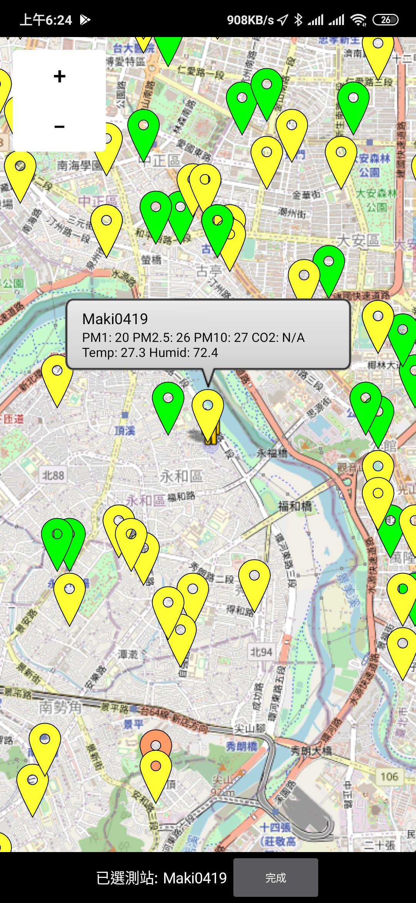

+++
title = "[Android App] PM2.5 環境空氣顯示器 (Airbox、LASS 等民間Maker站點)"
description = "[Android App] PM2.5 環境空氣顯示器 (Airbox、LASS 等民間Maker站點)"
date = 2019-01-09T07:57:00.009Z
updated = 2019-01-09T07:57:00.009Z
draft = false
aliases = [ "/2019/01/android-app-pm25-airbox-lass.html" ]

[taxonomies]
tags = [ "Android" ]

[extra]
card = "preview.png"
featured = true
+++

## 前言

<aside>
{{ image(url="preview.png", no_hover=true, transparent=true) }}
</aside>

2018 年底寫了一個手機 App，專門用來看我家窗外的 PM 測站。功能很簡單，用 App Inventor 兩天就寫完了。  
後來想想，既然參與了 LASS 這個開源專案，就讓我也做點貢獻吧！  
就把 App 補齊了一些地圖功能，還有針對不知道測站名稱的一般使用者做了一些調整。  
整個操作流程算是流暢，如果有哪裡不順歡迎反映。
<!--more-->
## Google Play

(太久沒更新被 Google Play 下架了)

~~<https://play.google.com/store/apps/details?id=appinventor.ai%5Fjim60105.air>~~

## 個人雲端 (apk 和 AppInventor 原始碼)

<https://cloud.maki0419.com/s/oGLSLqn7b6aaWZa>

## 功能描述

1. 串接 「PM2.5 開放資料入口網站」 之自造社群資料做顯示
2. 選擇測站的方式
   1. 由 GPS、地址定位，尋找臨近測站 (適合一般使用者)
   2. 從 device\_id 清單選擇 (適合擁有測站的 Maker 夥伴)
   3. 從地圖選擇 (適合看周邊測站位置)
3. 在地圖上呈現所有測站
   1. Marker 依照空氣狀況改變顏色顯示

## 截圖

|||
| ------------------- | ------------------- |
|  |  |
|  |  |
|  |  |

## 後記

在撰寫的時候遇到一個值得一提的瓶頸: Map 載入時的效能問題

要在 Map 上繪製三千多個 Marker，會整個 hang 住，應用程式無回應數秒後 Android 會關閉他。

App Inventer 沒有類似 Multi-thread 之類的功能可以使用，非常頭痛。

苦思一晚，最後使用 Clock Interval 搭配 List shift 的方式做呼叫，變相達成一樣的效果。

現在這 App 完全融入我的日常生活。

早起看一次，決定今天要不要呼吸...... 我是說戴口罩；回家看一次，看看要不要關窗開清淨機。

搭配上畢業專題做的空氣品質通報，我感覺整個人都變乾淨了。

