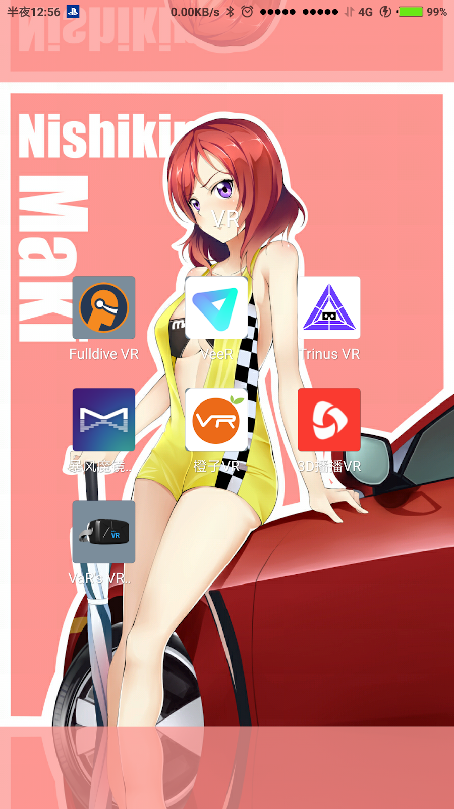

+++
title = "Android VR 影片APP 分享推薦"
description = "Android VR 影片APP 分享推薦"
date = 2018-08-28T06:43:00.009Z
updated = 2020-11-24T14:56:53.458Z
draft = false
aliases = [ "/2018/08/android-vr-app.html" ]

[taxonomies]
tags = [ "Android" ]
licenses = [ "All Rights Reserved" ]

[extra]
archive = "資訊過時，數款 App 已不存在了"
+++

## 前言

上禮拜買了 VR 眼鏡後 ([VR 眼鏡 小宅 Z5 青春版 2018 新款 開箱](@/Unboxing/VR-Headset-Xiaozhai-Z5/index.md))，安裝了一堆 APP 嘗鮮，結果留下來的就只有圖中這些。其他的不是不能看，就是體驗比別人差。特別強調一下，很多 APP 沒中選並不是做得不好，而是在台灣觀看會 LAG 或沒影像，估計是跨海和版權鎖區的關係 (?)。評語非常主觀請不要太認真\~

<!-- more -->

## [Fulldive VR](https://play.google.com/store/apps/details?id=in.fulldive.shell)

<aside>
{{ image(url="unnamed.png", no_hover=true) }}
</aside>

Fulldive VR 提供完整的沉浸式體驗，一開啟軟體就進入 Cardboard 模式，完全在裏頭操作選擇影片，而不需要把手機拿上拿下。搜尋可以直接搜尋到 Youtube 的影片，可以將他當成 Youtube 播放器來使用。他有另一個搭配的 APP 叫做 "[Fulldive Browser](https://play.google.com/store/apps/details?id=com.fulldive.mobile\&hl=en%5FUS)"，但是我沒搞懂該怎麼用。

<figure>
{{ image(url="2.png") }}
<figcaption>每個人可以給影片一個表情評價，上方就是針對使用者表情做分類</figcaption>
</figure>

<figure>
{{ image(url="3.png") }}
<figcaption>搜尋功能很強大</figcaption>
</figure>

## [VeeR VR](https://play.google.com/store/apps/details?id=com.velotech.veer)

<aside>
{{ image(url="061585aa5ce096efc5b00d8f8418154b15640654d.png", no_hover=true) }}
</aside>

VeeR VR 比較著重在社群的部分，來源都是使用者上傳，也是少數持續有新影片的平台。最左頁籤定時會有推薦內容，還有來自訂閱的社群更新，有點類似 Facebook 動態時報那樣。搜尋頁籤除了關鍵字搜尋以外，最讓我驚訝的是他有一個 "Anime" 分類！裡面有一些漫展的實拍影片，以及 MMD VR 影片等。

<figure>
{{ image(url="4.png") }}
<figcaption>軟體介面很漂亮，不像Fulldive能在Cardboard模式選影片算是可惜了</figcaption>
</figure>

## ~~暴風魔鏡~~/[橙子 VR](http://app.mi.com/details?id=com.chengzivr.android)/[3D 播播 VR](http://app.mi.com/details?id=com.bobo.splayer)

  

這三款軟體我一併做介紹，軟體本質大同小異，影片內容各有千秋，他們在台灣都可正常觀看。「本地播放」功能三款都做得很好，但是特別注意的是，「飛屏播放」功能做得最完善的是暴風魔鏡 (橙子 VR 檔名不支持特殊字元、3D 播播電腦軟體簡中亂碼)。以下截圖皆來自暴風魔鏡。


2020 更新: 暴風魔鏡在各 app 商城已下架，我也不打算再重裝測試。


<figure>
{{ image(url="5.png") }}
<figcaption>影片內容各式各樣，不過暴風魔鏡支援的遠端播放方式最多、功能完善</figcaption>
</figure>

<figure>
{{ image(url="6.png") }}
<figcaption>飛屏軟體電腦端，使用直覺</figcaption>
</figure>

<figure>
{{ image(url="7.png") }}
<figcaption>影片可以解析2D或3D，模式皆可選，三款都是很好的影片播放器</figcaption>
</figure>

<figure>
{{ image(url="8.png") }}
<figcaption>此為普通平面影片飛屏串流，上為在Cardboard模式觀賞，下為原片播放可見到畫面精細，目測沒有明顯掉幀情況，就算沒有VR眼鏡，一般串流播放也是表現優異順帶一提，這是個23分鐘1.7GB的H264 FLACx2 MKV檔案</figcaption>
</figure>

## [VaR's VR Video Player](https://play.google.com/store/apps/details?id=com.abg.VRVideoPlayer\&hl=zh%5FTW)

<aside>
{{ image(url="unnamed2.png", no_hover=true) }}
</aside>

這是個很單純的 VR 影片播放器，只支援本機播放。可調整選項眾多，軟體本體單純，如果自己的影片在其他播放軟體無法正常顯示不妨試試這款。

<figure>
{{ image(url="10.png") }}
<figcaption>除了基本的影片模式選擇，他還能調整視距、變形、尺寸等</figcaption>
</figure>

## [Trinus VR](https://play.google.com/store/apps/details?id=com.loxai.trinus.full\&hl=en%5FUS)

<aside>
{{ image(url="F7AAIXFIPY0L5D3.LARGE.jpg", no_hover=true) }}
</aside>

這個我故意放在最後面講，這是超他媽屌炸天的一款軟體。他可以串接 SteamVR，將你的手機模擬成連接電腦的 VR 裝置，及時串流遊戲畫面到手機上。而且連接方式支援 WIFI 傳輸，換句話說，沒有線的 SteamVR 眼鏡！個人沒有玩 PC 大作，無法就遊戲影像跟 FPS 做評論，就等別人補充了。

<figure>
{{ image(url="11.png") }}
<figcaption>可選選項非常多，很多我根本不知道怎麼設定</figcaption>
</figure>

<figure>
{{ image(url="12.JPG") }}
<figcaption>成功開啟Koikatu VR！</figcaption>
</figure>

雖然成功串流了 Koikatu 影像，但是沒有手柄可以操作。爬文看到[這裡](https://webcache.googleusercontent.com/search?q=cache:pHCqnb55at4J:https://www.weibo.com/ttarticle/p/show%3Fid%3D2309403992809748185646+\&cd=20\&hl=zh-TW\&ct=clnk\&gl=tw\&client=firefox-b)和[這裡](https://support.riftcat.com/hc/en-us/articles/211680065-LeapMotion-Tutorial-Tracking-your-hands-with-VRidge)提到 Leap Motion 可以模擬 Vive 手柄，值得研究。

<figure>
{{ image(url="DSC06988.JPG") }}
<figcaption>「立體的歐派，揉....揉不到？！」</figcaption>
</figure>
