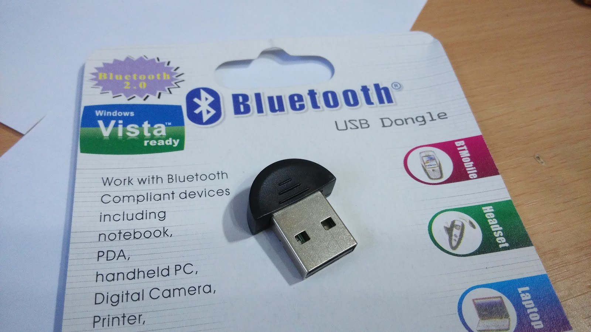
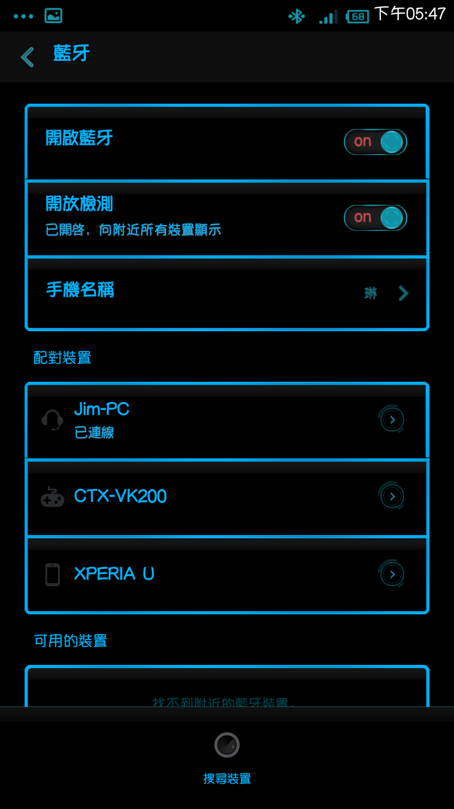

+++
title = "透過藍牙用電腦撥放手機音訊"
description = "透過藍牙用電腦撥放手機音訊"
date = 2014-06-16T09:55:00.000Z
updated = 2014-06-16T09:55:00.000Z
draft = false
aliases = [ ]

[taxonomies]
tags = [ ]

[extra]
card = "preview.jpg"
poor = true
+++

網購了這個  
花了一兩個小時設定，試用了 5 分鐘  
然後收回盒子裡。  
應該不是她產品問題，是我手機處理不來  
雖說我買的是便宜貨拉\~  
\--  <!--more-->
每次玩 LoveLive 都要把電腦喇叭拔起來插手機  
這樣拔拔插插頗麻煩的  
所以想要用藍芽來把聲音接進電腦，再用電腦撥放

原始的 Windows7 驅動沒有這樣的功能  
於是我就上網找到了這個: <http://blog.sun0816.com/12744.html>  
(因為這東西是 CSR 晶片的)  
把本機設定為 "耳機" 以後再連線就成功了

放音樂 OK，但是玩音 Game 不 OK  
音樂有播放出來，不過 LL 遊戲中的 "按鍵音" 有延遲  
而且不是全部往後延遲而是斷斷續續

個人猜測是同時 "驅動藍芽晶片"+"網路"+"運行遊戲" 手機會負荷不了  
所以以後就只能繼續拔拔插插拔拔插插拉\~\~

\--  
雖說不能玩 LL  
不過有成功播放聲音了所以紀錄一下設定部分

裝他: <http://blog.sun0816.com/12744.html>  
裝好以後打開程式長這樣  
對中間的蛋黃 "右鍵"→"屬性"

裝置名稱隨便取，等下配對的時候認得出來就好  
裝置類型選耳機

接著 "服務"→"藍芽高品質音訊"→"屬性"→"播放裝置"  
播放裝置選擇跟你混音器那邊一樣的

(圖片點開有大圖)

然後到手機那邊做配對  
他會顯示耳機圖案不是電腦圖案

以上。
