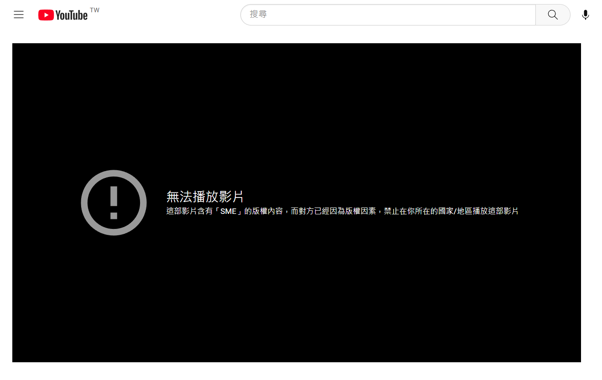
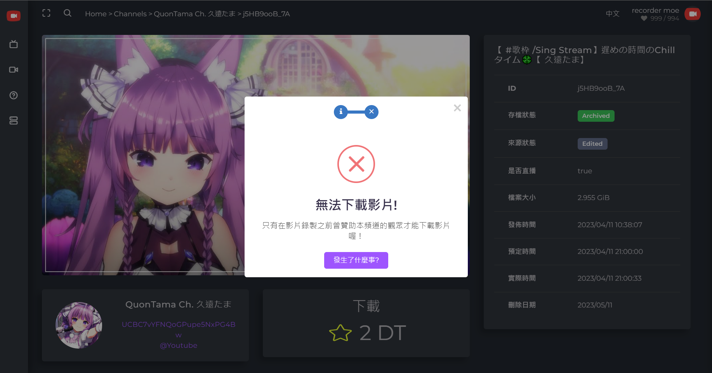
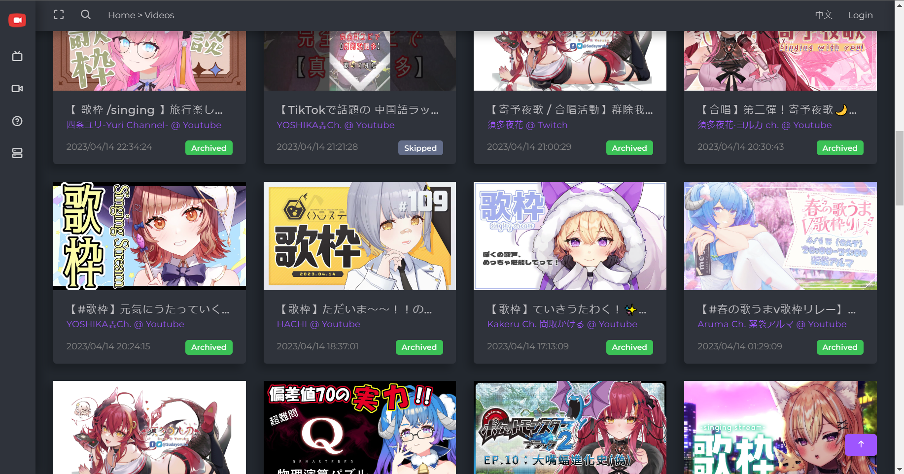
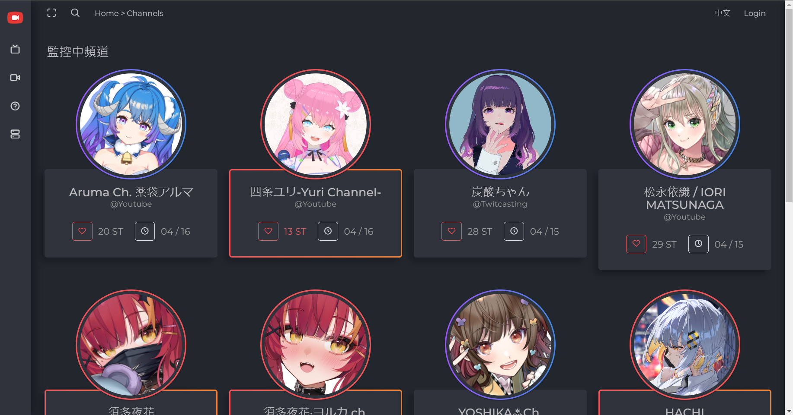
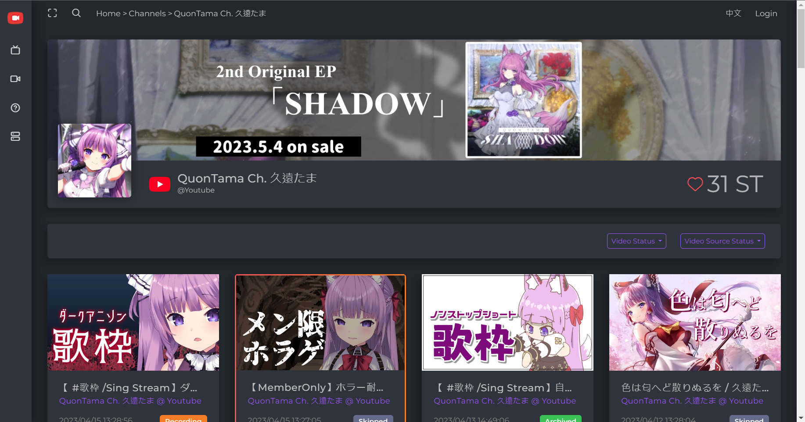
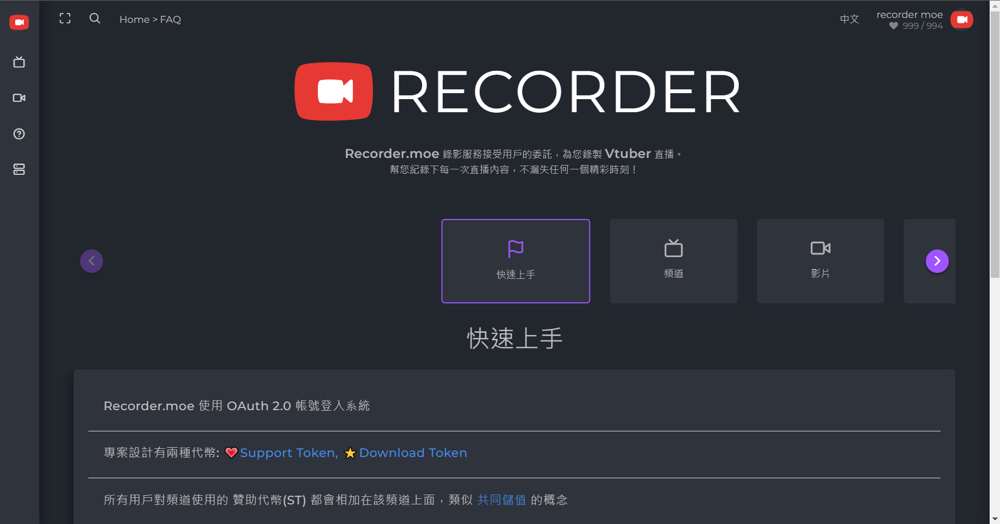
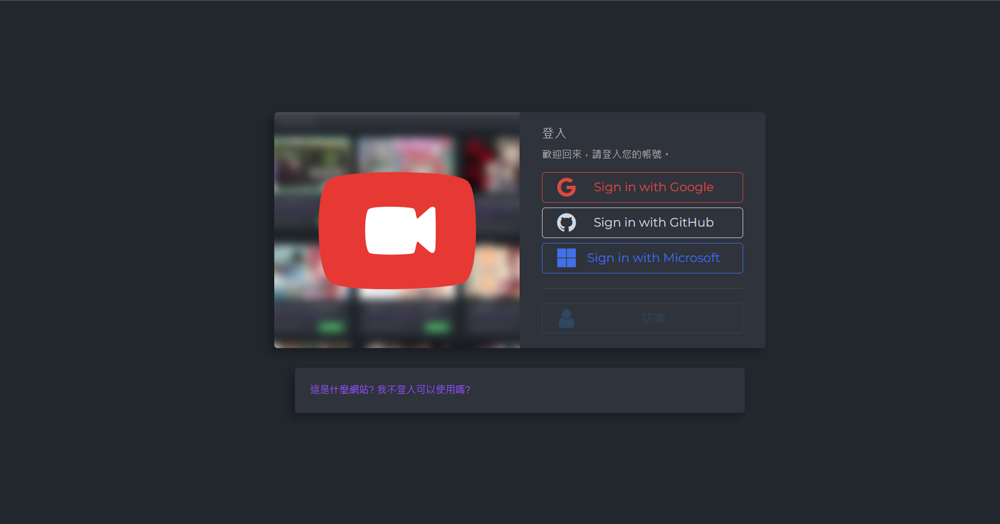
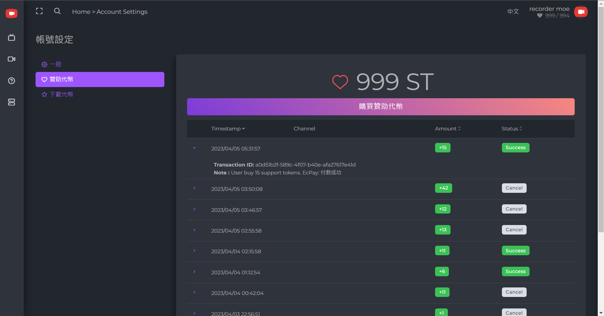

+++
title = "[個人專案] Recorder.moe 錄影服務，讓你再也不會錯過 Vtuber 直播"
description = "Recorder.moe 是一個線上錄影服務，致力於為 Vtuber 和粉絲提供全自動化的錄影服務體驗。Recorder.moe 使用先進的技術與 Azure 等雲端服務構建基礎設施。我們的目標是成為 Vtuber 領域中頂尖的錄影服務。"
date = 2023-04-13T17:48:00.036Z
updated = 2023-05-14T23:46:42.466Z
aliases = [
  "/2023/04/Recorder-moe-Never-miss-a-Vtuber-stream-again.html"
]

[taxonomies]
tags = [
  ".NET Core",
  "Azure",
  "C#",
  "Container",
  "JavaScript",
  "Livestream",
  "S3",
  "Twitch",
  "Youtube",
  "yt-dlp",
  "TwitCasting"
]
licenses = [ "GFDL 1.3" ]

[extra]
banner = "preview.png"
iscn = "iscn://likecoin-chain/QsE_540EtpD7_wYMBmvkJWAid2Sj5wBZym2z0y2RH10/1"
featured = true
archive = "本專案已於 2023/5/14 停止服務並全額退費，現在是一套供個人架設的錄影系統。"

  [extra.comments]
  id = "110193851499270279"
+++


Recorder.moe 曾經是面向一般使用者的付費錄影服務平台，自 2023/5/14 後轉型為供個人架設的錄影系統。  
這套系統的門檻相對較高，不建議沒有相關知識的人部署。😉

如果您有任何問題，歡迎到本專案的 Discord 詢問  
👉 <https://discord.gg/2M689Aaq4b>


> **Recorder.moe** 錄影服務接受用戶的委託，為您錄製 **Vtuber** 直播。  
> 幫您紀錄下每一次直播內容，不漏失任何一個精彩時刻！  
> **👉[https://recorder.moe](https://recorder.moe/)**

## 前言 —— 這是什麼專案，我為了什麼創造它?

> 
>
> SME版權炮

在最近幾年，Vtuber 成為了我最主要的娛樂興趣。我對 Vtuber 的直播影片充滿熱情，特別是唱歌主題的直播影片。但是，{{cr(body="Youtube 對音樂版權的限制使得這些影片很容易遭到刪除。")}}

作為一名軟體工程師，[我研究過各種錄影方法](@/Livestream/youtube-dl-auto-recording-live-dl/index.md) 和 [backup-dl](@/Livestream/backup-dl/index.md)。但是，{{cr(body="這些工具主要面向工程師使用，普通人並不容易操作。")}}

我注意到許多 Vtuber 粉絲也有相同的困擾，但是他們沒有足夠的技術去解決這個問題，大多數現有的工具也不夠易用。每個人自行錄影造成效能與資源的浪費，集中在同一個平台進行錄影，然後提供給需要的人會更加節省成本。

有鑑於此，[我決定打造一個以「錄影直播」為核心概念的服務 — Recorder.moe](https://recorder.moe/)。這是一個線上服務，能夠接受用戶的委託並代為錄製 Vtuber 的直播。{{cg(body="我希望可以透過這個簡單的服務，讓更多粉絲有機會欣賞 Vtuber 的魅力。")}}Recorder.moe 是我的心血結晶，我將持續努力開發來為 Vtuber 和粉絲服務。
<!-- more -->
## 使用流程 —— 如何使用 Recorder.moe 錄影服務

在前言中我們提到，{{cg(body="Recorder.moe 是一個線上錄影服務，接受用戶委託並代為錄製 Vtuber 的直播。")}}要使用這個服務，首先你需要有一個 Google、GitHub 或 Microsoft 帳號，並透過我們的網站登入。登入後，你可以購買 Support Token(ST) 並使用它來贊助你想要錄影的頻道。

**我們視「贊助頻道」這個動作為你向我們的平台發出錄影服務的委託**。在你贊助某個頻道後，我們的系統會開始監控該頻道並為你錄製直播。{{cr(body="你只能下載在你委託後所錄製的內容。")}}如果該頻道在你贊助前已經有被錄製的直播，你無法下載那些更早期的錄影檔案。{{cr(body="我們嚴格執行這條規則，以確立我們的服務定位在「提供錄影服務」，而非「販售錄影檔案」。")}}

> 
>
> 我們賣服務，不賣影片。

**所有錄製好的影片檔案會保存 30 天**，30 天後影片檔案將被自動刪除。{{cg(body="你可以在期限內使用 Download Token(DT) 取得你想要的影片，並且可以無限次數地存取該影片。")}}DT 會在你贊助頻道時自動配發給你。若頻道的 ST 用盡，我們會停止監控該頻道，直到它再度被贊助為止。

**Support Token** 用來支撐整個系統的運作成本，包含監控主機租用費用、錄影轉檔運算費用、錄影檔案儲存費用、資料庫交易費用、網頁後端 API 費用、專案開發維護人力成本。

**Download Token** 的設計是為了維持下載和贊助的比例，有贊助錄影者才會有對應的下載額度。且由於下載影片要消費 DT，用戶們會自主選擇在原平台觀賞來源仍存在的影片，{{cg(body="這個設計使我們不會瓜分掉 Vtuber 的流量。")}}

## 專案運作模式 —— Recorder.moe 如何運作

當用戶贊助某個頻道後，我們的系統會開始監控該頻道的直播資訊。一旦偵測到直播開始，系統會在 Azure Container Instance 上動態部署容器並執行錄影。錄影完成後，錄影檔案會上傳至 Azure Blob Storage，並更新資料庫的影片記錄。30 天後，影片檔案會被自動刪除。

我們選擇使用 Docker 技術是考量到成本效益，容器技術可以快速啟動與停止，並有效率地降低成本。一旦直播結束，容器也跟著停止，不會長期佔用運算資源。這個架構可以輕鬆地橫向擴展，{{cg(body="我們的系統可以在同一時間執行無限數量的錄影。")}}

## 專案基礎設施架構 —— Recorder.moe 背後的技術實現

我們選擇**微軟 Azure 雲端服務**做為基礎架構與服務提供商，因為它提供高度彈性的雲端運算服務和平台即服務 Azure Functions 等，可以有效降低我們的開發與維運成本。

> 
>
> 很複雜嗎? 反正你記住我用上一大堆酷玩意就對了  

Recorder.moe 的前端網站使用 Angular 構建，並部署在 **Azure Static Web Apps** 上。前端網站負責使用者界面、購買 ST、贊助頻道以及下載影片等功能。

後端 API 使用 **Azure Functions** 開發，同樣部署在 Azure 上。API 負責處理登入驗證、交易記錄、影片清單等和資料庫有關的請求。登入驗證使用 **Azure App Service** 內建的 Easy Auth 來進行 OAuth 2.0 登入 Google、GitHub 和 Microsoft 帳號。

我們使用 **Azure Container Instance** 動態部署 **Docker container**。這些 Container 負責直播的錄影工作，並將錄製完成的檔案上傳到 **Azure File Shares**。

上傳到 Azure File Shares 的錄影檔案，會由另一支 **Azure Function** 移轉至 **Azure Blob Storage**。Azure File Shares 和 Blob Storage 和我們的 Azure Function 位於同一個區域，以避免跨區域的頻寬費用。

所有的資料都儲存於 **Azure Cosmos DB** 中，像是用戶資料、交易資料、頻道清單、影片資料等。我們選擇 Cosmos DB 是考量到其高度的可用性和延展性。Angular 前端網站可以直接透過 API 查詢數據，這能大幅降低做為 Backend 的 Azure Function 的使用量，維持成本低廉。

最後，我們使用 **Cloudflare** 提供網站的 CDN 加速和 DNS 託管等服務。並透過 **Cloudflare Workers** 產出網頁的 Open Graph meta tag，針對不同的影片頁面提供各自的外部預覽圖片、資料，同時解決 Angular 身為 SPA 的先天限制。

## TL;DR 總結 —— 展望 Recorder.moe 的未來

總結來說，{{cg(body="Recorder.moe 是一個線上錄影服務，致力於為 Vtuber 和粉絲提供全自動化的錄影服務體驗。")}}透過購買 Support Token 並贊助服務，用戶可以委託我們幫忙錄製 Vtuber 的直播內容。我們視贊助為發出錄影委託，並依據委託的時間提供未來所錄製的內容給用戶下載。

{{cg(body="Recorder.moe 使用先進的技術與 Azure 等雲端服務構建基礎設施。")}}動態部署 Docker container 監控並錄製直播，儲存檔案於 Azure Blob Storage 和 Cosmos DB，由微軟提供高速的頻寬和良好使用體驗。這些技術的選用可以實現高度的擴展性、高可用性與低廉的維運成本。

{{cg(body="我們的目標是成為 Vtuber 領域中頂尖的錄影服務。")}}未來，我們將持續努力開發並提升各項功能:

1. 串接 Arweave 區塊鏈，讓錄製的影片能永久保存，不會因為我們的儲存到期而刪除。
2. 接入虛擬貨幣支付，讓更多國外用戶也能享受 Recorder.moe 的服務。
3. 除了現有的 Youtube、Twitch 和 Twitcasting 以外，我們也計劃支援更多的直播平台。
4. 我們即將啟動推薦計劃: 當您推薦其他人購買 ST，您將可以獲得一定的獎勵。用戶數的增加可以平分錄影成本，有效地降低每個人的負擔，進而讓我們能提供更加便宜的收費方案或是 DT 換算比率。

謝謝各位，我們將持續努力，打造出最好的 Vtuber 錄影服務！

> **Recorder.moe** 錄影服務接受用戶的委託，為您錄製**Vtuber** 直播。  
> 幫您紀錄下每一次直播內容，不漏失任何一個精彩時刻！  
> **👉[https://recorder.moe](https://recorder.moe/)**

## 網站截圖預覧

