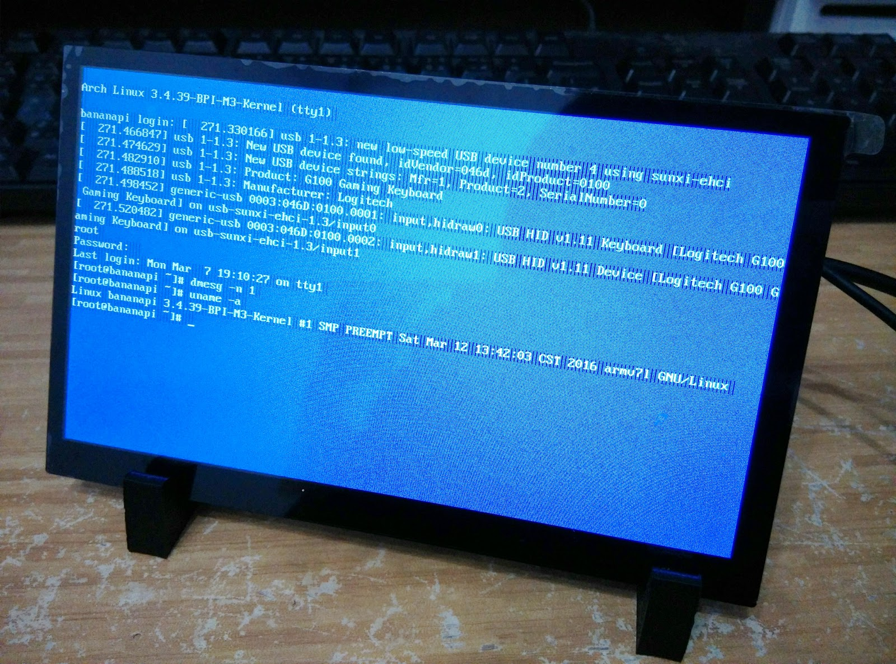

+++
title = "Bananapi 香蕉派 M3 ArchLinux 支援 BPI 7 吋 LCD 輸出之鏡像"
description = "Bananapi 香蕉派 M3 ArchLinux 支援 BPI 7 吋 LCD 輸出之鏡像"
date = 2016-03-12T13:33:00.003Z
updated = "2024-11-26T22:16:20.390Z"
draft = false
aliases = [ "/2016/03/bananapi-m3-archlinux-7lcd.html" ]

[taxonomies]
tags = [ "bananapi" ]

[extra]
card = "IMG_20160312_142441.jpg"
+++

[](IMG%5F20160312%5F142441.jpg)

香蕉派 M3，硬體夠強但是官方系統支援現在還不夠  
爬了一下文決定自己搞w

## 載點

OneDrive: <https://gothuedutw-my.sharepoint.com/:u:/g/personal/f03350001_go_thu_edu_tw/EcWcbE3FpyZKiTLQo1qHsHsBA-47783EqRLgvK7kMGQcDw?e=DMSM6G>

## 特色

1. 以官方釋出之 [BPI-M3-bsp](https://github.com/BPI-SINOVOIP/BPI-M3-bsp) 進行編譯
2. 搭配 "[2015-12-09-ArchLinuxARM-lite-bpi-m3-sd-emmc.img](http://forum.banana-pi.org/t/bpi-m3-new-image-archlinuxarm-lite-for-bpi-m3-20151209/850)" 進行 Cross-Compile
3. 以官方 7 吋 LCD 進行畫面輸出
4. 縮小 /dev/sdx2 之大小至 5.4G，確保 8G SD 卡都能裝的下
<!-- more -->
## 使用方法

* Windows:  
  使用 Win32DiskImager 寫入記憶卡

* Unix/Linux/BSD:

  ```bash
  dd if=arch_LCD7_20160312.img of=/dev/sdx bs=1M
  ```

  (覆蓋 /dev/sdx 為你的記憶卡位置)  
  詳見: <https://bananapi.gitbooks.io/bpi-m3/content/howtoburnlinuximagetoemmc.html>  
  寫入完成後，請用 resize2fs 擴大 /dev/sdx2 之容量為記憶卡最大大小  
  方法詳見: <http://banoffeepiserver.com/resize-the-root-file-system-partition.html>

## 已知問題

那個藍底螢幕不知道怎麼調啊\~

## 參考資料

1. How to burn Linux image to eMMC | Banana pi BPI-M3 octa-core single board computer  
   <https://bananapi.gitbooks.io/bpi-m3/content/howtoburnlinuximagetoemmc.html>
2. GitHub - BPI-SINOVOIP/BPI-M3-bsp: Supports BananaPi BPI -M3 (Kernel3.4)  
   <https://github.com/BPI-SINOVOIP/BPI-M3-bsp>
3. 乐美客轻松编译香蕉派 u-boot 及内核 (适用于 Lubuntu3.0)\_Banana Pro/Pi 常规讨论\_乐美客开发板论坛 | LeMaker  
   <http://forum.lemaker.org/cn/thread-426-1-1.html>
4. 放大或縮小 Linux 分割區 – 煎炸熊の記事本  
   <http://note.artchiu.org/2009/12/25/%E6%94%BE%E5%A4%A7%E6%88%96%E7%B8%AE%E5%B0%8F-linux-%E5%88%86%E5%89%B2%E5%8D%80/>
5. Resize the root partition  
   <http://banoffeepiserver.com/resize-the-root-file-system-partition.html>
