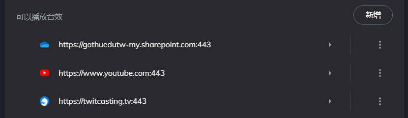
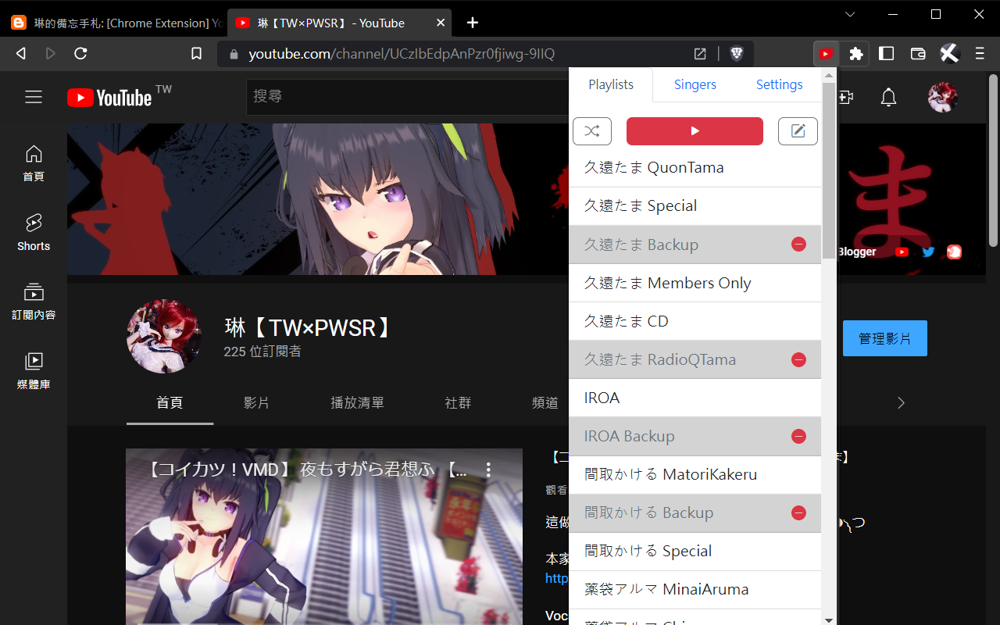
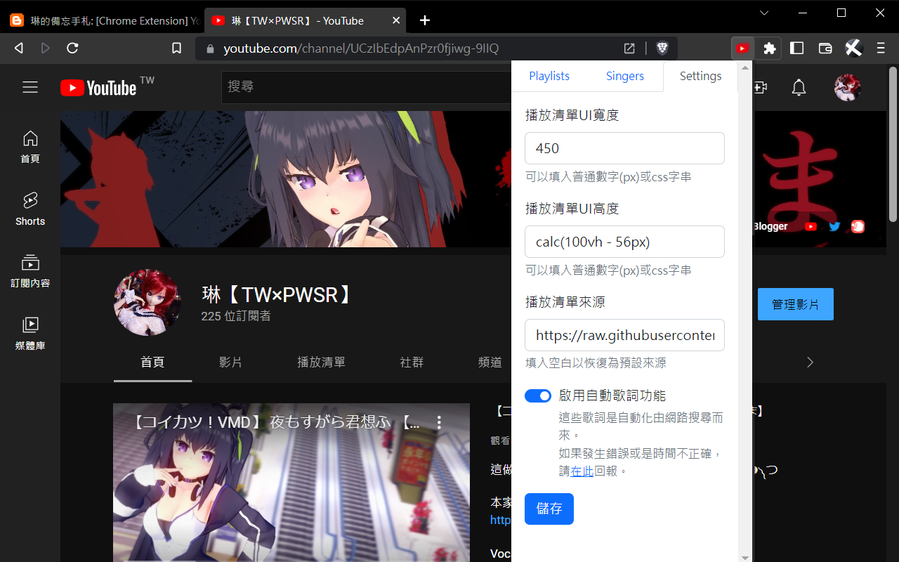
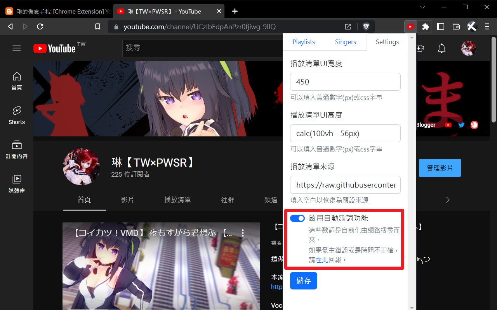
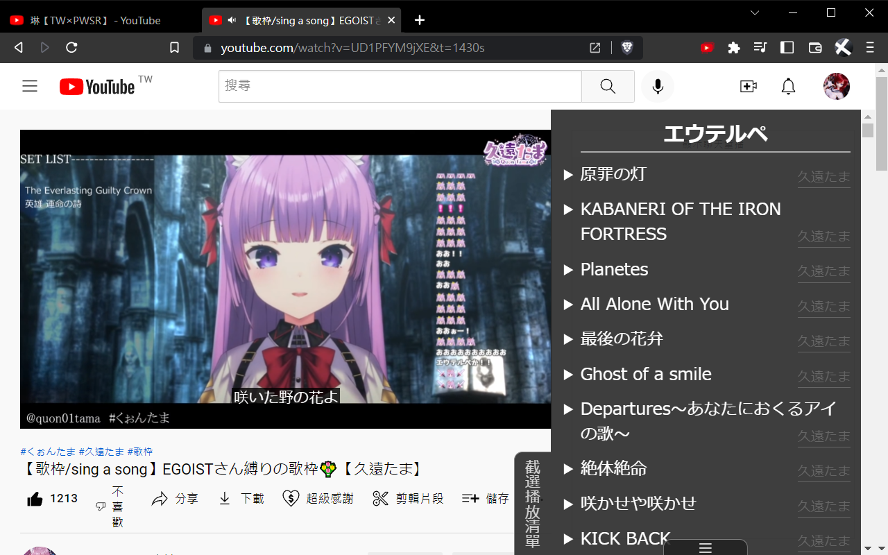
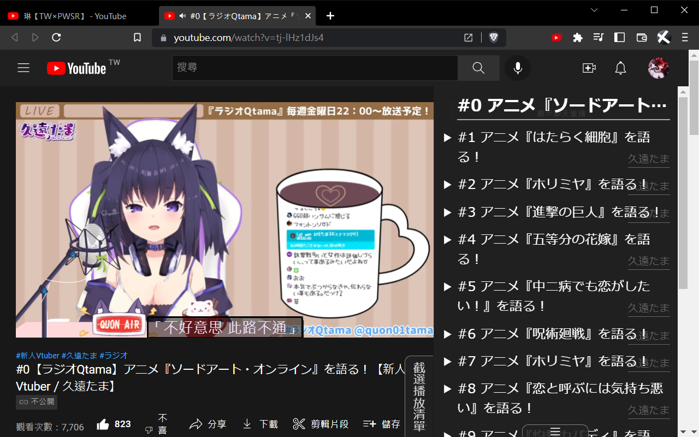

+++
title = "[Chrome Extension] Youtube影片截選播放清單 (Youtube Clip Playlist)"
description = "這是截選播放清單擴充功能，在 Youtube/Onedrive/GoogleDrive/TwitCasting 上直接播放「起始~結束時間」影片片段。此工具專門設計來聽 Vtuber 的歌枠。 (Chrome extension)"
date = 2022-06-29T16:50:00.018Z
updated = 2024-04-08T14:52:45.753Z
draft = false
aliases = [ "/2022/06/chrome-extension-youtube-clip-playlist.html" ]

[taxonomies]
tags = [ "JavaScript", "Livestream", "Youtube", "TwitCasting" ]
licenses = [ "GFDL 1.3" ]

[extra]
card = "preview.png"
iscn = "iscn://likecoin-chain/2fdhShCP5c6UejXKF9ZOwwl4v1cZPyp8RrbzcYpjt_o/1"
featured = true

  [extra.comments]
  id = "109500903202363504"
+++

{{ youtube(id="xuc4Buob22o") }}

    
      
   

## 前言

這是截選播放清單擴充功能，在 Youtube/OneDrive/GoogleDrive/TwitCasting 上直接播放「起始\~ 結束時間」影片片段。  
此工具專門設計來聽 Vtuber 的歌枠，這是我對於歌回烤肉的程式解

和看烤肉或剪片相比的優點為

* 觀看數都會算在原始影片上
* 只要清單化起始 / 結束時間就完事，比剪片快得多
* 因為沒有轉載、修改原影片，不會有版權爭議

> 此專案曾是個油猴腳本 (UserScript)，現已重寫為擴充功能
<!-- more -->
## 安裝方法

* 參照[這篇文章](@/Frontend/media-autoplay-on-browser/index.md)，設定下方網域的{{cg(body="允許自動播放")}}

  * `https://www.youtube.com:443`
  * `https://onedrive.live.com:443`
  * `https://gothuedutw-my.sharepoint.com:443`
  * `https://twitcasting.tv:443`
  * `https://drive.google.com:443`

  

* 安裝瀏覧器擴充功能

  <https://chrome.google.com/webstore/detail/kdlhjpdoaabhpolkaghkjklfcdfjapkh>

## 彈窗 UI 選單

### UI

瀏覧器右上角開啟擴充工具彈出式視窗

* 單擊左上角的隨機按鈕，切換是否隨機播放
* 單擊中間的紅色播放按鈕，播放**所有**播放清單
* 單擊播放清單列表，播放**單一**播放清單

### 禁用歌單功能

> 若你不聽廣播，可以把 RadioQTamaList 禁用，再使用全循序 / 隨機播放功能

點擊右上角進入「編輯」功能，此時在清單項單擊可以啟用、禁用該播放清單  
編輯完成後，請務必單擊右上角「儲存」按鈕寫入設定

## 歌單 (Playlist)

目前內建[久遠たま](https://www.youtube.com/channel/UCBC7vYFNQoGPupe5NxPG4Bw)、[間取かける](https://www.youtube.com/channel/UCiLt4FLjMXszLOh5ISi1oqw)、[薬袋アルマ](https://www.youtube.com/channel/UCD1QOCJIAPsMKMvRSXjLahw)、[須多夜花](https://www.youtube.com/channel/UCuy-kZJ7HWwUU-eKv0zUZFQ)、[伊冬ユナ](https://www.youtube.com/channel/UCYbzeYnRZuw7fZKrgu2bgtw)、[YOSHIKA⁂Ch.](https://www.youtube.com/c/YOSHIKA-Ch) 的歌單

如果想要編寫歌單，請參考[此 repo](https://github.com/jim60105/Playlists)  
你也可以 fork 此 repo，從頭寫你自己的！

### 歌單格式

歌單的格式是 JSON with comment  
這裡有[總表](https://github.com/jim60105/Playlists/blob/master/Playlists.jsonc)，標示清單名稱、標籤、位置，並載入[個別歌單](https://github.com/jim60105/Playlists/blob/master/QuonTama/QuonTamaSongList.jsonc)

每個陣列中儲存以下項目: \[VideoID, StartTime, EndTime, Title?, SubSrc?]

* VideoID: 必須用引號包住，為字串型態
* StartTime: 必須是非負數，為數字型態。如果要從頭播放，輸入 0
* EndTime: 必須是非負數，為數字型態。如果要播放至尾，輸入 0
* Title?: 必須用雙引號包住，為字串型態，可選
* SubSrc?: 必須用雙引號包住，為字串型態，可選

## 歌詞、字幕

### 自動歌詞功能

此專案有一支排程程式，自動從網路上蒐集歌詞，請在 UI 的 Settings 頁啟用。  
歌詞來源為 [網易雲音樂](https://music.163.com/)，以 GitHub Workflow 定時將播放清單使用的歌詞[轉存至 GitHub](https://github.com/jim60105/Lyrics/tree/lyrics)，然後再讓客戶端存取 GitHub。  
經過這層轉存，{{cg(body="你不會直接存取網易雲音樂站台")}}，請安心使用。

> 注意，這是附加功能！  
> 由於歌詞皆為自動化搜尋匹配，能預期會有大量的錯誤情況發生。  
> 若發現歌詞有錯誤，請在[這裡](https://github.com/jim60105/Lyrics/issues/new/choose)回報。  
> 請務必提供該歌曲的 Share 連結，以便我能夠快速修正錯誤歌曲

↓啟用後↓

### ASS 字幕功能

此工具支援載入 WebVTT 字幕 (.vtt)、ASS 字幕 (.ass)、lrc 歌詞 (.lrc)，可將字幕直鏈傳入歌單之 SubSrc 欄位

## 參數說明

### 播放單一播放清單

<pre style="text-align: left; width: 100%;">
  https://www.youtube.com/? 
  &nbsp;&nbsp;&nbsp;&nbsp;startplaylist &amp; 
  &nbsp;&nbsp;&nbsp;&nbsp;playlist=QuonTamaSongList
</pre>

### Youtube 網址格式

<pre style="text-align: left; width: 100%;">
  https://www.youtube.com/watch? 
  &nbsp;&nbsp;&nbsp;&nbsp;v=ETjgki1sSgc &amp; 
  &nbsp;&nbsp;&nbsp;&nbsp;t=1591 &amp; 
  &nbsp;&nbsp;&nbsp;&nbsp;end=1880 &amp; 
  &nbsp;&nbsp;&nbsp;&nbsp;shuffle=1 &amp; 
  &nbsp;&nbsp;&nbsp;&nbsp;playlistinclude=quon &amp; 
  &nbsp;&nbsp;&nbsp;&nbsp;playlistexclude=member
</pre>

### Google Drive 網址格式

<pre style="text-align: left; width: 100%;">
  https://drive.google.com/file/d/13LaALYNOmdN3GfD7aeKreyzshdKX-Tvz/view? 
  &nbsp;&nbsp;&nbsp;&nbsp;t=884 &amp; 
  &nbsp;&nbsp;&nbsp;&nbsp;end=1166  &amp; 
  &nbsp;&nbsp;&nbsp;&nbsp;shuffle=1 &amp; 
  &nbsp;&nbsp;&nbsp;&nbsp;playlistinclude=quon &amp; 
  &nbsp;&nbsp;&nbsp;&nbsp;playlistexclude=member
</pre>

### 其它網址格式 (目前支援 OneDrive、twitcasting)

其它格式是以原網址直接當做 VideoID 傳入

<pre style="text-align: left; width: 100%;">
  https://twitcasting.tv/quon01tama/movie/688324697 
  &nbsp;&nbsp;&nbsp;&nbsp;t=1470 &amp; 
  &nbsp;&nbsp;&nbsp;&nbsp;end=1653  &amp; 
  &nbsp;&nbsp;&nbsp;&nbsp;shuffle=1 &amp; 
  &nbsp;&nbsp;&nbsp;&nbsp;playlistinclude=twitcasting
</pre>

### 參數

<ul style="text-align: left;">
  <li>
    VideoID:
    在 Youtube 為原生<code>v</code>參數；Google Drive 是在路徑中；其它為原始網址
  </li>
  <li><code>t</code>: 影片播放開始時間</li>
  <li>
    <code>end</code>: 在指定秒數停止播放影片
  </li>
  <li>
    <code>shuffle</code>: Playlist 隨機播放，1 為啟用；0 為禁用(等同不傳入)&nbsp;
  </li>
  <li><code>playlist</code>: 播放單一清單，不能和 <code>playlistinclude</code>、<code>playlistexclude</code> 同時傳入&nbsp;</li><li>
    <code>playlistinclude</code>:
    讀入 Playlist 標籤，可以以「_」底線分隔傳入多個標籤
  </li>
  <li>
    <code>playlistexclude</code>:
    排除 Playlist 標籤，可以以「_」底線分隔傳入多個標籤
  </li>
</ul>

### 詳細功能描述

<ul style="text-align: left;">
  <li>此工具是由網址參數驅動</li>
  <li>
    傳入 startplaylist 時會啟動此工具，執行全清單循序播放
  </li>
  <li>
    傳入 end，會在指定秒數停止播放器
  </li>
  <li>
    傳入 playlist 參數，會播放指定播放清單
  </li>
  <li>
    使用「標籤篩選功能」，可以混合播放多個播放清單 (例如，以 playlistinclude=tama 播放久遠たま的所有類型播放清單)
    <ul>
  <li id="include">
    傳入 playlistinclude，則只會載入有該標籤的清單
  </li>
  <li>
    傳入 playlistexclude，則會排除有該標籤的清單，且 <b>Exclude 優先於Include</b>
  </li>
    </ul>
  </li>
  <li>
    「禁用歌單功能」將禁用指定歌單，即使透過標籤篩選也會被排除在外
  </li>
  <li>
    「隨機功能」為建立亂序清單後播放，在所有歌曲都放過一輪後才會再循環
  </li>
  <li>傳入 startplaylist 參數時會立刻重建亂序清單</li>
  <li>
    支援以鍵盤的媒體按鍵 (Media Keys) 操作「<b>下一首</b>」
  </li>
  <li hidden="">
    遮蔽「影片已暫停，要繼續觀賞嗎？」功能
  </li>
</ul>

## LICENSE

此工具以 GPLv3 License 開源
