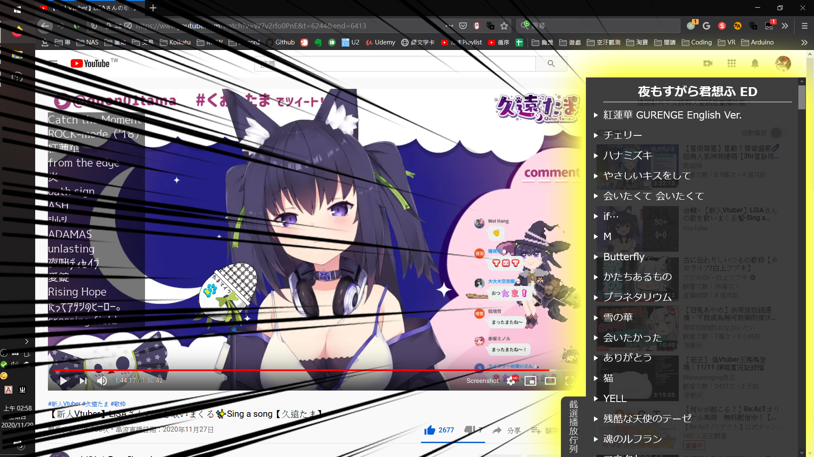
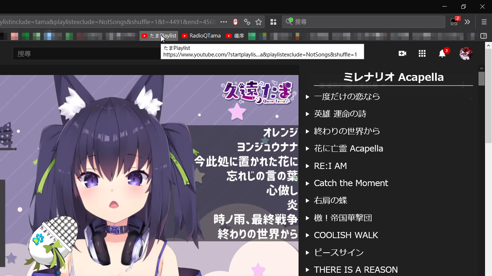
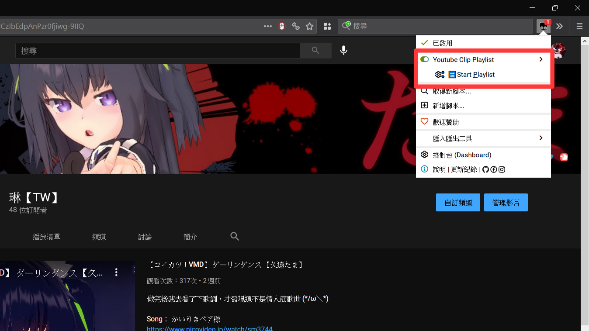
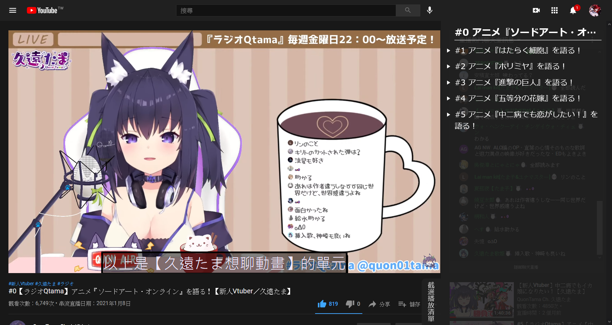

+++
title = "[UserScript] Youtube影片截選播放清單 (Youtube Clip Playlist)"
description = "這是截選播放清單功能，專門設計來聽Vtuber的歌枠。能設定歌曲起始時間、結束時間，並在播完單曲後播放下一首。把你的loop時數留給Vtuber本人，而不是烤肉man。"
date = 2020-12-19T10:58:00.124Z
updated = 2022-07-04T20:53:48.482Z
draft = true
aliases = [ "/2020/12/userscript-youtube-clip-playlist.html" ]

[taxonomies]
tags = [ "JavaScript", "Livestream" ]

[extra]
+++
## 前言

> 此專案已重寫為[Chrome擴充功能](/2022/06/chrome-extension-youtube-clip-playlist.html)

     

這是截選播放清單功能，專門設計來聽Vtuber的歌枠

和看烤肉或剪片相比的優點為

* 觀看數都會算在VT身上
* 只要清單化起始/結束時間就完事，比剪片快得多

**這是我對於歌回烤肉的程式解**

---

最近迷上幾位歌勢Vtuber，把她們的歌枠影片掛著當作業用BGM  
但做為BGM時，穿插在歌曲中間的談話聲總會把我的注意力拉走  
後來看到一種標「歌枠切り抜き」的剪片，單純把歌枠中的歌曲剪出 ，這很接近我要的東西  
但剪接影片重新上傳，這不是~~自稱~~程式設計師的做法 \_(:3 ⌒ﾞ)\_

我想要的是以包含起始、結束時間之影片段為單位的播放清單

翻了Youtube API，有關「結束時間」的功能只有提供在embed player上頭，所以我最開始是打算寫個網頁  
但很快就發現──因為版權關係，有些歌枠影片不開放站外播放，這功能不能由嵌入實現  
若限定在Youtube網域執行，那麼就只能從瀏覧器端下手

所以最後就是\~\~油猴腳本**!**  

## 安裝步驟

1. 參照[這篇文章](https://blog.maki0419.com/2022/01/media-autoplay-on-browser.html)，設定下方三個網域的允許自動播放  
   * `https://www.youtube.com:443`  
   * `https://gothuedutw-my.sharepoint.com:443`  
   * `https://twitcasting.tv:443`  

2. 安裝瀏覧器擴充:[Tampermonkey](https://www.tampermonkey.net/)
3. 安裝腳本:[Youtube Clip Playlist](https://github.com/jim60105/YoutubeClipPlaylist/raw/master/YoutubeClipPlaylist.user.js)
4. 修改Tampermonkey設定，使之每次播放時都會重載歌單  
   1. 一般→設定模式: 進階  
   2. 外部→更新週期: 永遠
5. 播放Playlist  
   * [由網址啟動](#url-start)  
   * [由啟動UI啟動](#ui-start)

## 參數說明

### Youtube網址格式

> <https://www.youtube.com/watch>?  
> v=ETjgki1sSgc &  
> t=1591 &  
> end=1880 &  
> shuffle=1 &  
> playlistinclude=quon &  
> playlistexclude=member

### Google Drive網址格式

> <https://drive.google.com/file/d/13LaALYNOmdN3GfD7aeKreyzshdKX-Tvz/view>?  
> t=884 &  
> end=1166 &  
> shuffle=1 &  
> playlistinclude=quon &  
> playlistexclude=member

### 其它網址格式 (目前支援OneDrive、twitcasting)

其它格式是以原網址直接當做VideoID傳入

> <https://twitcasting.tv/quon01tama/movie/688324697>  
> t=1470 &  
> end=1653 &  
> shuffle=1 &  
> playlistinclude=twitcasting

### 參數

* VideoID: 在Youtube為原生`v`參數；Google Drive 是在路徑中；其它為原始網址
* `t`: 影片播放開始時間
* `end`: 在指定秒數停止播放影片
* `shuffle`: Playlist隨機播放，1為啟用；0為禁用(等同不傳入)
* `playlistinclude`:讀入Playlist標籤，可以以「\_」底線分隔傳入多個標籤
* `playlistexclude`:排除Playlist標籤，可以以「\_」底線分隔傳入多個標籤

### 詳細功能描述

* 在設定end後，能在指定秒數停止播放器
* 若傳入playlistinclude，則只會載入有該標籤的清單
* 若傳入playlistexclude，則會排除有該標籤的清單，且**Exclude優先於Include**
* 隨機功能為建立亂序清單後播放，在**所有歌曲都放過一輪後才會再循環**
* 傳入startplaylist參數時會立刻重建亂序清單
* 支援以鍵盤的媒體按鍵(Media Keys)操作「**下一首**」
* 遮蔽「影片已暫停，要繼續觀賞嗎？」功能

## 啟動連結 {#url-start}

> 目前非歌曲的內容只有「RadioQTama廣播」，其它人可以省略NotSongs排除

| 說明                   | 連結                                                                                             |
|----------------------|--------------------------------------------------------------------------------------------------|
| 全清單 循序            | <https://www.youtube.com/?startplaylist>                                                         |
| 全清單 隨機            | <https://www.youtube.com/?startplaylist&shuffle=1>                                               |
| 久遠たま 全歌單循序      | <https://www.youtube.com/?startplaylist&playlistinclude=tama&playlistexclude=NotSongs>           |
| 久遠たま 排除會限        | <https://www.youtube.com/?startplaylist&playlistinclude=tama&playlistexclude=member%5FNotSongs>  |
| 久遠たま 全歌單隨機      | <https://www.youtube.com/?startplaylist&playlistinclude=tama&playlistexclude=NotSongs&shuffle=1> |
| 久遠たま twitcasting歌單 | <https://www.youtube.com/?startplaylist&playlistinclude=twitcasting>                             |
| RadioQTama 廣播        | <https://www.youtube.com/?startplaylist&playlistinclude=RadioQTama>                              |
| 須多夜花 全歌單循序    | <https://www.youtube.com/?startplaylist&playlistinclude=yoruka>                                  |
| 須多夜花 全歌單隨機    | <https://www.youtube.com/?startplaylist&playlistinclude=yoruka&shuffle=1>                        |
| 間取かける 全歌單循序     | <https://www.youtube.com/?startplaylist&playlistinclude=kakeru>                                  |
| 間取かける 全歌單隨機     | <https://www.youtube.com/?startplaylist&playlistinclude=kakeru&shuffle=1>                        |
| 薬袋アルマ 全歌單循序     | <https://www.youtube.com/?startplaylist&playlistinclude=aruma>                                   |
| 薬袋アルマ 全歌單隨機     | <https://www.youtube.com/?startplaylist&playlistinclude=aruma&shuffle=1>                         |
| 伊冬ユナ 全歌單循序      | <https://www.youtube.com/?startplaylist&playlistinclude=ItouYuna>                                |
| 伊冬ユナ 全歌單隨機      | <https://www.youtube.com/?startplaylist&playlistinclude=ItouYuna&shuffle=1>                      |
| 羽宮くぅ 全歌單循序      | <https://www.youtube.com/?startplaylist&playlistinclude=HaneMiya>                                |
| 羽宮くぅ 全歌單隨機      | <https://www.youtube.com/?startplaylist&playlistinclude=HaneMiya&shuffle=1>                      |
| 町田ちま 全歌單循序      | <https://www.youtube.com/?startplaylist&playlistinclude=MachitaChima>                            |
| 町田ちま 全歌單隨機      | <https://www.youtube.com/?startplaylist&playlistinclude=MachitaChima&shuffle=1>                  |
| 牧野白 全歌單循序      | <https://www.youtube.com/?startplaylist&playlistinclude=MakinoShiro>                             |
| 牧野白 全歌單隨機      | <https://www.youtube.com/?startplaylist&playlistinclude=MakinoShiro&shuffle=1>                   |

## TamperMonkey UI選單 {#ui-start}

### 啟動UI

在Youtube網站下點開TamperMonkey選單，單擊「Start Playlist」  
這相當於**啟動連結—全清單循序 (<https://www.youtube.com/?startplaylist>)**  

### 禁用歌單功能

在個別播放清單上單擊可以啟用、禁用該播放清單  
若你完全不聽廣播，可以把RadioQTamaList禁用，再去使用全循序/隨機播放功能  

## 歌單(Playlist)

目前內建[久遠たま](https://www.youtube.com/channel/UCBC7vYFNQoGPupe5NxPG4Bw)、[須多夜花](https://www.youtube.com/channel/UCuy-kZJ7HWwUU-eKv0zUZFQ)、[間取かける](https://www.youtube.com/channel/UCiLt4FLjMXszLOh5ISi1oqw)、[薬袋アルマ](https://www.youtube.com/channel/UCD1QOCJIAPsMKMvRSXjLahw)、[伊冬ユナ](https://www.youtube.com/channel/UCYbzeYnRZuw7fZKrgu2bgtw)、[羽宮くぅ](https://www.youtube.com/channel/UC4-EyORUDI%5FkyckQFmW3P7A)、[町田ちま](https://www.youtube.com/channel/UCo7TRj3cS-f%5F1D9ZDmuTsjw)、[牧野白](https://www.youtube.com/channel/UCbZcxNKrC0a6IZYBowvzAUg)的歌單  
如果想要參與編寫，請參考[此repo](https://github.com/jim60105/Playlists)的合作模式  

### 歌單格式

歌單的格式是JSON with comment  
在[這裡](https://github.com/jim60105/Playlists/blob/master/Playlists.jsonc)有總表，標示清單名稱、標籤、位置，並載入[個別歌單](https://github.com/jim60105/Playlists/blob/master/QuonTama/QuonTamaSongList.jsonc)

每個陣列中儲存以下項目: \[VideoID, StartTime, EndTime, Title?, SubSrc?\]

* VideoID: 必須用引號包住，為字串型態
* StartTime: 必須是非負數，為數字型態。如果要從頭播放，輸入0
* EndTime: 必須是非負數，為數字型態。如果要播放至尾，輸入0
* Title?: 必須用雙引號包住，為字串型態，可選
* SubSrc?: 必須用雙引號包住，為字串型態，可選
Youtube:OneDrive:TwitCasting ツイキャス:

> 對於有密碼鎖的影片，請延伸閱讀  
> [TwitCasting每次播放都要求輸入密碼？不要一直問我！](/2022/01/twitcasting-cookie.html)

## 字幕

此工具支援載入WebVTT字幕(.vtt)、ASS字幕(.ass)，請將字幕直鏈傳入歌單之SubSrc欄位  

> 我在[RadioQTama播放清單](https://www.youtube.com/?startplaylist&playlistinclude=RadioQTama)中使用了來自[アルバート](https://twitter.com/alubto)的翻譯字幕，是直接由[他的repo](https://gitlab.com/alubaato/tama-subs)取得內容  
> 我使用了一支[.Net Core程式](https://github.com/jim60105/Playlists/blob/master/QuonTama/CreateRadioQTamaSubtitles/CreateRadioQTamaSubtitles/Program.cs)和[Github Workflow](https://github.com/jim60105/Playlists/blob/master/.github/workflows/CreateRadioQTamaSubtitles.yml)做CI  
> 定時由他的gitlab取得ass直鏈，並重寫歌單

