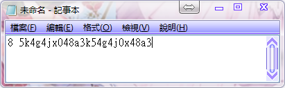
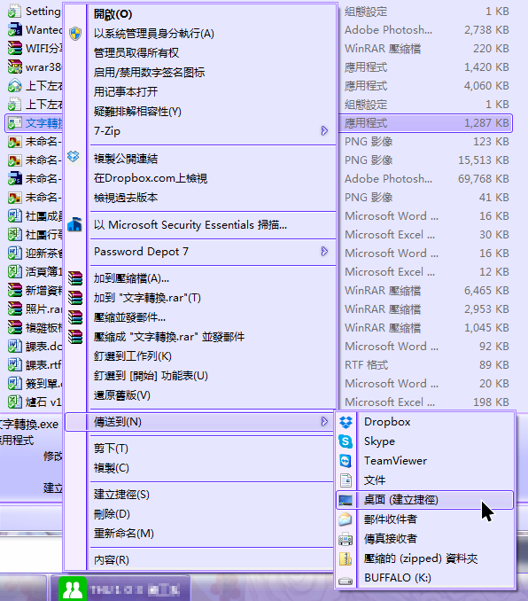
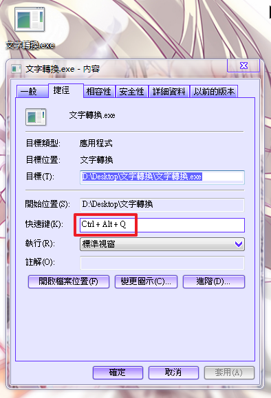

+++
title = "手殘亂碼終結者"
description = "手殘亂碼終結者"
date = 2014-10-05T09:25:00.000Z
updated = 2014-10-05T09:25:00.000Z
draft = true
aliases = [ ]

[taxonomies]
tags = [ ]

[extra]
card = "image.png"
+++

## 創作緣由

常常在打字的時候都會忘記切換輸入法

要打中文結果打出一串亂碼

相信各位都有這個經驗

像我這種喜歡加wwww的一天都會遇到好幾次((爆

之前就有想寫這個，不過實在是太忙沒空研究

前段時間花了大概半天時間把她生了出來，順便練習忘光的C++
<!-- more -->
## 載點

<https://dl.dropboxusercontent.com/u/7450906/%E6%96%87%E5%AD%97%E8%BD%89%E6%8F%9B.exe>
  
## ※以下聲明

1.在重開機以前偶爾會有快捷鍵無效的狀況  
2.平常有可能會切換到錯誤的視窗(程式寫法是會抓上一個視窗，如果有釘選在最上層的程式等，可能就會出錯)  
  
## 安裝方式

安裝重點在於建立快捷鍵，方法有幾種:

1.使用WinHotKey一類的工具

2.建立捷徑以後再右鍵→內容設定

我這邊採用方法2，如下:  
  
1.在桌面建立捷徑  

2.設定快速鍵:在捷徑上右鍵→內容，再把紅框處改成不會衝突的快捷鍵 (左Ctrl+左Alt+Q單手可按)  

3.套用，確定。重新開機\~  
  
**使用方式**  
  
當你打出一串亂碼的時候，把他全選→剪下，再按快捷鍵即可  

8 5k4g4jx048a3k54g4j0x48a3

想追求速度可以試試看按照順序按以下按鍵:  
(假設:一開始游標在亂碼的最後方，輸入法為 新注音"英數模式" ，如上圖)  
1.Shift+Home (整行選擇)  
2.Shift+Delete (剪下=Ctrl+X，因為已經按著Shift，故按這個會比較快)  
3.左Ctrl+左Alt+Q (上面設定的快捷鍵)
