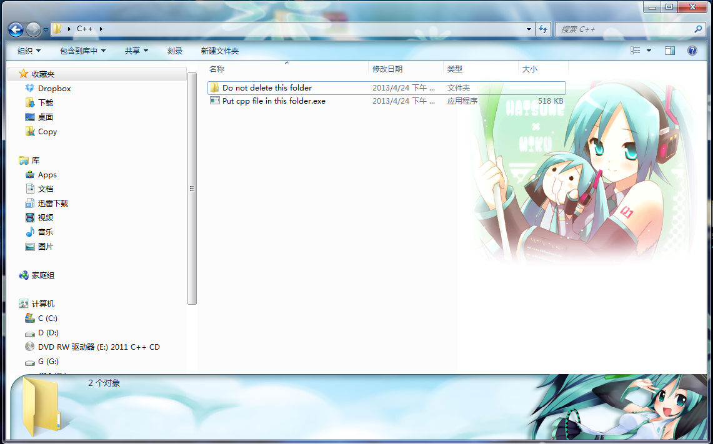
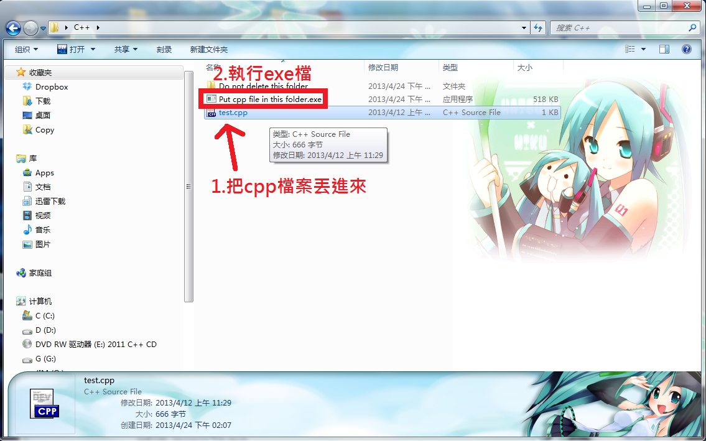
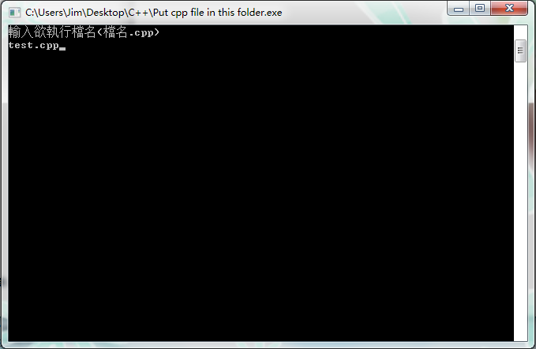
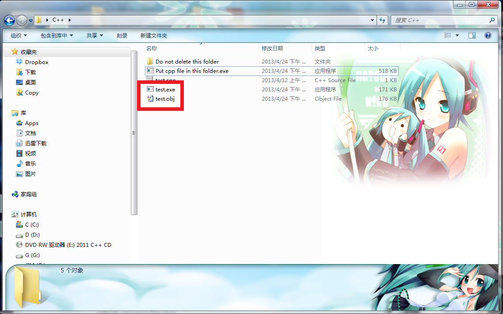

+++
title = "cpp 轉 exe程式"
description = "cpp 轉 exe程式"
date = 2013-04-24T06:22:00.003Z
updated = 2013-05-10T06:22:00.003Z
draft = false
aliases = [ "/2013/04/c-usbggww-c-1.html" ]

[taxonomies]
tags = [ ]
licenses = [ "GFDL 1.3" ]

[extra]
banner = "preview.png"
+++

有鑑於老師教的那一大串好麻煩，就做了這個東西。一樣是用 C++ 做的喔\~\~  
各位，正規的方法還是要學起來，不然考試不能帶 USB 就 GG 了喔 ww  
<!-- more -->
---  

20130510  
我把亂碼問題排除了，說起來這並不是問題。前段時間我為了玩 穢翼のユースティア 把 WIN7 改成了簡體系統跑遊戲，寫出來的程式在繁體系統運行就會亂碼  

---  

機械系的同學下載繁體系統 (ver.TC) 那個喔!!

給上了俊仲哥 C++ 課的同學們

載點:  
繁體系統: <https://dl.dropboxusercontent.com/u/7450906/C%2B%2B%20ver.TC.rar>  
簡體系統: <https://dl.dropboxusercontent.com/u/7450906/C%2B%2B%20ver.SC.rar>

1\. 把檔案解壓開來會得到一個 exe 檔 & 一個資料夾  
那個資料夾正如所說不要改名或刪除

2\. 將你要編譯的 cpp 檔案丟進來  
然後執行 exe 檔

3\. 輸入欲執行完整檔名  
後面的.cpp 要記得

4\. 大功告成啦\~\~

